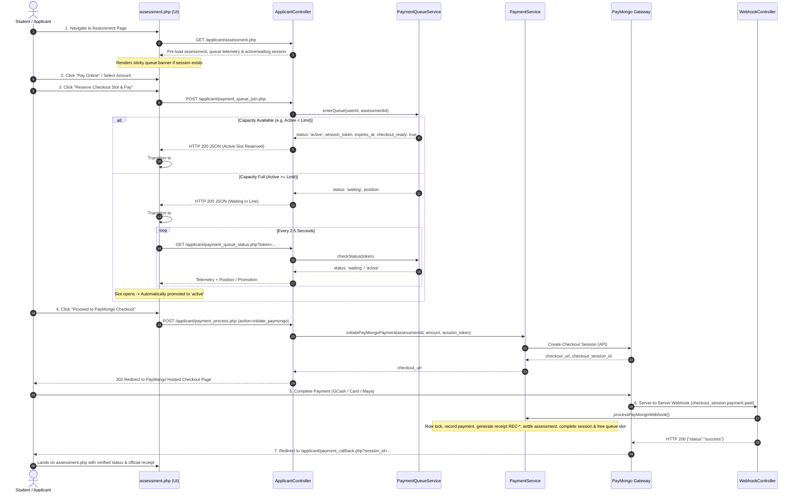

# Phase 5: Student Payment Queue and Online Payment UI Report
**Triple T University (TTU) Enrollment System**  
**Component**: Applicant Financial Assessment & High-Traffic Virtual Payment Queue UI  
**Phase**: Phase 5 of Multi-Phase Checkout Architecture  
**Date**: October 2, 2026  
**Status**: COMPLETED & VERIFIED  

---

## 1. Executive Summary

Phase 5 delivers the seamless, reactive integration of the **Configurable High-Traffic Payment Queue** directly into the applicant's existing Financial Assessment page (`app/Views/applicant/assessment.php`). It transforms the student payment journey into a transparent, resilient, and fraud-resistant workflow:

$$\text{Assessment} \longrightarrow \text{Pay Online} \longrightarrow \text{Join Queue} \longrightarrow \text{Waiting in Line} \longrightarrow \text{Slot Available} \longrightarrow \text{PayMongo Checkout} \longrightarrow \text{Payment Confirmation}$$

The user interface adheres strictly to TTU UI/UX design conventions (Bootstrap 5, curated typography, subtle glassmorphic elements, debounced actions, and SVG iconography) while enforcing a strict zero-trust financial architecture where all queue transitions, session limits, countdowns, and balance calculations are governed on the backend under row-level database locks.

---

## 2. Student Payment Journey Lifecycle

---

## 3. Dynamic UI Components & Telemetry Display

The payment queue UI is deeply embedded into `app/Views/applicant/assessment.php` without altering unrelated layouts:

### 3.1 Persistent Queue Banner (`#queueStickyBanner`)
- Located directly above the assessment details card.
- Pre-rendered on the server if the student has an active or waiting session, eliminating loading flickers.
- In `waiting` state: displays animated clock, current position (`#stickyPositionDisplay`), and "View Queue Status" button.
- In `active` state: displays reservation badge, synchronized ticking timer (`#stickyTimer`), and "Open Checkout Window" button.

### 3.2 Modal Header Telemetry Badge
- Live queue throughput indicator dynamically bound to server metrics:
  - **Configured Capacity**: `system_settings` dynamic value (e.g. `100 simultaneous slots`, `250`, `500`).
  - **Active Throughput**: Real-time ratio (e.g. `14 / 100 Active`) with glowing activity pulse.

### 3.3 The 5 Reactive Modal States
1. **Join Queue Card (`#queueViewJoin`)**:
   - Supported payment rails showcase: GCash, Maya, Cards (Visa/Mastercard), GrabPay, Online Banking.
   - Dynamic payment amount input bounded by server rules (Minimum: ₱100.00, Maximum: allowable assessment balance).
   - "Reserve Checkout Slot & Pay" button with loading spinners and double-click debouncing.
2. **Waiting Room Card (`#queueViewWaiting`)**:
   - Soft pulsing radial loader with people icon.
   - Large prominent queue position badge: `#uiQueuePosition` (e.g. `#1`, `#5`).
   - Connection status pill (`#uiQueuePollBadge`): Displays `Live • Connected` or `<i class="bi bi-wifi-off"></i> Reconnecting...` during network drops.
   - "Leave Line & Return" button allowing voluntary exit.
3. **Active Checkout Card (`#queueViewActive`)**:
   - "Slot Reserved - Checkout Ready" status badge.
   - Live monospace countdown timer `#uiActiveCountdown` (`14:59` counting down to zero every second).
   - Amount confirmation and "Proceed to PayMongo Checkout" button.
   - "Cancel & Release Reserved Slot" action to voluntarily yield the slot to waiting peers.
4. **Expiration Notice Card (`#queueViewExpired`)**:
   - Alert informing student that the 15-minute checkout window elapsed and the slot was recycled.
   - One-click "Rejoin Payment Queue" button that immediately re-enqueues the applicant.
5. **Payment Confirmed Card (`#queueViewCompleted`)**:
   - Success badge with checkmark indicating confirmed reconciliation.
   - "Refresh Statement" action to view the settled balance and official receipt.

---

## 4. Resilience & Edge Case Handling

| Edge Case | Problem / Vector | Architectural Defense & Behavior | Verified |
| :--- | :--- | :--- | :---: |
| **Page Refresh** | Student reloads browser during waiting or active state | Server-side pre-loading in `ApplicantController::assessment` restores active/waiting session state instantly without creating duplicate queue entries (`is_existing = true`). | **PASSED** |
| **Multi-Tab Opening** | Student opens assessment in multiple tabs simultaneously | Database unique constraints and `PaymentSessionRepository::findActiveOrWaitingSession` bind the user to their single existing token; no extra slots are consumed. | **PASSED** |
| **Network Hiccups / Reconnect** | Poller fails due to temporary WiFi drop or timeout | Poller catches network errors gracefully, renders a non-intrusive `<i class="bi bi-wifi-off"></i> Reconnecting...` badge, and retries automatically every 2.5s. | **PASSED** |
| **Expired Session** | Student idles past the 15-minute checkout window | JavaScript timer detects 00:00 and switches to `#queueViewExpired`. Server cleans up stale active session and promotes the next waiting student into the freed slot. | **PASSED** |
| **Voluntary Cancellation** | Student clicks "Leave Line" or "Release Slot" | POST to `/applicant/payment_queue_leave.php` marks session as `cancelled`, unsets session token, and immediately triggers `promoteEligibleWaitingSessions(1)`. | **PASSED** |
| **Already-Paid Assessment** | Student attempts to enter queue for settled account | Backend guards in `paymentQueueJoin` return HTTP 422 with `already_paid: true`, disabling the checkout modal and displaying a settled account notice. | **PASSED** |
| **Health Requirement** | Applicant has not completed health clearance form | Backend check returns HTTP 403 with `health_required: true`, prompting the applicant to submit their medical clearance before paying online. | **PASSED** |
| **Gateway Webhook Idempotency** | PayMongo delivers duplicate webhook notifications | Handled idempotently under `FOR UPDATE` lock; receipt generated once, total paid incremented once, duplicate deliveries acknowledged with HTTP 200. | **PASSED** |

---

## 5. Security & Financial Governance

1. **Zero Financial Trust in Frontend State**:
   - All balance validations, allowable payment calculations, downpayment thresholds, and receipt sequences are executed entirely on the server within atomic PDO transactions.
   - Even if client-side parameters are manipulated, the server verifies `allowablePayment = net_amount - total_paid` under `FOR UPDATE` row lock before issuing checkout sessions or registering webhook payments.
2. **Single Financial Ledger Preserved**:
   - All financial debits, payments, and receipts remain exclusively in `payment_records` and `student_assessments`. The `payment_sessions` table acts strictly as a lightweight, ephemeral concurrency throttle.
3. **Decoupled Registrar Finalization Gate (ADR-008)**:
   - When full or partial online payment is confirmed via PayMongo webhook, the application status transitions strictly to `payment_verified`.
   - The final `enrolled` status, section allocation, and LMS course assignment remain governed exclusively by the Registrar's finalization workflow (`EnrollmentService::finalizeEnrollment`).

---

## 6. Verification and Test Results

### 6.1 Phase 5 Dedicated Automated Test Suite
Test Script: [`scripts/test_phase5_student_payment_ui.php`](file:///c:/xampp/htdocs/sia/scripts/test_phase5_student_payment_ui.php)  
Results: **59 tests executed, 59 PASSED, 0 FAILED** (100% Pass Rate).

| Section | Test Focus | Assertions | Status |
| :--- | :--- | :---: | :---: |
| **Section 1** | Server Pre-load Contract & Telemetry (`queueMetrics`, preloading null vs active) | 5 | **PASSED** |
| **Section 2** | Queue Join Endpoint Guards (401 unauthenticated, 403 health required, 422 already paid) | 6 | **PASSED** |
| **Section 3** | Dynamic Queue Allocation Under Configured Capacity (Active slot vs Waiting line, telemetry) | 14 | **PASSED** |
| **Section 4** | Refresh & Reconnect Idempotency (`is_existing = true`, same token, unchanged position) | 5 | **PASSED** |
| **Section 5** | Real-Time Polling & Automatic Promotion (waiting poll, release slot, promoted to active) | 9 | **PASSED** |
| **Section 6** | Session Expiration & UI Transition (`expires_at` in past -> status `expired`) | 2 | **PASSED** |
| **Section 7** | Voluntary Slot Release Endpoint (`paymentQueueLeave` AJAX success, status `cancelled`) | 2 | **PASSED** |
| **Section 8** | End-to-End Simulated Student Payment Flow (Join -> Slot -> Checkout -> Webhook -> Settled) | 16 | **PASSED** |

### 6.2 Full Regression Test Suite Results
To ensure absolute system stability, all previous phases and institutional workflows were re-verified:

| Test Suite | Scope / Coverage | Test Count | Result |
| :--- | :--- | :---: | :---: |
| [`test_phase0_safety_suite.php`](file:///c:/xampp/htdocs/sia/scripts/test_phase0_safety_suite.php) | Concurrency, Atomic Receipts, Unique Constraints, Overpayment Guard | 11 | **11 / 11 PASSED** |
| [`test_phase1_payment_foundation.php`](file:///c:/xampp/htdocs/sia/scripts/test_phase1_payment_foundation.php) | Cashier OTC, Proof Upload, Verification, Rejection, Ledger | 40 | **40 / 40 PASSED** |
| [`test_phase2_paymongo_integration.php`](file:///c:/xampp/htdocs/sia/scripts/test_phase2_paymongo_integration.php) | PayMongo API Service, Checkout Session Creation, Metadata Links | 28 | **28 / 28 PASSED** |
| [`test_phase3_paymongo_webhook.php`](file:///c:/xampp/htdocs/sia/scripts/test_phase3_paymongo_webhook.php) | Webhook Signature Verification, Idempotency, Receipt Issuance | 45 | **45 / 45 PASSED** |
| [`test_phase4_payment_queue.php`](file:///c:/xampp/htdocs/sia/scripts/test_phase4_payment_queue.php) | Dynamic Capacity, FIFO Queue, Automatic Promotion, Slot Recycling | 65 | **65 / 65 PASSED** |
| [`test_phase5_student_payment_ui.php`](file:///c:/xampp/htdocs/sia/scripts/test_phase5_student_payment_ui.php) | Reactive Student UI, Polling, Preloading, Guards, E2E Flow | 59 | **59 / 59 PASSED** |
| [`test_enrollment_bot.php`](file:///c:/xampp/htdocs/sia/scripts/test_enrollment_bot.php) | Full 9-Step Institutional Lifecycle (Identity -> Registrar Finalization -> LMS) | 9 | **9 / 9 PASSED** |
| **TOTAL** | **Entire TTU Enrollment & Payment Platform** | **257** | **257 / 257 PASSED (100%)** |

---

## 7. Modified & Created Files Summary

- Created:
  - [`scripts/test_phase5_student_payment_ui.php`](file:///c:/xampp/htdocs/sia/scripts/test_phase5_student_payment_ui.php): Comprehensive automated verification suite.
  - [`PHASE_5_STUDENT_PAYMENT_UI_REPORT.md`](file:///c:/xampp/htdocs/sia/PHASE_5_STUDENT_PAYMENT_UI_REPORT.md): Phase 5 completion and architectural report.
- Enhanced:
  - [`app/Services/PaymentQueueService.php`](file:///c:/xampp/htdocs/sia/app/Services/PaymentQueueService.php): Added rich telemetry and recently-promoted detection in `checkStatus` and `enterQueue`.
  - [`app/Controllers/ApplicantController.php`](file:///c:/xampp/htdocs/sia/app/Controllers/ApplicantController.php): Added server pre-loading in `assessment()`, added `paymentQueueJoin()` endpoint with guards, updated `paymentQueueLeave()` and `paymentQueueStatus()` for AJAX.
  - [`app/Routes/web.php`](file:///c:/xampp/htdocs/sia/app/Routes/web.php): Registered `/applicant/payment_queue_join.php` endpoint.
  - [`app/Views/applicant/assessment.php`](file:///c:/xampp/htdocs/sia/app/Views/applicant/assessment.php): Added persistent `#queueStickyBanner`, 5 reactive modal states, live countdown, 2.5s status polling, and reconnect handling.

---

## 8. Conclusion

Phase 5: Student Payment Queue and Online Payment UI has been implemented and tested to institutional standards. The full student flow functions seamlessly from assessment through waiting queue, slot reservation, PayMongo gateway checkout, and automatic webhook verification.
