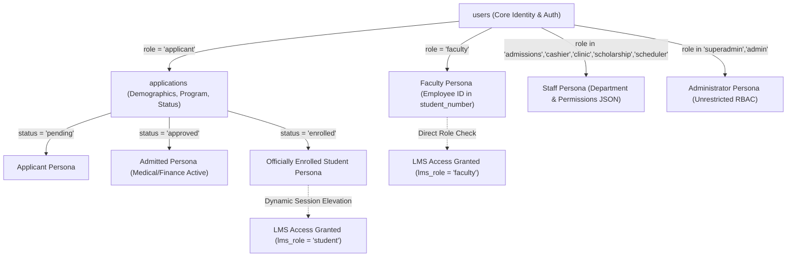
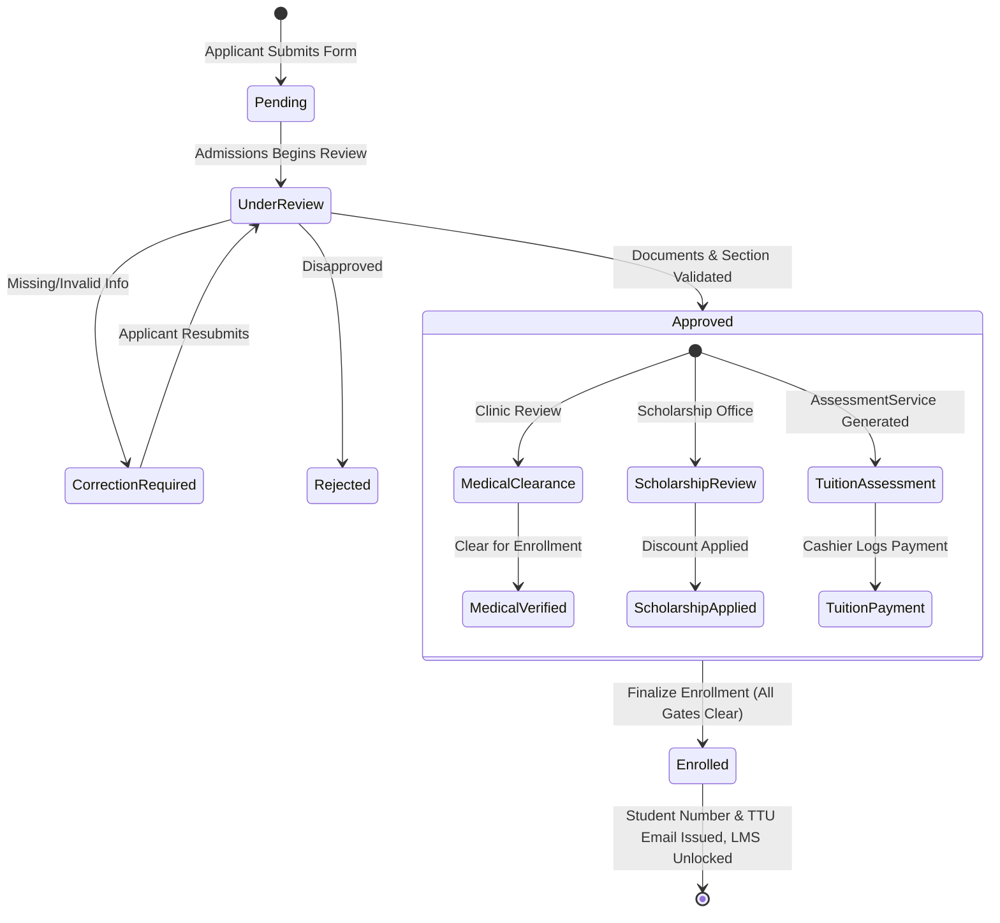

# 05. ENROLLMENT ACCOUNT & IDENTITY ARCHITECTURE ANALYSIS

**Document Reference:** `docs/codebase/05_ENROLLMENT_IDENTITY_ANALYSIS.md`  
**Execution Phase:** Phase 5 — Enrollment Account / Identity Analysis  
**Repository:** Triple T University (TTU) Enrollment System & LMS  
**Date:** September 13, 2026  
**Status:** FORENSICALLY VERIFIED AGAINST SOURCE CODE & CANONICAL SCHEMA (`database/schema.sql`)

---

## 1. Executive Summary

This document presents a comprehensive architectural and forensic analysis of how human identity, accounts, academic status, and organizational roles are represented, created, transitioned, and stored in the **Triple T University (TTU) Enrollment System**.

### Primary Findings
1. **Conflated Account vs. Identity Store:** The system treats the `users` table simultaneously as an authentication credentials store, an institutional identity record, an access control list (ACL), and an academic tracking table.
2. **Absence of Dedicated Person/Role Tables:** There are no `students`, `applicants`, `faculty`, or `staff` tables. A person is represented as a single row in `users`, supplemented by transient or one-to-one rows in `applications`, `health_records`, and `student_assessments`.
3. **The Role Synchronization Disconnect:** Although the `users.role` ENUM includes `'student'`, the enrollment finalization routines (`AdmissionsController::process` and `EnrollmentService::finalizeEnrollment`) update `applications.status = 'enrolled'` but **never execute an update on `users.role`**. The database row remains `role = 'applicant'`. LMS student login overcomes this by checking `applications.status IN ('enrolled', 'approved')` and dynamically overriding the session role to `'student'`.
4. **Single-Application Lifecycle Limitation:** Self-service enrollment (`EnrollController::showForm`) enforces that if an application exists with status other than `'pending'` or `'correction_required'`, the user is hard-redirected away. The system lacks multi-term re-enrollment data structures.
5. **Scheduler ↔ Faculty Disconnect:** In timetable and section definitions (`college_section_subjects` and `shs_section_subjects`), the assigned instructor is stored as an unconstrained `VARCHAR(150)` string with no foreign key reference to `users.id`. Faculty have no availability, load tracking, or scheduling entities in Enrollment.

---

## 2. Person Representation & Role Typologies

In TTU Enrollment, every physical individual is anchored to an entry in `users.id`. The specific persona is determined by `users.role`, auxiliary records, and application status:



### 2.1 Applicant Identity
* **Creation Point:** Public registration portal (`/sia/auth/register.php` -> `AuthController::register`).
* **Database State on Registration:**
  * `users.role` = `'applicant'`
  * `users.is_active` = `1`
  * `users.email_verified` = `1` (upon 6-digit OTP verification via `AuthController::verifyEmail`)
  * `users.student_number` = `NULL`
  * `users.ttu_email` = `NULL`
  * `users.college_curriculum_id` = `NULL`
* **Application Submission (`EnrollController::processForm`):**
  * Populates `applications` with 40+ demographic and personal fields:
    * Legal identification: `first_name`, `last_name`, `middle_name`, `suffix`, `lrn` (12-digit Learner Reference Number), `birth_date`, `place_of_birth`, `gender`, `civil_status`, `nationality`, `religion`.
    * Contact & Address: `contact_number`, `telephone_number`, `address_house_number`, `address_street`, `address_barangay`, `address_city`, `address_province`, `address_zip`, combined `address`.
    * Family Background: `father_name`, `father_occupation`, `father_contact`, `mother_name`, `mother_occupation`, `mother_contact`, `guardian_name`, `guardian_relationship`, `guardian_contact`.
    * Emergency Contacts: `emergency_contact_person`, `emergency_contact_relationship`, `emergency_contact_number`.
    * Academic Program Intent: `academic_level` (`'Senior High School'` | `'College'`), `grade_level` (`'Grade 11'`, `'Grade 12'`, `'1st Year'`, etc.), `school_year`, `semester`, `strand` (Program Code, e.g., `'BSIT'`, `'STEM'`), `student_type` (`'Regular'` | `'Irregular'`), `nstp` (`'CWTS'` | `'ROTC'` | `'LTS'`), `section_id`.
    * Health Self-Report: `special_needs`, `medical_conditions`, `allergies`.
  * Generates application reference number: `SIA-YYYY-XXXXXX` (via `Application::createFull`).
  * Sets `applications.status = 'pending'`.
* **Document Identity (`application_documents`):**
  * Tracks physical or uploaded proofs of identity and prior records (`psa_birth_certificate`, `form_138`, `good_moral`, `2x2_photo`).
  * Each document maintains its own audit state: `status` (`'pending'`, `'verified'`, `'rejected'`), `file_path`, and `feedback`.

### 2.2 Student Identity
* **Transformation Mechanism:** A student is **not** a distinct table. A student is an applicant whose enrollment has been finalized.
* **Institutional Identifiers:**
  * `users.student_number`: Generated atomically by `StudentNumberService::generate` in format `YYYY-XXXXXX` (e.g. `2026-000001`).
  * `users.ttu_email`: Generated automatically as `cleanFirst.cleanLast@ttu.edu.ph` (with collision counter suffix if needed).
  * `users.password`: **Overwritten** with a bcrypt hash of the temporary password (which defaults to the `student_number`).
  * `users.force_password_reset`: Set to `1`.
* **Academic Binding:**
  * `users.college_curriculum_id`: Permanently bound to the active curriculum version for their degree program.
  * `applications.college_curriculum_id`: Snapshotted to preserve the exact catalog requirements for that enrollment intake.
  * `college_enrollments` or `shs_enrollments`: Records the individual subjects enrolled for that semester/year level.
* **Status Flags:**
  * `applications.status` = `'enrolled'`
  * Note: `users.role` remains `'applicant'` in MySQL, but application logic treats the user as a student based on `applications.status`.

### 2.3 Faculty Identity
* **Creation Point:** System Administration (`/sia/admin/system/users.php` -> `SystemController::storeUser`).
* **Attributes in `users`:**
  * `role` = `'faculty'`
  * `student_number` = `FAC-YYYY-XXX` (Overloaded to store Faculty Employee Number).
  * `department` = Academic department name (e.g., `'College of Computer Studies'`).
  * `permissions` = `NULL` or custom permissions.
  * `is_active` = `1`.
* **Representation in Enrollment Subsystem:**
  * Faculty have **no records** in `applications`, `college_enrollments`, or `student_assessments`.
  * In `college_section_subjects` and `shs_section_subjects`, the assigned instructor is stored as `instructor VARCHAR(150) DEFAULT NULL` (a raw string, e.g., `'Prof. John Doe'`).
  * **Critical Gap:** Schedulers type in names as text. There is no foreign key link to `users.id`, which prevents automated timetable collision detection and LMS course auto-linking.

### 2.4 Staff Identity
* **Roles:** `'admissions'`, `'scholarship'`, `'cashier'`, `'clinic'`, `'scheduler'`.
* **Attributes in `users`:**
  * `role` = Designated departmental role ENUM.
  * `department` = Office assignment (`'Admissions Office'`, `'Finance / Cashier'`, `'Clinic'`, etc.).
  * `permissions` = JSON-encoded array of functional permission slugs (e.g., `["medical.review"]`, `["enrollment.finalize", "admissions.review"]`, `["assessments.generate", "payments.record"]`).
* **Access Gating:** Verified at controller boundaries via `requirePermission()` and `hasPermission()` (defined in `app/Helpers/functions.php`).

### 2.5 Administrator Identity
* **Roles:** `'superadmin'`, `'admin'`.
* **Attributes in `users`:**
  * `role` = `'superadmin'` or `'admin'`.
  * `department` = `'Administration'`.
  * `permissions` = `NULL`.
* **Privilege Level:** Universal system bypass. `hasPermission()` immediately returns `true` for `superadmin` and `admin`, granting access to all offices, audits, and configuration settings.

---

## 3. Storage Location of Identity State

Identity state is partitioned across **10 relational tables**:

| Table Name | Identity Dimension Stored | Primary Keys & Key Relations | Primary Controllers / Services |
| :--- | :--- | :--- | :--- |
| `users` | Primary Auth, Legal Name, Institutional Identifiers (`student_number`, `ttu_email`), Role, Active Curriculum. | `id` (PK), `email` (UQ), `student_number` (UQ) | `AuthController`, `SystemController`, `StudentNumberService` |
| `applications` | Legal Biographical, Demographic, Family, Prior Education, Academic Level, Degree Program, Section, Application Status. | `id` (PK), `user_id` (FK -> `users.id`), `reference_number` (UQ) | `EnrollController`, `ApplicantController`, `AdmissionsController`, `EnrollmentService` |
| `application_documents` | Verification of Legal Identity Proofs, Transcripts, Certificates. | `id` (PK), `application_id` (FK -> `applications.id`) | `DocumentController`, `AdmissionsController` |
| `application_subject_requests`| Custom requested subjects for Irregular students. | `id` (PK), `application_id` (FK -> `applications.id`), `subject_id` (FK -> `subjects.id`) | `EnrollController`, `AdmissionsController` |
| `health_records` | Clinical Identity, Vitals, Medical History, Clinic Clearance Status. | `id` (PK), `user_id` (FK -> `users.id`), `application_id` (FK -> `applications.id`) | `HealthController`, `ClinicController` |
| `college_enrollments` | Active College Course Roster per Student. | `id` (PK), `application_id` (FK), `subject_id` (FK), `college_section_id` (FK) | `AdmissionsController`, `EnrollmentService`, `CollegeController` |
| `shs_enrollments` | Active SHS Subject Roster per Student. | `id` (PK), `application_id` (FK), `subject_id` (FK), `shs_section_id` (FK) | `AdmissionsController`, `EnrollmentService`, `ShsController` |
| `student_assessments` | Financial Identity, Assessed Tuition, Discounts, Payment Status. | `id` (PK), `application_id` (FK), `user_id` (FK -> `users.id`) | `AssessmentService`, `FinanceController` |
| `payment_records` | Official Receipts (OR), Payments Ledger. | `id` (PK), `assessment_id` (FK), `user_id` (FK), `cashier_id` (FK) | `FinanceController` |
| `scholarship_applications` | Institutional & External Financial Grant Eligibility. | `id` (PK), `user_id` (FK -> `users.id`), `scholarship_id` (FK) | `ScholarshipController` |

---

## 4. The Enrollment Lifecycle & State Transitions

The enrollment lifecycle is managed as a multi-department state machine centered on `applications.status`:



### 4.1 What Happens When an Applicant is Approved (`status = 'approved'`)
Executed within `AdmissionsController::process` (`app/Controllers/Admin/Admissions/AdmissionsController.php:517-860`):
1. **Section Assignment:**
   * Validates section capacity (`applications.section_id` set to chosen `college_sections.id` or `shs_sections.id`).
2. **Curriculum Binding (College):**
   * If `users.college_curriculum_id` is null, queries the active curriculum for the student's program (`college_curricula WHERE program_id = ... AND status = 'active'`).
   * Permanently writes `users.college_curriculum_id = :curr_id`.
   * Snapshots `applications.college_curriculum_id = :curr_id`.
3. **Subject Enrollment (`college_enrollments` or `shs_enrollments`):**
   * Regular Students: Queries `college_curriculum_subjects` for the section's year level and semester, and inserts rows into `college_enrollments`. If the subject is NSTP, maps the track (`CWTS`, `ROTC`, `LTS`) based on applicant preference.
   * Irregular Students: Enrolls the specific subjects selected from `application_subject_requests`.
4. **Status Update:**
   * Updates `applications.status = 'approved'`.
   * Updates `admin_feedback` and `internal_notes`.
5. **Financial Assessment Generation:**
   * Calls `AssessmentService::generateAssessment($appId, $userId, $pdo)`.
   * Matches `fee_templates` based on `grade_level`, `strand`, and `semester`.
   * Snapshots tuition fees, laboratory fees, miscellaneous fees, and computes `total_amount` and `net_amount` into `student_assessments` and `assessment_items`.
6. **Unlocks Downstream Stages:**
   * The applicant dashboard displays steps for **Medical Clearance**, **Scholarship Application**, and **Cashier Payment**.

### 4.2 What Happens When an Applicant is Rejected (`status = 'rejected'`)
Executed within `AdmissionsController::process`:
1. `applications.status` is updated to `'rejected'`.
2. `applications.admin_feedback` stores the rejection justification.
3. An activity log entry is created with an alert icon (`bi-x-circle-fill text-danger`).
4. **User Account Status:**
   * `users.is_active` remains `1`.
   * `users.role` remains `'applicant'`.
   * The account is **not deleted or disabled**. The applicant can still log in to `/sia/applicant/dashboard.php` to view their rejection letter and feedback.
   * The user cannot proceed to medical examination, scholarship application, assessment, or enrollment.

### 4.3 What Happens When a Student Enrolls (`status = 'enrolled'`)
Executed either via `AdmissionsController::process` or `EnrollmentService::finalizeEnrollment`:
1. **Gatekeeper Validation:**
   * Payment Gate: `student_assessments.payment_status` must be `'partial'` or `'paid'`, or `applications.status = 'payment_verified'`.
   * Clinic Gate: `health_records.status` must be `'verified'`.
   * Document Gate: All uploaded `application_documents` must have status `'verified'`.
   * Authorization Gate: User performing action must have `enrollment.finalize` permission.
2. **Student Number Allocation:**
   * If `users.student_number` is blank, calls `StudentNumberService::generate((int)date('Y'), $pdo)`.
   * Atomically increments `student_number_sequences.current_value` for the active year.
   * Formats string: `YYYY-XXXXXX` (e.g., `2026-000042`).
   * Updates `users.student_number = :sn`.
3. **Institutional Credential Generation:**
   * Formats email: `cleanFirst.cleanLast@ttu.edu.ph`.
   * Loops with collision check (`SELECT COUNT(*) FROM users WHERE ttu_email = :email`), appending an incremental number (`john.doe1@ttu.edu.ph`) if necessary.
   * Overwrites `users.ttu_email = :ttu_email`.
4. **Temporary Security Reset:**
   * Temporary password is set to the generated Student Number (`$tempPassword = $studentNumber`).
   * Generates bcrypt hash: `password_hash($tempPassword, PASSWORD_DEFAULT)`.
   * Overwrites `users.password = :hash`.
   * Sets `users.force_password_reset = 1`.
5. **Application Status Finalization:**
   * Updates `applications.status = 'enrolled'`.
6. **Notification Delivery:**
   * Dispatches welcome email via PHPMailer (`sendStudentCredentialsEmail()`) containing Student ID, institutional email, and temporary password.
7. **LMS Activation:**
   * The student can now access the LMS portal (`/sia/auth/lms_student_login.php`). When they submit their Student ID and password, `LmsAuthController::login` verifies `applications.status IN ('enrolled', 'approved')` and grants entry.

---

## 5. Detailed Forensic Findings on Identity Generation & Binding

### 5.1 Student Number Generation (`StudentNumberService.php`)
```php
// app/Services/StudentNumberService.php:54-66
$incStmt = $pdo->prepare("
    INSERT INTO student_number_sequences (sequence_year, current_value) 
    VALUES (:year, 1) 
    ON DUPLICATE KEY UPDATE current_value = current_value + 1
");
$incStmt->execute(['year' => $year]);

$fetchStmt = $pdo->prepare("SELECT current_value FROM student_number_sequences WHERE sequence_year = :year LIMIT 1");
$fetchStmt->execute(['year' => $year]);
$seq = (int)$fetchStmt->fetchColumn();

return sprintf("%04d-%06d", $year, $seq);
```
* **Concurrency Safety:** Uses atomic `INSERT ... ON DUPLICATE KEY UPDATE` to avoid sequence collisions under high concurrent enrollment load.
* **Storage Location:** `users.student_number` (`VARCHAR(50) UNIQUE`).
* **Overloading Vulnerability:** Faculty employee IDs (e.g. `FAC-2026-001`) are inserted into this exact same column, preventing numeric-only database constraints.

### 5.2 Academic Progression & Association
* **Degree Programs & Strands:**
  * College programs are defined in `college_programs` (`code`, `name`).
  * SHS strands are defined in `shs_strands` (`code`, `name`).
  * In `applications`, the program is stored as a string code in `applications.strand` (e.g. `'BSCS'`, `'STEM'`).
* **Curriculum Version Binding:**
  * A student is bound to a single curriculum version via `users.college_curriculum_id` -> `college_curricula.id`.
  * When sections are scheduled, subjects are retrieved by matching `college_curriculum_subjects.curriculum_id = users.college_curriculum_id` for that student's current year level and semester.
  * This guarantees that even if a university introduces a revised 2027 curriculum, existing students remain bound to their matriculation catalog year (e.g. 2024 curriculum).

---

## 6. Architectural Weaknesses & Gaps in Enrollment Identity

### Gap 1: Incomplete Database Role Synchronization
* **Problem:** When an applicant is officially enrolled, `applications.status` becomes `'enrolled'`, but `users.role` remains `'applicant'`.
* **Consequence:** 
  * Any direct SQL query or third-party module filtering `WHERE role = 'student'` will return `0` students.
  * `app/Repositories/CollegeEnrollmentRepository.php` and `ShsEnrollmentRepository.php` work around this by querying `applications` rather than `users.role`.
  * If a student logs in through the main portal (`/sia/auth/login.php`), `AuthController::processLogin` sees `users.role = 'applicant'` and redirects them to the applicant dashboard (`/sia/applicant/dashboard.php`) rather than a student portal.

### Gap 2: Single-Enrollment Lifecycle Assumption
* **Problem:** The system has no `semesters` or `terms` student-history table. `applications` serves both as the initial admissions application and the active semester enrollment.
* **Consequence:**
  * When the student finishes 1st Year First Semester and needs to enroll in 1st Year Second Semester, `applications` cannot represent a second active term without overwriting previous application timestamps, document histories, and section links.
  * `EnrollController::showForm` explicitly prevents a user from opening the enrollment form if their prior application is `enrolled` or `approved`.

### Gap 3: Credential Overwrite on Finalization
* **Problem:** In `AdmissionsController.php:762` and `EnrollmentService.php:115`, when an applicant is enrolled, their original password is **overwritten** with a hash of their `student_number`, and `force_password_reset` is set to `1`.
* **Consequence:**
  * If the student was already logged into the main portal using their personal password, their personal password ceases to function immediately without prior notice.
  * If the welcome email fails to deliver (e.g., mail server timeout), the student is locked out because their original password was destroyed.

### Gap 4: Missing Relational Binding for Faculty
* **Problem:** `college_section_subjects.instructor` and `shs_section_subjects.instructor` are raw `VARCHAR(150)` strings.
* **Consequence:**
  * Schedulers can enter typos (`"Dr. Smith"`, `"Smith, J."`, `"Dr John Smith"`), making automated scheduling conflict checks impossible.
  * Faculty members logging into the LMS cannot have courses automatically assigned to them from the Registrar's timetable without manual administrator course-creation in `LmsAdminController`.

---

## 7. Direct Component Dependency Matrix

| Subsystem Component | File Path | Dependent Identity Fields | Failure Mode if Schema Changes |
| :--- | :--- | :--- | :--- |
| **Main Auth Controller** | `app/Controllers/AuthController.php` | `users.email`, `password`, `role`, `is_active`, `email_verified`, `force_password_reset` | Login failure, improper redirection between admin, applicant, and LMS dashboards. |
| **LMS Auth Controller** | `app/Controllers/Lms/LmsAuthController.php` | `users.student_number`, `password`, `is_active`, `applications.status` | Complete student or faculty LMS authentication failure. |
| **Admissions Controller** | `app/Controllers/Admin/Admissions/AdmissionsController.php` | `applications.status`, `users.student_number`, `users.ttu_email`, `users.college_curriculum_id` | Admissions review, approval, and enrollment finalization failure. |
| **Enrollment Service** | `app/Services/EnrollmentService.php` | `applications.status`, `users.student_number`, `users.ttu_email`, `users.password` | Programmatic enrollment finalization failure. |
| **Student Number Service** | `app/Services/StudentNumberService.php` | `student_number_sequences`, `users.student_number` | Duplicate student number generation, sequence counter corruption. |
| **Assessment Service** | `app/Services/AssessmentService.php` | `applications.academic_level`, `grade_level`, `strand`, `student_assessments.user_id` | Fee assessment calculation failure, billing discrepancies. |
| **Clinic Health Controller** | `app/Controllers/HealthController.php`, `Admin/Clinic/ClinicController.php` | `health_records.user_id`, `application_id`, `status` | Inability to record or verify medical clearance. |
| **Cashier / Finance** | `app/Controllers/Admin/Finance/FinanceController.php` | `student_assessments.user_id`, `payment_records.cashier_id` | Inability to log tuition payments or verify enrollment readiness. |
| **Registrar Controllers** | `app/Controllers/Admin/Registrar/CollegeController.php` | `college_enrollments.application_id`, `college_sections.id` | Class roster generation failure, section assignment failure. |

---

## 8. Summary & Next Phase Readiness

Phase 5 has established that the Enrollment System's identity architecture is **heavily coupled to the single `users` table and a single-term `applications` record**. 

Crucially, **LMS account state is currently entirely derived from Enrollment state**:
* Student LMS login has no dedicated account flags; it dynamically checks `applications.status IN ('enrolled', 'approved')`.
* Faculty LMS login checks `users.role = 'faculty'`, but faculty have zero relational presence in the enrollment timetable.

We are fully prepared to proceed to **Phase 6: LMS Account Analysis** to trace how the LMS domain receives, models, and utilizes these accounts.

*(Execution paused. Awaiting explicit user command to proceed to Phase 6.)*
