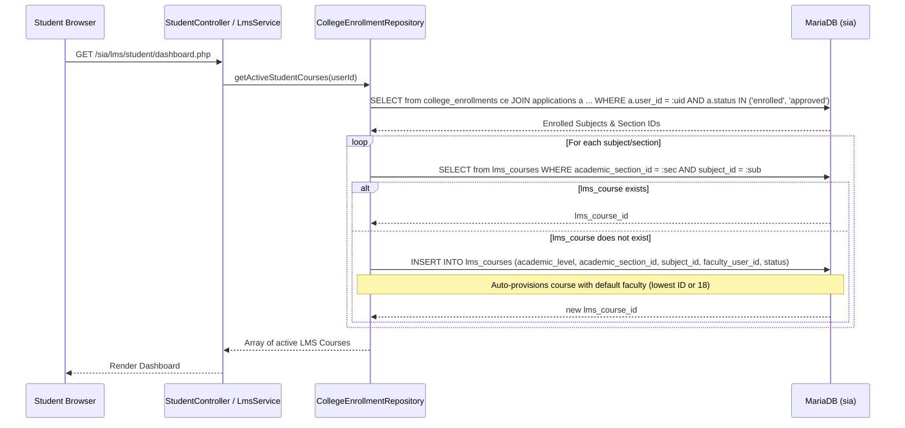

# 06. LMS ACCOUNT & IDENTITY ARCHITECTURE ANALYSIS

**Document Reference:** `docs/codebase/06_LMS_ACCOUNT_ANALYSIS.md`  
**Execution Phase:** Phase 6 — LMS Account Analysis  
**Repository:** Triple T University (TTU) Enrollment System & LMS  
**Date:** September 13, 2026  
**Status:** FORENSICALLY VERIFIED AGAINST SOURCE CODE & CANONICAL SCHEMA (`database/schema.sql`)

---

## 1. Executive Summary

This document provides a forensic architectural analysis of how the **Learning Management System (LMS)** subsystem within Triple T University represents human actors, authenticates students and faculty, calculates grades, resolves rosters, tracks attendance, and interacts with the shared `users` table and Enrollment state.

### Primary Architectural Realities
1. **Zero LMS-Specific Account Records:** The LMS has no dedicated `lms_users`, `lms_students`, or `lms_faculty` tables. All user identification is anchored directly to `users.id`.
2. **Dynamic Student Role Synthesis:** The LMS does not check `users.role = 'student'` in the database. Instead, student status is derived dynamically by validating that the user possesses an official `student_number` and has an active application record with `status IN ('enrolled', 'approved')`.
3. **Implicit/Virtual Course Enrollment:** There is no `lms_enrollments` or `lms_course_students` table. Course enrollment is calculated on-the-fly by joining the student's active `applications` record to `college_enrollments` / `shs_enrollments`, and matching section IDs and subject IDs to `lms_courses`.
4. **On-the-Fly Course Auto-Provisioning:** If a student accesses the LMS and an `lms_courses` row does not exist for their enrolled section and subject, the system automatically creates an `lms_courses` record in the background and arbitrarily assigns it to the faculty member with the lowest ID (`SELECT id FROM users WHERE role = 'faculty' ORDER BY id ASC LIMIT 1`) or fallback ID `18`.
5. **Computed Gradebook:** There are no `lms_grades` or `lms_grade_items` tables. Final percentages, scores, and grade matrices are calculated dynamically by aggregating published assignments (`lms_submissions.grade`) and quizzes (`lms_quiz_attempts.score`).
6. **Catastrophic Cascade Risk:** `lms_courses.faculty_user_id` has a foreign key constraint to `users.id` with `ON DELETE CASCADE`. If a faculty user is deleted from `users`, all their courses, modules, materials, assignments, student submissions, quizzes, and attendance records are permanently erased by the database engine.

---

## 2. Person & Account Representation in LMS

```mermaid
graph TD
    User["users Table"]
    
    subgraph Student LMS Pipeline
        User -->|student_number, password, is_active=1| LMSStudentAuth["LmsAuthController::login (role='student')"]
        LMSStudentAuth -->|JOIN applications WHERE status IN ('enrolled','approved')| StudentSession["$_SESSION['user_role'] = 'student'<br>$_SESSION['lms_role'] = 'student'"]
        StudentSession --> VirtualEnrollment["Virtual Enrollment Query<br>(applications -> college_enrollments -> lms_courses)"]
    end
    
    subgraph Faculty LMS Pipeline
        User -->|student_number (Employee ID), password, role='faculty'| LMSFacultyAuth["LmsAuthController::login (role='faculty')"]
        LMSFacultyAuth --> FacultySession["$_SESSION['user_role'] = 'faculty'<br>$_SESSION['lms_role'] = 'faculty'"]
        FacultySession --> DirectOwnership["Direct Course Ownership<br>(lms_courses.faculty_user_id = users.id)"]
    end
```

### 2.1 Student LMS Account
* **Storage Location:** `users` table (`id`, `student_number`, `password`, `first_name`, `last_name`, `email`, `is_active`).
* **Authentication Identifier:** Official `student_number` (format `YYYY-XXXXXX`).
* **Prerequisite for Access:** An approved or enrolled record in `applications` (`a.user_id = users.id AND a.status IN ('enrolled', 'approved')`).
* **Database Role State:** In MySQL, `users.role` is typically `'applicant'` (due to the enrollment finalization role update disconnect documented in Phase 5). LMS overrides this in PHP sessions:
  ```php
  // app/Controllers/Lms/LmsAuthController.php:99, 105
  $_SESSION['user_role'] = 'student';
  $_SESSION['lms_role'] = 'student';
  ```

### 2.2 Faculty LMS Account
* **Storage Location:** `users` table (`id`, `student_number`, `password`, `first_name`, `last_name`, `email`, `role = 'faculty'`, `department`, `is_active`).
* **Authentication Identifier:** Employee ID stored in the overloaded `users.student_number` column (e.g. `FAC-2026-001`).
* **Role Check:** Explicitly verified at database lookup:
  ```sql
  -- app/Controllers/Lms/LmsAuthController.php:126
  SELECT * FROM users 
  WHERE student_number = :eid AND role = 'faculty' AND is_active = 1
  ```
* **Course Authorization:** Verified directly against course ownership:
  ```sql
  -- app/Services/LmsService.php:127-130
  SELECT 1 FROM lms_courses 
  WHERE id = :lcid AND faculty_user_id = :uid AND status = 'active'
  ```

---

## 3. LMS Core Functional Domain Tracing

### 3.1 Course Enrollment (Virtual Resolution)
There is **no relational table linking students directly to LMS courses**. Course enrollment is resolved dynamically at request time:



#### Authorization Check (`isStudentAuthorizedForCourse`):
When a student visits `/sia/lms/student/course.php?id=X`, `StudentController::course` invokes:
```php
// app/Repositories/CollegeEnrollmentRepository.php:128-137
public function isStudentAuthorizedForCourse(int $userId, int $lmsCourseId): bool
{
    $courses = $this->getActiveStudentCourses($userId);
    foreach ($courses as $c) {
        if ((int)$c['lms_course_id'] === $lmsCourseId) {
            return true;
        }
    }
    return false;
}
```
If the course ID is not in their dynamically generated active subject roster, HTTP 403 Forbidden is returned.

### 3.2 Grades & Gradebook Architecture
* **Table Footprint:** No dedicated `lms_grades` table exists in `database/schema.sql`.
* **Dynamic Computation (`LmsGradebookService::getCourseGradebook`):**
  1. Queries all published assignments (`lms_assignments WHERE lms_course_id = :id AND status = 'published'`).
  2. Queries all published quizzes (`lms_quizzes WHERE lms_course_id = :id AND status = 'published'`).
  3. Queries all enrolled students for the course's underlying section:
     ```sql
     -- app/Services/LmsGradebookService.php:34-41
     SELECT u.id, u.student_number, u.first_name, u.last_name 
     FROM college_enrollments ce
     JOIN applications a ON ce.application_id = a.id
     JOIN users u ON a.user_id = u.id
     WHERE ce.college_section_id = :sec AND ce.subject_id = :sub
     ORDER BY u.last_name ASC, u.first_name ASC
     ```
  4. Computes Assignment Scores: For each student, queries `lms_submissions` where `status = 'GRADED'` and extracts `grade`.
  5. Computes Quiz Scores: For each student, queries `lms_quiz_attempts` where `status = 'graded'` and takes the highest score (`MAX(score)`).
  6. Computes Aggregates:
     $$\text{Total Possible} = \sum \text{Max Assignment Points} + \sum \text{Quiz Total Points}$$
     $$\text{Student Percentage} = \frac{\text{Student Total}}{\text{Total Possible}} \times 100$$
* **Student View (`LmsGradebookService::getStudentGradebook`):** Runs the full course gradebook calculation and filters the resulting grid where `student['id'] === $studentId`.

### 3.3 Submissions (Assignments & Quizzes)
* **Assignments (`lms_submissions`):**
  * `assignment_id` -> `lms_assignments.id` (FK ON DELETE CASCADE)
  * `student_id` -> `users.id` (FK ON DELETE CASCADE)
  * `graded_by` -> `users.id` (FK ON DELETE SET NULL)
  * Identity resolution: `SELECT s.*, u.first_name, u.last_name FROM lms_submissions s JOIN users u ON s.student_id = u.id WHERE s.assignment_id = :aid` (`LmsService.php:322`).
* **Quizzes (`lms_quiz_attempts` & `lms_quiz_answers`):**
  * `lms_quiz_id` -> `lms_quizzes.id` (FK ON DELETE CASCADE)
  * `student_id` -> `users.id` (FK ON DELETE CASCADE)
  * Answers recorded in `lms_quiz_answers` with choice selection, correctness boolean, and points awarded.
  * Identity resolution: `SELECT a.*, u.first_name, u.last_name FROM lms_quiz_attempts a JOIN users u ON a.student_id = u.id WHERE a.lms_quiz_id = :qid` (`LmsQuizService.php:268`).

### 3.4 Attendance
* **Session Definition:** `lms_attendance_sessions` (`id`, `lms_course_id`, `session_date`, `start_time`, `end_time`, `notes`).
* **Student Records:** `lms_attendance_records`:
  * `lms_attendance_session_id` -> `lms_attendance_sessions.id` (FK ON DELETE CASCADE)
  * `student_id` -> `users.id` (FK ON DELETE CASCADE)
  * `status`: ENUM(`'present'`, `'absent'`, `'late'`, `'excused'`)
  * `remarks`: VARCHAR(255)
  * Unique Constraint: `UNIQUE KEY unique_session_student (lms_attendance_session_id, student_id)`.
  * Identity resolution: `SELECT ar.*, u.first_name, u.last_name, u.student_number FROM lms_attendance_records ar JOIN users u ON ar.student_id = u.id WHERE ar.lms_attendance_session_id = :sid` (`LmsAttendanceService.php:101`).

### 3.5 Announcements
* **Table:** `lms_announcements`:
  * `lms_course_id` -> `lms_courses.id` (FK ON DELETE CASCADE)
  * `author_user_id` -> `users.id` (FK ON DELETE CASCADE)
  * `title`, `content`, `status` (`'draft'`, `'published'`), `published_at`, `expires_at`.
  * Identity resolution: `SELECT a.*, u.first_name, u.last_name FROM lms_announcements a JOIN users u ON a.author_user_id = u.id WHERE a.lms_course_id = :lcid` (`LmsAnnouncementService.php:19`).

---

## 4. Forensic Investigation of Phase 6 Questions

### Q1: What does LMS actually need from `users`?
The LMS interacts with the following 8 columns in `users`:

| Column | LMS Purpose | Code Location |
| :--- | :--- | :--- |
| `id` | Relational anchor for foreign keys: `lms_courses.faculty_user_id`, `lms_submissions.student_id`, `lms_submissions.graded_by`, `lms_quiz_attempts.student_id`, `lms_attendance_records.student_id`, `lms_announcements.author_user_id`. Also joins to `applications.user_id`. | All LMS Services & Repositories |
| `student_number` | Authentication login identifier for students (Student ID) and faculty (Employee ID). Displayed on attendance sheets and gradebook rosters. | `LmsAuthController.php:70, 126`, `LmsGradebookService.php:35`, `LmsAttendanceService.php:101` |
| `password` | Bcrypt hash verified during student and faculty LMS login. | `LmsAuthController.php:76, 134` |
| `first_name` | Displayed on course headers, instructor details, student gradebook lists, submission lists, quiz attempts, and announcement author tags. | `LmsService.php:75, 108, 322`, `LmsGradebookService.php:35`, `LmsQuizService.php:268` |
| `last_name` | Displayed alongside first name; used to sort student rosters alphabetically (`ORDER BY u.last_name ASC, u.first_name ASC`). | `LmsService.php:76, 109, 322`, `LmsGradebookService.php:40, 49` |
| `email` | Displayed as instructor contact email on course pages; populated into session. | `LmsService.php:77, 110`, `LmsAuthController.php:98, 148` |
| `role` | Verified during faculty login (`WHERE role = 'faculty'`); used in course generator and download authorizations. | `LmsAuthController.php:126`, `DownloadController.php:41`, `CollegeEnrollmentRepository.php:65` |
| `is_active` | Mandatory boolean check during LMS authentication (`AND is_active = 1`). Inactive accounts cannot log in. | `LmsAuthController.php:70, 126` |

**Columns in `users` NOT used by LMS:** `ttu_email` (LMS uses `email`), `college_curriculum_id` (handled in Enrollment), `permissions` (LMS uses role-based hardcoded checks), `email_verified`, `verification_code`, `verification_code_expires_at`, `reset_token`, `reset_token_expires_at`, `force_password_reset`.

### Q2: How does LMS know who is a student?
LMS does **not** check `users.role = 'student'` in the database. It determines student identity through this exact procedure:
1. Student submits Student ID and Password at `/sia/auth/lms_student_login.php`.
2. `LmsAuthController.php` looks up `users WHERE student_number = :sid AND is_active = 1`.
3. Verifies `password_verify($password, $user['password'])`.
4. Executes query:
   ```sql
   SELECT COUNT(*) FROM applications a
   WHERE a.user_id = :uid AND a.status IN ('enrolled', 'approved')
   ```
5. If count > 0, LMS marks the session: `$_SESSION['user_role'] = 'student'` and `$_SESSION['lms_role'] = 'student'`.

### Q3: How does LMS know who is a faculty member?
LMS recognizes faculty through:
1. Lookup at login:
   ```sql
   SELECT * FROM users 
   WHERE student_number = :eid AND role = 'faculty' AND is_active = 1
   ```
2. Session initialization: `$_SESSION['user_role'] = 'faculty'` and `$_SESSION['lms_role'] = 'faculty'`.
3. Course ownership verification:
   ```sql
   SELECT 1 FROM lms_courses 
   WHERE id = :lcid AND faculty_user_id = :uid AND status = 'active'
   ```

### Q4: What happens if a student has an LMS account before enrollment?
* **Reality:** A student **cannot** have an LMS account prior to enrollment because there is no independent LMS account entity.
* If a registered applicant attempts to log in to the LMS student portal:
  * They do not have a `student_number` (it is generated only upon final enrollment).
  * Even if they had a number, `SELECT COUNT(*) FROM applications WHERE user_id = :uid AND status IN ('enrolled', 'approved')` evaluates to 0.
  * The system displays: `"You are not officially enrolled yet."` and terminates the login attempt.

### Q5: Can a student use LMS without an approved application?
* **No.** Login is rejected if `applications.status` is not `'approved'` or `'enrolled'`.
* **Subtle System Inconsistency:** `LmsAuthController` allows login for status `'approved'`, but `LmsService::getStudentRepository` requires status `'enrolled'`. A student whose application is `'approved'` (but not finalized to `'enrolled'`) can log in, but will see an empty dashboard with zero accessible courses.

### Q6: Can a faculty member exist in LMS without being in `users`?
* **No.** 
  * Database foreign key `fk_lms_course_faculty` enforces `FOREIGN KEY (faculty_user_id) REFERENCES users (id) ON DELETE CASCADE`.
  * `lms_announcements.author_user_id` enforces `FOREIGN KEY (author_user_id) REFERENCES users (id) ON DELETE CASCADE`.
  * Faculty authentication queries `FROM users WHERE role = 'faculty'`.

### Q7: How does LMS resolve student names and emails?
* LMS does not store names or emails in LMS tables.
* LMS uses SQL `JOIN` operations:
  * Student Name in Gradebook: `JOIN users u ON a.user_id = u.id` -> `u.first_name, u.last_name`.
  * Student Name on Submissions: `JOIN users u ON s.student_id = u.id` -> `u.first_name, u.last_name`.
  * Instructor Name on Course: `JOIN users u ON lc.faculty_user_id = u.id` -> `u.first_name, u.last_name, u.email`.
  * Author on Announcements: `JOIN users u ON a.author_user_id = u.id` -> `u.first_name, u.last_name`.

---

## 5. Exhaustive Inventory of All Queries LMS Runs Against `users`

The following 14 queries represent every direct database query executed against `users` within the LMS controllers, services, and repositories:

```sql
-- 1. Student Authentication Lookup (LmsAuthController.php:70)
SELECT * FROM users WHERE student_number = :sid AND is_active = 1 LIMIT 1;

-- 2. Faculty Authentication Lookup (LmsAuthController.php:126)
SELECT * FROM users WHERE student_number = :eid AND role = 'faculty' AND is_active = 1;

-- 3. Default Faculty Fallback for Course Auto-Provisioning (CollegeEnrollmentRepository.php:65 & ShsEnrollmentRepository.php:62)
SELECT id FROM users WHERE role = 'faculty' ORDER BY id ASC LIMIT 1;

-- 4. Retrieve Instructor Name for Course Card (CollegeEnrollmentRepository.php:76 & ShsEnrollmentRepository.php:72)
SELECT lc.id, lc.faculty_user_id, u.first_name, u.last_name
FROM lms_courses lc
LEFT JOIN users u ON lc.faculty_user_id = u.id
WHERE lc.academic_level = :level AND lc.academic_section_id = :sec_id AND lc.subject_id = :sub_id;

-- 5. Retrieve Default Faculty Details on Insert (CollegeEnrollmentRepository.php:98 & ShsEnrollmentRepository.php:94)
SELECT first_name, last_name FROM users WHERE id = ?;

-- 6. Retrieve Courses Assigned to Faculty (LmsService.php:63-90)
SELECT lc.*, s.subject_code, s.subject_name, u.first_name, u.last_name, u.email
FROM lms_courses lc
JOIN subjects s ON lc.subject_id = s.id
LEFT JOIN users u ON lc.faculty_user_id = u.id
WHERE lc.faculty_user_id = :fid AND lc.status = 'active';

-- 7. Retrieve Course Details & Instructor Info (LmsService.php:98-117)
SELECT lc.*, s.subject_code, s.subject_name, u.first_name as instructor_first, u.last_name as instructor_last, u.email as instructor_email
FROM lms_courses lc
JOIN subjects s ON lc.subject_id = s.id
JOIN users u ON lc.faculty_user_id = u.id
WHERE lc.id = :lcid;

-- 8. Retrieve Assignment Submissions with Student Names (LmsService.php:322-326)
SELECT s.*, u.first_name, u.last_name 
FROM lms_submissions s
JOIN users u ON s.student_id = u.id
WHERE s.assignment_id = :aid
ORDER BY s.submitted_at DESC;

-- 9. Retrieve College Course Enrolled Students for Gradebook (LmsGradebookService.php:34-41)
SELECT u.id, u.student_number, u.first_name, u.last_name 
FROM college_enrollments ce
JOIN applications a ON ce.application_id = a.id
JOIN users u ON a.user_id = u.id
WHERE ce.college_section_id = :sec AND ce.subject_id = :sub
ORDER BY u.last_name ASC, u.first_name ASC;

-- 10. Retrieve SHS Course Enrolled Students for Gradebook (LmsGradebookService.php:43-50)
SELECT u.id, u.student_number, u.first_name, u.last_name 
FROM shs_enrollments se
JOIN applications a ON se.application_id = a.id
JOIN users u ON a.user_id = u.id
WHERE se.shs_section_id = :sec AND se.subject_id = :sub
ORDER BY u.last_name ASC, u.first_name ASC;

-- 11. Retrieve Attendance Records with Student Identity (LmsAttendanceService.php:100-105)
SELECT ar.*, u.first_name, u.last_name, u.student_number
FROM lms_attendance_records ar
JOIN users u ON ar.student_id = u.id
WHERE ar.lms_attendance_session_id = :sid;

-- 12. Retrieve Announcements with Author Name (LmsAnnouncementService.php:19-22)
SELECT a.*, u.first_name, u.last_name 
FROM lms_announcements a
JOIN users u ON a.author_user_id = u.id
WHERE a.lms_course_id = :lcid;

-- 13. Retrieve Quiz Attempts with Student Identity (LmsQuizService.php:267-272)
SELECT a.*, u.first_name, u.last_name 
FROM lms_quiz_attempts a
JOIN users u ON a.student_id = u.id
WHERE a.lms_quiz_id = :qid
ORDER BY a.score DESC, a.submitted_at DESC;

-- 14. Active Faculty List for Course Generator (LmsAdminController.php:44)
SELECT id, first_name, last_name, email 
FROM users 
WHERE role = 'faculty' AND is_active = 1 
ORDER BY last_name ASC;
```

---

## 6. Critical Architectural Flaws in the Current LMS Design

1. **Auto-Provisioning Race Condition & Fallback Faculty:**
   * When a student opens their dashboard, `CollegeEnrollmentRepository` executes a `SELECT` then `INSERT` on `lms_courses` without table locking or transactions. Under concurrent student dashboard requests, duplicate `lms_courses` records can be created for the same section and subject.
   * Auto-provisioned courses default to the faculty with the lowest ID (`ORDER BY id ASC LIMIT 1`) or hardcoded ID `18`. This results in an arbitrary faculty member seeing hundreds of unassigned courses on their dashboard.
2. **Cascade Deletion Danger (`ON DELETE CASCADE`):**
   * If an administrator deletes a faculty member from `users`, MySQL automatically deletes:
     * `lms_courses`
     * `lms_modules`
     * `lms_materials`
     * `lms_assignments`
     * `lms_submissions` (all student work and grades)
     * `lms_quizzes`, `lms_questions`, `lms_question_choices`, `lms_quiz_attempts`, `lms_quiz_answers`
     * `lms_attendance_sessions`, `lms_attendance_records`
     * `lms_announcements`
   * **Verdict:** Catastrophic data loss risk. Faculty deletion must use `RESTRICT` or soft deletion.
3. **No LMS Status/Suspension Control:**
   * A student cannot be suspended or put on academic hold in the LMS independently of the Enrollment system. The only access toggle is `users.is_active`, which disables both Enrollment and LMS simultaneously.

---

## 7. Summary & Next Phase Readiness

Phase 6 demonstrates that **the LMS subsystem is completely parasite-coupled to Enrollment's database tables**:
* It relies on `applications` for student identity and course rosters.
* It relies on `users` for legal names, credentials, and faculty ownership.
* It has no independent enrollment table, no independent account status, and no independent gradebook storage.

With Phase 5 (Enrollment Identity) and Phase 6 (LMS Account) completed, we are fully equipped to proceed to **Phase 7: Identity Separation Analysis (Evaluating architectural options for separating Enrollment and LMS state safely)**.

*(Execution paused. Awaiting explicit user command to proceed to Phase 7.)*
