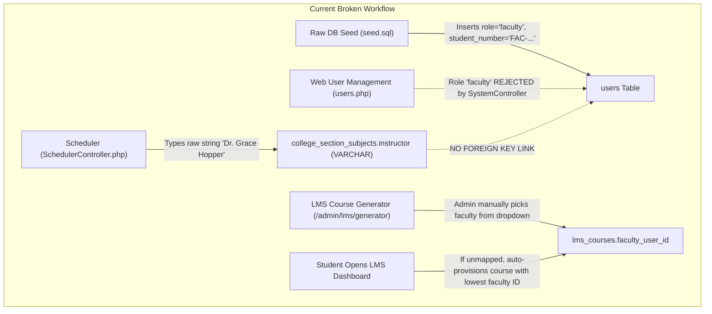
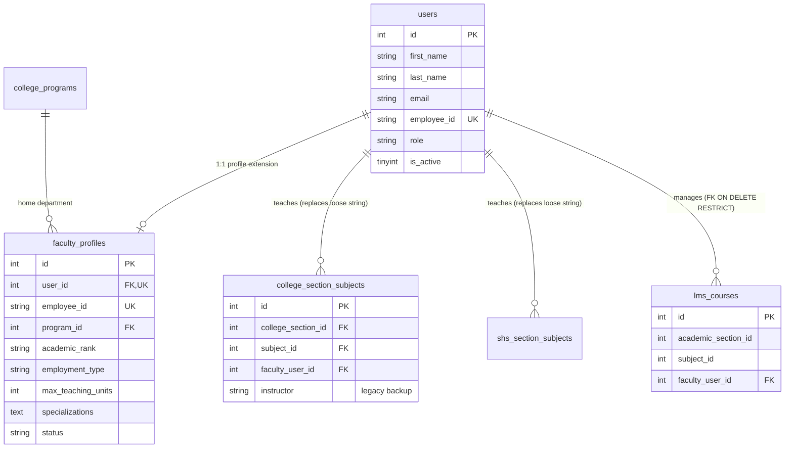
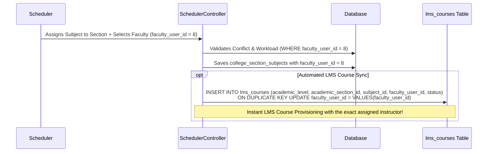

# 08. FACULTY ACCOUNT & IDENTITY ARCHITECTURE ANALYSIS

**Document Reference:** `docs/codebase/08_FACULTY_IDENTITY_ANALYSIS.md`  
**Execution Phase:** Phase 8 — Faculty Account Architecture  
**Repository:** Triple T University (TTU) Enrollment System & LMS  
**Date:** September 13, 2026  
**Status:** FORENSICALLY VERIFIED AGAINST SOURCE CODE & CANONICAL SCHEMA (`database/schema.sql`)

---

## 1. Executive Summary

This document presents a comprehensive forensic audit of how **faculty accounts, academic affiliations, teaching workloads, and timetable assignments** are currently structured in Triple T University (TTU), along with a definitive architectural design for a normalized, robust **Faculty Profile & Workload Management** system.

### Critical Forensic Discoveries
1. **Broken Faculty Creation in UI:** In `SystemController::storeUser` (`app/Controllers/Admin/System/SystemController.php:162`), the role validation strictly permits only `['applicant', 'superadmin', 'admissions', 'scholarship', 'cashier']`. The role `'faculty'` is **completely excluded**. Furthermore, the Add User modal in `app/Views/admin/system/users.php:337-346` omits `'faculty'` from its dropdown. Faculty accounts **cannot be created via the web interface** and currently exist solely via raw database seeding (`database/seed.sql`).
2. **Overloaded Identifier:** Faculty Employee IDs (e.g., `FAC-2026-001`, `FAC-2026-002`) are shoved into the `users.student_number` column.
3. **The Loose String Scheduling Hazard:** In `college_section_subjects` and `shs_section_subjects`, the assigned instructor is stored as an unvalidated `VARCHAR(150)` text string (`instructor`). Timetable conflict validation (`SchedulerController.php:495-545`) uses raw string equality (`ss.instructor = ?`), which silently fails if names differ in punctuation, titles, or spacing.
4. **Portal Redirection Blindspot:** If a faculty member logs in through the primary login page (`/sia/auth/login.php`), `AuthController::processLogin` checks if their role is in `$adminRoles`. Because `'faculty'` is not an admin role, the system redirects them to the **applicant dashboard** (`/sia/applicant/dashboard.php`).
5. **No Academic Department Structure:** The `department` field in `users` is an arbitrary text string. The user management UI only offers 5 administrative offices (`'System Administration'`, `'Registrar'`, `'Admissions'`, `'Finance'`, `'Scholarship'`) with zero options for academic colleges or departments (e.g., `'Computer Science'`, `'Information Technology'`).
6. **LMS Assignment Disconnect:** Because timetable scheduling uses loose strings, the system cannot automatically link assigned instructors to LMS courses. Schedulers assign a section subject, but the LMS course must either be manually mapped by an administrator via `/sia/admin/lms/generator` or get auto-provisioned to an arbitrary fallback instructor (lowest faculty ID or 18) when a student accesses their dashboard.

---

## 2. Forensic Audit of Current Faculty Lifecycle



### 2.1 How Faculty Accounts Are Created
* **Source Code Reality:**
  * File: `app/Controllers/Admin/System/SystemController.php`
  ```php
  // Line 162:
  if (!in_array($role, ['applicant', 'superadmin', 'admissions', 'scholarship', 'cashier'])) {
      throw new Exception('Invalid role specified.');
  }
  ```
  * File: `app/Views/admin/system/users.php`
  ```html
  <!-- Lines 337-346: Role dropdown in modal -->
  <select name="role" class="form-select form-select-sm bg-light" required>
    <option value="applicant">Applicant</option>
    <option value="admin">Registrar</option>
    <option value="scheduler">Scheduler</option>
    <option value="admissions">Admissions Officer</option>
    <option value="scholarship">Scholarship Officer</option>
    <option value="cashier">Cashier</option>
    <option value="clinic">Clinic Officer</option>
    <option value="superadmin">Super Administrator</option>
  </select>
  ```
  * **Result:** There is no functional path in the application code for an administrator to register a faculty member. The 3 existing faculty members in the system (`Alan Turing`, `Ada Lovelace`, `Dr. Grace Hopper`) were inserted via `database/seed.sql:44-46`.

### 2.2 Departmental Assignment
* **Field:** `users.department` (`VARCHAR(100)`).
* **Current Seeded Values:**
  * Alan Turing: `'Computer Science Dept'`
  * Ada Lovelace: `'Information Technology Dept'`
  * Dr. Grace Hopper: `'Computer Science Dept'`
* **Limitation:** There is no `departments` table. The values are unstructured text strings with no linkage to `college_programs` or academic divisions.

### 2.3 Course & Timetable Assignment
* **Enrollment Scheduling:**
  * Handled in `app/Controllers/Admin/Scheduler/SchedulerController.php`.
  * Schedulers input an instructor name as plain text into the timetable grid.
  * Conflict checking query (`SchedulerController.php:495`):
    ```sql
    SELECT ss.day, ss.start_time, ss.end_time, sec.section_code, sub.subject_code
    FROM college_section_subjects ss
    JOIN college_sections sec ON ss.college_section_id = sec.id
    JOIN subjects sub ON ss.subject_id = sub.id
    WHERE ss.instructor = ? AND ss.college_section_id != ? AND ss.day = ? AND ss.day IS NOT NULL
      AND (ss.start_time < ? AND ss.end_time > ?)
    ```
  * **Flaw:** If one scheduler types `"Grace Hopper"` and another types `"Dr. Grace Hopper"`, MySQL string comparison fails, and a double-booking schedule conflict is permitted.

### 2.4 Faculty Portal Authentication & Access Gating
* **Enrollment Portal (`/sia/auth/login.php`):**
  * Handled by `AuthController::processLogin`.
  * If a faculty member enters their email and password:
    ```php
    // app/Controllers/AuthController.php:136-142
    $adminRoles = ['superadmin', 'admin', 'admissions', 'scholarship', 'cashier', 'clinic', 'scheduler'];
    if (in_array($user['role'], $adminRoles, true)) {
        $response->redirect('/sia/admin/dashboard.php');
    } else {
        $response->redirect('/sia/applicant/dashboard.php');
    }
    ```
  * Because `'faculty'` is omitted from `$adminRoles`, the system redirects the instructor to `/sia/applicant/dashboard.php`, rendering an applicant timeline with 0% progress.
* **LMS Portal (`/sia/auth/lms_faculty_login.php`):**
  * Handled by `LmsAuthController::login`.
  * Verifies `SELECT * FROM users WHERE student_number = :eid AND role = 'faculty' AND is_active = 1`.
  * Initializes:
    * `$_SESSION['user_role'] = 'faculty'`
    * `$_SESSION['lms_role'] = 'faculty'`
    * `$_SESSION['user_id'] = (int)$user['id']`
  * Redirects correctly to `/sia/lms/faculty/dashboard.php`.

---

## 3. Necessary Faculty Information & Domain Model

A production-grade higher education institution requires that faculty records maintain attributes far beyond a simple name and password:

| Information Domain | Specific Attributes Needed | Purpose in Institutional Workflows |
| :--- | :--- | :--- |
| **Institutional Identity** | `employee_id` (e.g. `FAC-2026-001`) | Official payroll, biometric, and institutional faculty identifier. |
| **Academic Hierarchy** | `academic_rank` (`Instructor`, `Asst Prof`, `Assoc Prof`, `Professor`, `Lecturer`) | Determines scheduling priority, base salary rate, and committee eligibility. |
| **Employment Terms** | `employment_type` (`Full-Time`, `Part-Time`, `Adjunct`, `Designated`) | Governs maximum and minimum teaching workload policies. |
| **Organizational Unit** | `department_id` or `program_id` (FK to `college_programs.id`) | Links faculty to their home academic college (e.g., BSCS, BSIT). |
| **Teaching Capacity** | `max_teaching_units` (e.g., 18 or 24 units) | Prevents schedulers from overloading instructors beyond CHED/DepEd limits. |
| **Academic Expertise** | `specializations` (JSON array of subjects / disciplines) | Validates whether an instructor is qualified to teach specialized subjects. |
| **Operational Status** | `status` (`active`, `on_leave`, `sabbatical`, `resigned`) | Inactive/on-leave faculty are hidden from scheduling dropdowns. |

---

## 4. Clean Architecture & Relational Schema Design

To achieve strict separation of concerns while preserving full backward compatibility with the existing 14 foreign keys referencing `users.id`, we design a dedicated **`faculty_profiles`** extension table.



### 4.1 Canonical DDL for `faculty_profiles`

```sql
CREATE TABLE IF NOT EXISTS `faculty_profiles` (
  `id` INT(10) UNSIGNED NOT NULL AUTO_INCREMENT,
  `user_id` INT(10) UNSIGNED NOT NULL,
  `employee_id` VARCHAR(50) NOT NULL,
  `program_id` INT(10) UNSIGNED DEFAULT NULL COMMENT 'Home academic department / program',
  `academic_rank` ENUM('Instructor I', 'Instructor II', 'Assistant Professor', 'Associate Professor', 'Professor', 'Lecturer') NOT NULL DEFAULT 'Instructor I',
  `employment_type` ENUM('Full-Time', 'Part-Time', 'Adjunct') NOT NULL DEFAULT 'Full-Time',
  `max_teaching_units` INT(11) NOT NULL DEFAULT 18,
  `specializations` LONGTEXT CHARACTER SET utf8mb4 COLLATE utf8mb4_bin DEFAULT NULL COMMENT 'JSON array of subjects or areas',
  `status` ENUM('active', 'on_leave', 'sabbatical', 'resigned', 'retired') NOT NULL DEFAULT 'active',
  `created_at` TIMESTAMP NOT NULL DEFAULT CURRENT_TIMESTAMP,
  `updated_at` TIMESTAMP NOT NULL DEFAULT CURRENT_TIMESTAMP ON UPDATE CURRENT_TIMESTAMP,
  PRIMARY KEY (`id`),
  UNIQUE KEY `unique_faculty_user` (`user_id`),
  UNIQUE KEY `unique_faculty_employee_id` (`employee_id`),
  KEY `idx_faculty_program` (`program_id`),
  KEY `idx_faculty_status` (`status`),
  CONSTRAINT `fk_faculty_profile_user` FOREIGN KEY (`user_id`) REFERENCES `users` (`id`) ON DELETE CASCADE,
  CONSTRAINT `fk_faculty_profile_program` FOREIGN KEY (`program_id`) REFERENCES `college_programs` (`id`) ON DELETE SET NULL
) ENGINE=InnoDB DEFAULT CHARSET=utf8mb4 COLLATE=utf8mb4_unicode_ci;
```

### 4.2 Timetable Integration DDL

To eliminate loose text strings in section timetables, add a relational foreign key while maintaining the legacy string column during transition:

```sql
-- Add faculty_user_id to college section subjects
ALTER TABLE `college_section_subjects`
  ADD COLUMN `faculty_user_id` INT(10) UNSIGNED DEFAULT NULL AFTER `room`,
  ADD KEY `idx_css_faculty` (`faculty_user_id`),
  ADD CONSTRAINT `fk_css_faculty_user` FOREIGN KEY (`faculty_user_id`) REFERENCES `users` (`id`) ON DELETE SET NULL;

-- Add faculty_user_id to SHS section subjects
ALTER TABLE `shs_section_subjects`
  ADD COLUMN `faculty_user_id` INT(10) UNSIGNED DEFAULT NULL AFTER `room`,
  ADD KEY `idx_sss_faculty` (`faculty_user_id`),
  ADD CONSTRAINT `fk_sss_faculty_user` FOREIGN KEY (`faculty_user_id`) REFERENCES `users` (`id`) ON DELETE SET NULL;
```

---

## 5. Automated Scheduler ↔ LMS Course Synchronization Pipeline

With `faculty_user_id` stored directly in section timetables, the system achieves **automated, zero-manual-intervention LMS course provisioning**:



### Key Benefits of this Pipeline:
1. **Eliminates Manual Course Generation:** Admins no longer need to visit `/sia/admin/lms/generator` to manually wire section subjects to faculty.
2. **Eliminates the Fallback Faculty Bug:** The system never assigns courses to the lowest faculty ID (Alan Turing) or hardcoded ID 18. The course belongs immediately to the instructor scheduled by the Registrar.
3. **Automatic Instructor Reassignment:** If the Registrar reassigns a section subject from Instructor A to Instructor B, `lms_courses.faculty_user_id` updates automatically, transferring course materials and gradebook management to the new instructor.

---

## 6. Fixes Required in Application Controllers

### 6.1 `SystemController.php` Fix
* Add `'faculty'` and `'clinic'`, `'scheduler'`, `'admin'` to the allowed roles in `create_user`:
  ```php
  $validRoles = ['applicant', 'superadmin', 'admin', 'admissions', 'scholarship', 'cashier', 'clinic', 'scheduler', 'faculty'];
  if (!in_array($role, $validRoles, true)) {
      throw new Exception('Invalid role specified.');
  }
  ```
* In `app/Views/admin/system/users.php`, add `<option value="faculty">Faculty Member</option>` to the role dropdown.

### 6.2 `AuthController.php` Portal Redirection Fix
* Update `processLogin` in `app/Controllers/AuthController.php:136-143`:
  ```php
  $adminRoles = ['superadmin', 'admin', 'admissions', 'scholarship', 'cashier', 'clinic', 'scheduler'];
  if (in_array($user['role'], $adminRoles, true)) {
      $response->redirect('/sia/admin/dashboard.php');
  } elseif ($user['role'] === 'faculty') {
      $response->redirect('/sia/lms/faculty/dashboard.php');
  } elseif ($user['role'] === 'student') {
      $response->redirect('/sia/lms/student/dashboard.php');
  } else {
      $response->redirect('/sia/applicant/dashboard.php');
  }
  ```
  This guarantees that a faculty member logging in at `/sia/auth/login.php` is seamlessly directed to the Faculty LMS dashboard instead of the applicant dashboard.

---

## 7. Summary & Next Phase Readiness

Phase 8 has identified and documented the exact architectural flaws in faculty management:
* The user creation UI bug blocking faculty registration.
* The overloading of `student_number` with Employee IDs.
* The loose string scheduling hazard and lack of foreign keys.
* The portal login redirection defect.

Furthermore, Phase 8 has defined the complete DDL and synchronization architecture for `faculty_profiles` and section-timetable integration.

We are fully prepared to proceed to **Phase 9: Scheduler ↔ Faculty ↔ LMS Analysis (Deep technical mapping of timetable scheduling, conflict algorithms, and automatic course provisioning)**.

*(Execution paused. Awaiting explicit user command to proceed to Phase 9.)*
