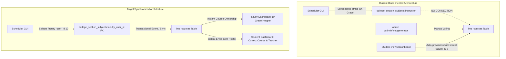
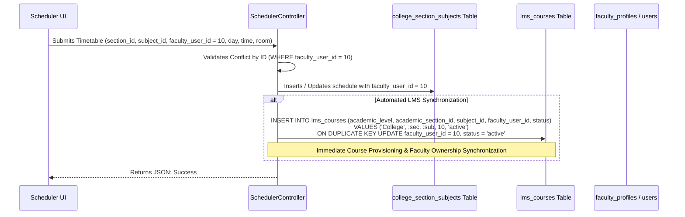

# 09. SCHEDULER ↔ FACULTY ↔ LMS INTEGRATION ANALYSIS

**Document Reference:** `docs/codebase/09_SCHEDULER_FACULTY_LMS_ANALYSIS.md`  
**Execution Phase:** Phase 9 — Scheduler ↔ Faculty ↔ LMS Analysis  
**Repository:** Triple T University (TTU) Enrollment System & LMS  
**Date:** September 13, 2026  
**Status:** FORENSICALLY VERIFIED AGAINST SOURCE CODE & CANONICAL SCHEMA (`database/schema.sql`)

---

## 1. Executive Summary

This document delivers a comprehensive forensic analysis of the interactions and disconnects between the **Scheduler / Timetable Subsystem**, **Faculty Management**, and the **Learning Management System (LMS)**.

### Primary Architectural Findings
1. **Total Isolation of the Scheduler:** In the current implementation, **the Scheduler does not communicate with the LMS in any way**. Saving or updating a timetable schedule in `SchedulerController::saveSchedule` updates only `college_section_subjects` or `shs_section_subjects`. It executes zero queries against `lms_courses`.
2. **The Loose String Fallacy:** Faculty assignments in section schedules are stored as unconstrained text strings (`VARCHAR(150)` in `instructor`). Timetable conflict detection relies on literal string comparison (`ss.instructor = ?`), which fails silently if titles or formatting differ (`"Dr. Grace Hopper"` vs `"Grace Hopper"`).
3. **The Unassigned Faculty Problem:** Assigning an instructor in the Scheduler does **not** give that instructor access to the course in the LMS. Faculty dashboards query `lms_courses WHERE faculty_user_id = :fid`, but the Scheduler never populates `lms_courses`.
4. **The Fallback Faculty Bug:** If an administrator does not manually wire a course via `/sia/admin/lms/generator`, the first enrolled student who opens their LMS dashboard triggers an on-the-fly background query in `CollegeEnrollmentRepository` / `ShsEnrollmentRepository` that arbitrarily assigns the course to whatever faculty member has the lowest ID in MySQL (`ORDER BY id ASC LIMIT 1`, which defaults to Alan Turing, ID `8`) or fallback ID `18`.
5. **Orphaned Courses on Section Deletion:** Deleting a section in `SchedulerController::collegeSections` deletes `college_sections` and `college_section_subjects`, but leaves `lms_courses` completely intact because `lms_courses.academic_section_id` has no foreign key constraint. The course becomes a zombie record in the LMS.

---

## 2. Current State vs. Target State Comparison



---

## 3. Forensic Investigation of Phase 9 Inquiries

### 3.1 How Schedulers Assign Faculty
* **Code Location:** `app/Controllers/Admin/Scheduler/SchedulerController.php:518-556`
* **Mechanism:**
  * Schedulers open the section timetable grid (`/sia/admin/scheduler/college_schedule.php?section_id=X`).
  * The form submits an array of schedule rows via AJAX to `saveSchedule`.
  * The input extracts `$instructor = !empty(trim($sched['instructor'] ?? '')) ? trim($sched['instructor']) : null;`.
  * The query executes:
    ```sql
    UPDATE college_section_subjects 
    SET day = ?, start_time = ?, end_time = ?, room = ?, instructor = ?, delivery_mode = ?
    WHERE id = ? AND college_section_id = ?
    ```
  * **Critical Gap:** The input is a raw text field. There is no dropdown tied to `users` or `faculty_profiles`, no ID validation, and no foreign key.

### 3.2 What Happens When a Faculty Member is Assigned in the Scheduler
* The instructor's name is saved as plain text in `college_section_subjects.instructor`.
* **Impact on LMS:** **Zero.**
  * `lms_courses` is not touched.
  * The faculty member’s LMS dashboard (`/sia/lms/faculty/dashboard.php`) shows `0` courses.
  * Students enrolled in the section see `"Instructor TBA"` or fallback faculty details in their LMS course cards.

### 3.3 Does the Scheduler Talk to the LMS?
* **No.** An exhaustive code search across `SchedulerController.php` (569 lines) confirms **zero references** to `lms_courses`, `lms_modules`, `LmsService`, or any LMS class. The Scheduler operates in total isolation from the LMS.

### 3.4 What Happens if an Assigned Faculty Member is Changed?
* **Scenario:** Section `BSIT 1-A` for `CS101` was originally assigned to `"Alan Turing"`, and later changed by the Registrar to `"Ada Lovelace"`.
* **Result in Enrollment:** `college_section_subjects.instructor` is updated to `"Ada Lovelace"`.
* **Result in LMS:**
  * If the LMS course was already generated, `lms_courses.faculty_user_id` continues to point to Alan Turing (`user_id = 8`).
  * **Critical Security Defect:** Alan Turing retains full teaching, grading, assignment-creation, and gradebook authority over a class he no longer teaches. Ada Lovelace cannot access the class on her LMS portal.
  * Schedulers have no visibility into this desynchronization.

### 3.5 What Happens if a Section is Canceled or Deleted?
* **Code Location:** `SchedulerController.php:31-49`
* **Deletion Routine:**
  ```php
  $pdo->prepare('DELETE FROM college_section_subjects WHERE college_section_id = ?')->execute([$sectionId]);
  $stmtDel = $pdo->prepare('DELETE FROM college_sections WHERE id = ?');
  $stmtDel->execute([$sectionId]);
  ```
* **Consequence on LMS:**
  * `lms_courses.academic_section_id` has **no foreign key constraint** referencing `college_sections.id`.
  * MySQL cannot cascade or restrict the deletion.
  * All `lms_courses` records tied to that section ID remain active in the database as **orphaned courses**.
  * The instructor still sees the canceled course on their faculty dashboard.
* **Deactivation Routine (`toggle_status`):**
  * Toggling `college_sections.status` between `1` and `0` does **not** update `lms_courses.status`.
  * An inactive/canceled section remains fully active in the LMS.

### 3.6 How LMS Courses Are Created: Manual vs. Automatic
Currently, LMS courses are created via two fragmented pathways:

#### Pathway 1: Manual Generation (`LmsAdminController::generateLmsCourse`)
* Admin visits `/sia/admin/lms/generator`.
* Query identifies section subjects that lack matching rows in `lms_courses`:
  ```sql
  -- app/Controllers/Admin/LmsAdminController.php:19-25
  SELECT css.id, 'College' as academic_level, cs.id as section_id, cs.section_code, s.id as subject_id, s.subject_code, s.subject_name, css.instructor as old_instructor_string
  FROM college_section_subjects css
  JOIN college_sections cs ON css.college_section_id = cs.id
  JOIN subjects s ON css.subject_id = s.id
  LEFT JOIN lms_courses lc ON lc.academic_level = 'College' AND lc.academic_section_id = cs.id AND lc.subject_id = s.id
  WHERE lc.id IS NULL
  ```
* Admin manually selects a faculty member from a dropdown and clicks "Generate LMS Course".
* Executes `INSERT INTO lms_courses (academic_level, academic_section_id, subject_id, faculty_user_id, status) VALUES (...)`.

#### Pathway 2: Automatic Auto-Provisioning on Read (`CollegeEnrollmentRepository`)
* If an admin fails to use the manual generator, when an enrolled student opens their dashboard (`/sia/lms/student/dashboard.php`), the repository attempts to load their courses.
* Finding no `lms_courses` record, lines 87-96 execute:
  ```php
  // app/Repositories/CollegeEnrollmentRepository.php:65-66, 88-96
  $facStmt = $this->pdo->query("SELECT id FROM users WHERE role = 'faculty' ORDER BY id ASC LIMIT 1");
  $defaultFacultyId = (int)$facStmt->fetchColumn() ?: 18;

  $ins = $this->pdo->prepare("
      INSERT INTO lms_courses (academic_level, academic_section_id, subject_id, faculty_user_id, status)
      VALUES ('College', :sec_id, :sub_id, :fac_id, 'active')
  ");
  $ins->execute(['sec_id' => $secId, 'sub_id' => $subId, 'fac_id' => $defaultFacultyId]);
  ```
* **Flaw:** This assigns the course to whichever faculty member has the lowest user ID (Alan Turing), completely ignoring the instructor assigned in the timetable.

### 3.7 What Links a Section Subject to an LMS Course?
* There is **no direct foreign key** linking `college_section_subjects.id` to `lms_courses.id`.
* The link is **composite and loose**:
  $$\text{lms\_courses} \Longleftrightarrow (\text{academic\_level}, \text{academic\_section\_id}, \text{subject\_id})$$
* This means an `lms_courses` record represents the pairing of a section and a subject, but has no direct knowledge of the meeting times, room, or schedule ID in `college_section_subjects`.

### 3.8 How a Student Gets into an LMS Course
1. Student enrolls via Admissions (`applications.status = 'enrolled'`).
2. Subjects are inserted into `college_enrollments` (`application_id`, `subject_id`, `college_section_id`).
3. When the student opens the LMS, `CollegeEnrollmentRepository::getActiveStudentCourses` matches their `(college_section_id, subject_id)` to `lms_courses`.
4. The student is immediately granted access to the course, its modules, assignments, and quizzes.

### 3.9 How a Faculty Member Gets Assigned to an LMS Course
* Currently, faculty members **never** get assigned via the Scheduler.
* They get assigned **only** through manual admin selection in `LmsAdminController` or accidentally through the lowest-ID auto-provisioning fallback.

---

## 4. Architectural Gaps & Concurrency Vulnerabilities

1. **Auto-Provisioning Concurrency Race Condition:**
   * In `CollegeEnrollmentRepository.php:75-96`, the check-and-insert sequence is performed without transaction isolation or table locks:
     ```php
     $lcStmt->execute(['sec_id' => $secId, 'sub_id' => $subId]);
     $lmsCourse = $lcStmt->fetch(PDO::FETCH_ASSOC);
     if (!$lmsCourse) {
         $ins->execute([...]);
     }
     ```
   * Under concurrent student login (e.g. 40 students opening their dashboards simultaneously after enrollment), multiple parallel processes can find `$lmsCourse == false` and insert duplicate `lms_courses` rows for the same section subject.
   * `lms_courses` lacks a unique key on `(academic_level, academic_section_id, subject_id)`, permitting duplicate course entries.
2. **Double-Booking via Text Permutations:**
   * Schedulers can double-book an instructor across two different sections at the exact same hour if the instructor's name is typed with any slight variation (`"A. Turing"` vs `"Alan Turing"`).
3. **Ghost Courses for Deactivated Sections:**
   * Archiving or deactivating a section in the Registrar has zero effect on the LMS course. Students can continue submitting work to dead sections.

---

## 5. Clean Scheduler ↔ Faculty ↔ LMS Integration Architecture

To permanently resolve these defects, we design an **event-driven, transaction-safe synchronization pipeline** between the Scheduler and the LMS:



### 5.1 Schema Enhancements Required

```sql
-- 1. Add faculty_user_id to timetable tables
ALTER TABLE `college_section_subjects`
  ADD COLUMN `faculty_user_id` INT(10) UNSIGNED DEFAULT NULL AFTER `room`,
  ADD CONSTRAINT `fk_css_faculty` FOREIGN KEY (`faculty_user_id`) REFERENCES `users` (`id`) ON DELETE SET NULL;

ALTER TABLE `shs_section_subjects`
  ADD COLUMN `faculty_user_id` INT(10) UNSIGNED DEFAULT NULL AFTER `room`,
  ADD CONSTRAINT `fk_sss_faculty` FOREIGN KEY (`faculty_user_id`) REFERENCES `users` (`id`) ON DELETE SET NULL;

-- 2. Add Unique Constraint on lms_courses to eliminate duplicate course race conditions
ALTER TABLE `lms_courses`
  ADD UNIQUE KEY `unique_section_subject_course` (`academic_level`, `academic_section_id`, `subject_id`);

-- 3. Replace Dangerous Cascade Constraint on LMS Courses
ALTER TABLE `lms_courses`
  DROP FOREIGN KEY `fk_lms_course_faculty`,
  ADD CONSTRAINT `fk_lms_course_faculty` FOREIGN KEY (`faculty_user_id`) REFERENCES `users` (`id`) ON DELETE RESTRICT;
```

### 5.2 Algorithmic Enhancements in `SchedulerController`

#### Conflict Detection by ID (Strict & Concurrency-Safe)
Replace the loose string comparison with relational lookup:
```php
$instConfStmt = $pdo->prepare('
    SELECT sec.section_code, sub.subject_code, ss.day, ss.start_time, ss.end_time
    FROM college_section_subjects ss
    JOIN college_sections sec ON ss.college_section_id = sec.id
    JOIN subjects sub ON ss.subject_id = sub.id
    WHERE ss.faculty_user_id = :faculty_id 
      AND ss.college_section_id != :section_id 
      AND ss.day = :day 
      AND (ss.start_time < :end_time AND ss.end_time > :start_time)
');
```

#### Automatic LMS Course Synchronization Routine
In `SchedulerController::saveSchedule`, immediately after updating `college_section_subjects`:
```php
if ($facultyUserId > 0) {
    $syncLmsStmt = $pdo->prepare('
        INSERT INTO lms_courses (academic_level, academic_section_id, subject_id, faculty_user_id, status)
        VALUES (:level, :section_id, :subject_id, :faculty_user_id, "active")
        ON DUPLICATE KEY UPDATE 
            faculty_user_id = VALUES(faculty_user_id),
            status = "active"
    ');
    $syncLmsStmt->execute([
        'level' => $academicLevel,
        'section_id' => $sectionId,
        'subject_id' => $subjectId,
        'faculty_user_id' => $facultyUserId
    ]);
}
```

#### Section Lifecycle Cascade Management
* **On Section Deactivation (`toggle_status`):**
  ```php
  $pdo->prepare('UPDATE lms_courses SET status = "archived" WHERE academic_section_id = ? AND academic_level = ?')
      ->execute([$sectionId, $level]);
  ```
* **On Section Deletion (`delete_section`):**
  * Check if `lms_courses` has student activity:
    ```sql
    SELECT COUNT(*) FROM lms_submissions s 
    JOIN lms_assignments a ON s.assignment_id = a.id 
    JOIN lms_courses lc ON a.lms_course_id = lc.id 
    WHERE lc.academic_section_id = :sec_id
    ```
  * If submissions exist, archive the LMS course (`status = 'archived'`) to protect student work and historical records.
  * If no submissions exist, safely purge the `lms_courses` record.

---

## 6. Summary & Next Phase Readiness

Phase 9 has thoroughly mapped the disconnection between the Scheduler, Faculty, and LMS:
* Identified the total lack of communication between Scheduler and LMS.
* Identified the fallback faculty bug that assigns courses to arbitrary faculty members.
* Identified the concurrency race condition permitting duplicate LMS courses.
* Designed the complete relational schema and automated synchronization routine linking timetable assignments to LMS courses.

We are fully prepared to proceed to **Phase 10: Faculty Availability + Conflict Analysis (Designing faculty availability schedules, room & instructor conflict algorithms, and workload capacity management)**.

*(Execution paused. Awaiting explicit user command to proceed to Phase 10.)*
