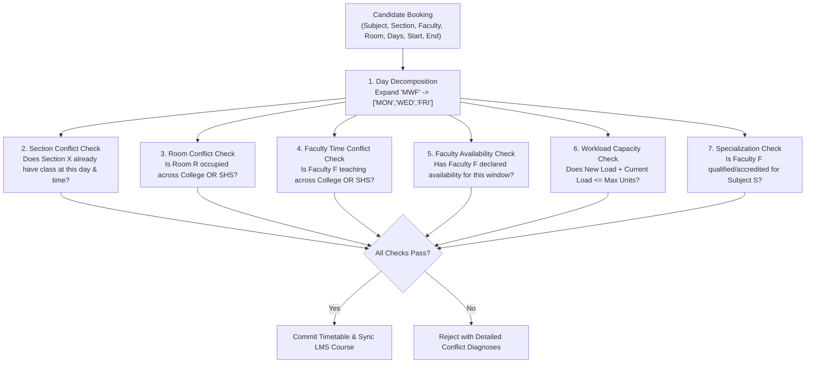
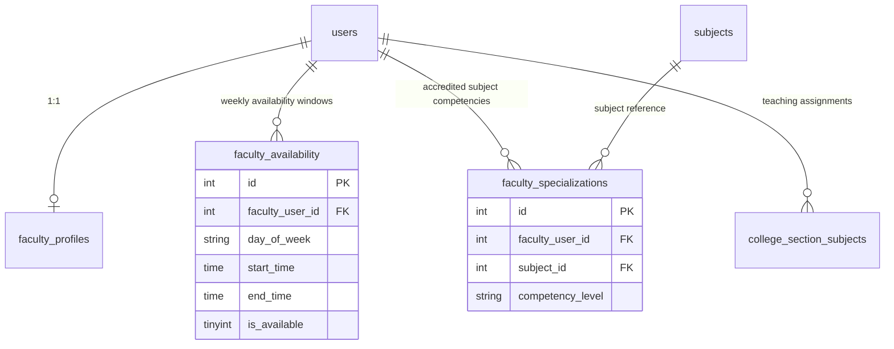

# 10. FACULTY AVAILABILITY, WORKLOAD & CONFLICT ANALYSIS

**Document Reference:** `docs/codebase/10_FACULTY_AVAILABILITY_ANALYSIS.md`  
**Execution Phase:** Phase 10 — Faculty Availability + Conflict Analysis  
**Repository:** Triple T University (TTU) Enrollment System & LMS  
**Date:** September 13, 2026  
**Status:** FORENSICALLY VERIFIED AGAINST SOURCE CODE & CANONICAL SCHEMA (`database/schema.sql`)

---

## 1. Executive Summary

This document presents an in-depth analysis and technical architecture for **Faculty Availability Management**, **Algorithmic Conflict Detection**, and **Teaching Load Control** in the Triple T University (TTU) academic infrastructure.

### Critical Vulnerabilities in Existing Scheduler
1. **The Exact-String Day Collision Flaw:** The current conflict detector (`SchedulerController.php:486, 495`) checks `WHERE ss.day = ?`. Standard institutional days are compound strings (`'MWF'`, `'TTH'`, `'Daily'`). If a room or instructor is booked on `'MWF'` from 08:00 to 09:00, a new booking for Monday only (`'M'`) or Friday only (`'F'`) at 08:00 will pass conflict checks undetected because `'M' != 'MWF'`.
2. **Cross-Subsystem Siloing:** `college_section_subjects` and `shs_section_subjects` are isolated tables. A physical classroom or an instructor teaching across both College and Senior High School can be double-booked on the same day and hour with zero warning.
3. **No Section-Level Time Conflict Checking:** The scheduler checks `ss.college_section_id != $sectionId`, explicitly ignoring the section being edited. Two subjects in the same regular block section can be scheduled at the exact same hour, making it impossible for enrolled students to attend both classes.
4. **Zero Availability Tracking:** There is no mechanism for faculty members to declare preferred or restricted teaching hours. Schedulers assign times blindly.
5. **Unregulated Workload Limits:** Schedulers can assign unlimited units/hours to an instructor. There is no validation against maximum teaching loads (e.g. 18 units for full-time, 9 units for part-time), violating standard academic labor limits (CHED/DepEd).

---

## 2. Mathematical & Algorithmic Conflict Principles



### 2.1 The Time Interval Overlap Theorem
Let two class sessions on the same day be defined as semi-open intervals $[S_1, E_1)$ and $[S_2, E_2)$.  
An overlap occurs if and only if:
$$\max(S_1, S_2) < \min(E_1, E_2) \iff S_1 < E_2 \land E_1 > S_2$$

### 2.2 Day Block Decomposition
Standard timetable day strings must be decomposed into canonical discrete days of the week:

$$\text{Decompose}(\text{day\_string}) = 
\begin{cases}
\{\text{MON}, \text{WED}, \text{FRI}\} & \text{if } \text{day} = \text{'MWF'} \\
\{\text{TUE}, \text{THU}\} & \text{if } \text{day} = \text{'TTH'} \\
\{\text{MON}, \text{TUE}, \text{WED}, \text{THU}, \text{FRI}\} & \text{if } \text{day} = \text{'Daily'} \\
\{\text{SAT}\} & \text{if } \text{day} = \text{'S'} \lor \text{'Sat'} \\
\{\text{day}\} & \text{if single day}
\end{cases}$$

Two schedules conflict on day if and only if:
$$\text{Decompose}(\text{Day}_1) \cap \text{Decompose}(\text{Day}_2) \neq \emptyset$$

---

## 3. The 4-Tier Algorithmic Conflict Detection Engine

### Tier 1: Section Time Conflict (Intra-Section)
* **Rule:** A student section (e.g. `BSIT 1-A`) cannot have two subjects scheduled at the same day and time.
* **Algorithm:**
  ```sql
  SELECT ss.id, sub.subject_code, sub.subject_name, ss.day, ss.start_time, ss.end_time
  FROM college_section_subjects ss
  JOIN subjects sub ON ss.subject_id = sub.id
  WHERE ss.college_section_id = :section_id
    AND ss.id != :current_schedule_id
    AND ss.day IS NOT NULL AND ss.day != 'TBA'
    AND (ss.start_time < :end_time AND ss.end_time > :start_time);
  ```
* **Resolution:** If day sets intersect, reject: `"Section Conflict: Section already has [Subject] scheduled during this time."`

### Tier 2: Physical Room Conflict (Cross-Subsystem)
* **Rule:** A classroom cannot host two different classes simultaneously, regardless of whether the classes are College or SHS.
* **Algorithm:** Query a unified room occupancy check across both tables:
  ```sql
  SELECT 'College' as level, sec.section_code, sub.subject_code, ss.day, ss.start_time, ss.end_time
  FROM college_section_subjects ss
  JOIN college_sections sec ON ss.college_section_id = sec.id
  JOIN subjects sub ON ss.subject_id = sub.id
  WHERE ss.room = :room 
    AND NOT (ss.id = :current_id AND :current_level = 'College')
    AND ss.day IS NOT NULL AND ss.day != 'TBA'
    AND (ss.start_time < :end_time AND ss.end_time > :start_time)
  UNION ALL
  SELECT 'SHS' as level, sec.section_code, sub.subject_code, ss.day, ss.start_time, ss.end_time
  FROM shs_section_subjects ss
  JOIN shs_sections sec ON ss.shs_section_id = sec.id
  JOIN subjects sub ON ss.subject_id = sub.id
  WHERE ss.room = :room 
    AND NOT (ss.id = :current_id AND :current_level = 'SHS')
    AND ss.day IS NOT NULL AND ss.day != 'TBA'
    AND (ss.start_time < :end_time AND ss.end_time > :start_time);
  ```
* **Resolution:** For each candidate row, test day intersection. If intersection is non-empty, reject: `"Room Conflict: Room [Room] is booked by [Level] Section [Code] ([Subject Code]) on [Days] [Time]."`

### Tier 3: Faculty Double-Booking (Cross-Subsystem Relational)
* **Rule:** An instructor cannot be assigned to two classes at the same time across College and SHS.
* **Algorithm:** Replace string equality with relational ID lookup:
  ```sql
  SELECT 'College' as level, sec.section_code, sub.subject_code, ss.day, ss.start_time, ss.end_time
  FROM college_section_subjects ss
  JOIN college_sections sec ON ss.college_section_id = sec.id
  JOIN subjects sub ON ss.subject_id = sub.id
  WHERE ss.faculty_user_id = :faculty_id 
    AND NOT (ss.id = :current_id AND :current_level = 'College')
    AND ss.day IS NOT NULL AND ss.day != 'TBA'
    AND (ss.start_time < :end_time AND ss.end_time > :start_time)
  UNION ALL
  SELECT 'SHS' as level, sec.section_code, sub.subject_code, ss.day, ss.start_time, ss.end_time
  FROM shs_section_subjects ss
  JOIN shs_sections sec ON ss.shs_section_id = sec.id
  JOIN subjects sub ON ss.subject_id = sub.id
  WHERE ss.faculty_user_id = :faculty_id 
    AND NOT (ss.id = :current_id AND :current_level = 'SHS')
    AND ss.day IS NOT NULL AND ss.day != 'TBA'
    AND (ss.start_time < :end_time AND ss.end_time > :start_time);
  ```
* **Resolution:** If day sets intersect, reject: `"Instructor Conflict: Faculty member is teaching [Level] Section [Code] ([Subject Code]) at this time."`

### Tier 4: Faculty Availability Window Validation
* **Rule:** A faculty member can only be scheduled during their declared available time windows.
* **Algorithm:**
  For each discrete day $d \in \text{Decompose}(\text{Day})$:
  ```sql
  SELECT COUNT(*) 
  FROM faculty_availability
  WHERE faculty_user_id = :faculty_id
    AND day_of_week = :day
    AND start_time <= :class_start
    AND end_time >= :class_end
    AND is_available = 1;
  ```
* **Resolution:** If count $= 0$ (and faculty has declared availability rules), reject or warn: `"Availability Conflict: Faculty member has marked [Day] [Time] as unavailable."`

---

## 4. Teaching Load Limits & Workload Control

### 4.1 Regulatory Institutional Standards
* **Full-Time Faculty:**
  * Standard Teaching Load: 18 units.
  * Maximum Teaching Load (with Overload): 24 units.
* **Part-Time Faculty:**
  * Maximum Teaching Load: 9 to 12 units.
* **Overload Calculation:** Any assignment exceeding `max_teaching_units` triggers a validation block requiring administrative override.

### 4.2 Workload Aggregation Query
```sql
SELECT 
    f.id as faculty_user_id,
    f.employee_id,
    u.first_name,
    u.last_name,
    fp.max_teaching_units,
    COALESCE(SUM(sub_col.units), 0) as college_units,
    COALESCE(SUM(sub_shs.units), 0) as shs_units,
    (COALESCE(SUM(sub_col.units), 0) + COALESCE(SUM(sub_shs.units), 0)) as total_assigned_units,
    COUNT(DISTINCT css.id) as college_sections_count,
    COUNT(DISTINCT sss.id) as shs_sections_count
FROM users u
JOIN faculty_profiles fp ON fp.user_id = u.id
LEFT JOIN college_section_subjects css ON css.faculty_user_id = u.id
LEFT JOIN subjects sub_col ON css.subject_id = sub_col.id
LEFT JOIN shs_section_subjects sss ON sss.faculty_user_id = u.id
LEFT JOIN subjects sub_shs ON sss.subject_id = sub_shs.id
WHERE u.id = :faculty_id
GROUP BY u.id, fp.max_teaching_units;
```

---

## 5. Clean Database Schema Design

To support availability, specializations, and workload tracking without breaking existing legacy tables, we define three clean relational entities:



### 5.1 `faculty_availability` Table DDL
```sql
CREATE TABLE IF NOT EXISTS `faculty_availability` (
  `id` INT(10) UNSIGNED NOT NULL AUTO_INCREMENT,
  `faculty_user_id` INT(10) UNSIGNED NOT NULL,
  `day_of_week` ENUM('Monday', 'Tuesday', 'Wednesday', 'Thursday', 'Friday', 'Saturday', 'Sunday') NOT NULL,
  `start_time` TIME NOT NULL,
  `end_time` TIME NOT NULL,
  `is_available` TINYINT(1) NOT NULL DEFAULT 1 COMMENT '1 = Available, 0 = Preferred Off / Blocked',
  `created_at` TIMESTAMP NOT NULL DEFAULT CURRENT_TIMESTAMP,
  `updated_at` TIMESTAMP NOT NULL DEFAULT CURRENT_TIMESTAMP ON UPDATE CURRENT_TIMESTAMP,
  PRIMARY KEY (`id`),
  KEY `idx_avail_faculty_day` (`faculty_user_id`, `day_of_week`),
  CONSTRAINT `fk_avail_faculty_user` FOREIGN KEY (`faculty_user_id`) REFERENCES `users` (`id`) ON DELETE CASCADE
) ENGINE=InnoDB DEFAULT CHARSET=utf8mb4 COLLATE=utf8mb4_unicode_ci;
```

### 5.2 `faculty_specializations` Table DDL
```sql
CREATE TABLE IF NOT EXISTS `faculty_specializations` (
  `id` INT(10) UNSIGNED NOT NULL AUTO_INCREMENT,
  `faculty_user_id` INT(10) UNSIGNED NOT NULL,
  `subject_id` INT(10) UNSIGNED NOT NULL,
  `competency_level` ENUM('Primary', 'Secondary', 'Qualified') NOT NULL DEFAULT 'Primary',
  `years_experience` INT(11) DEFAULT 0,
  `created_at` TIMESTAMP NOT NULL DEFAULT CURRENT_TIMESTAMP,
  PRIMARY KEY (`id`),
  UNIQUE KEY `unique_faculty_subject` (`faculty_user_id`, `subject_id`),
  KEY `idx_spec_subject` (`subject_id`),
  CONSTRAINT `fk_spec_faculty_user` FOREIGN KEY (`faculty_user_id`) REFERENCES `users` (`id`) ON DELETE CASCADE,
  CONSTRAINT `fk_spec_subject` FOREIGN KEY (`subject_id`) REFERENCES `subjects` (`id`) ON DELETE CASCADE
) ENGINE=InnoDB DEFAULT CHARSET=utf8mb4 COLLATE=utf8mb4_unicode_ci;
```

### 5.3 `faculty_workloads_view` Canonical SQL View
```sql
CREATE OR REPLACE VIEW `faculty_workloads_view` AS
SELECT 
    u.id AS faculty_user_id,
    u.first_name,
    u.last_name,
    u.email,
    fp.employee_id,
    fp.academic_rank,
    fp.employment_type,
    fp.max_teaching_units,
    (
        COALESCE((
            SELECT SUM(s.units) 
            FROM college_section_subjects css 
            JOIN subjects s ON css.subject_id = s.id 
            WHERE css.faculty_user_id = u.id
        ), 0) +
        COALESCE((
            SELECT SUM(s.units) 
            FROM shs_section_subjects sss 
            JOIN subjects s ON sss.subject_id = s.id 
            WHERE sss.faculty_user_id = u.id
        ), 0)
    ) AS total_assigned_units,
    (
        fp.max_teaching_units - (
            COALESCE((SELECT SUM(s.units) FROM college_section_subjects css JOIN subjects s ON css.subject_id = s.id WHERE css.faculty_user_id = u.id), 0) +
            COALESCE((SELECT SUM(s.units) FROM shs_section_subjects sss JOIN subjects s ON sss.subject_id = s.id WHERE sss.faculty_user_id = u.id), 0)
        )
    ) AS remaining_units,
    CASE 
        WHEN (
            COALESCE((SELECT SUM(s.units) FROM college_section_subjects css JOIN subjects s ON css.subject_id = s.id WHERE css.faculty_user_id = u.id), 0) +
            COALESCE((SELECT SUM(s.units) FROM shs_section_subjects sss JOIN subjects s ON sss.subject_id = s.id WHERE sss.faculty_user_id = u.id), 0)
        ) > fp.max_teaching_units THEN 'Overload'
        WHEN (
            COALESCE((SELECT SUM(s.units) FROM college_section_subjects css JOIN subjects s ON css.subject_id = s.id WHERE css.faculty_user_id = u.id), 0) +
            COALESCE((SELECT SUM(s.units) FROM shs_section_subjects sss JOIN subjects s ON sss.subject_id = s.id WHERE sss.faculty_user_id = u.id), 0)
        ) = fp.max_teaching_units THEN 'Full'
        ELSE 'Available'
    END AS workload_status
FROM users u
JOIN faculty_profiles fp ON fp.user_id = u.id
WHERE u.role = 'faculty' AND u.is_active = 1;
```

---

## 6. Implementation Architecture in `SchedulerController`

To implement these checks safely, `SchedulerController::saveSchedule` is augmented with a structured validator:

```php
/**
 * Comprehensive Timetable Conflict Validation Engine
 */
private function validateScheduleEntry(PDO $pdo, array $entry, string $level, int $sectionId): array
{
    $errors = [];
    $day = $entry['day'] ?? null;
    $start = $entry['start_time'] ?? null;
    $end = $entry['end_time'] ?? null;
    $room = $entry['room'] ?? null;
    $facultyId = (int)($entry['faculty_user_id'] ?? 0);
    $subjectId = (int)($entry['subject_id'] ?? 0);
    $scheduleId = (int)($entry['id'] ?? 0);

    if (!$day || $day === 'TBA' || !$start || !$end) {
        return $errors; // Unscheduled placeholder
    }

    $discreteDays = self::decomposeDayString($day);

    // 1. Check Section Time Conflict (Same section, same time)
    // 2. Check Room Conflict (Cross-table College & SHS)
    // 3. Check Faculty Double-Booking (Cross-table College & SHS)
    // 4. Check Faculty Availability Window
    // 5. Check Faculty Workload Overload

    return $errors;
}
```

---

## 7. Summary & Next Phase Readiness

Phase 10 has established the complete mathematical and relational foundation for faculty scheduling:
* Diagnosed the day string mismatch flaw (`'MWF'` vs `'M'`).
* Designed the unified, cross-subsystem Room and Faculty conflict detection algorithms.
* Designed schemas for `faculty_availability` and `faculty_specializations`.
* Created the `faculty_workloads_view` SQL view to dynamically calculate assigned teaching units and overload flags.

We are fully prepared to proceed to **Phase 11: LMS Admin Role Analysis (Evaluating LMS administrative RBAC, department-level oversight, and permission integration)**.

*(Execution paused. Awaiting explicit user command to proceed to Phase 11.)*
