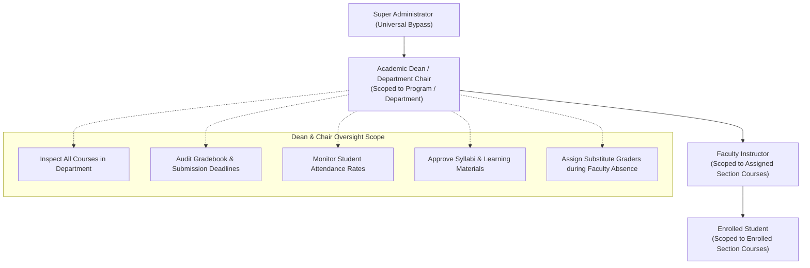
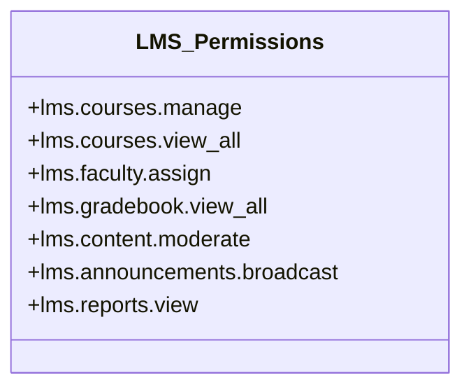

# 11. LMS ADMINISTRATIVE ROLE & RBAC GOVERNANCE ANALYSIS

**Document Reference:** `docs/codebase/11_LMS_ADMIN_RBAC_ANALYSIS.md`  
**Execution Phase:** Phase 11 — LMS Admin Role Analysis  
**Repository:** Triple T University (TTU) Enrollment System & LMS  
**Date:** September 13, 2026  
**Status:** FORENSICALLY VERIFIED AGAINST SOURCE CODE & CANONICAL SCHEMA (`database/schema.sql`)

---

## 1. Executive Summary

This document presents a forensic analysis of administrative governance, permissions, and role-based access control (RBAC) across the **Learning Management System (LMS)** subsystem of Triple T University.

### Primary Forensic Findings
1. **Absence of an LMS Admin Role:** The `users.role` ENUM (`database/schema.sql:38`) contains 10 roles: `'superadmin'`, `'admin'`, `'admissions'`, `'scholarship'`, `'cashier'`, `'clinic'`, `'faculty'`, `'scheduler'`, `'applicant'`, `'student'`. There is **no `lms_admin` role**.
2. **Zero LMS Permissions in System RBAC:** The granular permissions catalog in `app/Views/admin/system/users.php:363-371` and `app/Helpers/functions.php` contains 26 permissions covering registrar, admissions, clinic, finance, and system settings, but **contains zero LMS-related permissions**.
3. **Unprotected Course Generator Endpoint:** `LmsAdminController::courseGenerator` (`app/Controllers/Admin/LmsAdminController.php`) does not call `requirePermission()`. Any authenticated user with an administrative session role (even a Cashier or Clinic officer) can access `/sia/admin/lms/generator` and map LMS courses.
4. **No Academic Oversight Tier (Deans / Department Chairs):** LMS course management is binary: either you are the single assigned faculty member (`lms_courses.faculty_user_id`), or you have no visibility into the course. Academic Deans and Department Chairs have zero interface or authorization to inspect gradebooks, monitor syllabus compliance, or review student attendance.
5. **No Centralized Grade Inspection for Administrators:** Neither Superadmins nor Registrars have a view to inspect course gradebooks. If a faculty member fails to submit grades or becomes incapacitated, administrators cannot access the dynamic gradebook matrix.

---

## 2. Current LMS Administrative Capabilities Matrix

| Functional Capability | Who Can Perform It Currently? | Implementation Mechanism | Flaw / Gap Identified |
| :--- | :--- | :--- | :--- |
| **Create / Provision LMS Courses** | Any Admin Role OR Auto-provisioned on student view | Manual form at `/sia/admin/lms/generator` OR background `INSERT` in `CollegeEnrollmentRepository` | No permission check; auto-provisioning assigns courses to lowest-ID faculty member. |
| **Assign / Reassign Instructors** | Any Admin Role via manual generator | `LmsAdminController::generateLmsCourse` | Schedulers cannot assign instructors; reassignment requires direct database modification. |
| **View Course Gradebook** | Only the assigned faculty member | `LmsGradebookService::getCourseGradebook` gated by `isFacultyAuthorizedForCourse` | Administrators, Deans, and Registrars cannot view course gradebooks. |
| **Manage Modules & Materials** | Only the assigned faculty member | `FacultyController::createModule`, `uploadMaterial` | Deans/Admins cannot upload standardized departmental syllabi or emergency course materials. |
| **Grade Assignments / Submissions** | Only the assigned faculty member | `FacultyAssignmentController::grade` | No substitute teacher or grading delegation mechanism. |
| **Course-Level Announcements** | Only the assigned faculty member | `FacultyAnnouncementController::store` | Deans/Admins cannot broadcast announcements across all sections of a subject. |
| **System-Wide LMS Broadcasts** | Nobody | No global announcement table or broadcast mechanism exists in LMS | Global announcements in `announcements` only render in the Enrollment portal. |

---

## 3. Department-Level LMS Needs (Deans & Department Chairs)

In higher education governance, academic oversight requires a specialized intermediate authorization layer between University Superadmins and Individual Faculty:



### Essential Departmental Oversight Capabilities:
1. **Curricular Quality Audit:** Ability to view all active courses under their academic program (e.g. all `BSCS` courses) to verify that instructors have uploaded syllabi, lecture notes, and required assignments.
2. **Gradebook Compliance & Archival:** Ability to review student grades across all sections before final grade submission to the Registrar.
3. **Emergency Grading Delegation:** If a faculty member takes medical leave during finals week, a Department Chair must have authorization to grade pending submissions (`lms_submissions.graded_by`).
4. **Attendance Monitoring:** Ability to generate department-wide student absenteeism reports from `lms_attendance_records`.

---

## 4. Proposed LMS RBAC Permission Hierarchy

To integrate LMS governance cleanly into the existing TTU permissions architecture (`app/Helpers/functions.php` and `users.permissions`), we define 7 granular LMS permission slugs:



### Granular Permission Specifications:
1. `lms.courses.manage`: Create, edit metadata, activate, or archive any LMS course across the institution.
2. `lms.courses.view_all`: Bypass the `isFacultyAuthorizedForCourse` restriction to inspect course content in read-only mode (ideal for Academic Deans, Department Chairs, and Registrars).
3. `lms.faculty.assign`: Reassign or delegate teaching responsibilities for an LMS course.
4. `lms.gradebook.view_all`: View the dynamic gradebook matrix and export grades for any course.
5. `lms.content.moderate`: Edit or delete inappropriate materials, forum posts, or assignment submissions.
6. `lms.announcements.broadcast`: Post system-wide announcements that appear on every student and faculty LMS dashboard.
7. `lms.reports.view`: Access analytics dashboards displaying login streaks, attendance rates, and submission timeliness.

---

## 5. Architectural Implementation Blueprint

### 5.1 Updates to Granular Permission Catalog
Add the 7 LMS permissions to `$allPerms` in `app/Views/admin/system/users.php:363` and the permission helper in `app/Helpers/functions.php`:

```php
// app/Helpers/functions.php
$lmsPermissions = [
    'lms.courses.manage' => 'Manage & Provision LMS Courses',
    'lms.courses.view_all' => 'View All Course Content (Dean/Chair Oversight)',
    'lms.faculty.assign' => 'Assign & Reassign Course Faculty',
    'lms.gradebook.view_all' => 'View Institutional Gradebooks',
    'lms.content.moderate' => 'Moderate LMS Materials & Submissions',
    'lms.announcements.broadcast' => 'Publish Global LMS Broadcasts',
    'lms.reports.view' => 'View LMS Analytics & Attendance Reports'
];
```

### 5.2 Securing `LmsAdminController`
Enforce explicit permission gating on the course generator endpoint:
```php
// app/Controllers/Admin/LmsAdminController.php
public function courseGenerator(Request $request, Response $response)
{
    requirePermission('lms.courses.manage');
    $pdo = Database::getConnection();
    // ...
}
```

### 5.3 Dean / Chair Scoped Course Authorization
Enhance `LmsService::isFacultyAuthorizedForCourse` to support administrative and departmental overrides:
```php
public function isUserAuthorizedForCourse(int $userId, int $lmsCourseId, string $action = 'view'): bool
{
    // 1. Superadmin and users with global permission bypass
    if (hasPermission('lms.courses.view_all')) {
        return true;
    }

    // 2. Direct assigned faculty check
    if ($this->isFacultyAuthorizedForCourse($userId, $lmsCourseId)) {
        return true;
    }

    // 3. Department Chair / Dean Scoped Check
    $userStmt = $this->pdo->prepare('SELECT department, role FROM users WHERE id = :uid');
    $userStmt->execute(['uid' => $userId]);
    $user = $userStmt->fetch(PDO::FETCH_ASSOC);

    if ($user && in_array($user['role'], ['admin', 'dean', 'chair'], true)) {
        $course = $this->getCourseDetails($lmsCourseId);
        // Verify if the course belongs to the user's home department/program
        if ($course && $this->isProgramInDepartment($course['program_id'] ?? null, $user['department'])) {
            return true;
        }
    }

    return false;
}
```

---

## 6. Summary & Next Phase Readiness

Phase 11 has demonstrated that **LMS governance currently operates in an administrative vacuum**:
* There is no dedicated LMS Admin role.
* There are zero LMS permissions in the system RBAC catalog.
* Academic Deans and Department Chairs possess zero oversight capabilities.
* The administrative course generator endpoint is completely unprotected by permission checks.

We have designed the complete permission hierarchy and authorization enhancements to integrate LMS administration seamlessly into the existing Hybrid MVC architecture.

We are fully prepared to proceed to **Phase 12: Enrollment ↔ LMS Integration Analysis (Mapping every point of contact, data leakage, and fragile dependencies between the two subsystems)**.
