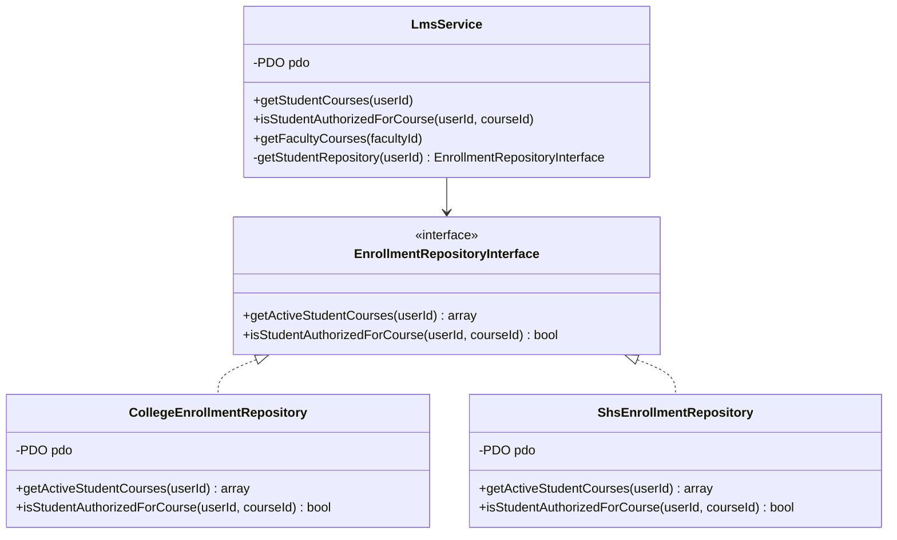
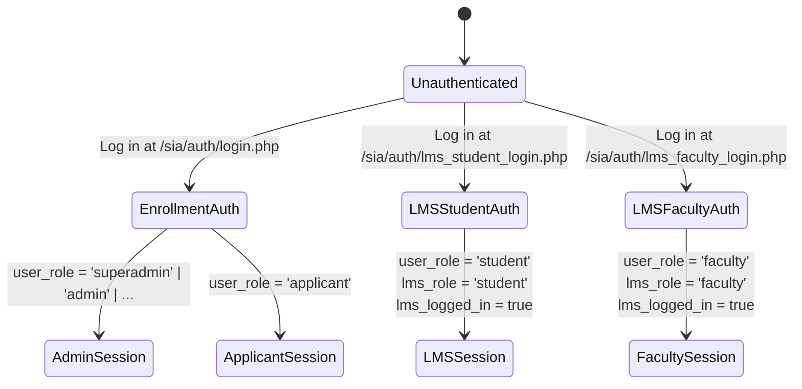
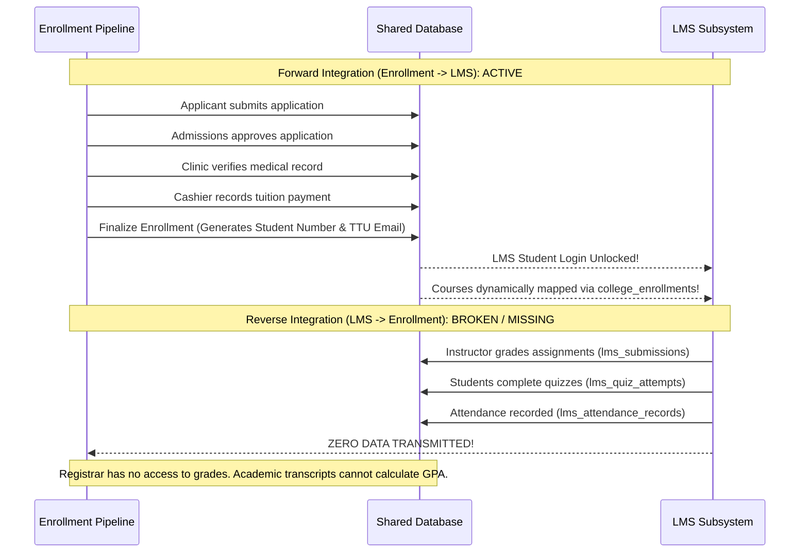

# 12. ENROLLMENT ↔ LMS INTEGRATION ARCHITECTURE ANALYSIS

**Document Reference:** `docs/codebase/12_ENROLLMENT_LMS_INTEGRATION.md`  
**Execution Phase:** Phase 12 — Enrollment ↔ LMS Integration Analysis  
**Repository:** Triple T University (TTU) Enrollment System & LMS  
**Date:** September 13, 2026  
**Status:** FORENSICALLY VERIFIED AGAINST SOURCE CODE & CANONICAL SCHEMA (`database/schema.sql`)

---

## 1. Executive Summary

This document provides a forensic architectural mapping of every intersection, dependency, data exchange, and shared state between the **Enrollment Subsystem** and the **Learning Management System (LMS)** within Triple T University.

```mermaid
graph LR
    subgraph Enrollment Subsystem
        App["applications"]
        CE["college_enrollments"]
        SE["shs_enrollments"]
        Sec["college_sections / shs_sections"]
        Sub["subjects"]
    end

    subgraph Shared Core
        Users["users Table (Identity / Auth)"]
        Sessions["PHP Session Namespace ($_SESSION)"]
        Helpers["functions.php & DB Singleton"]
    end

    subgraph LMS Subsystem
        LC["lms_courses"]
        LM["lms_modules / lms_materials"]
        LA["lms_assignments / lms_quizzes"]
        LS["lms_submissions / lms_quiz_attempts"]
        AR["lms_attendance_records"]
    end

    Users --> Enrollment Subsystem
    Users --> LMS Subsystem
    
    App -->|Status & Section Gating| LC
    CE & SE -->|Virtual Roster Resolution| LC
    Sec -.->|academic_section_id (No FK)| LC
    Sub -->|subject_id FK| LC
    
    LS & AR -->|student_id FK| Users
    LC -->|faculty_user_id FK| Users
```

---

## 2. Multi-Level Integration Mapping

### 2.1 Database-Level Integration (Shared Schema & Constraints)

The two subsystems interface directly across **6 core tables**:

| Shared Entity | Enrollment Write Responsibility | LMS Read / Write Responsibility | Relational Constraints & Risks |
| :--- | :--- | :--- | :--- |
| **`users`** | Writes legal names, emails, credentials, student numbers, roles, and curriculum IDs. | Reads credentials for login; queries names for rosters, gradebooks, and submissions; references `users.id` in 8 foreign keys. | Catastrophic hazard: `lms_courses.faculty_user_id` has `ON DELETE CASCADE`. Deleting a faculty member purges all LMS courses, submissions, and quiz questions. |
| **`applications`** | Writes all demographic data, program choices, section assignments, and status transitions (`pending` $\to$ `approved` $\to$ `enrolled`). | Gating mechanism: Queries `a.status IN ('enrolled', 'approved')` to authorize student login; queries `a.academic_level` to select repository. | Parasitic coupling: LMS has no student table; it cannot operate without `applications`. |
| **`college_enrollments` / `shs_enrollments`** | Created during Admissions approval or enrollment finalization; maps student to enrolled subjects and sections. | Virtual Roster Engine: LMS gradebook, attendance, and course authorization join these tables to determine student lists. | LMS maintains no course enrollment records; dropping a student in Enrollment immediately breaks LMS gradebook history for that student. |
| **`subjects`** | Maintained by Registrar; defines curriculum catalog, unit values, and codes. | Referenced by `lms_courses.subject_id` (`ON DELETE CASCADE`); course views display code, name, units. | Deleting a subject in Registrar immediately deletes all historical LMS courses and student submissions for that subject. |
| **`college_sections` / `shs_sections`** | Maintained by Scheduler / Registrar; defines cohort codes, capacity, and terms. | `lms_courses.academic_section_id` stores section ID logically. | **Missing Foreign Key:** Deleting a section deletes timetable records but leaves orphaned courses in LMS. |
| **`activity_logs`** | Logs admissions, document verification, fee assessment, and enrollment events. | Currently underutilized by LMS; only user profile and login activities are logged. | Shared audit trail. |

---

### 2.2 Code-Level Integration (Models, Services, and Repositories)

The integration at the application layer is mediated by domain services and repositories:



#### Key Code Interactions:
1. **Dynamic Repository Factory (`LmsService::getStudentRepository`):**
   ```php
   // app/Services/LmsService.php:22-40
   $stmt = $this->pdo->prepare("
       SELECT academic_level FROM applications 
       WHERE user_id = :uid AND status = 'enrolled' 
       ORDER BY id DESC LIMIT 1
   ");
   $stmt->execute(['uid' => $userId]);
   $level = $stmt->fetchColumn();

   if ($level === 'College') return new CollegeEnrollmentRepository();
   if ($level === 'Senior High School') return new ShsEnrollmentRepository();
   return null;
   ```
   If a user lacks an `'enrolled'` application record, `LmsService` fails to instantiate a repository, completely disabling LMS course retrieval.
2. **Dynamic Gradebook Enrollment Resolution (`LmsGradebookService`):**
   ```php
   // app/Services/LmsGradebookService.php:34-51
   // Directly queries college_enrollments and shs_enrollments to assemble the student roster!
   ```
3. **Shared Core Helpers (`app/Helpers/functions.php`):**
   * Shared PDO connection singleton (`App\Core\Database::getConnection()`).
   * Shared notification engine: `sendStudentCredentialsEmail()` sends institutional credentials used for LMS access.

---

### 2.3 Authentication & Session-Level Integration

The two subsystems share a single PHP session namespace (`$_SESSION`), which creates severe cross-portal side effects:



#### Identified Session Collision Flaw:
* When a user logs in via `LmsAuthController.php:99`, the controller executes:
  ```php
  $_SESSION['user_role'] = 'student';
  $_SESSION['lms_role'] = 'student';
  ```
* If that user was previously an administrative assistant or applicant in the Enrollment portal, their `$_SESSION['user_role']` is overwritten.
* When they navigate back to administrative or applicant routes, `RoleMiddleware.php:61` evaluates the mutated `$_SESSION['user_role']`, denying them access or triggering redirect loops.

---

### 2.4 Business Process Level Integration (The Asymmetric Lifecycle)



#### The Forward Integration Works (Enrollment $\to$ LMS):
Finalizing enrollment successfully activates LMS login, generates institutional credentials, and populates course rosters.

#### The Reverse Integration is Non-Existent (LMS $\to$ Enrollment):
* Grades calculated in the LMS (`LmsGradebookService`) remain trapped within LMS tables.
* There is **no grade submission workflow** from faculty to the Registrar.
* `student_academic_records_view` sums enrolled units, but cannot display course grades or GPAs.
* Academic standing, dean's list honors, and prerequisite clearance for subsequent terms cannot be automated.

---

## 3. Vulnerability & Data Leakage Matrix

| Vulnerability / Leakage Point | Subsystems Involved | Severity | Impact |
| :--- | :--- | :---: | :--- |
| **Cascade Deletion of Historical Academics** | `users` $\to$ `lms_courses` $\to$ `lms_submissions` | **CRITICAL** | Deleting a faculty member purges student submissions, quiz questions, and grades. |
| **Session State Mutation** | `LmsAuthController` $\leftrightarrow$ `RoleMiddleware` | **MAJOR** | LMS login mutates `$_SESSION['user_role']`, corrupting access to Enrollment portals. |
| **Unlinked Timetable Instructor** | `college_section_subjects` $\leftrightarrow$ `lms_courses` | **MAJOR** | Schedulers assign instructors as text strings; LMS course ownership is decoupled, causing fallback assignments. |
| **Premature LMS Login Access** | `applications` $\leftrightarrow$ `LmsAuthController` | **MINOR** | Status `'approved'` permits login to LMS dashboard, but displays 0 courses until status is `'enrolled'`. |
| **Orphaned LMS Courses** | `college_sections` $\leftrightarrow$ `lms_courses` | **MAJOR** | Deleting a section leaves active zombie courses in the LMS. |
| **Zero Academic Feedback Loop** | LMS Gradebook $\leftrightarrow$ Registrar Records | **CRITICAL** | Final LMS grades do not update student academic histories or transcripts. |

---

## 4. Summary & Next Phase Readiness

Phase 12 has mapped the full boundary between Enrollment and LMS:
* Identified the asymmetric forward-only data flow (Enrollment pushes students to LMS, but LMS never returns grades to Registrar).
* Uncovered the session variable collision mutating `$_SESSION['user_role']`.
* Traced the fragile database links where schema deletions cascade destructively across subsystem boundaries.

We are fully prepared to proceed to **Phase 13: End-to-End Workflow Trace (Step-by-step code and database tracing across student, faculty, and scheduler lifecycles)**.
