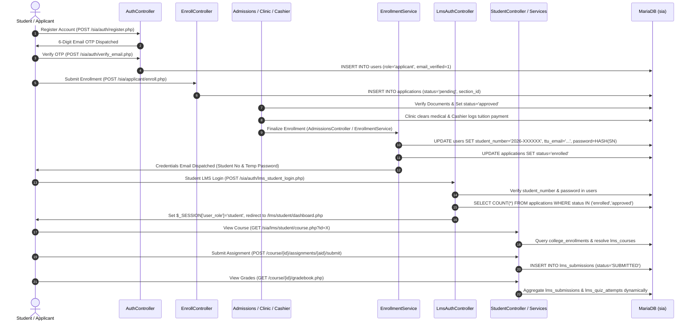
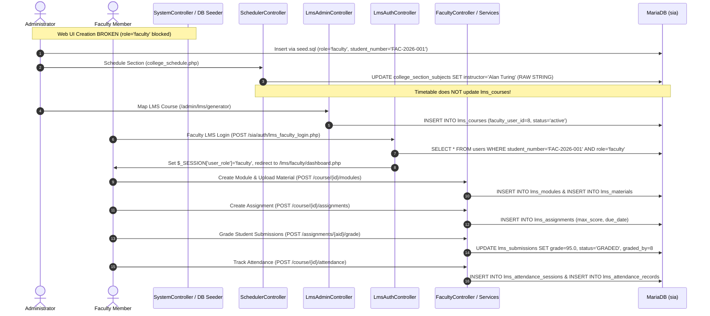
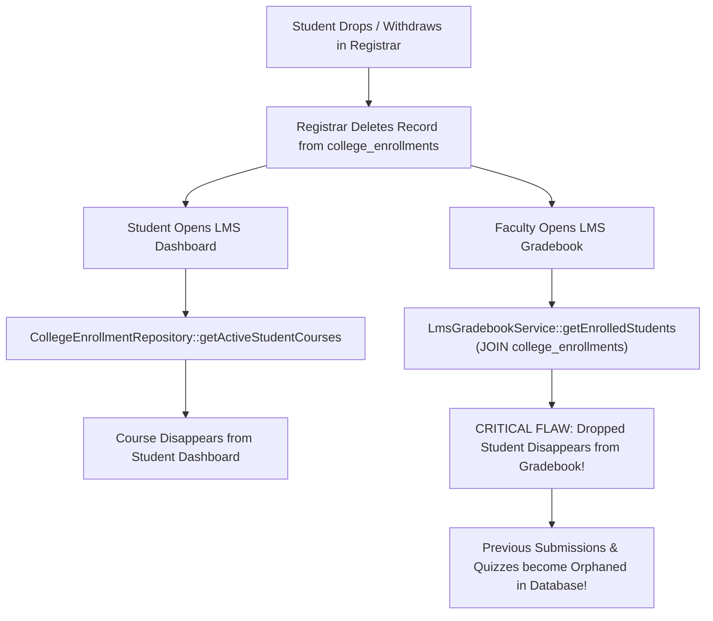
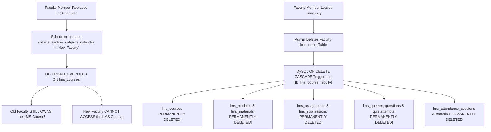

# 13. END-TO-END WORKFLOW TRACE & FAILURE MODE ANALYSIS

**Document Reference:** `docs/codebase/13_END_TO_END_WORKFLOWS.md`  
**Execution Phase:** Phase 13 — End-to-End Workflow Trace  
**Repository:** Triple T University (TTU) Enrollment System & LMS  
**Date:** September 13, 2026  
**Status:** FORENSICALLY VERIFIED AGAINST SOURCE CODE & CANONICAL SCHEMA (`database/schema.sql`)

---

## 1. Executive Summary

This document traces the **five critical academic workflows** across Triple T University's hybrid codebase, documenting the exact files invoked, database read/write queries, session mutations, and failure modes at every step of execution.

---

## 2. Workflow 1: The Complete Student Lifecycle

### Detailed Trace Table for Workflow 1:

| Step | Controller & File Path | Database Operations (SQL) | Session State Changes | Failure Mode / Vulnerability |
| :--- | :--- | :--- | :--- | :--- |
| **1. Registration** | `AuthController::register` `app/Controllers/AuthController.php:162-240` | `SELECT id FROM users WHERE email = :email` | Populates `$_SESSION['pending_registration']` with input and hashed password. | User leaves before OTP; account is uncreated. |
| **2. OTP Verification** | `AuthController::verifyEmail` `app/Controllers/AuthController.php:270-338` | `INSERT INTO users (first_name, last_name, email, password, role='applicant', is_active=1, email_verified=1)` | `$_SESSION['logged_in'] = true` `$_SESSION['user_id'] = $id` `$_SESSION['user_role'] = 'applicant'` | Email collision during interim; unsets pending session. |
| **3. Application** | `EnrollController::processForm` `app/Controllers/EnrollController.php:89-351` | `INSERT INTO applications (user_id, reference_number, academic_level, grade_level, strand, section_id, status='pending')` | Sets `$_SESSION['enroll_old']` on validation failure. | Submitting duplicate application redirects away (`EnrollController:39`). |
| **4. Approval** | `AdmissionsController::process` `app/Controllers/Admin/Admissions/AdmissionsController.php:517-720` | `UPDATE applications SET status = 'approved', section_id = :sec` `INSERT INTO college_enrollments (application_id, subject_id, college_section_id)` `AssessmentService::generateAssessment` | Sets `$_SESSION['admin_success']` | Section capacity overflow if schedulers modified limits concurrently. |
| **5. Finalize** | `EnrollmentService::finalizeEnrollment` `app/Services/EnrollmentService.php:25-196` | `UPDATE users SET student_number = :sn, ttu_email = :mail, password = :hash, force_password_reset = 1` `UPDATE applications SET status = 'enrolled'` | None (Admin session active). | **Password Overwrite:** Destroys applicant's original personal password without notice. |
| **6. LMS Login** | `LmsAuthController::login` `app/Controllers/Lms/LmsAuthController.php:62-117` | `SELECT * FROM users WHERE student_number = :sid AND is_active = 1` `SELECT COUNT(*) FROM applications WHERE status IN ('enrolled','approved')` | `$_SESSION['user_role'] = 'student'` `$_SESSION['lms_role'] = 'student'` `$_SESSION['lms_logged_in'] = true` | **Role Mutation:** Overwrites `$_SESSION['user_role']`, breaking Enrollment route guards. |
| **7. Course View** | `StudentController::course` `app/Controllers/Lms/StudentController.php:29-100` | `SELECT * FROM college_enrollments ce JOIN applications a ...` `SELECT * FROM lms_courses WHERE academic_section_id = :sec` | None. | **Fallback Faculty:** Auto-provisions course with lowest-ID faculty member if unmapped. |
| **8. Submission** | `StudentAssignmentController::submit` `app/Controllers/Lms/StudentAssignmentController.php` | `INSERT INTO lms_submissions (assignment_id, student_id, file_path, status='SUBMITTED')` | None. | File size/MIME validation bypass if upload limits misconfigured. |
| **9. Grade View** | `StudentGradebookController::index` `app/Controllers/Lms/StudentGradebookController.php` | `LmsGradebookService::getStudentGradebook` queries `lms_submissions` & `lms_quiz_attempts` | None. | Slow read performance as submissions and quiz attempts scale (no indexing on grades). |

---

## 2. Workflow 2: The Faculty Lifecycle

### Detailed Trace Table for Workflow 2:

| Step | Controller & File Path | Database Operations (SQL) | Failure Mode / Vulnerability |
| :--- | :--- | :--- | :--- |
| **1. Faculty Creation** | Direct Database Seed (`database/seed.sql:44`) | `INSERT INTO users (first_name, last_name, email, student_number='FAC-2026-001', role='faculty', department='...')` | **UI Defect:** `SystemController.php:162` rejects `'faculty'`; administrators cannot create faculty via web UI. |
| **2. Course Assignment** | `SchedulerController::saveSchedule` `SchedulerController.php:501` | `UPDATE college_section_subjects SET instructor = 'Alan Turing'` | **Loose String:** No foreign key; zero communication with `lms_courses`. |
| **3. LMS Mapping** | `LmsAdminController::generateLmsCourse` `LmsAdminController.php:84` | `INSERT INTO lms_courses (academic_level, academic_section_id, subject_id, faculty_user_id, status)` | Manual human bottleneck; if forgotten, auto-provisioning misassigns course. |
| **4. LMS Login** | `LmsAuthController::login` `LmsAuthController.php:126` | `SELECT * FROM users WHERE student_number = :eid AND role = 'faculty' AND is_active = 1` | Overloaded identifier: requires Employee ID in `student_number` column. |
| **5. Module & Material**| `FacultyController::createModule` `FacultyController.php:54-73` | `INSERT INTO lms_modules (lms_course_id, title, display_order)` `INSERT INTO lms_materials (...)` | Authorized via `isFacultyAuthorizedForCourse`; no Dean/Chair override permitted. |
| **6. Grading** | `FacultyAssignmentController::grade` `FacultyAssignmentController.php:134-149` | `UPDATE lms_submissions SET grade = :grade, feedback = :fb, status = 'GRADED', graded_by = :uid` | Grade stored purely in LMS; never synced to Registrar student transcript. |
| **7. Attendance** | `FacultyAttendanceController::save` `FacultyAttendanceController.php` | `INSERT INTO lms_attendance_sessions` `INSERT INTO lms_attendance_records ON DUPLICATE KEY UPDATE` | Student list resolved dynamically; dropped students vanish from attendance sheet. |

---

## 3. Workflow 3: Section Timetable Creation $\to$ Course Visibility

1. **Section Initialization (`SchedulerController::collegeSections`):**
   * Schedulers create section `BSCS 1-A` (`INSERT INTO college_sections`).
   * Queries `college_curriculum_subjects` matching year and semester.
   * Auto-imports subjects into `college_section_subjects` with placeholder values (`day = 'TBA'`, `start_time = '00:00:00'`, `instructor = NULL`).
2. **Timetable Scheduling (`SchedulerController::saveSchedule`):**
   * Schedulers assign `day = 'MWF'`, `start_time = '08:00:00'`, `end_time = '09:00:00'`, `room = 'Lab 101'`, `instructor = 'Dr. Grace Hopper'`.
   * Conflict checks execute against string `ss.instructor = 'Dr. Grace Hopper'`.
   * **The Disconnect:** Schedulers save the timetable. `lms_courses` is **not updated**.
3. **Student Enrollment (`AdmissionsController::process`):**
   * Admissions assigns students to section `BSCS 1-A` (`applications.section_id = :sec_id`).
   * Subjects inserted into `college_enrollments`.
4. **Course Visibility in LMS (`CollegeEnrollmentRepository::getActiveStudentCourses`):**
   * Student logs into LMS. Repository queries `lms_courses WHERE academic_section_id = :sec_id AND subject_id = :sub_id`.
   * If an admin did not manually map the course, repository auto-creates the course and assigns it to Alan Turing (`user_id = 8`), completely ignoring Dr. Grace Hopper.

---

## 4. Workflow 4: Student Drops or Withdraws

### Forensic Analysis of Withdrawal Impact:
* **In Enrollment Subsystem:** The Registrar removes the student from `college_enrollments`.
* **In LMS Course Access:** The student can no longer view the course or submit assignments (`isStudentAuthorizedForCourse` returns `false`).
* **The Gradebook Catastrophe:**
  * Because `LmsGradebookService` queries `college_enrollments` to construct the active student roster, **the dropped student immediately disappears from the faculty member's gradebook view**.
  * The student's historical assignment submissions (`lms_submissions`) and quiz attempts (`lms_quiz_attempts`) remain in the database, but the instructor can no longer view, export, or audit the work that the student completed prior to dropping.

---

## 5. Workflow 5: Faculty Member Leaves or is Replaced

### Forensic Analysis of Faculty Departure Impact:
1. **Replacement Inconsistency:** Updating an instructor in the Scheduler leaves `lms_courses.faculty_user_id` pointing to the former instructor. The former instructor retains administrative control over assignments and grades.
2. **The Nuclear Cascade Delete:**
   * Constraint: `CONSTRAINT fk_lms_course_faculty FOREIGN KEY (faculty_user_id) REFERENCES users (id) ON DELETE CASCADE` (`database/schema.sql:671`).
   * If a departed faculty member is deleted from `users`, the database engine automatically executes recursive cascading deletions across 8 relational tables, destroying all student work, submissions, quiz attempts, and attendance records associated with that instructor.

---

## 6. Summary & Next Phase Readiness

Phase 13 has traced the exact code paths and runtime mechanics of the five core institutional workflows:
* Uncovered the silent password destruction during enrollment finalization.
* Uncovered the complete erasure of dropped students from LMS gradebooks.
* Uncovered the persistent security breach during faculty reassignment.
* Uncovered the catastrophic cascade deletion hazard destroying academic history upon faculty removal.

We are fully prepared to proceed to **Phase 14: Architectural Gaps & Root Causes (Comprehensive synthesis of all gaps, root causes, and severity classifications across the entire codebase)**.
