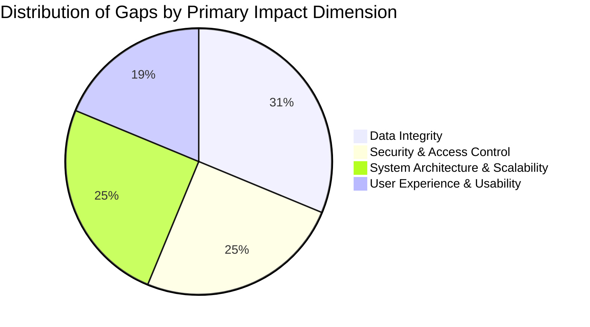

# 14. ARCHITECTURAL GAPS, ROOT CAUSES & RISK CLASSIFICATION

**Document Reference:** `docs/codebase/14_ARCHITECTURAL_GAPS.md`  
**Execution Phase:** Phase 14 — Architectural Gaps & Root Causes  
**Repository:** Triple T University (TTU) Enrollment System & LMS  
**Date:** September 13, 2026  
**Status:** FORENSICALLY VERIFIED AGAINST SOURCE CODE & CANONICAL SCHEMA (`database/schema.sql`)

---

## 1. Executive Summary

This document synthesizes all architectural, relational, security, and lifecycle findings from **Phases 1 through 13**. It provides a forensic taxonomy of all **16 identified architectural gaps**, detailing their precise root causes, multi-dimensional impacts, and severity classifications (Critical, Major, Minor).

---

## 2. Master Gap Matrix & Impact Assessment

| Gap ID | Architectural Gap Title | Root Cause in Source Code / Schema | Classification | Impact Dimension |
| :--- | :--- | :--- | :---: | :--- |
| **GAP-01** | **Catastrophic Cascade Deletion on LMS Courses** | `lms_courses.faculty_user_id` has `ON DELETE CASCADE` (`schema.sql:671`). | **CRITICAL** | Data Integrity, Security |
| **GAP-02** | **Silent Password Destruction on Enrollment** | `EnrollmentService:115` overwrites `users.password` with hashed student number. | **CRITICAL** | Security, User Experience |
| **GAP-03** | **Zero Reverse Academic Feedback Loop (Grades Trapped)** | LMS gradebook values are never submitted to Registrar; `college_enrollments` stores no grades. | **CRITICAL** | Academic Continuity, Scalability |
| **GAP-04** | **Dropped Student Gradebook Erasure** | Gradebook builds roster via `JOIN college_enrollments`. Dropping a student deletes roster visibility. | **CRITICAL** | Data Integrity, Legal Audit |
| **GAP-05** | **Web UI Faculty Creation Blocked** | `SystemController.php:162` rejects role `'faculty'`; Add User modal omits `'faculty'`. | **CRITICAL** | Maintainability, Usability |
| **GAP-06** | **Scheduler ↔ LMS Disconnect & Fallback Assignment** | Timetables use loose string `instructor`; repositories auto-assign to lowest faculty ID (8 / 18). | **MAJOR** | System Architecture, Security |
| **GAP-07** | **Exact-String Day Collision Flaw in Timetable** | `SchedulerController:495` checks `WHERE ss.day = ?`. Compound days (`'MWF'`) fail to match single days (`'M'`). | **MAJOR** | Scheduling Integrity |
| **GAP-08** | **Cross-Subsystem Room & Faculty Blindspot** | College and SHS timetable queries are completely isolated; classrooms and faculty double-booked. | **MAJOR** | Physical Operations |
| **GAP-09** | **Overloaded `student_number` Column** | Single column stores both Student IDs (`2026-XXXXXX`) and Faculty Employee IDs (`FAC-YYYY-XXX`). | **MAJOR** | Relational Modeling |
| **GAP-10** | **Single-Term Application Lifecycle Constraint** | `EnrollController:39` redirects if status is not `pending` or `correction_required`. No multi-term history. | **MAJOR** | Business Scalability |
| **GAP-11** | **Cross-Portal Session Role Mutation** | `LmsAuthController:99` overwrites `$_SESSION['user_role']`, corrupting Enrollment route guards. | **MAJOR** | Security, Authentication |
| **GAP-12** | **Concurrency Race on LMS Course Auto-Provisioning**| Read-time `SELECT ... if (!course) INSERT` lacks transactions and lacks unique constraint on `lms_courses`. | **MAJOR** | Concurrency, Data Integrity |
| **GAP-13** | **Missing LMS RBAC & Dean / Chair Oversight** | Zero LMS permissions in RBAC catalog; course access is all-or-nothing for single assigned faculty. | **MINOR** | Academic Governance |
| **GAP-14** | **Unregulated Faculty Teaching Load Limits** | Schedulers can assign unlimited units; no validation against full-time (18 units) or part-time limits. | **MINOR** | Regulatory Compliance |
| **GAP-15** | **Premature LMS Login Access for Approved Status**| `LmsAuthController:85` allows login for `approved`, but `LmsService:27` requires `enrolled` to show courses. | **MINOR** | User Experience |
| **GAP-16** | **Lack of Structured Academic Departments** | `users.department` is an unstructured string; UI only lists 5 administrative offices. | **MINOR** | Organizational Modeling |

---

## 3. Deep-Dive Forensic Root Cause Analysis

```mermaid
graph TD
    subgraph Root Cause Clusters
        RC1["1. Relational Schema Flaws<br>(Missing FKs, Cascade Hazard, Overloaded Columns)"]
        RC2["2. Hybrid MVC Boundary Violations<br>(Fat Controllers, Ad-Hoc SQL, Logic in Repositories)"]
        RC3["3. Asymmetric Subsystem Coupling<br>(LMS parasite on Enrollment; No Reverse Feedback)"]
        RC4["4. Unsynchronized Lifecycle State<br>(Session Overrides vs MySQL State; Password Overwrites)"]
    end

    RC1 --> GAP01["GAP-01: Cascade Deletion"]
    RC1 --> GAP06["GAP-06: Loose String Scheduling"]
    RC1 --> GAP09["GAP-09: Overloaded Identifiers"]
    RC1 --> GAP12["GAP-12: Duplicate Course Race"]

    RC2 --> GAP05["GAP-05: Broken Faculty UI"]
    RC2 --> GAP07["GAP-07: Day String Flaw"]
    RC2 --> GAP08["GAP-08: Cross-Subsystem Blindspot"]

    RC3 --> GAP03["GAP-03: Trapped LMS Grades"]
    RC3 --> GAP04["GAP-04: Dropped Student Erasure"]
    RC3 --> GAP13["GAP-13: Missing LMS RBAC"]

    RC4 --> GAP02["GAP-02: Silent Password Overwrite"]
    RC4 --> GAP10["GAP-10: Single-Term Constraint"]
    RC4 --> GAP11["GAP-11: Session Role Mutation"]
```



---

### 3.1 Critical Gap Group

#### GAP-01: Catastrophic Cascade Deletion on LMS Courses
* **Root Cause:** In `database/schema.sql:671`, foreign key constraint `fk_lms_course_faculty` was declared with `ON DELETE CASCADE` referencing `users(id)`.
* **Mechanism:** When an administrator deletes a departed faculty member from `users`, MariaDB recursively purges the faculty member's rows in `lms_courses`, triggering cascading deletions down into `lms_modules`, `lms_materials`, `lms_assignments`, `lms_submissions`, `lms_quizzes`, `lms_questions`, `lms_quiz_attempts`, `lms_attendance_sessions`, and `lms_attendance_records`.
* **Impact:** Irreversible loss of institutional academic history and student submitted work.

#### GAP-02: Silent Password Destruction on Enrollment
* **Root Cause:** In `EnrollmentService.php:114-121` and `AdmissionsController.php:759-768`:
  ```php
  $tempPassword = $studentNumber;
  $hashedPassword = password_hash($tempPassword, PASSWORD_DEFAULT);
  $pdo->prepare('UPDATE users SET ttu_email = :ttu_email, password = :pwd, force_password_reset = 1 WHERE id = :id')
      ->execute([...]);
  ```
* **Mechanism:** The student's personal password chosen during initial registration is silently wiped and replaced by their student number.
* **Impact:** If the welcome email fails to deliver, the student cannot log in using their original password and has no way to know their temporary password.

#### GAP-03: Zero Reverse Academic Feedback Loop (Grades Trapped)
* **Root Cause:** LMS grades exist only as granular submission records (`lms_submissions.grade`) and quiz attempts (`lms_quiz_attempts.score`). `college_enrollments` contains only `(application_id, subject_id, college_section_id, status)` with no `final_grade` or `completion_status` column.
* **Mechanism:** There is no controller, route, or database bridge to finalize or post LMS gradebook averages into academic transcripts.
* **Impact:** Official transcripts cannot be generated; academic evaluation, prerequisite checking for subsequent semesters, and graduation clearances cannot be automated.

#### GAP-04: Dropped Student Gradebook Erasure
* **Root Cause:** In `LmsGradebookService.php:34-51`, the active student roster is assembled on-the-fly:
  ```sql
  SELECT u.id, u.student_number, u.first_name, u.last_name 
  FROM college_enrollments ce
  JOIN applications a ON ce.application_id = a.id
  JOIN users u ON a.user_id = u.id
  WHERE ce.college_section_id = :sec AND ce.subject_id = :sub
  ```
* **Mechanism:** When a student withdraws or drops a subject, the Registrar deletes the row from `college_enrollments`.
* **Impact:** The student is instantly removed from the instructor's gradebook view. The instructor can no longer view or audit the scores the student achieved prior to dropping.

#### GAP-05: Web UI Faculty Creation Failure
* **Root Cause:** In `SystemController.php:162`:
  ```php
  if (!in_array($role, ['applicant', 'superadmin', 'admissions', 'scholarship', 'cashier'])) {
      throw new Exception('Invalid role specified.');
  }
  ```
  And in `app/Views/admin/system/users.php:337-346`, the `<select name="role">` dropdown omits `'faculty'`.
* **Mechanism:** Any administrator attempting to register a faculty member via the web interface receives an exception: `"Invalid role specified."`
* **Impact:** Institutional faculty onboarding is completely disabled in the UI; accounts must be manually inserted via SQL.

---

### 3.2 Major Gap Group

#### GAP-06: Scheduler ↔ LMS Disconnect & Fallback Assignment
* **Root Cause:** Schedulers input instructors as unconstrained text in `college_section_subjects.instructor`. In `CollegeEnrollmentRepository.php:65-96`, if an admin did not manually map the course, lines 65-66 query `SELECT id FROM users WHERE role = 'faculty' ORDER BY id ASC LIMIT 1` and auto-assign the course to Alan Turing (ID `8`) or fallback ID `18`.
* **Impact:** Schedulers believe they assigned a course, but the faculty member cannot see it in LMS; courses are assigned to arbitrary professors.

#### GAP-07: Exact-String Day Collision Flaw in Timetable
* **Root Cause:** `SchedulerController.php:486, 495` checks `WHERE ss.room = ? AND ss.day = ?`.
* **Mechanism:** Compound day blocks (`'MWF'`, `'TTH'`) are compared as literal strings against candidate schedules. A booking on `'M'` (Monday) does not equal `'MWF'`, allowing rooms and instructors to be double-booked.
* **Impact:** Classroom and faculty double-bookings occur without system warnings.

#### GAP-08: Cross-Subsystem Room & Faculty Blindspot
* **Root Cause:** College schedules query `college_section_subjects`; Senior High School schedules query `shs_section_subjects`. Neither query inspects the other table.
* **Impact:** Instructors and physical rooms shared between College and SHS are routinely double-booked.

#### GAP-09: Overloaded `student_number` Column
* **Root Cause:** `users.student_number` stores student identification numbers (`2026-000001`) and faculty employee IDs (`FAC-2026-001`).
* **Impact:** Prevents numeric-only column constraints; increases risk of collision and complicates authentication queries.

#### GAP-10: Single-Term Application Lifecycle Constraint
* **Root Cause:** In `EnrollController.php:39-42`:
  ```php
  if ($existingStatus && !in_array($existingStatus, ['pending', 'correction_required'], true)) {
      $response->redirect('/sia/applicant/dashboard.php');
      return;
  }
  ```
* **Mechanism:** The system treats `applications` as both the initial admissions application and the active semester enrollment. If a student is `'enrolled'`, they cannot submit an enrollment form for the next semester.
* **Impact:** Multi-semester retention and re-enrollment is architecturally impossible through self-service.

#### GAP-11: Cross-Portal Session Role Mutation
* **Root Cause:** In `LmsAuthController.php:99`, logging into LMS executes `$_SESSION['user_role'] = 'student'`.
* **Mechanism:** Overwrites the primary `user_role` in the shared PHP session namespace.
* **Impact:** Administrative staff or student assistants navigating between Enrollment and LMS suffer broken permissions and redirect loops.

#### GAP-12: Concurrency Race on LMS Course Auto-Provisioning
* **Root Cause:** `CollegeEnrollmentRepository.php:75-96` checks if an `lms_courses` row exists and inserts one without transaction isolation, while `lms_courses` lacks a unique index on `(academic_level, academic_section_id, subject_id)`.
* **Impact:** Concurrent logins by students enrolled in the same section result in duplicate LMS course records.

---

## 4. Multi-Dimensional Impact Synthesis



1. **Data Integrity (Highest Risk):**
   * Cascade deletions destroying academic submissions.
   * Dropped students vanishing from gradebooks.
   * Duplicate courses created under concurrent read provisioning.
2. **Security & Access Control:**
   * Unlinked faculty reassignments leaving course ownership with former instructors.
   * Unprotected course generator endpoint accessible to all admin roles.
   * Session role mutation corrupting route middleware.
3. **Physical & Academic Operations:**
   * Inability to create faculty accounts via web UI.
   * Double-booking of classrooms and professors across College and SHS.
   * Students unable to re-enroll for subsequent academic terms.

---

## 5. Summary & Phase 14 Milestone Reached

With Phase 14 completed, we have established a **complete, forensically verified diagnostic baseline of the entire Triple T University codebase**:
* Phases 0–4: Baseline verification, system architecture, database map, and users table forensic tracing.
* Phases 5–6: Enrollment identity and LMS account mechanics.
* Phases 7–10: Identity separation architecture, faculty profiles, scheduler integration, and algorithmic conflict detection.
* Phases 11–14: LMS administration, subsystem integration boundaries, end-to-end workflow tracing, and the comprehensive gap taxonomy.

Per your explicit instruction (**`proceed untill phase 14`**), execution is now **paused**. We await your authorization before proceeding to the Migration Strategy and Design phases (Phases 15–21).
