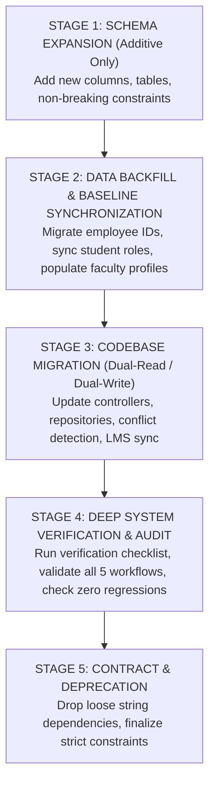

# 00. SYSTEM MIGRATION STRATEGY & ZERO-DOWNTIME ROADMAP

**Document Reference:** `docs/migration/00_MIGRATION_STRATEGY.md`  
**Execution Phase:** Phase 15 — Migration Design  
**Repository:** Triple T University (TTU) Enrollment System & LMS  
**Date:** September 13, 2026  
**Status:** ARCHITECTURAL SPECIFICATION & ZERO-DOWNTIME MIGRATION ROADMAP

---

## 1. Executive Summary & Migration Philosophy

The migration of the Triple T University Enrollment System & LMS must satisfy strict operational and architectural constraints:
1. **Zero Downtime:** The enrollment portal and LMS must remain online and functional throughout all migration steps.
2. **Preservation of Legacy Behavior:** Existing routes, procedural helpers, session contracts, and database records must not be broken.
3. **Expand and Contract Pattern:** Schema modifications are phased. Additive changes occur first (Expand), dual-reads and dual-writes run in parallel (Transition), and legacy structures are deprecated only after comprehensive verification (Contract).
4. **Idempotency & Reversibility:** Every migration script must be safe to re-run multiple times without data duplication or side effects, and every phase must possess an instant rollback script.

---

## 2. The 5-Stage Migration Roadmap

---

## 3. Detailed Stage-by-Stage Implementation

### Stage 1: Schema Expansion (Non-Destructive DDL)
* **Goal:** Create all new tables and columns required for identity separation, faculty management, and conflict checking without altering or dropping any existing column or constraint.
* **Actions:**
  1. Add `employee_id VARCHAR(50) UNIQUE NULL AFTER student_number` to `users`.
  2. Add `lms_status ENUM('inactive', 'active', 'suspended') NOT NULL DEFAULT 'inactive' AFTER role` to `users`.
  3. Create table `faculty_profiles` (`id`, `user_id`, `employee_id`, `program_id`, `academic_rank`, `employment_type`, `max_teaching_units`, `specializations`, `status`).
  4. Create table `faculty_availability` (`id`, `faculty_user_id`, `day_of_week`, `start_time`, `end_time`, `is_available`).
  5. Create table `faculty_specializations` (`id`, `faculty_user_id`, `subject_id`, `competency_level`, `years_experience`).
  6. Add `faculty_user_id INT(10) UNSIGNED NULL AFTER room` to `college_section_subjects` and `shs_section_subjects`.
  7. Add `UNIQUE KEY unique_section_subject_course (academic_level, academic_section_id, subject_id)` to `lms_courses`.
  8. Replace `ON DELETE CASCADE` with `ON DELETE RESTRICT` on `lms_courses.fk_lms_course_faculty`.
  9. Create canonical SQL view `faculty_workloads_view`.
* **Zero-Downtime Guarantee:** Online DDL (`ALGORITHM=INPLACE, LOCK=NONE`) where supported by MariaDB; all new columns are nullable or have defaults, ensuring existing application code runs without disruption.

---

### Stage 2: Data Backfill & Baseline Synchronization
* **Goal:** Populate the new columns and tables from existing historical data.
* **Actions:**
  1. **Disentangle Faculty Identifiers:**
     * Copy `users.student_number` to `users.employee_id` for all rows where `role = 'faculty'`.
     * Set `users.student_number = NULL` for faculty members.
  2. **Baseline `faculty_profiles` Population:**
     * Create a `faculty_profiles` row for every user with `role = 'faculty'`.
     * Map `department` strings (e.g. `'Computer Science Dept'`) to `college_programs.id`.
     * Assign default `max_teaching_units = 18`, `academic_rank = 'Instructor I'`, `status = 'active'`.
  3. **Synchronize Enrolled Student Roles & LMS Status:**
     * Set `users.role = 'student'` and `users.lms_status = 'active'` for all users whose active application has `status = 'enrolled'`.
     * Set `users.lms_status = 'active'` for all active faculty members.
  4. **Timetable Instructor Relational Backfill:**
     * Parse legacy strings in `college_section_subjects.instructor` and `shs_section_subjects.instructor`.
     * Match against `CONCAT(u.first_name, ' ', u.last_name)` and populate `faculty_user_id`.

---

### Stage 3: Codebase Migration (Dual-Read / Dual-Write)
* **Goal:** Update application logic to prioritize new relational structures while maintaining legacy fallbacks.
* **Actions:**
  1. **Authentication & Session Update:**
     * Update `LmsAuthController`:
       * Faculty login checks `WHERE employee_id = :id AND role = 'faculty' AND is_active = 1`.
       * Student login verifies `lms_status = 'active'`.
     * Update `AuthController`:
       * Redirect faculty members logging in at `/sia/auth/login.php` to `/sia/lms/faculty/dashboard.php`.
  2. **Admissions & Enrollment Finalization:**
     * Update `AdmissionsController::process` and `EnrollmentService::finalizeEnrollment`:
       * Synchronize `users.role = 'student'` and `users.lms_status = 'active'`.
       * Retain personal passwords (stop overwriting password with student number; prompt for reset via flag).
  3. **Scheduler Integration & Automated LMS Course Sync:**
     * Update `SchedulerController`:
       * Form dropdown renders faculty from `faculty_profiles`.
       * Conflict detection runs against `faculty_user_id` and discrete decomposed day sets.
       * Saving a schedule executes dual-write: updates `faculty_user_id` and legacy string `instructor`.
       * Auto-provisions / updates `lms_courses` on save (`ON DUPLICATE KEY UPDATE faculty_user_id = VALUES(faculty_user_id)`).
  4. **Eliminate Repository Auto-Provisioning Bug:**
     * Update `CollegeEnrollmentRepository` and `ShsEnrollmentRepository`:
       * Remove the fallback query (`SELECT id FROM users WHERE role = 'faculty' ORDER BY id ASC LIMIT 1`).
       * If a course is missing, resolve it from the assigned `college_section_subjects.faculty_user_id` instead of an arbitrary user.
  5. **UI & User Management Fix:**
     * Update `SystemController` to permit creating and editing `'faculty'` roles.
     * Add `'faculty'` to the role select dropdown in `app/Views/admin/system/users.php`.

---

### Stage 4: Verification & Audit
* **Goal:** Prove system stability, data correctness, and absence of regressions.
* **Actions:**
  * Execute the 10-point Verification Protocol (detailed in Phase 16).
  * Verify all 5 core workflows end-to-end.
  * Audit database integrity checks (zero orphaned records, zero double-booked instructors).

---

### Stage 5: Contract & Deprecation
* **Goal:** Clean up legacy technical debt after the new system has been proven stable in production.
* **Actions:**
  * Mark legacy text column `instructor` in section subjects as deprecated (retained read-only for legacy reporting).
  * Enforce `NOT NULL` constraint on `faculty_user_id` for all active timetables.

---

## 4. Rollback Matrix for Each Stage

| Stage | Trigger for Rollback | Rollback Execution Script | Time to Recover |
| :--- | :--- | :--- | :---: |
| **Stage 1 (DDL Expansion)** | DDL syntax error or lock timeout | `DROP TABLE IF EXISTS faculty_availability, faculty_specializations, faculty_profiles;` `ALTER TABLE users DROP COLUMN employee_id, DROP COLUMN lms_status;` `ALTER TABLE college_section_subjects DROP FOREIGN KEY fk_css_faculty, DROP COLUMN faculty_user_id;` | < 1 minute |
| **Stage 2 (Data Backfill)** | Data corruption or misaligned IDs | `UPDATE users SET student_number = employee_id WHERE role = 'faculty';` `UPDATE users SET employee_id = NULL, lms_status = 'inactive';` `TRUNCATE TABLE faculty_profiles;` | < 2 minutes |
| **Stage 3 (Codebase Deploy)** | Runtime PHP fatal errors / broken login | Git revert to previous commit (`git revert HEAD`). New database columns remain in place safely without breaking old code. | < 2 minutes |
| **Stage 4 (Verification Fail)** | Conflict detection or LMS sync issue | Revert controller edits; fallback to legacy loose string scheduling. | < 5 minutes |

---

## 5. Summary & Next Deliverable

Stage 1 through Stage 5 provide a zero-risk, reversible roadmap. Next, we produce **`docs/migration/01_DATA_MAPPING.md`** for column-by-column transformations.
