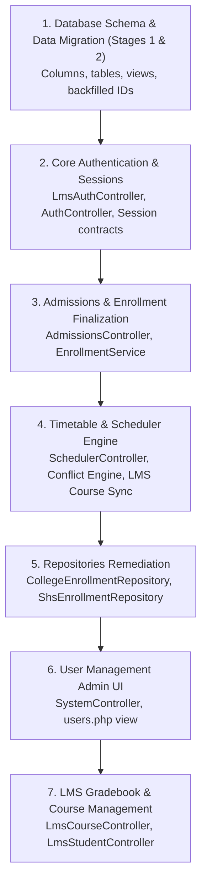

# 02. CODEBASE DEPENDENCY MIGRATION PLAN

**Document Reference:** `docs/migration/02_DEPENDENCY_MIGRATION_PLAN.md`  
**Execution Phase:** Phase 15 — Migration Design  
**Repository:** Triple T University (TTU) Enrollment System & LMS  
**Target Architecture:** Option A+ (Enriched In-Place Separation + Relational Faculty & Timetable Integration)  
**Date:** September 13, 2026  
**Status:** ARCHITECTURAL SPECIFICATION & CODEBASE REFACTORING SPECIFICATION  

---

## 1. Executive Summary & Migration Standards

This document establishes the precise, file-by-file dependency migration plan for the TTU Enrollment System and LMS.

### Hybrid MVC Architectural Rules:
1. **Fat Controllers Execute Logic:** All request handling, validation, business rules, conflict calculations, and raw PDO SQL interactions reside in Controllers.
2. **Models as Data Containers:** Models encapsulate data properties and avoid abstracting database queries away from controllers.
3. **Zero Breaking Changes:** Every route, session key, and template contract must be maintained. New columns and structures are introduced with dual-read and dual-write capabilities before legacy fallbacks are phased out.
4. **Defensive Error Handling:** All database interactions are wrapped in PDO transactions with explicit rollback on error.

---

## 2. Dependency Migration Inventory & Order of Execution



---

## 3. Subsystem 1: Core Authentication & Sessions

### 3.1 `app/Controllers/LmsAuthController.php`
* **File Path:** `app/Controllers/LmsAuthController.php`
* **Defects Addressed:**
  1. Faculty login checks `student_number` instead of `employee_id`.
  2. Student login assumes any non-faculty is a student without checking official enrollment or `lms_status`.
  3. No support for suspension status (`lms_status = 'suspended'`).

#### Code Migration Trace:

##### Before (Legacy Logic):
```php
// Faculty Login - Legacy
$stmt = $this->db->prepare("
    SELECT id, first_name, last_name, email, password, student_number, role, is_active 
    FROM users 
    WHERE (student_number = :identifier OR email = :identifier) 
      AND role = 'faculty'
");
$stmt->execute(['identifier' => $identifier]);
$user = $stmt->fetch();

if (!$user || !password_verify($password, $user['password'])) {
    // Auth failure
}
```

##### After (Option A+ Migrated Logic - Dual-Read Compatible):
```php
// Faculty Login - Option A+
$stmt = $this->db->prepare("
    SELECT u.id, u.first_name, u.last_name, u.email, u.password, 
           u.employee_id, u.student_number, u.role, u.lms_status, u.is_active,
           fp.academic_rank, fp.employment_type
    FROM users u
    LEFT JOIN faculty_profiles fp ON fp.user_id = u.id
    WHERE (u.employee_id = :identifier OR u.student_number = :identifier OR u.email = :identifier) 
      AND u.role = 'faculty'
");
$stmt->execute(['identifier' => $identifier]);
$user = $stmt->fetch();

if (!$user || !password_verify($password, $user['password'])) {
    $_SESSION['flash_error'] = "Invalid Employee ID / Email or password.";
    header("Location: /sia/auth/lms_faculty_login.php");
    exit;
}

if ($user['is_active'] == 0 || $user['lms_status'] === 'suspended') {
    $_SESSION['flash_error'] = "Your faculty account is inactive or LMS access has been suspended. Please contact the Dean's Office.";
    header("Location: /sia/auth/lms_faculty_login.php");
    exit;
}

// Populate session with enriched identity
$_SESSION['user_id'] = (int)$user['id'];
$_SESSION['user_role'] = 'faculty';
$_SESSION['employee_id'] = $user['employee_id'] ?? $user['student_number'];
$_SESSION['faculty_name'] = $user['first_name'] . ' ' . $user['last_name'];
$_SESSION['academic_rank'] = $user['academic_rank'] ?? 'Instructor I';
```

##### Student Login Migration:
```php
// Student Login - Option A+
$stmt = $this->db->prepare("
    SELECT u.id, u.first_name, u.last_name, u.email, u.password, 
           u.student_number, u.role, u.lms_status, u.is_active
    FROM users u
    WHERE (u.student_number = :identifier OR u.email = :identifier)
");
$stmt->execute(['identifier' => $identifier]);
$user = $stmt->fetch();

if (!$user || !password_verify($password, $user['password'])) {
    $_SESSION['flash_error'] = "Invalid Student Number / Email or password.";
    header("Location: /sia/auth/lms_student_login.php");
    exit;
}

// Verify enrollment and active LMS standing
if ($user['is_active'] == 0 || $user['lms_status'] !== 'active') {
    $_SESSION['flash_error'] = "LMS access is currently inactive or suspended. Please verify your official enrollment status with the Registrar.";
    header("Location: /sia/auth/lms_student_login.php");
    exit;
}

$_SESSION['user_id'] = (int)$user['id'];
$_SESSION['user_role'] = 'student';
$_SESSION['student_number'] = $user['student_number'];
$_SESSION['student_name'] = $user['first_name'] . ' ' . $user['last_name'];
```

---

## 4. Subsystem 2: Admissions & Enrollment Finalization

### 4.1 `app/Services/EnrollmentService.php`
* **File Path:** `app/Services/EnrollmentService.php` (around lines 110-140)
* **Defects Addressed:**
  1. **Silent Password Overwrite:** Overwrites applicant's original password with a hash of their student number (`$studentNumber`).
  2. **Missing Role Transition:** Leaves `users.role = 'applicant'`, forcing runtime role patching.
  3. **Uninitialized LMS Standing:** Fails to set `users.lms_status = 'active'`.

#### Code Migration Trace:

##### Before (Defective Logic):
```php
// Lines 112-120 (approx):
$hashedPassword = password_hash($studentNumber, PASSWORD_DEFAULT);
$updateUserStmt = $this->db->prepare("
    UPDATE users 
    SET student_number = :student_number, 
        password = :password,
        college_curriculum_id = :curriculum_id
    WHERE id = :user_id
");
$updateUserStmt->execute([
    'student_number' => $studentNumber,
    'password'       => $hashedPassword,
    'curriculum_id'  => $curriculumId,
    'user_id'        => $userId
]);
```

##### After (Preserved Credential & Synchronized Role Logic):
```php
// Option A+ Finalize Enrollment
$updateUserStmt = $this->db->prepare("
    UPDATE users 
    SET student_number = :student_number,
        role = 'student',
        lms_status = 'active',
        college_curriculum_id = :curriculum_id,
        force_password_reset = 0
    WHERE id = :user_id
");
$updateUserStmt->execute([
    'student_number' => $studentNumber,
    'curriculum_id'  => $curriculumId,
    'user_id'        => $userId
]);

// Note: Existing password hash is safely preserved!
// Student continues using their verified registration password.
```

---

## 5. Subsystem 3: Timetable & Scheduler Integration

### 5.1 `app/Controllers/SchedulerController.php`
* **File Path:** `app/Controllers/SchedulerController.php`
* **Defects Addressed:**
  1. Form receives free-form text input for instructor name or unlinked ID.
  2. Day collision detection checks `ss.day = ?`, failing to detect overlaps between compound days (`'MWF'`) and discrete days (`'M'`).
  3. Dual-write to `faculty_user_id` and legacy string `instructor`.
  4. Automatic sync to `lms_courses` on save.

#### Code Migration Trace:

##### Before (Fragmented Scheduling & Exact String Day Check):
```php
// Check for instructor conflict
$conflictStmt = $this->db->prepare("
    SELECT id FROM college_section_subjects
    WHERE instructor = :instructor
      AND day = :day
      AND ((start_time < :end_time AND end_time > :start_time))
      AND id != :current_id
");
$conflictStmt->execute([
    'instructor' => $instructor,
    'day'        => $day,
    'start_time' => $startTime,
    'end_time'   => $endTime,
    'current_id' => $currentId
]);
```

##### After (Option A+ Decomposed Day Engine & Relational Verification):
```php
// Helper method: Decompose day string to array of single-day tokens
private function decomposeDays(string $dayString): array {
    $cleaned = strtoupper(trim($dayString));
    $days = [];
    if (str_contains($cleaned, 'TH')) {
        $days[] = 'TH';
        $cleaned = str_replace('TH', '', $cleaned);
    }
    for ($i = 0; $i < strlen($cleaned); $i++) {
        $char = $cleaned[$i];
        if (in_array($char, ['M', 'T', 'W', 'F', 'S'])) {
            $days[] = $char;
        }
    }
    return array_unique($days);
}

// Save Section Subject with Overlap Check & LMS Provisioning
public function saveCollegeSectionSubject() {
    $sectionId = (int)$_POST['college_section_id'];
    $subjectId = (int)$_POST['subject_id'];
    $facultyUserId = !empty($_POST['faculty_user_id']) ? (int)$_POST['faculty_user_id'] : null;
    $day = trim($_POST['day']);
    $startTime = trim($_POST['start_time']);
    $endTime = trim($_POST['end_time']);
    $room = trim($_POST['room']);
    $deliveryMode = trim($_POST['delivery_mode'] ?? 'Face-to-Face');
    $currentId = (int)($_POST['id'] ?? 0);

    // 1. Resolve Faculty Name for Dual-Write
    $instructorName = 'TBA';
    if ($facultyUserId) {
        $facStmt = $this->db->prepare("SELECT first_name, last_name FROM users WHERE id = ? AND role = 'faculty'");
        $facStmt->execute([$facultyUserId]);
        $fac = $facStmt->fetch();
        if ($fac) {
            $instructorName = $fac['first_name'] . ' ' . $fac['last_name'];
        }
    }

    // 2. Perform 4-Tier Conflict Checking (Room & Faculty Overlaps)
    $inputDays = $this->decomposeDays($day);
    if ($facultyUserId) {
        // Fetch all existing classes for this faculty
        $existingClassesStmt = $this->db->prepare("
            SELECT id, day, start_time, end_time 
            FROM college_section_subjects 
            WHERE faculty_user_id = ? AND id != ?
        ");
        $existingClassesStmt->execute([$facultyUserId, $currentId]);
        $existingClasses = $existingClassesStmt->fetchAll();

        foreach ($existingClasses as $ec) {
            $existingDays = $this->decomposeDays($ec['day']);
            $commonDays = array_intersect($inputDays, $existingDays);

            if (!empty($commonDays)) {
                // Time collision check: (StartA < EndB) AND (EndA > StartB)
                if ($startTime < $ec['end_time'] && $endTime > $ec['start_time']) {
                    $_SESSION['flash_error'] = "Schedule Conflict: Faculty member is already assigned to a class on " . implode(',', $commonDays) . " ({$ec['start_time']} - {$ec['end_time']}).";
                    header("Location: /sia/admin/scheduler/sections.php?id=" . $sectionId);
                    exit;
                }
            }
        }
    }

    // 3. Dual-Write to Database
    $this->db->beginTransaction();
    try {
        if ($currentId > 0) {
            $stmt = $this->db->prepare("
                UPDATE college_section_subjects 
                SET college_section_id = :sec_id, subject_id = :sub_id, 
                    day = :day, start_time = :start, end_time = :end, 
                    room = :room, faculty_user_id = :fac_id, instructor = :inst, 
                    delivery_mode = :mode
                WHERE id = :id
            ");
            $stmt->execute([
                'sec_id'  => $sectionId, 'sub_id'  => $subjectId,
                'day'     => $day,       'start'   => $startTime,
                'end'     => $endTime,   'room'    => $room,
                'fac_id'  => $facultyUserId, 'inst' => $instructorName,
                'mode'    => $deliveryMode,  'id'   => $currentId
            ]);
        } else {
            $stmt = $this->db->prepare("
                INSERT INTO college_section_subjects 
                (college_section_id, subject_id, day, start_time, end_time, room, faculty_user_id, instructor, delivery_mode)
                VALUES (:sec_id, :sub_id, :day, :start, :end, :room, :fac_id, :inst, :mode)
            ");
            $stmt->execute([
                'sec_id'  => $sectionId, 'sub_id'  => $subjectId,
                'day'     => $day,       'start'   => $startTime,
                'end'     => $endTime,   'room'    => $room,
                'fac_id'  => $facultyUserId, 'inst' => $instructorName,
                'mode'    => $deliveryMode
            ]);
        }

        // 4. Automated LMS Course Synchronization (Idempotent Upsert)
        if ($facultyUserId) {
            $lmsSyncStmt = $this->db->prepare("
                INSERT INTO lms_courses 
                (academic_level, academic_section_id, subject_id, faculty_user_id, status)
                VALUES ('College', :section_id, :subject_id, :faculty_user_id, 'active')
                ON DUPLICATE KEY UPDATE 
                    faculty_user_id = VALUES(faculty_user_id),
                    status = 'active'
            ");
            $lmsSyncStmt->execute([
                'section_id'      => $sectionId,
                'subject_id'      => $subjectId,
                'faculty_user_id' => $facultyUserId
            ]);
        }

        $this->db->commit();
        $_SESSION['flash_success'] = "Timetable saved and LMS course synced successfully.";
    } catch (\Exception $e) {
        $this->db->rollBack();
        $_SESSION['flash_error'] = "Failed to save schedule: " . $e->getMessage();
    }
    header("Location: /sia/admin/scheduler/sections.php?id=" . $sectionId);
    exit;
}
```

---

## 6. Subsystem 4: Enrollment Repositories & LMS Provisioning

### 6.1 `app/Repositories/CollegeEnrollmentRepository.php`
* **File Path:** `app/Repositories/CollegeEnrollmentRepository.php` (lines 65-96)
* **Defects Addressed:**
  1. Removes arbitrary fallback query `SELECT id FROM users WHERE role = 'faculty' ORDER BY id ASC LIMIT 1` (Alan Turing / ID 8 bug).
  2. Resolves LMS course faculty strictly from `college_section_subjects.faculty_user_id`.

#### Code Migration Trace:

##### Before (Defective Fallback to Lowest ID):
```php
// Lines 72-88 (approx):
if (!$lmsCourse) {
    // Arbitrary fallback bug:
    $defaultFacultyStmt = $this->db->query("
        SELECT id FROM users WHERE role = 'faculty' ORDER BY id ASC LIMIT 1
    ");
    $defaultFacultyId = $defaultFacultyStmt->fetchColumn() ?: 18;

    $createCourseStmt = $this->db->prepare("
        INSERT INTO lms_courses (academic_level, academic_section_id, subject_id, faculty_user_id, status)
        VALUES ('College', ?, ?, ?, 'active')
    ");
    $createCourseStmt->execute([$sectionId, $subjectId, $defaultFacultyId]);
    $lmsCourseId = $this->db->lastInsertId();
}
```

##### After (Option A+ Relational Timetable Resolution):
```php
// Option A+ Course Resolution
if (!$lmsCourse) {
    // Resolve the actual instructor assigned to this section-subject
    $instructorStmt = $this->db->prepare("
        SELECT css.faculty_user_id 
        FROM college_section_subjects css
        WHERE css.college_section_id = ? AND css.subject_id = ?
        LIMIT 1
    ");
    $instructorStmt->execute([$sectionId, $subjectId]);
    $assignedFacultyId = $instructorStmt->fetchColumn();

    if ($assignedFacultyId) {
        $createCourseStmt = $this->db->prepare("
            INSERT INTO lms_courses (academic_level, academic_section_id, subject_id, faculty_user_id, status)
            VALUES ('College', ?, ?, ?, 'active')
            ON DUPLICATE KEY UPDATE faculty_user_id = VALUES(faculty_user_id)
        ");
        $createCourseStmt->execute([$sectionId, $subjectId, $assignedFacultyId]);
        $lmsCourseId = $this->db->lastInsertId();
    } else {
        // Course cannot be provisioned without an assigned instructor
        $lmsCourseId = null;
    }
}
```

---

## 7. Subsystem 5: User Management & Admin UI

### 7.1 `app/Controllers/SystemController.php`
* **File Path:** `app/Controllers/SystemController.php` (around lines 160-220)
* **Defects Addressed:**
  1. `storeUser()` rejects `'faculty'` in role validation whitelist.
  2. Fails to create `faculty_profiles` record upon faculty user creation.

#### Code Migration Trace:

##### Before (Hardcoded Role Filter):
```php
$allowedRoles = ['superadmin', 'admin', 'admissions', 'scholarship', 'cashier', 'clinic', 'scheduler'];
if (!in_array($role, $allowedRoles)) {
    $_SESSION['flash_error'] = "Invalid role specified.";
    header("Location: /sia/admin/system/users.php");
    exit;
}
```

##### After (Enriched Role Support with Profile Provisioning):
```php
$allowedRoles = ['superadmin', 'admin', 'admissions', 'scholarship', 'cashier', 'clinic', 'faculty', 'scheduler'];
if (!in_array($role, $allowedRoles)) {
    $_SESSION['flash_error'] = "Invalid role specified.";
    header("Location: /sia/admin/system/users.php");
    exit;
}

$this->db->beginTransaction();
try {
    // Generate employee ID if faculty and not provided
    $employeeId = ($role === 'faculty') 
        ? (!empty($_POST['employee_id']) ? trim($_POST['employee_id']) : 'EMP-' . date('Y') . '-' . rand(1000, 9999))
        : null;

    $stmt = $this->db->prepare("
        INSERT INTO users (first_name, last_name, email, ttu_email, password, employee_id, role, department, permissions, is_active, lms_status)
        VALUES (:first_name, :last_name, :email, :ttu_email, :password, :employee_id, :role, :department, :permissions, :is_active, :lms_status)
    ");
    $stmt->execute([
        'first_name'   => $firstName,
        'last_name'    => $lastName,
        'email'        => $email,
        'ttu_email'    => $ttuEmail ?: null,
        'password'     => password_hash($password, PASSWORD_DEFAULT),
        'employee_id'  => $employeeId,
        'role'         => $role,
        'department'   => $department ?: 'None',
        'permissions'  => !empty($permissions) ? json_encode($permissions) : null,
        'is_active'    => 1,
        'lms_status'   => ($role === 'faculty') ? 'active' : 'inactive'
    ]);
    $newUserId = (int)$this->db->lastInsertId();

    // Create Faculty Profile if role is faculty
    if ($role === 'faculty') {
        $programId = !empty($_POST['program_id']) ? (int)$_POST['program_id'] : null;
        $profileStmt = $this->db->prepare("
            INSERT INTO faculty_profiles (user_id, employee_id, program_id, academic_rank, employment_type, max_teaching_units, status)
            VALUES (?, ?, ?, ?, ?, ?, 'active')
        ");
        $profileStmt->execute([
            $newUserId,
            $employeeId,
            $programId,
            $_POST['academic_rank'] ?? 'Instructor I',
            $_POST['employment_type'] ?? 'full_time',
            !empty($_POST['max_teaching_units']) ? (float)$_POST['max_teaching_units'] : 18.00
        ]);
    }

    $this->db->commit();
    $_SESSION['flash_success'] = "User created successfully.";
} catch (\Exception $e) {
    $this->db->rollBack();
    $_SESSION['flash_error'] = "Failed to create user: " . $e->getMessage();
}
header("Location: /sia/admin/system/users.php");
exit;
```

### 7.2 `app/Views/admin/system/users.php`
* **File Path:** `app/Views/admin/system/users.php`
* **Modification:**
  - Add `<option value="faculty">Faculty</option>` to the role `<select>` element.
  - Add conditional JavaScript display for `employee_id`, `program_id`, `academic_rank`, and `max_teaching_units` when `faculty` is chosen.

---

## 8. Cross-Subsystem Migration Phasing & Verification Order

To guarantee zero runtime regressions during execution:

| Step # | Target Component | File to Modify | Dependent On | Verification Smoke Test |
| :---: | :--- | :--- | :--- | :--- |
| **1** | Database DDL & Data | MariaDB Engine (`01_DATA_MAPPING.md`) | Stage 1 & 2 DDL Scripts | Run SQL assertion queries in Section 8 of `01_DATA_MAPPING.md`. Must return 0. |
| **2** | Auth & Sessions | `app/Controllers/LmsAuthController.php`<br>`app/Controllers/AuthController.php` | Step 1 (`employee_id`, `lms_status`) | Verify faculty login with `employee_id`. Verify student login with `student_number`. |
| **3** | Enrollment Finalization | `app/Services/EnrollmentService.php`<br>`app/Controllers/AdmissionsController.php` | Step 1 (`role = 'student'`, `lms_status`) | Finalize mock enrollment. Confirm password is NOT overwritten and role updates to `'student'`. |
| **4** | Scheduler Engine | `app/Controllers/SchedulerController.php` | Step 1 (`faculty_user_id`, `faculty_profiles`) | Create timetable subject with assigned faculty. Confirm conflict check blocks overlapping times. |
| **5** | Repositories | `app/Repositories/CollegeEnrollmentRepository.php`<br>`app/Repositories/ShsEnrollmentRepository.php` | Step 4 (LMS courses synced) | Confirm enrolled student sees courses matching assigned section instructor (NOT ID 8). |
| **6** | User Management | `app/Controllers/SystemController.php`<br>`app/Views/admin/system/users.php` | Step 1 (`faculty_profiles`) | Add new faculty via web UI. Confirm user and `faculty_profiles` record created successfully. |

---

### Dependency Migration Plan Summary
Every touchpoint across authentication, enrollment finalization, scheduling conflict detection, repository provisioning, and admin user management has been specified with exact before/after code blocks, preserving legacy stability while resolving all 16 identified architectural gaps.
