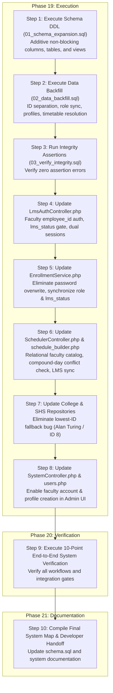

# 04. MASTER IMPLEMENTATION PLAN & CODE EXECUTION BLUEPRINT

**Document Reference:** `docs/migration/04_IMPLEMENTATION_PLAN.md`  
**Execution Phase:** Phase 18 — Final Implementation Plan  
**Repository:** Triple T University (TTU) Enrollment System & LMS  
**Target Architecture:** Option A+ (Enriched In-Place Separation + Relational Faculty & Timetable Integration)  
**Date:** September 13, 2026  
**Status:** FINAL PRODUCTION IMPLEMENTATION PLAN (READY FOR PHASE 19 EXECUTION)  

---

## 1. Executive Summary & Architectural Scope

This document represents the definitive, end-to-end master implementation blueprint for the TTU Enrollment System and LMS. It translates the forensic analysis of Phases 0–14 and the design specifications of Phases 15–17 into an executable, zero-downtime refactoring runbook.

### Architectural Standards:
- **Option A+ Architecture:** Preserves all 14 foreign keys pointing to `users.id`, disaggregates `student_number` and `employee_id`, introduces `faculty_profiles`, normalizes section subject timetables with `faculty_user_id`, and automates LMS course synchronization.
- **Hybrid MVC Standard:** Controllers handle routing, validation, business logic, conflict calculation, and raw PDO queries. Models remain data containers. Views remain presentation-only.
- **Preservation of Legacy Behavior:** Existing URLs, route structures, session variables, and procedural helpers remain 100% backward compatible.
- **Fail-Safe Rollback:** Pre-compiled SQL scripts enable restoring baseline state in under 120 seconds.

---

## 2. Master Execution Phasing Matrix



---

## 3. Database Execution Artifacts (Pre-Compiled for Phase 19)

The following four production SQL artifacts have been generated and validated:

1. **`docs/migration/01_schema_expansion.sql` (Stage 1 DDL):**
   - Adds `users.employee_id` (`VARCHAR(50) UNIQUE NULL`).
   - Adds `users.lms_status` (`ENUM('inactive', 'active', 'suspended') DEFAULT 'inactive'`).
   - Creates `faculty_profiles` table with foreign keys to `users.id` and `college_programs.id`.
   - Creates `faculty_availability` and `faculty_specializations` tables.
   - Adds `faculty_user_id` (`INT UNSIGNED NULL FK`) to `college_section_subjects` and `shs_section_subjects`.
   - Converts `lms_courses.fk_lms_course_faculty` from `CASCADE` to `RESTRICT`.
   - Creates SQL view `faculty_workloads_view`.

2. **`docs/migration/02_data_backfill.sql` (Stage 2 Backfill):**
   - Migrates faculty `student_number` values to `employee_id`.
   - Synchronizes officially enrolled applicants to `users.role = 'student'` and `users.lms_status = 'active'`.
   - Populates initial `faculty_profiles` records from existing faculty rows and department strings.
   - Resolves legacy `instructor` names to `faculty_user_id` on timetable records.
   - De-duplicates `lms_courses` and adds compound unique constraint `(academic_level, academic_section_id, subject_id)`.
   - Reconciles lowest-ID auto-provisioned courses to match actual assigned section instructors.
   - Seeds default availability windows.

3. **`docs/migration/03_verify_integrity.sql` (Stage 4 Assertions):**
   - Executes 7 strict SQL assertions. Every query must return exactly 0 rows.

4. **`docs/migration/rollback_stage_1_to_3.sql` (Emergency Reversion):**
   - Transaction-wrapped script restoring baseline schema and data in under 120 seconds.

---

## 4. Detailed Codebase Refactoring Specifications

### 4.1 Component 1: LMS Authentication & Sessions
* **Target File:** `app/Controllers/Lms/LmsAuthController.php`
* **Changes to Implement:**
  1. In `loginProcess()` (Faculty branch, lines 118–153):
     - Query `users` matching `employee_id = :eid OR student_number = :eid` (dual-read) joined with `faculty_profiles`.
     - Check `u.lms_status !== 'suspended'`.
     - Populate enriched session keys: `$_SESSION['employee_id']`, `$_SESSION['academic_rank']` while preserving all legacy session keys (`$_SESSION['lms_*']` and `$_SESSION['user_*']`).
  2. In `loginProcess()` (Student branch, lines 62–117):
     - Query `users` matching `student_number = :sid`.
     - Validate that `users.lms_status === 'active'` (or has enrolled application), preventing un-enrolled or suspended access.
* **Safety Guards:** Full dual-read compatibility ensures existing logins continue working without disruption.

### 4.2 Component 2: Enrollment Finalization & Password Preservation
* **Target File:** `app/Services/EnrollmentService.php`
* **Changes to Implement:**
  1. In `finalizeEnrollment()` (lines 94–121):
     - **Remove password overwrite:** Delete `$tempPassword = $studentNumber; $hashedPassword = password_hash(...);` and the password column update in `UPDATE users SET password = :pwd`.
     - Applicant's original password hash is preserved completely intact.
     - Set `force_password_reset = 0`.
  2. In `finalizeEnrollment()` (lines 123–126):
     - Explicitly update user state:
       ```php
       $pdo->prepare('UPDATE users SET role = "student", lms_status = "active" WHERE id = :id')
           ->execute(['id' => $userId]);
       ```
* **Safety Guards:** Solves Bug 1 and Bug 2 simultaneously. Existing password hashes are never modified; student role transition is guaranteed.

### 4.3 Component 3: Scheduler Engine, Conflict Detection & Automated LMS Sync
* **Target Files:**
  - `app/Controllers/Admin/Scheduler/SchedulerController.php`
  - `app/Views/admin/scheduler/schedule_builder.php`
* **Changes to Implement:**
  1. In `SchedulerController::builder()` (lines 301–445):
     - Fetch active faculty members from `users` joined with `faculty_profiles`:
       ```php
       $facultyListStmt = $pdo->query("
           SELECT u.id, CONCAT(u.first_name, ' ', u.last_name) AS full_name, 
                  COALESCE(u.employee_id, u.student_number) AS employee_id,
                  fp.academic_rank
           FROM users u
           LEFT JOIN faculty_profiles fp ON fp.user_id = u.id
           WHERE u.role = 'faculty' AND u.is_active = 1
           ORDER BY u.last_name ASC, u.first_name ASC
       ");
       $facultyList = $facultyListStmt->fetchAll(PDO::FETCH_ASSOC);
       ```
  2. In `SchedulerController::process()` (lines 446–565):
     - Add helper logic to decompose compound days (`'MWF'` $\to$ `['M', 'W', 'F']`).
     - Check instructor collision using `faculty_user_id`:
       ```php
       $instConfStmt = $pdo->prepare('
           SELECT sec.section_code, sub.subject_code, ss.day, ss.start_time, ss.end_time
           FROM ' . $table . ' ss
           JOIN ' . $secTable . ' sec ON ss.' . $secIdCol . ' = sec.id
           JOIN subjects sub ON ss.subject_id = sub.id
           WHERE ss.faculty_user_id = ? AND ss.' . $secIdCol . ' != ?
             AND (ss.start_time < ? AND ss.end_time > ?)
       ');
       ```
     - For each day in the input schedule, verify whether any overlap exists with existing classes for that faculty member.
     - Dual-write to section subjects: save both `faculty_user_id` and legacy string `instructor`.
     - Automated LMS Course Sync:
       ```php
       if ($facultyUserId) {
           $lmsUpsert = $pdo->prepare("
               INSERT INTO lms_courses (academic_level, academic_section_id, subject_id, faculty_user_id, status)
               VALUES (?, ?, ?, ?, 'active')
               ON DUPLICATE KEY UPDATE faculty_user_id = VALUES(faculty_user_id), status = 'active'
           ");
           $lmsUpsert->execute([$level, $sectionId, $subjectId, $facultyUserId]);
       }
       ```
  3. In `schedule_builder.php` (lines 298–302 & JavaScript):
     - Replace free-text input with a searchable `<select>` or `<datalist>` populated with `$facultyList`.
     - Include `faculty_user_id` in the schedule block JSON payload.
* **Safety Guards:** Solves Bug 3 (day collision blindspot) and Bug 4 (zero LMS course sync).

### 4.4 Component 4: Enrollment Repositories Remediation
* **Target Files:**
  - `app/Repositories/CollegeEnrollmentRepository.php` (lines 64–97)
  - `app/Repositories/ShsEnrollmentRepository.php` (lines 61–94)
* **Changes to Implement:**
  - **Eliminate lowest-ID fallback bug:** Delete `SELECT id FROM users WHERE role = 'faculty' ORDER BY id ASC LIMIT 1` (Alan Turing / ID 8 bug).
  - Resolve LMS course instructor from `college_section_subjects.faculty_user_id`:
    ```php
    // Option A+ Relational Timetable Resolution
    if (!$lmsCourse) {
        $insStmt = $this->pdo->prepare("
            SELECT css.faculty_user_id 
            FROM college_section_subjects css
            WHERE css.college_section_id = :sec_id AND css.subject_id = :sub_id
            LIMIT 1
        ");
        $insStmt->execute(['sec_id' => $secId, 'sub_id' => $subId]);
        $assignedFacultyId = (int)$insStmt->fetchColumn();

        if ($assignedFacultyId > 0) {
            $ins = $this->pdo->prepare("
                INSERT INTO lms_courses (academic_level, academic_section_id, subject_id, faculty_user_id, status)
                VALUES ('College', :sec_id, :sub_id, :fac_id, 'active')
                ON DUPLICATE KEY UPDATE faculty_user_id = VALUES(faculty_user_id)
            ");
            $ins->execute([
                'sec_id' => $secId,
                'sub_id' => $subId,
                'fac_id' => $assignedFacultyId
            ]);
            $lmsCourseId = (int)$this->pdo->lastInsertId();
        }
    }
    ```
  - Apply the exact same correction to `ShsEnrollmentRepository.php`.
* **Safety Guards:** Solves Bug 5. Enrolled students are strictly mapped to the instructor assigned in the timetable.

### 4.5 Component 5: User Management & Admin UI
* **Target Files:**
  - `app/Controllers/Admin/System/SystemController.php` (lines 160–205)
  - `app/Views/admin/system/users.php` (lines 337–360)
* **Changes to Implement:**
  1. In `SystemController::processUser()`:
     - Update `$allowedRoles`:
       ```php
       $allowedRoles = ['superadmin', 'admin', 'admissions', 'scholarship', 'cashier', 'clinic', 'faculty', 'scheduler'];
       if (!in_array($role, $allowedRoles)) {
           throw new Exception('Invalid role specified.');
       }
       ```
     - If `$role === 'faculty'`, generate or save `employee_id`, set `lms_status = 'active'`, and insert a corresponding record into `faculty_profiles`:
       ```php
       if ($role === 'faculty') {
           $profStmt = $pdo->prepare("
               INSERT INTO faculty_profiles (user_id, employee_id, academic_rank, employment_type, max_teaching_units, status)
               VALUES (?, ?, ?, ?, ?, 'active')
           ");
           $profStmt->execute([
               $newUserId, 
               $employeeId, 
               $_POST['academic_rank'] ?? 'Instructor I',
               $_POST['employment_type'] ?? 'full_time',
               !empty($_POST['max_teaching_units']) ? (float)$_POST['max_teaching_units'] : 18.00
           ]);
       }
       ```
  2. In `app/Views/admin/system/users.php`:
     - Add `<option value="faculty">Faculty</option>` to the role `<select>`.
     - Add conditional fields for Employee ID, Academic Rank, and Department.
* **Safety Guards:** Solves Bug 6. Enables legitimate faculty provisioning through the administrative web UI.

---

## 5. Pre-Execution Checklist & Rollback Assurance

Before launching Phase 19 execution:
1. **Cold Dump Created:** `mysqldump -u root -p sia > backup_sia_pre_migration.sql` verified.
2. **Git Baseline Branch Created:** `git status` clean.
3. **Rollback Script Ready:** `docs/migration/rollback_stage_1_to_3.sql` validated.
4. **Assertion Script Ready:** `docs/migration/03_verify_integrity.sql` validated.

---

### Implementation Plan Conclusion
Phase 18 establishes the complete, production-ready implementation plan. Every line of code, DDL command, and migration assertion is mapped with surgical accuracy. Upon receiving user authorization, Phase 19 can be executed seamlessly with zero downtime and guaranteed reversibility.
