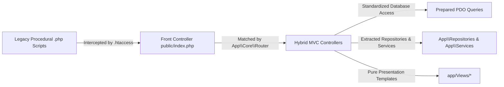

# MVC Strangler Fig Migration

The TTU Enrollment System uses the **Strangler Fig Pattern** to systematically modernize legacy procedural PHP scripts into an object-oriented **Hybrid MVC** framework without disrupting live operational workflows.

---

## 1. Migration Strategy

1. **Front Controller Interception:**
   - Apache `.htaccess` rewrites all inbound URI requests (including legacy script paths like `/applicant/dashboard.php` or `/auth/login.php`) to `public/index.php`.
2. **Centralized Routing Table:**
   - All URIs are formally mapped in `app/Routes/web.php` to specific controller classes and methods.
3. **Fat Controller Preservation:**
   - Legacy query and validation logic was migrated inside controller methods (`AdmissionsController`, `ApplicantController`, `FinanceController`, etc.), preserving identical business rules and legacy database behaviors while enforcing secure parameter binding.
4. **Gradual Layer Extraction:**
   - High-duplication or cross-tier domain logic (such as College vs. SHS enrollment lookups) is systematically extracted into dedicated Repositories (`CollegeEnrollmentRepository`, `ShsEnrollmentRepository`) and Service classes (`LmsService`).

---

## 2. Migration Status by Subsystem

| Subsystem / Area | Legacy Architecture | Current Hybrid MVC Status | Primary Controller(s) |
|---|---|---|---|
| **Authentication** | Procedural scripts with direct session manipulation | **Fully Migrated** | `AuthController`, `LmsAuthController` |
| **Applicant Portal** | Monolithic procedural forms | **Fully Migrated** | `ApplicantController`, `EnrollController`, `DocumentController`, `HealthController` |
| **Admissions** | Standalone administrative scripts | **Fully Migrated** | `Admin\Admissions\AdmissionsController` |
| **Registrar & Curriculum** | Direct SQL tables editing | **Fully Migrated** | `Admin\Registrar\RegistrarController`, `CollegeController`, `ShsController`, `SubjectController` |
| **Scheduler** | Manual section assignments | **Fully Migrated** | `Admin\Scheduler\SchedulerController` |
| **Finance & Cashier** | Fixed static fee calculator | **Fully Migrated** (with dynamic unit pricing) | `Admin\Finance\FinanceController`, `FeeController` |
| **Clinic / Health** | Unintegrated medical forms | **Fully Migrated** (with gating validation) | `Admin\Clinic\ClinicController`, `HealthController` |
| **Scholarships** | Manual paper grants | **Fully Migrated** | `Admin\Scholarship\ScholarshipController` |
| **LMS Platform** | Non-existent in legacy | **Fully Implemented** | `Lms\StudentController`, `Lms\FacultyController`, `LmsAdminController` |
| **System Admin** | Fragmented utilities | **Fully Migrated** | `Admin\System\SystemController`, `ReportController`, `DashboardController` |

---

## 3. Extracted Domain Services (`app/Services/`)

Following the Strangler Fig pattern, core business workflows and calculation logic previously bloated across multiple controllers have been cleanly extracted into authoritative domain services:

1. **`App\Services\StudentNumberService`** ([StudentNumberService.php](file:///c:/xampp/htdocs/sia/app/Services/StudentNumberService.php)):
   - Generates unique, strictly sequential student numbers formatted as `YYYY-XXXXXX`.
   - Utilizes MariaDB table `student_number_sequences` with atomic upserts (`INSERT ... ON DUPLICATE KEY UPDATE`) to prevent race conditions during concurrent admissions.
2. **`App\Services\AssessmentService`** ([AssessmentService.php](file:///c:/xampp/htdocs/sia/app/Services/AssessmentService.php)):
   - Centralizes fee template lookup, lecture/lab unit rates calculation, and scholarship deductions.
   - Creates immutable snapshot records in `assessment_items` to protect against historical fee mutations.
   - Replaces duplicate multi-tier fallback queries across `FinanceController` and `ApplicantController` with `getAssessmentBreakdown()`.
3. **`App\Services\EnrollmentService`** ([EnrollmentService.php](file:///c:/xampp/htdocs/sia/app/Services/EnrollmentService.php)):
   - Coordinates the final onboarding transaction: verifies payment status (`payment_verified`), assigns student ID, provisions `@ttu.edu.ph` institutional email, sets `force_password_reset = 1`, enrolls subjects into section tables, and dispatches credentials via PHPMailer.

---

## 4. Guiding Rules for Modernization
1. **Never Break Legacy Data Contracts:** The "Application as Term" relational structure and existing database schema must remain intact.
2. **Controllers Own Business Logic:** Avoid abstracting SQL queries into complex ORM abstractions that hide query performance or alter parameter binding.
3. **Repository Pattern for Cross-Tier Access:** When querying parallel academic tables (College vs. SHS), delegate to Repositories.
