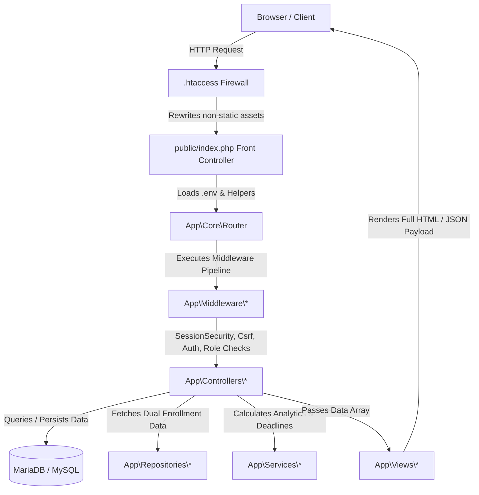

# System Architecture

## 1. Architectural Pattern: Hybrid MVC Monolith
The TTU Enrollment System uses a **Hybrid MVC** pattern, modernizing legacy procedural code through the [[MVC Strangler Fig Migration]].

The application runs on Vanilla PHP without heavyweight third-party web frameworks, relying on lightweight custom core components located in `app/Core/`:
- **`Router`**: Evaluates HTTP request paths and method signatures, executing middleware chains and resolving controller actions.
- **`Request`**: Encapsulates `$_GET`, `$_POST`, `$_SERVER`, and raw request body inputs.
- **`Response`**: Formats HTTP responses, sets status codes, headers, and issues JSON or redirect responses.
- **`BaseModel`**: Simple data container and Active Record-like abstraction for core entities.

---

## 2. Technology Stack
- **Backend:** PHP 8.2+ (PSR-4 Custom Autoloader, Custom Router, Middleware Pipeline)
- **Database:** MariaDB 10.4.32 / MySQL 8.0+ (Raw SQL via PDO with prepared statements, `ATTR_EMULATE_PREPARES => false`)
- **Email Delivery:** PHPMailer (v6.9.1) via Composer, with SMTP TLS (Port 587)
- **Frontend Framework:** HTML5, Vanilla CSS3 tokens, JavaScript (ES6+), Bootstrap 5.3+
- **Visuals & Charts:** Bootstrap Icons (v1.11+), Chart.js (v4.4+), Google Fonts (Inter, Plus Jakarta Sans)
- **Web Server:** Apache 2.4 (XAMPP Environment) with `.htaccess` mod_rewrite engine

---

## 3. Layer Separation & Responsibilities

### Controllers (`app/Controllers/`)
The system follows a **Fat Controller** standard:
- **Routing & Interception:** Handles incoming request inputs, validates parameters, and verifies authorization.
- **Business Logic & Workflow:** Implements domain rules (e.g., assessing tuition rates, transitioning application statuses, generating student credentials).
- **Data Access:** Executes parameterized PDO queries directly against MariaDB.
- **View Assembly:** Prepares view data and invokes `$this->render('view_name', $data)`.

### Repositories (`app/Repositories/`)
Introduced for cross-tier data access where logic spans College and SHS:
- `CollegeEnrollmentRepository`: Resolves active subjects, sections, and advisers from `college_enrollments` and auto-provisions `lms_courses` on student access.
- `ShsEnrollmentRepository`: Resolves active subjects, sections, and advisers from `shs_enrollments` and auto-provisions `lms_courses` on student access.

### Services (`app/Services/`)
Domain services encapsulate complex business logic and calculations:
- `LmsService`: Aggregates cross-course student deadlines, announcements, class streaks, course details, and materials.
- `LmsGradebookService`: Computes assignment scores, quiz results, and weighted student grades.
- `LmsQuizService`: Handles quiz attempts, choice validation, instant multiple-choice grading, and time limits.
- `LmsAttendanceService`: Manages daily attendance sessions and roll-call records.
- `LmsAnnouncementService`: Handles instructor and course announcements.
- `LmsCalendarService`: Compiles academic schedule events and assignment due dates.

### Models (`app/Models/`)
Models act primarily as basic data structures and lightweight utility wrappers (`User`, `Application`, `HealthRecord`, `Schedule`, `StudentAssessment`, `ActivityLog`, `Announcement`).

### Views (`app/Views/`)
- Presentation layer composed of standard PHP/HTML templates.
- Segregated into administrative (`admin/`), applicant (`applicant/`), auth (`auth/`), and LMS portals (`lms/`).
- Includes layout wrapper components (`layout_header.php`, `layout_footer.php`) and email templates (`emails/`).

---

## 4. Multi-Portal Segregation
The application operates 4 distinct user-facing portals sharing a single unified database:
1. **Applicant Portal:** (`/applicant/*`) - Admission application, requirement uploads, health submission, self-enrollment, and assessment viewing.
2. **Admin Management System:** (`/admin/*`) - Admissions, Registrar, Scheduler, Finance, Clinic, Scholarship, and System Administration.
3. **Student LMS Portal:** (`/lms/student/*`) - Enrolled course viewer, learning modules, assignments, timed quizzes, attendance, and gradebook.
4. **Faculty LMS Portal:** (`/lms/faculty/*`) - Class roster, module and file material upload, assignment grading, quiz authoring, and attendance tracking.

---

## 5. Security & Isolation Boundaries
1. **Firewall & Routing:** Direct file access to `app/`, `config/`, `database/`, and root scripts is intercepted and blocked by `.htaccess`.
2. **Authentication Gating:** Enforced by `SessionSecurityMiddleware`, `AuthMiddleware`, and `RoleMiddleware`.
3. **Database Integrity:** Parameterized queries protect against SQL Injection.

---
**Related:**
- [[MVC Strangler Fig Migration]]
- [[Authentication & Email Verification]]
- [[Database Overview]]
- [[Module Index]]
