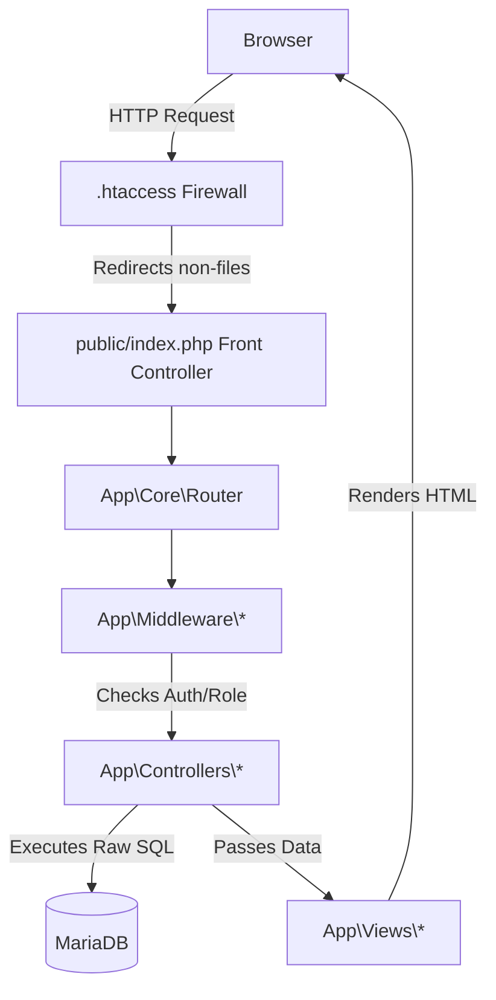

# System Architecture

## Overall Architecture
The TTU Enrollment System uses a **Hybrid MVC** pattern, also known as the [[MVC Strangler Fig Migration]] pattern. It is transitioning from a legacy procedural PHP structure to a unified custom MVC framework.

## Technology Stack
- **Backend:** PHP (Custom PSR-4 Autoloader, Router, Middleware)
- **Database:** MariaDB / MySQL (Raw SQL via PDO)
- **Frontend:** HTML, CSS, JavaScript, jQuery, Bootstrap 5
- **Server:** XAMPP (Apache)
- **Dependencies:** PHPMailer (via Composer)

## Request Lifecycle

## Backend Architecture
- **Controllers:** The system heavily utilizes "Fat Controllers". Business logic, validation, and complex SQL queries are written directly inside the `app/Controllers/` files.
- **Models:** Models exist in `app/Models/` but act primarily as basic data containers rather than an active record or repository layer.
- **Views:** Fully separated into `app/Views/` and rendered by the controllers.

## Legacy Architecture
Procedural scripts like `cleanup.php` and `patch_shs_sections.php` still exist in the project root. While `.htaccess` blocks direct access to `app/`, `config/`, and `database/`, care must be taken with root scripts.

## Architecture Boundaries
1. **Presentation:** Handled by `app/Views/` and frontend JS.
2. **Business & DB Logic:** Tightly coupled inside `app/Controllers/`.
3. **Infrastructure:** Handled by `App\Core\` (Request, Response, Router).
4. **LMS Segregation:** LMS features are segregated into distinct `Lms\FacultyController` and `Lms\StudentController` with dedicated authentication (`LmsAuthController`) and route grouping.

**Related:**
- [[MVC Strangler Fig Migration]]
- [[Database Overview]]
