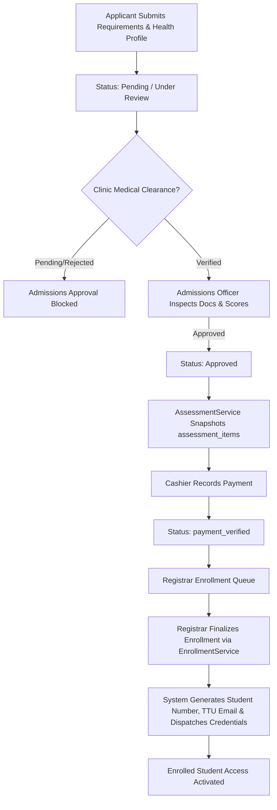

# Admissions Module

**Path**: `admin/admissions/`  
**Required Roles**: `admissions`, `admin`, `superadmin`  
**Controller**: [`AdmissionsController.php`](file:///c:/xampp/htdocs/sia/app/Controllers/Admin/Admissions/AdmissionsController.php)

The Admissions module is the primary administrative intake checkpoint in the [[Student Lifecycle Workflow]].

---

## 1. Core Responsibilities
1. **Application Intake & Review:** Reviews submitted applications across `pending`, `under_review`, and `correction_required` states with responsive quick-filter pills and real-time intake metrics (`dashboard.php`, `review.php`).
2. **Document Verification:** Inspects applicant-uploaded admission requirements (PSA Birth Certificate, Form 137/138, Good Moral, 2x2 Photos) via `application_documents`. Powered by correlated subqueries (`doc_count`, `pending_docs`) in `AdmissionsController@review` and an in-browser zoom inspector (`detail.php`).
3. **Section & Curriculum Assignment:** Assigns active class sections from `college_sections` or `shs_sections`. For regular college applicants, locks in permanent `college_curriculum_id` on the student record and populates `college_enrollments` from curriculum subjects.
4. **Irregular Applicant Subject Requests:** Displays custom requested subjects from `application_subject_requests` directly within an interactive subject drawer in `application_detail.php`, preserving custom student schedules across different programs/years without section overwrite.
5. **Clinic Clearance Requirement:** Requires verified medical clearance from the Clinic (`health_records.status = 'verified'`) before permitting transition to `status = 'approved'`.
6. **Automatic Assessment Snapshotting:** Upon moving status to `approved`, automatically delegates assessment calculation to `App\Services\AssessmentService`, freezing fee line items in `assessment_items`.
7. **Enrollment Queue Handoff:** Once approved and assessed, applicants proceed to Cashier payment verification (`payment_verified`). Official enrollment finalization and credential generation are owned by the [[Registrar]].

---

## 2. Automated Student Credential Issuance
When the Registrar officer finalizes an application via `RegistrarController@finalizeEnrollment` (delegated to `App\Services\EnrollmentService`):
1. **Student Number Generation:** Generates a unique student ID formatted as `YYYY-XXXXXX` (e.g. `2026-000003`) via atomic sequence in `App\Services\StudentNumberService`.
2. **Institutional TTU Email:** Formats and assigns a university email address (`firstname.lastname@ttu.edu.ph`) with automatic numerical collision suffixing.
3. **Temporary Password Generation:** Assigns the student number as the initial temporary password and flags `users.force_password_reset = 1`.
4. **Automated Dispatch:** Dispatches the branded HTML credentials email ([`welcome_credentials.php`](file:///c:/xampp/htdocs/sia/app/Views/emails/welcome_credentials.php)) via PHPMailer.

---

## 3. Core Files & Endpoints
| Endpoint | Method | Action | Description |
|---|---|---|---|
| `/admin/admissions/admissions_dashboard.php` | GET | `index` | Summary statistics, pending queues, and application tables. |
| `/admin/admissions/review.php` | GET | `review` | Filterable list of applications by status and program. |
| `/admin/admissions/application_detail.php` | GET | `detail` | Complete applicant record, irregular subject requests, academic history, uploaded docs. |
| `/admin/admissions/application_process.php` | POST | `process` | Evaluates documents, enforces clinic clearance gate, triggers `AssessmentService`. |
| `/admin/admissions/bulk_process.php` | POST | `bulkProcess` | Batch approvals/rejections of multiple applications. |
| `/admin/admissions/document_view.php` | GET | `viewDocument` | Secure document inspector with zoom preview. |

---

## 4. Integration & Data Flow

---
**Related:**
- [[Applicant Portal]]
- [[Clinic]]
- [[Authentication & Email Verification]]
- [[Email & Notification System]]
