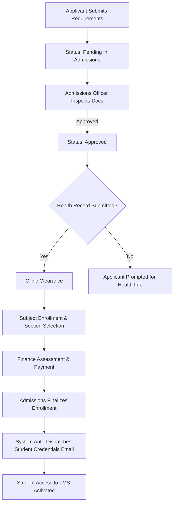

# Admissions Module

**Path**: `admin/admissions/`  
**Required Roles**: `admissions`, `admin`, `superadmin`  
**Controller**: [`AdmissionsController.php`](file:///c:/xampp/htdocs/sia/app/Controllers/Admin/Admissions/AdmissionsController.php)

The Admissions module is the primary administrative intake checkpoint in the [[Student Lifecycle Workflow]].

---

## 1. Core Responsibilities
1. **Application Intake & Review:** Reviews submitted applications across `pending`, `under_review`, and `correction_required` states.
2. **Document Verification:** Inspects applicant-uploaded admission requirements (PSA Birth Certificate, Form 137/138, Good Moral, 2x2 Photos) via `application_documents`.
3. **Section & Curriculum Assignment:** Assigns active class sections from `college_sections` or `shs_sections`. For college applicants, locks in permanent `college_curriculum_id` on the student record and populates `college_enrollments` from curriculum subjects.
4. **Automatic Assessment Generation:** Upon moving status to `approved` or `enrolled`, dynamically creates `student_assessments` using active `fee_templates` (computing per-unit tuition based on enrolled subject units if `is_per_unit = 1`).
5. **Final Enrollment & Credential Provisioning:** When finalizing enrollment (`status = 'enrolled'`), automatically generates student numbers (`YYYY-XXXXXX`), provisions institutional TTU email, sets temporary LMS password, and dispatches credentials via PHPMailer.

---

## 2. Automated Student Credential Issuance
When an Admissions officer finalizes an application:
1. **Student Number Generation:** Generates a unique student ID formatted as `YYYY-XXXXXX` (e.g. `2026-000003`) via `generateStudentNumber()`.
2. **Institutional TTU Email:** Formats and assigns a university email address (`firstname.lastname@ttu.edu.ph`).
3. **Temporary Password Generation:** Assigns the student number as the initial temporary password and flags `users.force_password_reset = 1`.
4. **Automated Dispatch:** Dispatches the branded HTML credentials email ([`welcome_credentials.php`](file:///c:/xampp/htdocs/sia/app/Views/emails/welcome_credentials.php)) via [`sendStudentCredentialsEmail()`](file:///c:/xampp/htdocs/sia/app/Helpers/functions.php) using PHPMailer.

---

## 3. Core Files & Endpoints
| Endpoint | Method | Action | Description |
|---|---|---|---|
| `/admin/admissions/admissions_dashboard.php` | GET | `index` | Summary statistics, pending queues, and application tables. |
| `/admin/admissions/review.php` | GET | `review` | Filterable list of applications by status and program. |
| `/admin/admissions/application_detail.php` | GET | `detail` | Complete applicant record, academic history, uploaded docs. |
| `/admin/admissions/application_process.php` | POST | `process` | Updates application status, document approval, notes, and triggers credentials. |
| `/admin/admissions/bulk_process.php` | POST | `bulkProcess` | Batch approvals/rejections of multiple applications. |
| `/admin/admissions/document_view.php` | GET | `viewDocument` | Secure document inspector with zoom preview. |

---

## 4. Integration & Data Flow

---
**Related:**
- [[Applicant Portal]]
- [[Clinic]]
- [[Authentication & Email Verification]]
- [[Email & Notification System]]
