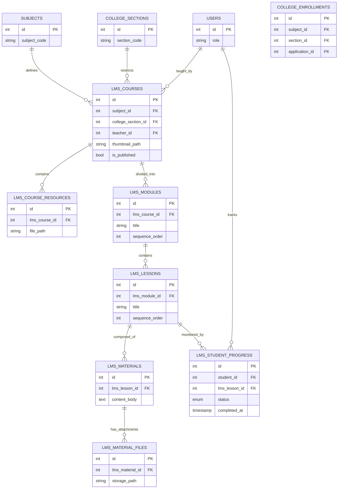

# TTU LMS Database Architecture

> **Generated**: August 1, 2026
> **Scope**: LMS Phase 2 (Foundation)
> **Principle**: The Enrollment System (`users`, `subjects`, `college_sections`, `college_enrollments`) remains the absolute source of truth. LMS tables *only* store learning-specific metadata and relational hierarchies.

---

## 1. System Data Flow Overview

The LMS architecture follows a strict one-way dependency from the Enrollment System:

1. **Identity & Authorization**: The LMS relies entirely on the `users` table. Both students and faculty use their `student_number` (or employee ID) to log in.
2. **Access Control**: A student's access to an LMS course is dynamically verified against the `college_enrollments` table. If a student drops a subject in the enrollment system, they automatically lose access in the LMS.
3. **Course Instantiation**: When a faculty member is assigned to teach a Subject/Section, an `lms_courses` record is generated to hold the syllabus and thumbnails.
4. **Learning Hierarchy**: `lms_courses` ➔ `lms_modules` ➔ `lms_lessons` ➔ `lms_materials` ➔ `lms_material_files`.

---

## 2. Table Specifications

### 2.1 `lms_courses`
* **Purpose**: Extends the base enrollment subjects with LMS-specific metadata (like a welcome message or thumbnail). Groups a specific subject, section, and teacher together.
* **Columns**:
  * `id` (INT, Unsigned, Auto Increment)
  * `subject_id` (INT, Unsigned)
  * `college_section_id` (INT, Unsigned, Nullable - *Null if course is open to all sections*)
  * `teacher_id` (INT, Unsigned)
  * `thumbnail_path` (VARCHAR 255, Nullable)
  * `welcome_message` (TEXT, Nullable)
  * `is_published` (TINYINT 1, Default 0)
  * `created_at` (TIMESTAMP)
  * `updated_at` (TIMESTAMP)
* **Primary Key**: `id`
* **Foreign Keys**:
  * `subject_id` → `subjects(id)` (ON DELETE CASCADE)
  * `college_section_id` → `college_sections(id)` (ON DELETE CASCADE)
  * `teacher_id` → `users(id)` (ON DELETE CASCADE)
* **Indexes**: `idx_subject_section_teacher (subject_id, college_section_id, teacher_id)` (UNIQUE)
* **Relationships**: One-to-many with `lms_modules` and `lms_course_resources`.

### 2.2 `lms_course_resources`
* **Purpose**: Stores global course files (e.g., Syllabus PDF, Grading Guidelines) independent of weekly modules.
* **Columns**:
  * `id` (INT, Unsigned, Auto Increment)
  * `lms_course_id` (INT, Unsigned)
  * `title` (VARCHAR 255)
  * `file_path` (VARCHAR 255)
  * `file_size` (INT, Unsigned)
  * `mime_type` (VARCHAR 100)
  * `uploaded_at` (TIMESTAMP)
* **Primary Key**: `id`
* **Foreign Keys**:
  * `lms_course_id` → `lms_courses(id)` (ON DELETE CASCADE)
* **Indexes**: `idx_course_id (lms_course_id)`

### 2.3 `lms_modules`
* **Purpose**: Thematic or chronological groupings of lessons (e.g., "Week 1", "Chapter 1: Introduction").
* **Columns**:
  * `id` (INT, Unsigned, Auto Increment)
  * `lms_course_id` (INT, Unsigned)
  * `title` (VARCHAR 255)
  * `description` (TEXT, Nullable)
  * `sequence_order` (INT) - *Used for drag-and-drop sorting*
  * `is_published` (TINYINT 1, Default 0)
  * `created_at` (TIMESTAMP)
* **Primary Key**: `id`
* **Foreign Keys**:
  * `lms_course_id` → `lms_courses(id)` (ON DELETE CASCADE)
* **Indexes**: `idx_course_id (lms_course_id)`
* **Relationships**: One-to-many with `lms_lessons`.

### 2.4 `lms_lessons`
* **Purpose**: A specific learning unit within a module.
* **Columns**:
  * `id` (INT, Unsigned, Auto Increment)
  * `lms_module_id` (INT, Unsigned)
  * `title` (VARCHAR 255)
  * `overview` (TEXT, Nullable)
  * `sequence_order` (INT)
  * `is_published` (TINYINT 1, Default 0)
  * `created_at` (TIMESTAMP)
* **Primary Key**: `id`
* **Foreign Keys**:
  * `lms_module_id` → `lms_modules(id)` (ON DELETE CASCADE)
* **Indexes**: `idx_module_id (lms_module_id)`
* **Relationships**: One-to-many with `lms_materials` and `lms_student_progress`.

### 2.5 `lms_materials`
* **Purpose**: The actual instructional content (rich text, embedded videos, instructions) that makes up a lesson.
* **Columns**:
  * `id` (INT, Unsigned, Auto Increment)
  * `lms_lesson_id` (INT, Unsigned)
  * `title` (VARCHAR 255)
  * `content_body` (MEDIUMTEXT) - *HTML rich text content*
  * `sequence_order` (INT)
  * `created_at` (TIMESTAMP)
* **Primary Key**: `id`
* **Foreign Keys**:
  * `lms_lesson_id` → `lms_lessons(id)` (ON DELETE CASCADE)
* **Indexes**: `idx_lesson_id (lms_lesson_id)`
* **Relationships**: One-to-many with `lms_material_files`.

### 2.6 `lms_material_files`
* **Purpose**: Downloadable files (PDFs, PPTs) or raw video files attached directly to a specific material block.
* **Columns**:
  * `id` (INT, Unsigned, Auto Increment)
  * `lms_material_id` (INT, Unsigned)
  * `original_filename` (VARCHAR 255)
  * `storage_path` (VARCHAR 255)
  * `file_size_bytes` (INT, Unsigned)
  * `mime_type` (VARCHAR 100)
  * `uploaded_at` (TIMESTAMP)
* **Primary Key**: `id`
* **Foreign Keys**:
  * `lms_material_id` → `lms_materials(id)` (ON DELETE CASCADE)
* **Indexes**: `idx_material_id (lms_material_id)`

### 2.7 `lms_student_progress`
* **Purpose**: Tracks a student's completion status for individual lessons to calculate overall course progress.
* **Columns**:
  * `id` (INT, Unsigned, Auto Increment)
  * `student_id` (INT, Unsigned)
  * `lms_lesson_id` (INT, Unsigned)
  * `status` (ENUM: 'in_progress', 'completed')
  * `last_accessed_at` (TIMESTAMP, Nullable)
  * `completed_at` (TIMESTAMP, Nullable)
* **Primary Key**: `id`
* **Foreign Keys**:
  * `student_id` → `users(id)` (ON DELETE CASCADE)
  * `lms_lesson_id` → `lms_lessons(id)` (ON DELETE CASCADE)
* **Indexes**: `idx_student_lesson (student_id, lms_lesson_id)` (UNIQUE) - *A student can only have one progress record per lesson.*

---

## 3. Entity Relationship Diagram (ERD)

---

## 4. Constraint & Rules Summary

1. **Third Normal Form (3NF)**: No duplication of Subject Names, Codes, Student Names, or Section Identifiers exists within the LMS schema. Everything is accessed dynamically via JOINs.
2. **Cascading Deletions**: If a `subject` is deleted from the Enrollment System, the database automatically cascades the deletion down the entire tree: `lms_courses` ➔ `lms_modules` ➔ `lms_lessons` ➔ `lms_materials` ➔ `lms_material_files`.
3. **Progress Integrity**: The unique compound index on `lms_student_progress (student_id, lms_lesson_id)` ensures data consistency by preventing duplicate progress entries for the same student on the same lesson.
