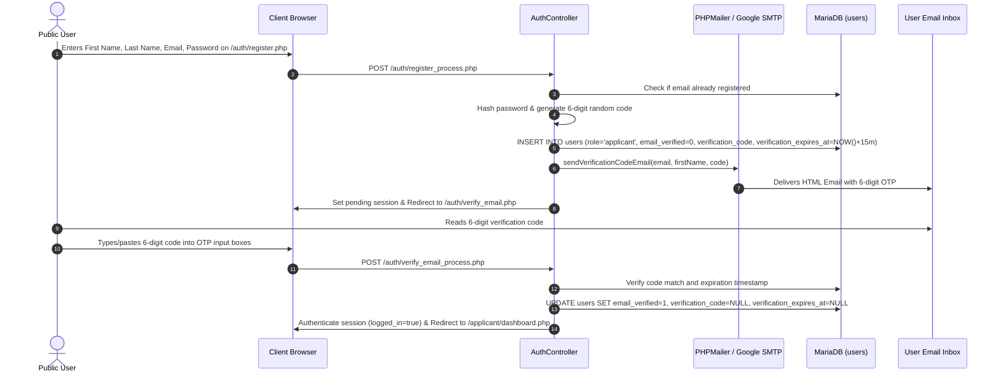

# Applicant Registration & Verification Workflow

This workflow governs how prospective students register an account, undergo 6-digit email OTP verification, and gain authenticated access to the TTU Applicant Portal.

---

## 1. Workflow Diagram

---

## 2. Step-by-Step Execution

### Step 1: Initial Registration Form (`/auth/register.php`)
- User provides First Name, Last Name, Email, Password, and Password Confirmation.
- Validation enforces:
  - Required names, valid email format (`filter_var`).
  - Minimum 8-character password with matching confirmation.
  - Email uniqueness check against `users` table.

### Step 2: Database Account Creation & OTP Generation
- A new record is created in `users` with:
  - `role = 'applicant'`
  - `is_active = 1`
  - `email_verified = 0` (unverified state)
  - `verification_code = 'XXXXXX'` (6 random digits via `sprintf('%06d', random_int(100000, 999999))`)
  - `verification_expires_at = DATE_ADD(NOW(), INTERVAL 15 MINUTE)`

### Step 3: Branded Email Transmission
- [`sendVerificationCodeEmail()`](file:///c:/xampp/htdocs/sia/app/Helpers/functions.php) loads `.env` SMTP credentials and sends the [`email_verification.php`](file:///c:/xampp/htdocs/sia/app/Views/emails/email_verification.php) template containing the university campus hero background and 6-digit OTP.

### Step 4: OTP Verification Screen (`/auth/verify_email.php`)
- Interactive UI presents 6 single-digit inputs with auto-focus forward, backspace navigation, and clipboard paste support.
- Includes a 60-second cooldown timer for requesting a fresh OTP via `/auth/resend_verification.php`.

### Step 5: Verification & Authentication
- Submitting the valid code clears the OTP columns in the database, sets `email_verified = 1`, creates authenticated user session variables (`$_SESSION['logged_in'] = true`, `$_SESSION['user_role'] = 'applicant'`), logs an audit entry, and redirects the user to `/applicant/dashboard.php`.

---

## 3. Login Interception Rule
If an unverified user (`email_verified = 0`) attempts to log in via `/auth/login.php`:
1. The system prevents dashboard entry.
2. Automatically generates a fresh 6-digit code with a renewed 15-minute expiry.
3. Sends a new verification email and redirects the user to `/auth/verify_email.php`.

---
**Related:**
- [[Authentication & Email Verification]]
- [[Email & Notification System]]
- [[Applicant Portal]]
- [[Users Table]]
