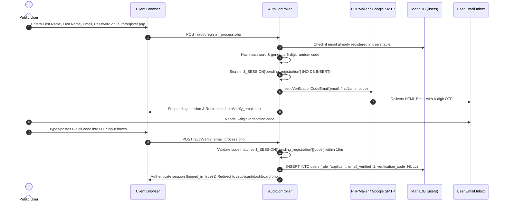

# Applicant Registration & Verification Workflow

This workflow governs how prospective students register an account, undergo 6-digit email OTP verification, and gain authenticated access to the TTU Applicant Portal.

> [!IMPORTANT]
> **Deferred Account Creation Architecture:** User accounts are **not** created in the `users` database table upon registration form submission. Unverified credentials and OTPs reside exclusively in temporary session memory (`$_SESSION['pending_registration']`) and are written to the database **only after** the applicant successfully submits the valid 6-digit OTP.

---

## 1. Workflow Diagram

---

## 2. Step-by-Step Execution

### Step 1: Initial Registration Form (`/auth/register.php`)
- User provides First Name, Last Name, Email, Password, and Password Confirmation.
- Validation enforces:
  - Required names, valid email format (`filter_var`).
  - Minimum 8-character password with matching confirmation.
  - Email uniqueness check against active `users` table.

### Step 2: Session Staging & OTP Generation (No Database Pollution)
- The applicant record is **not** written to the database.
- Credentials and OTP are staged in `$_SESSION['pending_registration']`:
  - `first_name`, `last_name`, `email`
  - `password`: `password_hash($password, PASSWORD_DEFAULT)`
  - `code`: 6-digit random string via `sprintf('%06d', random_int(100000, 999999))`
  - `expires_at`: `time() + (15 * 60)` (15-minute expiration)

### Step 3: Branded Email Transmission
- [`sendVerificationCodeEmail()`](file:///c:/xampp/htdocs/sia/app/Helpers/functions.php) loads `.env` SMTP credentials and sends the [`email_verification.php`](file:///c:/xampp/htdocs/sia/app/Views/emails/email_verification.php) template containing the university campus hero background and 6-digit OTP.

### Step 4: OTP Verification Screen (`/auth/verify_email.php`)
- Interactive UI presents 6 single-digit inputs with auto-focus forward, backspace navigation, and clipboard paste support.
- Includes a 60-second cooldown timer for requesting a fresh OTP via `/auth/resend_verification.php` (which updates `$_SESSION['pending_registration']` in-memory).

### Step 5: Verification, Account Insertion & Authentication
- Upon submitting the valid 6-digit OTP code within 15 minutes:
  1. Executes `INSERT INTO users (first_name, last_name, email, password, role, is_active, email_verified, ...) VALUES (?, ?, ?, ?, 'applicant', 1, 1, ...)`
  2. Clears pending registration session memory.
  3. Establishes authenticated user session (`$_SESSION['logged_in'] = true`, `$_SESSION['user_role'] = 'applicant'`).
  4. Logs an audit activity entry in `activity_logs`.
  5. Redirects to [`/applicant/dashboard.php`](file:///c:/xampp/htdocs/sia/app/Views/applicant/dashboard.php).

---

## 3. Login Interception Rule for Legacy / Existing Users
If an existing unverified user (`email_verified = 0`) in the database attempts to log in via `/auth/login.php`:
1. The system blocks login.
2. Generates a fresh 6-digit code with renewed 15-minute expiry in `users`.
3. Sends a new verification email and redirects the user to `/auth/verify_email.php`.
4. Submitting the code marks `users.email_verified = 1` and logs the user in.

---
**Related:**
- [[Authentication & Email Verification]]
- [[Email & Notification System]]
- [[Applicant Portal]]
- [[Users Table]]
- [[ADR-006 Deferred Account Creation via OTP]]
