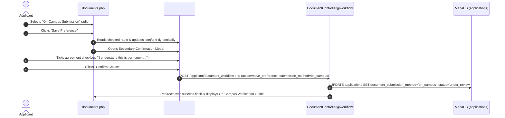

# Document Submission Preference Workflow

This document specifies the workflow for selecting and finalizing document submission modes (**Online Upload** vs **On-Campus Physical Submission**) on the TTU Applicant Portal (`/applicant/documents.php`).

---

## 1. Overview & Dual Verification Modes

Applicants can choose between two submission pathways:

| Feature / Pathway | Online Upload | On-Campus Physical Submission |
|---|---|---|
| **Primary Method** | Digital PDF / PNG / JPG file upload through portal | In-person document verification at Admissions Office |
| **Applicant Requirement** | Upload all mandatory documents (Form 138, Birth Cert, Good Moral) | Visit campus with original documents & reference number |
| **Portal Behavior** | File upload widgets enabled; submit button activates when complete | File upload widgets disabled; campus visit guide & checklist displayed |
| **Status Transition** | Status remains `pending` until all files uploaded, then `under_review` | Status immediately updates to `under_review` upon confirmation |
| **Irreversibility** | Confirmed choice locks the preference to ensure evaluation integrity | Confirmed choice locks the preference to prevent dual-routing confusion |

---

## 2. Step-by-Step Workflow & Secondary Confirmation

---

## 3. Secondary Confirmation Modal Logic

To prevent accidental locking or misunderstandings:
1. When the applicant clicks **"Save Preference"**, the JavaScript function `updateModalContent()` dynamically inspects which radio button is active.
2. The modal header, icon (`bi-building` vs `bi-cloud-arrow-up`), warning notice, and detailed bullet list are populated with exact instructions for the selected method.
3. The **"Confirm Choice"** action button remains strictly **disabled** until the applicant checks the irreversible consent checkbox:
   `[x] I understand that this choice is permanent, irreversible, and cannot be undone online.`
4. Submitting posts to `DocumentController@workflow` with CSRF protection.

---

## 4. On-Campus Physical Verification Screen State

When `document_submission_method = 'on_campus'`:
- The portal renders the **On-Campus Verification Instructional Guide**:
  - **Action Banner:** Highlights the applicant's official Reference Number (e.g. `SIA-2026-083165`).
  - **Office Location:** Ground Floor, Administration Building, Main Campus (Windows 1 & 2).
  - **Operating Hours:** Monday to Friday 8:00 AM – 5:00 PM, Saturday 8:00 AM – 12:00 PM.
  - **Checklist:** Itemized list of required physical documents (Original + Photocopy).
  - **Process Walkthrough:** Next steps explaining evaluation, status approval, and post-approval enrollment unlocks.

---
**Related:**
- [[Applicant Portal]]
- [[Applicant Registration Workflow]]
- [[Page Relationships Matrix]]
