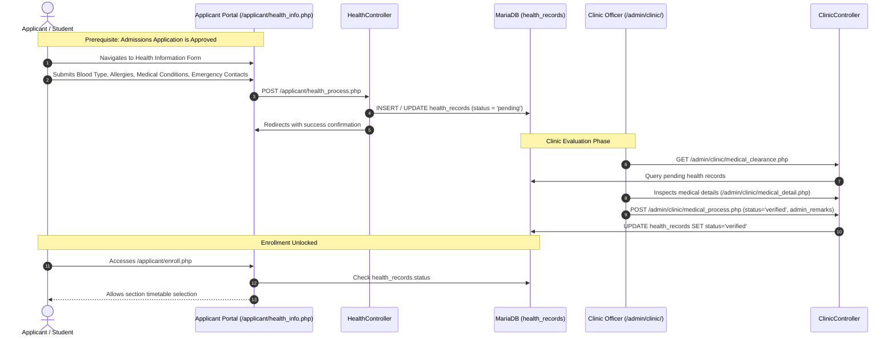

# Health Submission & Clinic Clearance Workflow

This workflow documents the process of submitting student health information, clinic staff evaluation, and the post-approval clearance gating rule required before subject enrollment.

---

## 1. Workflow Sequence Diagram



---

## 2. Step-by-Step Details

### Step 1: Health Information Submission (`/applicant/health_info.php`)
- **Prerequisite:** The applicant's admission application has reached `approved` status.
- **Form Data:**
  - Blood Type (A+, A-, B+, B-, AB+, AB-, O+, O-).
  - Pre-existing medical conditions, chronic illnesses, allergies, and ongoing medications.
  - Emergency contact person, relationship, and contact number.
- **Controller Action:** `HealthController::process` validates required fields, updates or inserts into `health_records`, and transitions status to `pending`.

### Step 2: Clinic Evaluation (`/admin/clinic/medical_clearance.php`)
- **Review Screen:** Clinic officers review submitted records with status filtering (`pending`, `under_review`, `correction_required`, `verified`).
- **Detailed Inspection:** `ClinicController::detail` displays the full medical and emergency profile.
- **Decision:** Clinic officers can mark the record as `verified` or request corrections with specific remarks.

### Step 3: Mandatory Enrollment Gating Rule
In [`ApplicantController`](file:///c:/xampp/htdocs/sia/app/Controllers/ApplicantController.php) and [`EnrollController`](file:///c:/xampp/htdocs/sia/app/Controllers/EnrollController.php):
```php
// Check if health record has been submitted post-approval
$hStmt = $pdo->prepare('SELECT status FROM health_records WHERE user_id = :user_id LIMIT 1');
$hStmt->execute(['user_id' => $userId]);
$healthStatus = $hStmt->fetchColumn();

if (!$healthStatus) {
    // Intercept and force submission before allowing timetable selection
    $_SESSION['flash_warning'] = 'Please complete your Health Information before proceeding with enrollment.';
    $response->redirect('/sia/applicant/health_info.php');
    return;
}
```

---
**Related:**
- [[Clinic]]
- [[Applicant Portal]]
- [[Student Lifecycle Workflow]]
- [[Business Rules]]
