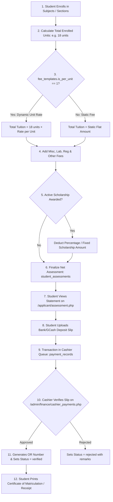

# Payment & Assessment Workflow

This workflow documents how the system dynamically evaluates tuition fees, applies scholarship discounts, processes online payment proof uploads, and enables cashier verification and official receipt generation.

---

## 1. Workflow Diagram

---

## 2. Dynamic Calculation Formula

$$\text{Gross Tuition} = \begin{cases} \sum(\text{Enrolled Subject Units}) \times \text{Template Rate}, & \text{if } \text{is\_per\_unit} = 1 \\ \text{Template Tuition Fee}, & \text{if } \text{is\_per\_unit} = 0 \end{cases}$$

$$\text{Gross Assessment} = \text{Gross Tuition} + \text{Registration Fee} + \text{Miscellaneous Fee} + \text{Laboratory Fee} + \text{Other Fees}$$

$$\text{Net Amount Payable} = \text{Gross Assessment} - \text{Scholarship Discount}$$

---

## 3. Step-by-Step Execution

### Step 1: Subject Enrollment & Assessment Generation
- Once an applicant selects their section in `/applicant/enroll.php`, the controller inserts rows into `college_enrollments` (or `shs_enrollments`).
- The system queries matching `fee_templates` for the student's program/strand and year level.
- Computes total enrolled units and inserts the finalized statement into `student_assessments`.

### Step 2: Student Statement Review & Proof Upload (`/applicant/assessment.php`)
- Displays itemized financial statement (e.g., `18 units @ ₱500.00/unit = ₱9,000.00`, plus Misc fees).
- If paying via Bank Transfer / Online, the student uploads their deposit slip / GCash screenshot via `POST /applicant/payment_process.php`.
- The upload is stored in `/uploads/payments/` and creates a `payment_records` row with `status = 'pending'`.

### Step 3: Cashier Review & Verification (`/admin/finance/cashier_payments.php`)
- Cashier accesses the payments ledger and clicks on pending transactions to inspect the uploaded payment slip in a modal viewer.
- Entering the Official Receipt (OR) Number and submitting verification updates `payment_records.status = 'verified'` and sets `verified_by` to the cashier's user ID.

### Step 4: Official Receipt & Matriculation Slip
- The student can immediately view and print their official payment receipt (`/admin/finance/cashier_receipt.php`) and Certificate of Matriculation (`/applicant/print_slip.php`).

---
**Related:**
- [[Finance]]
- [[Scholarship]]
- [[Applicant Portal]]
- [[Data Dictionary]]
