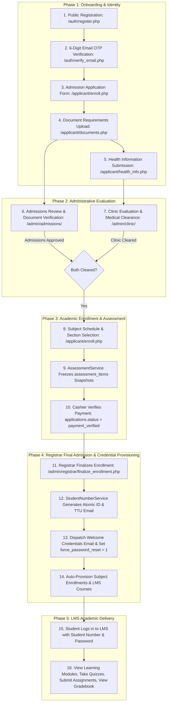

# Student Lifecycle Workflow

This document outlines the complete, end-to-end operational lifecycle of a student in the TTU Enrollment System and LMS, across all departments and roles.

---

## 1. Complete Student Lifecycle Map

---

## 2. Detailed Phase Breakdown

### Phase 1: Onboarding & Identity
- **Actor:** Public User $\rightarrow$ `applicant`.
- **Key Actions:** Account registration, 6-digit email OTP verification, demographic form submission, scanned document upload (PSA, Form 137), and health history declaration.

### Phase 2: Administrative Evaluation
- **Actors:** Admissions Officers (`admissions`), Clinic Officers (`clinic`).
- **Key Actions:** Admissions inspects uploaded certificate files and application data; Clinic reviews health conditions and emergency contacts. Both clearances are tracked in database records (`applications.status`, `health_records.status`).

### Phase 3: Academic Enrollment & Assessment
- **Actors:** Applicant, Cashiers (`cashier`), Scholarship Officers (`scholarship`).
- **Key Actions:** Applicant selects timetable sections from available curriculum offerings; system calculates tuition dynamically using enrolled units $\times$ rate per unit; optional scholarship discounts are applied; applicant uploads bank payment proof; cashier verifies payment and issues official receipt.

### Phase 4: Final Admission & LMS Provisioning
- **Actors:** Admissions, Background Mailer Service.
- **Key Actions:** Admissions marks enrollment as finalized; system generates official Student Number (`YYYY-XXXXXX`), sets up institutional TTU email, dispatches welcome credentials email, and auto-provisions active course records in `lms_courses`.

### Phase 5: LMS Academic Delivery
- **Actors:** Enrolled Student (`applicant` / `student`), Faculty Instructors (`faculty`).
- **Key Actions:** Student logs into LMS via Student Number; accesses lecture modules; participates in timed quizzes; uploads assignment submissions; views real-time attendance and gradebook records.

---
**Related:**
- [[Applicant Registration Workflow]]
- [[Health Submission & Clearance Workflow]]
- [[Payment & Assessment Workflow]]
- [[LMS]]
- [[Module Index]]
