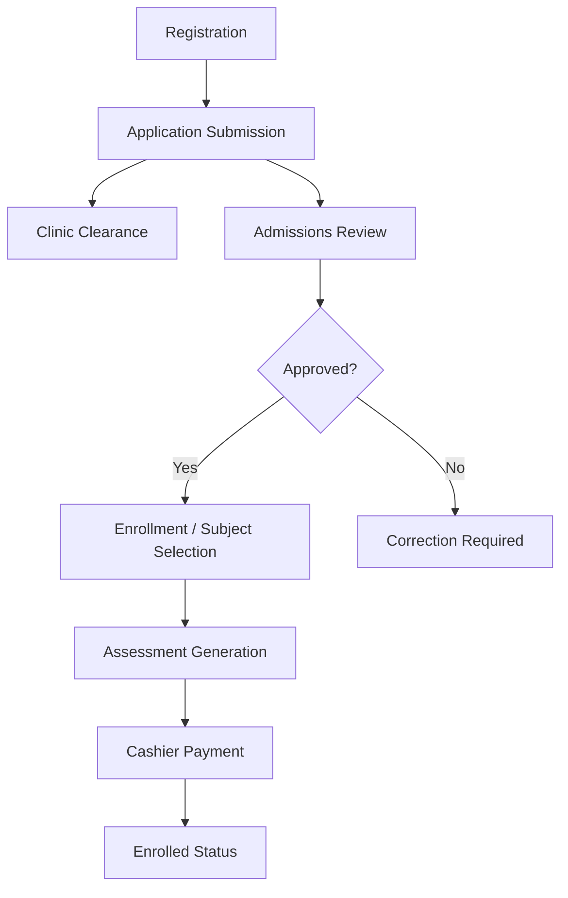

# Workflow Index

Understanding how data moves through the TTU system is critical. Below are the primary workflows, representing the lifecycle of a student from registration to full enrollment.

## Core Workflows
1. **[[Applicant Registration Workflow]]**: Account creation and login.
2. **[[Application Review Workflow]]**: Submitting data and admissions evaluation.
3. **[[Enrollment and Scheduling Workflow]]**: Selecting subjects, matching sections based on the [[Curriculum Architecture]].
4. **[[Assessment and Payment Workflow]]**: Generating fees via templates and cashier receipting.

## Diagram Overview

## Related
- [[Business Rules]]
- [[Database Overview]]
