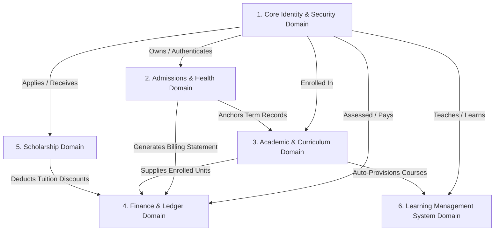
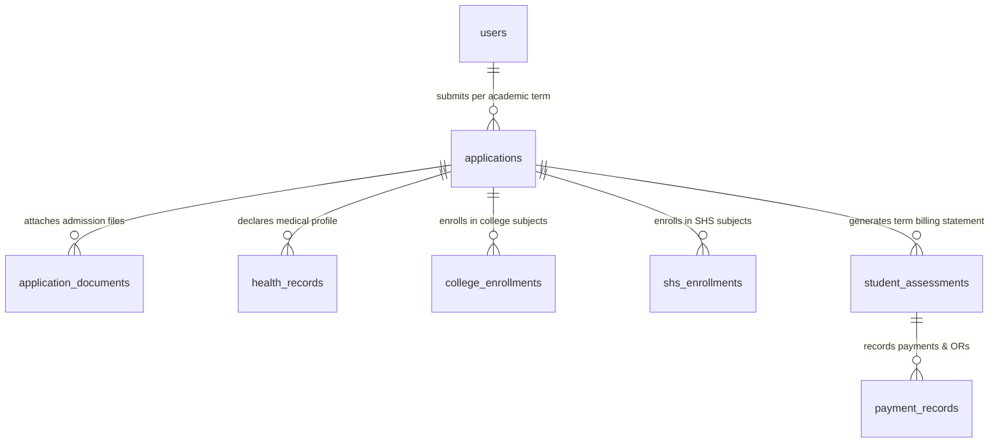
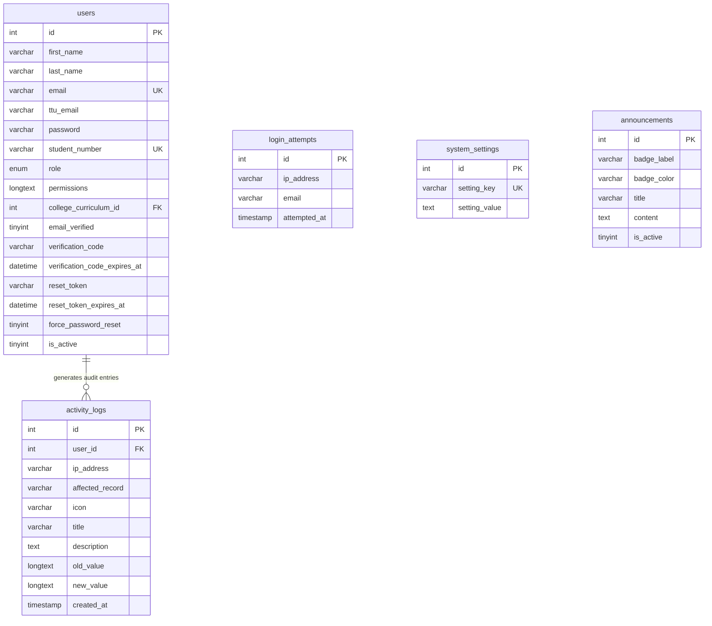
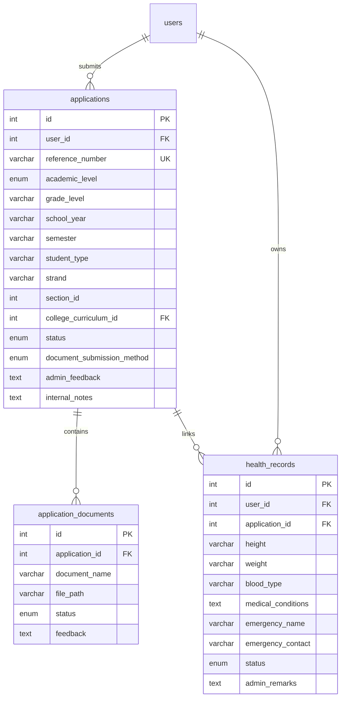
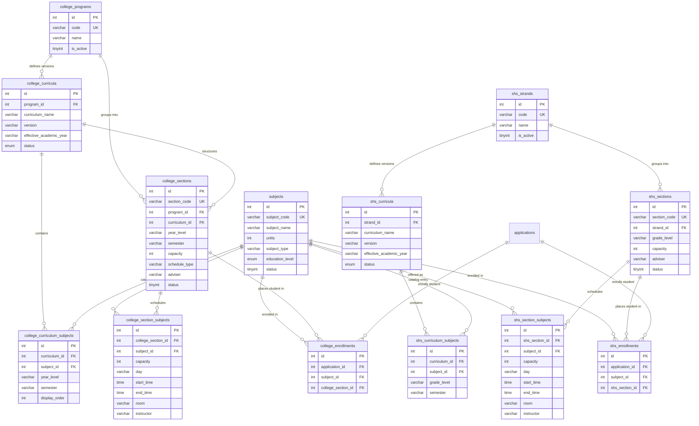
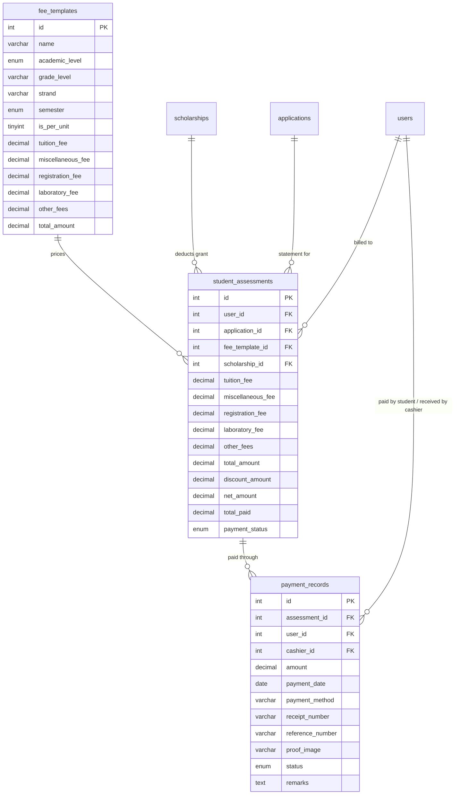
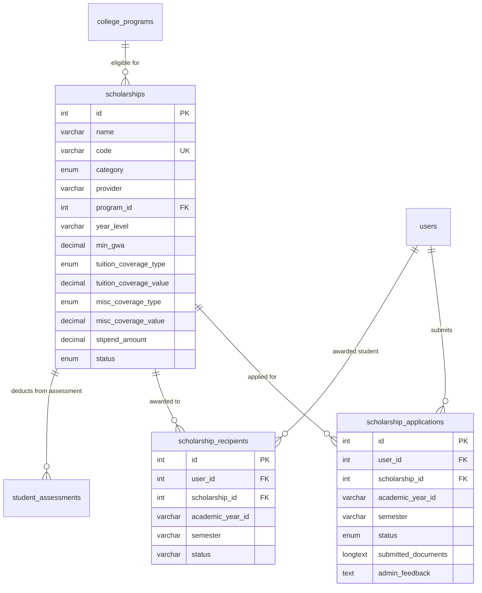
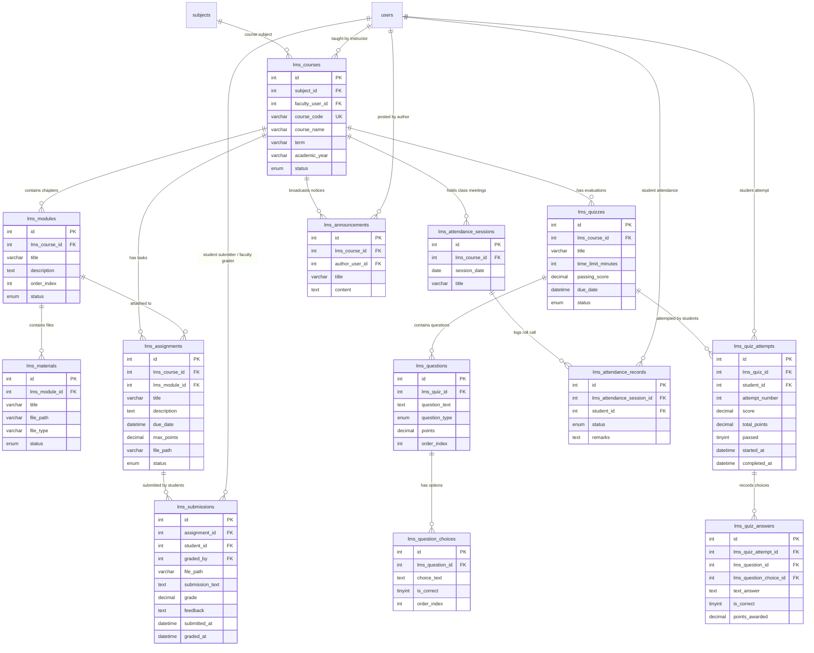

# Entity Relationship Architecture & Data Models

This document provides a comprehensive visual and relational specification of the **Triple T University (TTU)** database (`sia`). It maps the entity-relationship topology across all functional domains, documents relationship cardinalities and foreign keys, explores the central **"Application as Term"** architecture, and details cross-domain data contracts.

---

## 1. High-Level System Domain Topology

The TTU relational schema is organized into 6 interconnected functional domains centered around the **Identity (`users`)** and **Application (`applications`)** hub:



---

## 2. The "Application as Term" Relational Paradigm

The central architectural tenet of the TTU database is: **There is no separate `students` table**.



### Relational Flow
1. **User Identity (`users`)**: Represents all human actors (`applicant`, `student`, `faculty`, `admissions`, `cashier`, `clinic`, `scheduler`, `admin`, `superadmin`).
2. **Term Application (`applications`)**: Represents an applicant's attempt or an enrolled student's registration for a specific academic school year and semester.
3. **Term-Bound Subsystems**:
   - **Academic Enrollments**: `college_enrollments` / `shs_enrollments` link active subjects directly to `applications.id`.
   - **Financial Ledger**: `student_assessments` links the term's billing statement to `applications.id`.
   - **Medical Clearance**: `health_records` connects health declarations to `applications.id`.
4. **Student State Transition**: An applicant becomes an active enrolled student when `applications.status = 'enrolled'` and `users.student_number` is populated (`YYYY-XXXXXX`).

---

## 3. Domain-Level Entity Relationship Diagrams

### 3.1 Core Identity & Security Domain



---

### 3.2 Admissions & Health Domain



---

### 3.3 Academic & Curriculum Domain (College & SHS)



---

### 3.4 Finance, Cashier & Ledger Domain



---

### 3.5 Scholarship Domain



---

### 3.6 Learning Management System (LMS) Domain



---

## 4. Key Relationships & Foreign Key Reference

| Parent Table | Child Table | Cardinality | Foreign Key Constraint | Action on Delete | Business Meaning |
|---|---|:---:|---|---|---|
| `users` | `applications` | $1 : N$ | `applications.user_id` $\rightarrow$ `users.id` | `CASCADE` | Tracks all admission and term enrollment records for a person. |
| `applications` | `application_documents`| $1 : N$ | `application_documents.application_id` $\rightarrow$ `applications.id` | `CASCADE` | Digital admission requirement files (PSA, Form 137, Good Moral). |
| `applications` | `health_records` | $1 : 1$ | `health_records.application_id` $\rightarrow$ `applications.id` | `CASCADE` | Medical history declarations and clinic clearance status. |
| `college_programs`| `college_curricula` | $1 : N$ | `college_curricula.program_id` $\rightarrow$ `college_programs.id` | `CASCADE` | Versioned curriculum blueprints under a degree program. |
| `college_curricula`| `college_curriculum_subjects` | $1 : N$ | `college_curriculum_subjects.curriculum_id` $\rightarrow$ `college_curricula.id` | `CASCADE` | Maps subjects to specific year levels and semesters. |
| `college_sections`| `college_section_subjects` | $1 : N$ | `college_section_subjects.college_section_id` $\rightarrow$ `college_sections.id` | `CASCADE` | Timetable schedule slots (day, time, room, instructor) per section block. |
| `applications` | `college_enrollments` | $1 : N$ | `college_enrollments.application_id` $\rightarrow$ `applications.id` | `CASCADE` | Official bridge table assigning college subjects to enrolled students. |
| `shs_strands` | `shs_curricula` | $1 : N$ | `shs_curricula.strand_id` $\rightarrow$ `shs_strands.id` | `CASCADE` | Versioned curriculum blueprints for Senior High School strands. |
| `shs_sections` | `shs_enrollments` | $1 : N$ | `shs_enrollments.shs_section_id` $\rightarrow$ `shs_sections.id` | `CASCADE` | Official bridge table assigning SHS subjects to enrolled students. |
| `fee_templates` | `student_assessments` | $1 : N$ | `student_assessments.fee_template_id` $\rightarrow$ `fee_templates.id` | `SET NULL` | Pricing template used to compute student tuition and misc fees. |
| `student_assessments`| `payment_records`| $1 : N$ | `payment_records.assessment_id` $\rightarrow$ `student_assessments.id` | `CASCADE` | Over-the-counter payments and bank transfer proof transactions. |
| `scholarships` | `scholarship_recipients`| $1 : N$ | `scholarship_recipients.scholarship_id` $\rightarrow$ `scholarships.id` | `CASCADE` | Active student grantees receiving financial deductions. |
| `subjects` | `lms_courses` | $1 : N$ | `lms_courses.subject_id` $\rightarrow$ `subjects.id` | `CASCADE` | Active LMS course provision instances for enrolled subjects. |
| `lms_courses` | `lms_modules` | $1 : N$ | `lms_modules.lms_course_id` $\rightarrow$ `lms_courses.id` | `CASCADE` | Weekly learning modules and syllabus units. |
| `lms_modules` | `lms_materials` | $1 : N$ | `lms_materials.lms_module_id` $\rightarrow$ `lms_modules.id` | `CASCADE` | Downloadable lecture files, PDFs, and learning assets. |
| `lms_courses` | `lms_assignments` | $1 : N$ | `lms_assignments.lms_course_id` $\rightarrow$ `lms_courses.id` | `CASCADE` | Graded tasks, instructions, and due dates. |
| `lms_assignments` | `lms_submissions` | $1 : N$ | `lms_submissions.assignment_id` $\rightarrow$ `lms_assignments.id` | `CASCADE` | Student file uploads, grades, and faculty feedback. |
| `lms_courses` | `lms_quizzes` | $1 : N$ | `lms_quizzes.lms_course_id` $\rightarrow$ `lms_courses.id` | `CASCADE` | Timed evaluation assessments. |
| `lms_quizzes` | `lms_questions` | $1 : N$ | `lms_questions.lms_quiz_id` $\rightarrow$ `lms_quizzes.id` | `CASCADE` | Question bank items (Multiple Choice, True/False, Essay). |
| `lms_questions` | `lms_question_choices` | $1 : N$ | `lms_question_choices.lms_question_id` $\rightarrow$ `lms_questions.id` | `CASCADE` | Multiple choice option texts and `is_correct` answer flags. |
| `lms_quizzes` | `lms_quiz_attempts` | $1 : N$ | `lms_quiz_attempts.lms_quiz_id` $\rightarrow$ `lms_quizzes.id` | `CASCADE` | Timed student exam attempts and final scores. |
| `lms_courses` | `lms_attendance_sessions`| $1 : N$ | `lms_attendance_sessions.lms_course_id` $\rightarrow$ `lms_courses.id` | `CASCADE` | Class meeting date logs. |
| `lms_attendance_sessions`| `lms_attendance_records`| $1 : N$ | `lms_attendance_records.lms_attendance_session_id` $\rightarrow$ `lms_attendance_sessions.id` | `CASCADE` | Individual student roll-call status (`present`, `late`, `absent`, `excused`). |

---

## 5. Cross-Domain Indirect & Polymorphic Bridges

Certain key interactions in the application are polymorphic or indirect:

### 1. Dynamic LMS Course Discovery (Polymorphic Bridge)
- `college_enrollments` connects to `applications` $\rightarrow$ `subjects` $\rightarrow$ `college_sections`.
- `shs_enrollments` connects to `applications` $\rightarrow$ `subjects` $\rightarrow$ `shs_sections`.
- **Indirect Bridge:** The LMS does not have a static student enrollment table; `CollegeEnrollmentRepository` and `ShsEnrollmentRepository` query these enrollment bridge tables and dynamically resolve `lms_courses.id` where `applications.status = 'enrolled'`.

### 2. Tuition Rate per Unit Calculation (Indirect Aggregation)
- `student_assessments` references `fee_templates`.
- When `fee_templates.is_per_unit = 1`, the controller computes:
  $$\text{Total Tuition} = \left(\sum \text{subjects.units} \text{ from } \text{college\_enrollments}\right) \times \text{fee\_templates.tuition\_fee}$$
- The calculation is computed on-the-fly in PHP before persisting to `student_assessments`.

---

## 6. Legacy & Uncertain Entities Investigation

### Status of `student_scholarships` Table

```text
Table Name: student_scholarships
Columns: id, assessment_id, scholarship_id, academic_year, semester, created_at, updated_at
Foreign Keys:
  - fk_student_scholarships_assessment (assessment_id -> student_assessments.id)
  - fk_student_scholarships_scholarship (scholarship_id -> scholarships.id)
```

#### Codebase Evidence & Audit Finding:
1. **Grep Search in Executable Code (`app/`)**:
   - `student_scholarships` is **NOT referenced in any active PHP Controller, Model, Service, Repository, or View**.
2. **Active Implementation**:
   - Active scholarship grants are stored in **`scholarship_recipients`** (`ScholarshipController.php:257-270`) and tracked via **`scholarship_applications`**.
   - Active discounts are stored directly as a foreign key on **`student_assessments.scholarship_id`**.
3. **Classification**:
   - **CONFIRMED LEGACY / SUPERSEDED ARTIFACT**: `student_scholarships` was the early association table in early prototypes, superseded by `scholarship_recipients` during the financial refactoring. It remains present in `schema_dump.sql` to prevent breaking legacy installations, but is not used in active execution.

---

## 7. Database View: `student_academic_records_view`

The active MariaDB database includes a pre-compiled database View:
```sql
CREATE VIEW student_academic_records_view AS
SELECT 
    u.id AS user_id,
    u.student_number,
    u.first_name,
    u.last_name,
    u.email,
    u.ttu_email,
    a.id AS application_id,
    a.reference_number,
    a.academic_level,
    a.grade_level,
    a.strand,
    a.status AS enrollment_status,
    sec.section_code,
    (SELECT SUM(s.units) 
     FROM college_enrollments ce 
     JOIN subjects s ON ce.subject_id = s.id 
     WHERE ce.application_id = a.id) AS total_enrolled_units
FROM users u
JOIN applications a ON u.id = a.user_id
LEFT JOIN college_sections sec ON a.section_id = sec.id;
```
**Purpose**: Synthesizes student demographic, enrollment state, section codes, and unit calculations for reporting controllers (`ReportController.php`, `RegistrarController.php`).

---
**Related Documentation:**
- [[Database Overview]]
- [[Data Dictionary]]
- [[Users Table]]
- [[Applications Table]]
- [[16 - Page Relationships/02 - Cross-Module Data Flow & Table Sharing]]
- [[02 - Modules/LMS_Database_Architecture]]
