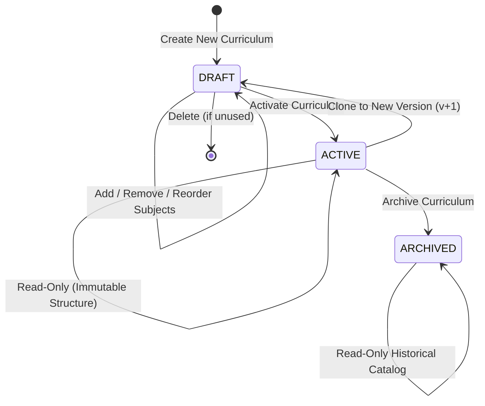

# Curriculum Architecture & Lifecycle

The TTU System maintains parallel curriculum hierarchies for **College** and **Senior High School (SHS)** to accommodate distinct institutional structures, grading units, and subject prerequisites while guaranteeing historical integrity and immutability.

---

## 1. Academic Tier Structures

```mermaid
flowchart TD
    subgraph College Hierarchy
        CP[College Program: college_programs] --> CC[College Curriculum Version: college_curricula]
        CC --> CCS[Curriculum Subjects: college_curriculum_subjects]
        CCS --> S1[Universal Subjects Catalog: subjects]
        CCS --> CSEC[College Sections: college_sections]
        CSEC --> CSS[Section Subjects & Schedules: college_section_subjects]
        CSS --> CE[College Enrollments: college_enrollments]
    end

    subgraph Senior High School Hierarchy
        SS[SHS Strand: shs_strands] --> SC[SHS Curriculum Version: shs_curricula]
        SC --> SCS[Curriculum Subjects: shs_curriculum_subjects]
        SCS --> S2[Universal Subjects Catalog: subjects]
        SCS --> SSEC[SHS Sections: shs_sections]
        SSEC --> SSS[Section Subjects & Schedules: shs_section_subjects]
        SSS --> SE[SHS Enrollments: shs_enrollments]
    end
```

---

## 2. Curriculum Lifecycle States

Both College and Senior High School curricula follow a strict 3-state lifecycle machine:

### State Rules & Permissions:

| Lifecycle State | Structural Editing (Add/Remove/Move Subjects) | Metadata Editing | Deletion | Clone to New Draft | Activation / Transition |
|---|---|---|---|---|---|
| **`draft`** | **Allowed** (Subject mapping, year/grade level, semester, display order) | **Allowed** (Curriculum name, effective academic year) | **Allowed** (Only if no sections or enrollments exist) | N/A | Can be transitioned to `active` |
| **`active`** | **BLOCKED** (Strictly Immutable) | **Restricted** (Cannot alter program/strand or code) | **BLOCKED** (Strictly protected from deletion) | **Allowed** (Creates new draft version with cloned subjects) | Can be transitioned to `archived` |
| **`archived`** | **BLOCKED** (Read-Only) | **BLOCKED** (Read-Only) | **BLOCKED** (Historical preservation) | **Allowed** (Can branch new draft version) | Final lifecycle state |

---

## 3. Immutability Enforcement & Clone Versioning

1. **Version Isolation:**
   - Active and archived curricula can NEVER have subjects added, removed, or reordered.
   - When academic programs update requirements, administrators must use **Clone to Draft**, which creates Version $N+1$ in `draft` state while preserving Version $N$ intact.
2. **Subject Reordering (`display_order`):**
   - Both `college_curriculum_subjects` and `shs_curriculum_subjects` contain a `display_order INT DEFAULT 0` column.
   - Reordering subjects is permitted exclusively in `draft` status and is rejected by controllers when the curriculum is `active` or `archived`.
3. **Application & Enrollment Anchoring:**
   - Applicant and student enrollment records reference the specific curriculum ID they entered under (`applications.curriculum_id` / `college_sections.curriculum_id`).
   - Historical students remain pinned to their initial entry catalog, while incoming cohorts follow newly activated revisions.

---

## 4. Downstream Integrations

- **Scheduler Module:** Auto-syncs subjects from the active section curriculum into `college_section_subjects` / `shs_section_subjects`.
- **Learning Management System (LMS):** Section enrollments resolve curriculum subject metadata, dynamically generating `lms_courses` and provisioning course rosters.
- **Finance Module:** Assessment calculations read curriculum unit configurations to compute tuition fees safely without mutating settled historical balances.

---
**Related:**
- [[Subject Catalog Immutability Architecture]]
- [[Registrar]]
- [[Scheduler]]
- [[LMS]]
- [[ADR-005 Curriculum Versioning and Subject Catalog Immutability]]
