# Curriculum Architecture

The TTU System maintains parallel curriculum hierarchies for **College** and **Senior High School (SHS)** to accommodate distinct institutional structures, grading units, and subject prerequisites while preserving historical versioning.

---

## 1. Academic Tier Structures

```mermaid
flowchart TD
    subgraph College Hierarchy
        CP[College Program: college_programs] --> CC[College Curriculum Version: college_curricula]
        CC --> CCS[Curriculum Subjects: college_curriculum_subjects]
        CCS --> S1[Universal Subjects Catalog: subjects]
        CCS --> CSEC[College Sections: college_sections]
        CSEC --> CSS[Section Subjects & Schedules: college_section_subjects]
        CSS --> CE[College Enrollments: college_enrollments]
    end

    subgraph Senior High School Hierarchy
        SS[SHS Strand: shs_strands] --> SC[SHS Curriculum Version: shs_curricula]
        SC --> SCS[Curriculum Subjects: shs_curriculum_subjects]
        SCS --> S2[Universal Subjects Catalog: subjects]
        SCS --> SSEC[SHS Sections: shs_sections]
        SSEC --> SSS[Section Subjects & Schedules: shs_section_subjects]
        SSS --> SE[SHS Enrollments: shs_enrollments]
    end
```

---

## 2. Versioning & Curriculum Immutability
1. **Application Anchoring:** An applicant's row in `applications` references a specific `college_curriculum_id` or `curriculum_id` (for SHS).
2. **Coexistence of Versions:**
   - Multiple versions of a curriculum (e.g. `BSIT 2021 Curriculum` and `BSIT 2024 Revised`) coexist simultaneously.
   - 4th-year students remain pinned to their initial entry catalog, while incoming 1st-year students follow the updated catalog.
3. **Immutability Enforcement:**
   - Once students are enrolled against a curriculum version, the curriculum is treated as **immutable**.
   - Any curriculum revisions must be published as a **new curriculum record** rather than modifying existing enrolled subjects.

---

## 3. LMS Auto-Provisioning Integration
Curriculum subjects and section timetables directly power the Learning Management System:
- When a student enrolls in sections, `CollegeEnrollmentRepository` / `ShsEnrollmentRepository` resolve the associated `subject_id` and section adviser (`adviser`), automatically provisioning `lms_courses` records so that students see their courses immediately on their LMS dashboard.

---
**Related:**
- [[Registrar]]
- [[Scheduler]]
- [[LMS]]
- [[Database Overview]]
