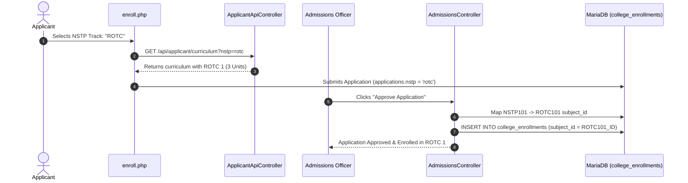

# National Service Training Program (NSTP) Architecture

This document specifies the technical implementation, database modeling, curriculum linkages, section scheduling, and admissions approval workflows for the **National Service Training Program (NSTP)** in compliance with Philippine Republic Act No. 9163 (RA 9163).

---

## 1. Statutory Compliance (RA 9163)

Under RA 9163, all tertiary-level students enrolled in baccalaureate degree programs must complete **two (2) semesters** of NSTP:
- **NSTP 1** (3 units): 1st Year, 1st Semester
- **NSTP 2** (3 units): 1st Year, 2nd Semester
- **Total Units:** 6 academic units required for graduation.

Students select one of three authorized program components (tracks):
1. **CWTS (Civic Welfare Training Service):** Programs/activities contributory to general welfare and community livelihood development.
2. **ROTC (Reserve Officers' Training Corps):** Military training providing defense preparedness and leadership.
3. **LTS (Literacy Training Service):** Training students to teach literacy and numeracy skills to children and out-of-school youth.

---

## 2. Database Catalog Structure

### Subject Catalog Registration (`subjects` table)
The system registers general placeholder subjects along with track-specific subjects in the `subjects` master catalog (`education_level = 'College'`, `subject_type = 'NSTP'`, `status = 'active'`):

| Subject Code | Subject Title | Units | Lecture | Lab | Component Track |
|---|---|---|---|---|---|
| `NSTP101` | National Service Training Program 1 | 3.00 | 3 | 0 | General / Curriculum Placeholder (Sem 1) |
| `NSTP102` | National Service Training Program 2 | 3.00 | 3 | 0 | General / Curriculum Placeholder (Sem 2) |
| `CWTS101` | Civic Welfare Training Service 1 | 3.00 | 3 | 0 | CWTS Track (1st Sem) |
| `CWTS102` | Civic Welfare Training Service 2 | 3.00 | 3 | 0 | CWTS Track (2nd Sem) |
| `ROTC101` | Reserve Officers' Training Corps 1 | 3.00 | 3 | 0 | ROTC Track (1st Sem) |
| `ROTC102` | Reserve Officers' Training Corps 2 | 3.00 | 3 | 0 | ROTC Track (2nd Sem) |
| `LTS101` | Literacy Training Service 1 | 3.00 | 3 | 0 | LTS Track (1st Sem) |
| `LTS102` | Literacy Training Service 2 | 3.00 | 3 | 0 | LTS Track (2nd Sem) |

### Curriculum Association (`curriculum_subjects` table)
All degree curricula (e.g. BSIT 2026, BSCS 2026) bind the base `NSTP101` code to Year 1, Semester 1, ensuring all degree programs calculate full required units (12.0 units total in 1st Sem).

### Section Scheduling (`schedule` & `sections` tables)
Section schedules (e.g. `BSIT 1-A`, `BSCS 1-A`) include Saturday physical training sessions:
- **Day:** Saturday
- **Time:** 8:00 AM – 11:00 AM (3 hours)
- **Room / Venue:** Quadrangle / University Gymnasium

---

## 3. Dynamic Applicant Selection & Live Preview

### Applicant Enrollment Form (`/applicant/enroll.php`)
- Applicants specify their preferred NSTP track (`cwts`, `rotc`, or `lts`) via a dropdown in Step 1 (Academic Details).
- When the applicant changes their track, `enroll.php` invokes:
  `GET /sia/api/applicant/curriculum?curriculum_id={id}&year=1&semester=1&nstp={cwts|rotc|lts}`

### Live Curriculum API Transformation (`ApplicantApiController.php`)
In `getCurriculum()` and `getFullCurriculum()`:
```php
if ($sub['subject_type'] === 'NSTP' || strpos($code, 'NSTP') !== false) {
    if ($nstpChoice === 'rotc') {
        $sub['subject_code'] = 'ROTC 1 (NSTP 1)';
        $sub['subject_title'] = 'Reserve Officers\' Training Corps 1';
    } elseif ($nstpChoice === 'lts') {
        $sub['subject_code'] = 'LTS 1 (NSTP 1)';
        $sub['subject_title'] = 'Literacy Training Service 1';
    } else {
        $sub['subject_code'] = 'CWTS 1 (NSTP 1)';
        $sub['subject_title'] = 'Civic Welfare Training Service 1';
    }
}
```

---

## 4. Admissions Approval & Modular Subject Mapping

When an Admissions Officer approves an applicant on `/admin/admissions/application_detail.php`:
1. `AdmissionsController@approve` fetches the applicant's chosen track from `applications.nstp` (defaulting to `'cwts'`).
2. If the curriculum contains a general `NSTP` subject ID, the system queries the `subjects` table for the corresponding track subject code (e.g., `CWTS101`, `ROTC101`, `LTS101`).
3. The track-specific subject ID is inserted into `college_enrollments`, ensuring the student's official study load and grades reflect the exact NSTP track chosen.



---
**Related:**
- [[Curriculum Architecture]]
- [[Subject Catalog Immutability Architecture]]
- [[ADR-005 Curriculum Versioning and Subject Catalog Immutability]]
- [[ADR-007 NSTP Modular Curriculum Integration]]
