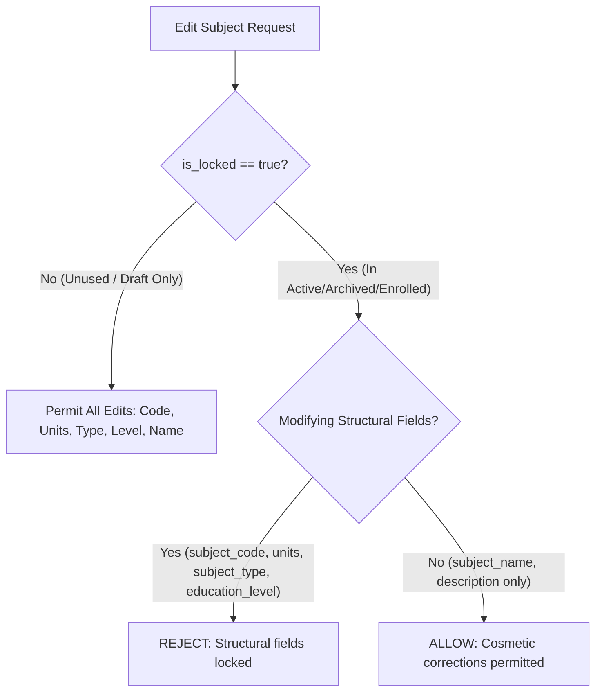

# Subject Catalog Immutability & Historical Data Protection

**Module:** [[Registrar]] / [[Curriculum Architecture]]  
**Primary Controller:** [`SubjectController.php`](file:///c:/xampp/htdocs/sia/app/Controllers/Admin/Registrar/SubjectController.php)  
**Database Table:** `subjects`

---

## 1. Overview & Context

The TTU System utilizes a single shared `subjects` table serving multiple downstream subsystems:
1. **College Curricula** (`college_curriculum_subjects`)
2. **Senior High School Curricula** (`shs_curriculum_subjects`)
3. **College Timetable Schedules** (`college_section_subjects`)
4. **SHS Timetable Schedules** (`shs_section_subjects`)
5. **College Student Enrollments & Academic Records** (`college_enrollments`)
6. **SHS Student Enrollments & Academic Records** (`shs_enrollments`)
7. **LMS Course Instances** (`lms_courses`)

To ensure that historical transcripts, past financial assessments, and academic credits are **never corrupted by downstream changes**, the Subject Catalog enforces strict database and controller-level immutability rules.

---

## 2. Foreign Key Hardening (`ON DELETE RESTRICT`)

All 7 foreign keys pointing to `subjects.id` have been migrated from `ON DELETE CASCADE` to **`ON DELETE RESTRICT`**:

| Foreign Key Name | Child Table | Constraint Action |
|---|---|---|
| `college_curriculum_subs_ibfk_2` | `college_curriculum_subjects` | `ON DELETE RESTRICT` |
| `shs_curriculum_subs_ibfk_2` | `shs_curriculum_subjects` | `ON DELETE RESTRICT` |
| `college_section_subjects_ibfk_2` | `college_section_subjects` | `ON DELETE RESTRICT` |
| `shs_section_subjects_ibfk_2` | `shs_section_subjects` | `ON DELETE RESTRICT` |
| `college_enrollments_ibfk_2` | `college_enrollments` | `ON DELETE RESTRICT` |
| `shs_enrollments_ibfk_2` | `shs_enrollments` | `ON DELETE RESTRICT` |
| `fk_lms_course_subject` | `lms_courses` | `ON DELETE RESTRICT` |

> [!IMPORTANT]
> A raw `DELETE FROM subjects WHERE id = ?` on any subject referenced by curricula, sections, enrollments, or LMS courses will be physically rejected by MySQL.

---

## 3. Usage Detection & Immutability Matrix

The `SubjectController::getSubjectUsageDetails(PDO $pdo, int $subjectId)` method computes real-time dependency metrics across all 7 consuming tables:

- `draft_curricula`: Count of associations in draft curricula.
- `active_curricula`: Count of associations in active curricula.
- `archived_curricula`: Count of associations in archived curricula.
- `section_schedules`: Count of section timetable slots.
- `enrollments`: Count of actual student enrollment records.
- `lms_courses`: Count of provisioned LMS course offerings.
- `total_usage`: Aggregated sum across all consumers.
- `is_locked`: `true` if `(active_curricula + archived_curricula + section_schedules + enrollments + lms_courses) > 0`.

### Field Mutation Rules:

| Subject State | Structural Fields (`subject_code`, `units`, `subject_type`, `education_level`) | Cosmetic Fields (`subject_name`, `description`) | Physical Deletion | Status Deactivation (`status = 0`) |
|---|---|---|---|---|
| **Unused / Draft-Only** | **Editable** | **Editable** | **Allowed** | **Allowed** |
| **Referenced (Active/Archived/Enrolled/LMS)** | **LOCKED (Read-Only)** | **Editable** (Typo corrections allowed) | **BLOCKED** | **Allowed** (Soft Retirement) |

---

## 4. Subject Lifecycle & Non-Destructive Retirement

Instead of destructive physical deletions, the system uses the `subjects.status` flag:
- **`status = 1` (Active):** Visible across all new curriculum builders, section builders, and search pickers.
- **`status = 0` (Inactive / Retired):**
  - Excluded from all **NEW** curriculum builders (`WHERE status = 1`).
  - **Preserved 100% intact** in all existing curricula, historical enrollments, student transcripts, and LMS course archives.
  - Can be reactivated at any time by administrators via `SubjectController::toggle_status`.

---

## 5. Financial Snapshot Protection

In [`FinanceController.php`](file:///c:/xampp/htdocs/sia/app/Controllers/Admin/Finance/FinanceController.php), dynamic assessment auto-synchronization is strictly limited to:
$$\text{payment\_status} \equiv \text{'unpaid'} \quad \text{AND} \quad \text{total\_paid} \equiv 0.00$$

Paid, partially paid, or settled assessments are treated as **immutable historical financial snapshots** and are never modified by curriculum or subject changes.

---
**Related:**
- [[Curriculum Architecture]]
- [[Registrar]]
- [[Finance]]
- [[ADR-005 Curriculum Versioning and Subject Catalog Immutability]]
