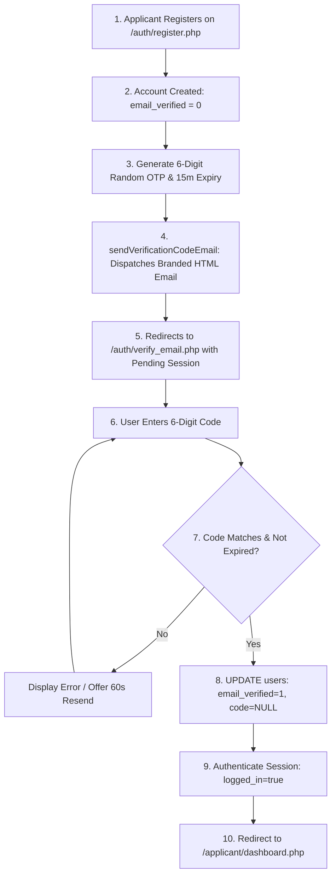

# Authentication & Email Verification

This document specifies the end-to-end authentication lifecycle, 6-digit OTP email verification gating, and multi-portal role-based access control.

---

## 1. Authentication Lifecycle



---

## 2. Technical Implementation Details

### Database Schema Updates (`users`)
- `email_verified` (TINYINT(1), DEFAULT 1): `0` for new applicants; `1` for verified accounts.
- `verification_code` (VARCHAR(10), NULL): Stores the active 6-digit code.
- `verification_expires_at` (DATETIME, NULL): Expiration timestamp (15 minutes).

### 6-Digit OTP Generation & Expiry
```php
$code = sprintf('%06d', random_int(100000, 999999));
$stmt = $pdo->prepare('
    INSERT INTO users (first_name, last_name, email, password, role, is_active, email_verified, verification_code, verification_expires_at) 
    VALUES (?, ?, ?, ?, ?, ?, 0, ?, DATE_ADD(NOW(), INTERVAL 15 MINUTE))
');
```

### Verification Interface (`/auth/verify_email.php`)
- **Interactive OTP Input:** 6 individual digit boxes with auto-advance, backspace navigation, and clipboard paste distribution.
- **Resend Cooldown:** 60-second JavaScript timer and backend cooldown check.
- **Change Email Option:** Allows the user to restart registration if an incorrect email was provided.

### Login Interception Gating
In `AuthController::login`:
- If an applicant authenticates with valid password but `email_verified === 0`:
  1. Login is blocked.
  2. A fresh 6-digit OTP is generated.
  3. A new verification email is dispatched.
  4. The applicant is redirected to `/auth/verify_email.php`.

---

## 3. Multi-Portal Authentication Endpoints

| Portal | Login Route | Auth Controller & Action | Allowed Credentials | Post-Login Landing |
|---|---|---|---|---|
| **Admissions & Admin** | `/auth/login.php` | `AuthController@login` | Email & Password | `/admin/dashboard.php` |
| **Applicant Portal** | `/auth/login.php` | `AuthController@login` | Email & Password (must be verified) | `/applicant/dashboard.php` |
| **Student LMS** | `/auth/lms_student_login.php` | `LmsAuthController@loginProcess` | **Student Number** (`YYYY-XXXXXX`) & Unified Password | `/lms/student/dashboard.php` |
| **Faculty LMS** | `/auth/lms_faculty_login.php` | `LmsAuthController@loginProcess` | **Faculty Employee ID** & Unified Password | `/lms/faculty/dashboard.php` |

---

## 4. Dedicated Sign-out Endpoints
- **Student LMS Logout:** `/auth/lms_student_logout.php` (or `/lms/student/logout`) $\rightarrow$ redirects to `/auth/lms_student_login.php`.
- **Faculty LMS Logout:** `/auth/lms_faculty_logout.php` (or `/lms/faculty/logout`) $\rightarrow$ redirects to `/auth/lms_faculty_login.php`.
- **General Logout:** `/auth/logout.php` $\rightarrow$ smart detector redirects LMS users to their respective LMS portal and admins/applicants to `/auth/login.php`.

---
**Related:**
- [[Email & Notification System]]
- [[Applicant Registration Workflow]]
- [[Security Overview]]
- [[Users Table]]
