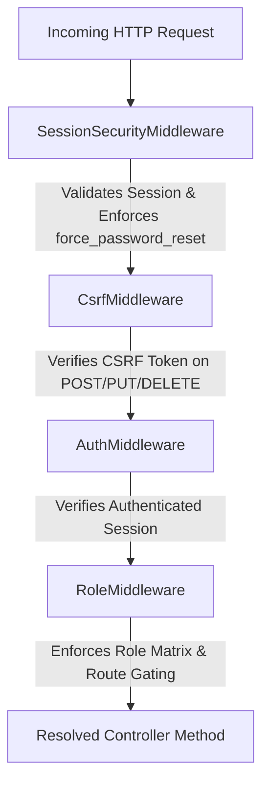

# Security Overview

The TTU Enrollment System implements a multi-layered security architecture across network routing, HTTP middleware, session management, input validation, and database parameterization.

---

## 1. Web Server & Firewall (`.htaccess`)
The Apache `.htaccess` configuration acts as the front firewall:
- **Directory Protection:** Blocks direct public HTTP access to `app/`, `config/`, `database/`, and `scratch/`.
- **Script Interception:** Rewrites all non-static file requests directly to the master Front Controller `public/index.php`.
- **Database Wipe Protection:** Completely blocks HTTP execution of database migration and setup scripts. `database/migrations/setup_database.php` additionally asserts `if (php_sapi_name() !== 'cli') { http_response_code(403); exit('Forbidden: CLI execution only.'); }`.
- **Directory Browsing:** Disables directory listings (`Options -Indexes`).

---

## 2. Middleware Security Pipeline
Every incoming request passing through `App\Core\Router` traverses an interceptor pipeline:

1. **`SessionSecurityMiddleware`**: Enforces secure cookie attributes (`HttpOnly`, `SameSite=Lax`, `Secure` when HTTPS), checks user-agent/IP consistency, regenerates session IDs upon state changes, and intercepts accounts with `force_password_reset = 1`, redirecting them to change password before granting portal access.
2. **`CsrfMiddleware`**: Generates cryptographic CSRF tokens stored in `$_SESSION['csrf_token']` and verifies all state-mutating requests (`POST`).
3. **`AuthMiddleware`**: Confirms valid login state (`$_SESSION['logged_in'] === true`).
4. **`RoleMiddleware`**: Enforces role requirements (`RoleMiddleware:admin`, `RoleMiddleware:applicant`, `RoleMiddleware:scheduler`).

---

## 3. Authentication & Privilege Defense
- **Password Storage:** Hashed using PHP's native `password_hash()` with `PASSWORD_DEFAULT` (Bcrypt, cost 10+).
- **Mandatory Password Rotation (`force_password_reset`):** Auto-generated credentials for enrolled students force an immediate password update upon first authentication.
- **Privilege Escalation Safeguards:** `SystemController::processUser` strictly asserts `$_SESSION['user_role'] === 'superadmin'` before permitting assignment or creation of `superadmin` user accounts.
- **OTP Verification Gating:** 6-digit random verification codes are generated via `random_int(100000, 999999)` with a 15-minute expiration timestamp. Unverified accounts (`email_verified = 0`) cannot bypass OTP validation.
- **Brute Force Protection:** Tracks failed login attempts in `login_attempts` table by IP and email, enforcing temporary lockout throttles.

---

## 4. SQL Injection Protection
- The entire application interacts with MariaDB via **PHP Data Objects (PDO)** using prepared statements with bound parameters (`?` or `:name`).
- Raw string concatenations from `$_POST`, `$_GET`, or user input inside SQL queries are strictly prohibited.

---

## 5. File Upload & Insecure Direct Object Reference (IDOR) Defenses
- **Upload Validation:** Validates MIME types, extensions, and maximum file sizes for documents and payment proofs.
- **LMS Downloads (`DownloadController`):** File materials (`lms_materials`) and submissions (`lms_submissions`) are delivered through controller actions that verify the requesting student is actively enrolled in the corresponding course.

---
**Related:**
- [[Authentication & Email Verification]]
- [[Email & Notification System]]
- [[System Architecture]]
