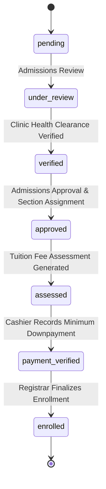

# ADR-008: Authoritative Enrollment State Machine and Cashier Decoupling

## Status
**Accepted**

## Date
2026-09-06

## Context
Historically, upon recording an initial tuition payment or verifying a student's online deposit slip, `FinanceController` directly modified the application record from `assessed` / `finance_verified` to `enrolled`. As part of this cashier-level execution, the cashier controller directly generated student numbers, provisioned institutional university emails, generated temporary login credentials, dispatched welcome emails, and enrolled the student into section subjects.

This design presented several critical institutional and architectural vulnerabilities:
1. **Separation of Duties Violation:** Cashier personnel possessed unilateral authority to officially confer matriculation and academic standing onto applicants, bypassing the Office of the Registrar.
2. **Clearance Bypass:** Applicants could be matriculated without mandatory clinic health clearance, documentary requirement verification, or registrar prerequisite evaluation.
3. **Concurrency Bottlenecks & Race Conditions:** Two cashiers accepting payments concurrently could trigger simultaneous enrollment routines, leading to duplicate student ID allocations or colliding user account provisions.

## Decision
We decoupled cashier financial verification from official academic enrollment and established the **Registrar as the sole institutional authority** for final matriculation:

1. **Decoupled Financial State (`payment_verified`):**
   - When a cashier records an over-the-counter payment or verifies an online bank deposit meeting or exceeding the downpayment threshold, `FinanceController` records the payment and transitions the application to `status = 'payment_verified'`.
   - The cashier workflow strictly handles fiscal accounting and issues the official receipt without mutating academic status or user identities.
2. **Admissions Clinic Medical Gate:**
   - In `AdmissionsController@process`, an application cannot be approved or advanced unless the applicant's clinic health record is marked `status = 'verified'` in `health_records`.
3. **Exclusive Registrar Finalization Gate:**
   - Introduced `RegistrarController::finalizeEnrollment()` and the secure endpoint `POST /admin/registrar/finalize_enrollment.php`.
   - The Registrar UI displays a dedicated **Pending Finalization Queue** filtering for applications in `payment_verified` status.
   - Upon Registrar review and approval, `EnrollmentService::finalizeEnrollment()` atomically transitions the application status to `enrolled`, generates the official student number, provisions the `@ttu.edu.ph` institutional email, sets `force_password_reset = 1`, dispatches the welcome email, and assigns section subjects.

## Consequences

### Positive
- **Strict Separation of Concerns:** Finance exclusively verifies transactions; Registrar exclusively confers matriculation and academic standing.
- **Institutional Compliance:** Medical and academic clearances must be fully satisfied prior to enrollment.
- **Audit Integrity:** Academic standing transitions are permanently logged under the Registrar's user identity in `activity_logs`.

### Trade-offs
- Requires a two-step post-payment workflow: Cashier receives funds $\rightarrow$ Registrar executes final matriculation check.
- Mitigated by providing the Registrar with a streamlined, batch-capable or single-click confirmation queue.

---
**Related:**
- [[Student Lifecycle Workflow]]
- [[Payment & Assessment Workflow]]
- [[Registrar]]
- [[Finance]]
- [[ADR-001 The Application as Term Concept]]
- [[ADR-010 Domain Service Layer Extraction and Atomic Sequences]]
