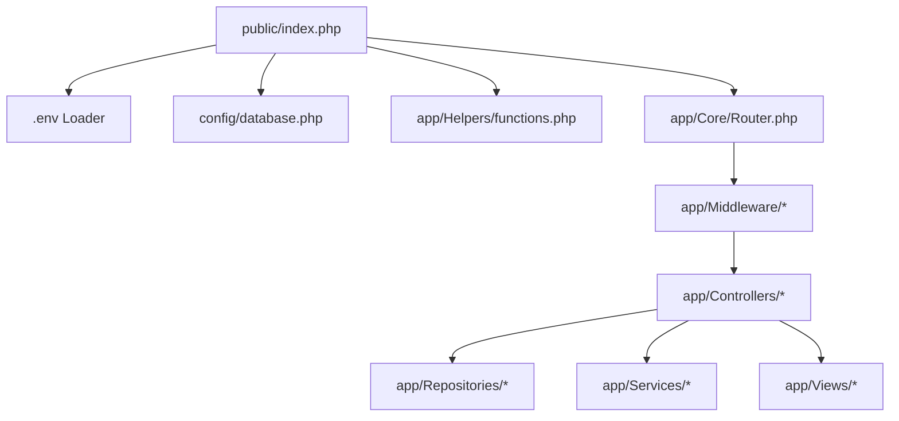

# Shared Dependencies & Blast Radius Impact Analysis

This document identifies the central shared components, libraries, and middleware pipelines across the TTU codebase. It documents **who uses each component** and the **system-wide blast radius** if any shared file is modified.

---

## 1. High-Impact Shared Files Inventory

---

## 2. Shared Component Breakdown

### 2.1 Global Helper Functions (`app/Helpers/functions.php`)
- **Role:** Master procedural utility library providing session management, authentication assertions, formatting, database wrappers, and PHPMailer email dispatchers.
- **Key Functions Provided:**
  - `getDbConnection()`: Returns singleton PDO instance with prepared statement emulation disabled.
  - `auth_user()`, `auth_check()`, `auth_role()`, `has_role()`: Session authentication helpers.
  - `formatDate()`, `formatCurrency()`, `sanitizeInput()`: Data formatting & security filters.
  - `generateReferenceNumber()`, `generateStudentNumber()`, `generateReceiptNumber()`: Identifiers.
  - `sendVerificationCodeEmail()`, `sendStudentCredentialsEmail()`: PHPMailer SMTP email dispatch.
  - `logActivity()`: Inserts state snapshots into `activity_logs`.
  - `isPasswordStrong()`, `validateLRN()`, `validatePHPhone()`: Business rule validators.
- **Used By:**
  - **Every single Controller in the application** (`app/Controllers/**/*.php`).
  - **All View Layouts & Partials** (`app/Views/**/*.php`).
  - **All API Endpoints** (`app/Controllers/Api/*.php`).
  - **All Repositories & Services** (`app/Repositories/*`, `app/Services/*`).
- **Blast Radius / Impact If Changed:**
  - **CRITICAL / SYSTEM-WIDE (100%)**: Breaking any function in `functions.php` causes immediate fatal crashes across all 4 portals (Admin, Applicant, Student LMS, Faculty LMS) and breaks database connectivity.

---

### 2.2 Database Connection Singleton (`config/database.php`)
- **Role:** Resolves database host, port, database name, username, and password from environment variables (`getenv()`) or `.env` file and creates the PDO connection.
- **Used By:**
  - `app/Helpers/functions.php` (`getDbConnection()`).
  - `app/Core/BaseModel.php`.
  - Standalone migration and CLI scripts (`scripts/`).
- **Blast Radius / Impact If Changed:**
  - **CRITICAL / SYSTEM-WIDE (100%)**: Failure to connect halts all HTTP requests with database exception errors.

---

### 2.3 Middleware Pipeline (`app/Middleware/`)
- **Chain of Execution:**
  1. `SessionSecurityMiddleware`: Enforces session hijacking protection, user-agent verification, and inactivity timeout.
  2. `CsrfMiddleware`: Validates `_csrf_token` on all `POST`, `PUT`, and `DELETE` requests.
  3. `AuthMiddleware`: Validates active user login and intercepts unauthenticated access, redirecting to appropriate login portal.
  4. `RoleMiddleware`: Enforces role-based access control (RBAC), verifying that the user has the required role (`superadmin`, `admin`, `admissions`, `cashier`, `clinic`, `faculty`, `scheduler`, `applicant`).
- **Used By:**
  - `app/Core/Router.php` on every dispatched route in `app/Routes/web.php`.
- **Blast Radius / Impact If Changed:**
  - **HIGH / SECURITY CRITICAL**: Bugs in `CsrfMiddleware` will break all form submissions; bugs in `RoleMiddleware` can allow unauthorized cross-role privilege escalation or lock out legitimate staff.

---

### 2.4 Custom Router & Request/Response Engine (`app/Core/`)
- **Components:**
  - `Router.php`: Resolves URL path against `app/Routes/web.php`, extracts dynamic parameters (`{id}`), runs middleware chains, and instantiates controllers.
  - `Request.php`: Sanitizes `$_GET`, `$_POST`, `$_SERVER`, and raw JSON body streams.
  - `Response.php`: Handles HTTP status codes, JSON payload encoding, and header redirects.
- **Used By:**
  - `public/index.php` (Single Entry Point).
- **Blast Radius / Impact If Changed:**
  - **CRITICAL / SYSTEM-WIDE (100%)**: Any routing bug breaks URL resolution for the entire application.

---

### 2.5 Dual-Tier Repositories (`app/Repositories/`)
- **Components:**
  - `CollegeEnrollmentRepository.php`: Joins `college_enrollments`, `subjects`, `college_sections`, and `applications`. Auto-provisions `lms_courses`.
  - `ShsEnrollmentRepository.php`: Joins `shs_enrollments`, `subjects`, `shs_sections`, and `applications`. Auto-provisions `lms_courses`.
- **Used By:**
  - `app/Controllers/Lms/StudentController.php`
  - `app/Controllers/Lms/FacultyController.php`
  - `app/Services/LmsService.php`
  - `app/Controllers/Admin/Finance/FinanceController.php` (for calculating dynamic per-unit tuition rates)
  - `app/Controllers/Admin/Registrar/RegistrarController.php`
- **Blast Radius / Impact If Changed:**
  - **HIGH / ACADEMIC & LMS CRITICAL**: Changes directly affect student course visibility, faculty rosters, LMS grade calculations, and student tuition assessment statements.

---

### 2.6 Domain Services (`app/Services/`)
- **Components:**
  - `LmsService.php`: Deadlines, streaks, upcoming calendar events, and announcements aggregator.
  - `LmsGradebookService.php`: Weighted grading logic.
  - `LmsQuizService.php`: Timed quiz choice validation and auto-scoring.
  - `LmsAttendanceService.php`: Roll-call attendance session tracker.
- **Used By:**
  - Student & Faculty LMS Controllers (`app/Controllers/Lms/*.php`).
- **Blast Radius / Impact If Changed:**
  - **MODERATE / LMS ISOLATED**: Impacts student assignments, quiz evaluation, and grade display without affecting Admissions or Finance operations.

---
**Related:**
- [[00 - Master Relationship Index & Matrix]]
- [[02 - Cross-Module Data Flow & Table Sharing]]
- [[03 - Auth & Public Pages Relationship Map]]
