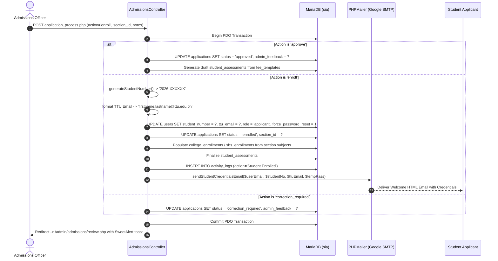

# Admissions Admin Relationship Map

This document traces the complete code execution chain, database queries, state mutations, and credential dispatch flows for the Admissions Administration subsystem.

---

## 1. Admissions Dashboard (`/admin/admissions/admissions_dashboard.php`)

### Page Identity
- **File Path:** [`app/Views/admin/admissions/admissions_dashboard.php`](file:///c:/xampp/htdocs/sia/app/Views/admin/admissions/admissions_dashboard.php)
- **Controller:** [`app/Controllers/Admin/Admissions/AdmissionsController.php`](file:///c:/xampp/htdocs/sia/app/Controllers/Admin/Admissions/AdmissionsController.php) (`index()`)
- **Route:** `GET /admin/admissions/admissions_dashboard.php`
- **Authorized Roles:** `admissions`, `admin`, `superadmin`
- **Middleware:** `SessionSecurityMiddleware`, `AuthMiddleware`, `RoleMiddleware:admissions`

### Database Queries Traced
```text
GET /admin/admissions/admissions_dashboard.php
    ↓
AdmissionsController@index
    ↓
1. SELECT COUNT(*) as total FROM applications
2. SELECT COUNT(*) as pending FROM applications WHERE status = 'pending'
3. SELECT COUNT(*) as under_review FROM applications WHERE status = 'under_review'
4. SELECT COUNT(*) as approved FROM applications WHERE status = 'approved'
5. SELECT COUNT(*) as enrolled FROM applications WHERE status = 'enrolled'
6. SELECT a.*, u.first_name, u.last_name, u.email 
   FROM applications a 
   JOIN users u ON a.user_id = u.id 
   ORDER BY a.created_at DESC LIMIT 10
    ↓
Renders: app/Views/admin/admissions/admissions_dashboard.php
```

---

## 2. Review Queue (`/admin/admissions/review.php`)

### Page Identity
- **File Path:** [`app/Views/admin/admissions/review.php`](file:///c:/xampp/htdocs/sia/app/Views/admin/admissions/review.php)
- **Controller:** `AdmissionsController@review`
- **Route:** `GET /admin/admissions/review.php`
- **Query Parameters:** `status` (pending, under_review, correction_required, approved, rejected, enrolled), `search`, `page`

### Data Flow
Filters applications table with pagination and dynamically displays document submission flags (`online` vs `on_campus`) and clinic clearance indicators.

---

## 3. Application Detail & Document Inspector (`/admin/admissions/application_detail.php`)

### Page Identity
- **File Path:** [`app/Views/admin/admissions/application_detail.php`](file:///c:/xampp/htdocs/sia/app/Views/admin/admissions/application_detail.php)
- **Controller:** `AdmissionsController@detail`
- **Route:** `GET /admin/admissions/application_detail.php`
- **Query Parameter:** `id` (int, required)

### Tracing Chain
```text
GET /admin/admissions/application_detail.php?id={id}
    ↓
AdmissionsController@detail
    ↓
1. SELECT a.*, u.first_name, u.last_name, u.email, u.student_number 
   FROM applications a JOIN users u ON a.user_id = u.id WHERE a.id = ?
2. SELECT * FROM application_documents WHERE application_id = ?
3. SELECT * FROM health_records WHERE application_id = ?
4. SELECT * FROM student_assessments WHERE application_id = ?
5. SELECT * FROM college_sections WHERE program_id = ? (or shs_sections)
    ↓
Renders application record with interactive document preview modal and section assignment dropdown
```

---

## 4. Application Processing & Credential Generation (`/admin/admissions/application_process.php`)

### Page Identity
- **Handler:** `AdmissionsController@process`
- **Route:** `POST /admin/admissions/application_process.php`
- **Form Traced:** `<form method="POST" action="/admin/admissions/application_process.php">`

### Complete Code Execution Flow


---
**Related:**
- [[00 - Master Relationship Index & Matrix]]
- [[04 - Applicant Portal Relationship Map]]
- [[06 - Clinic Admin Relationship Map]]
- [[07 - Registrar Admin Relationship Map]]
