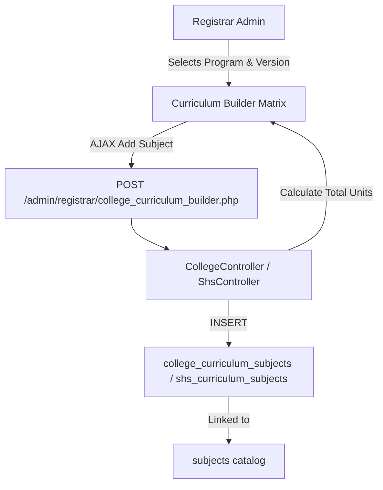
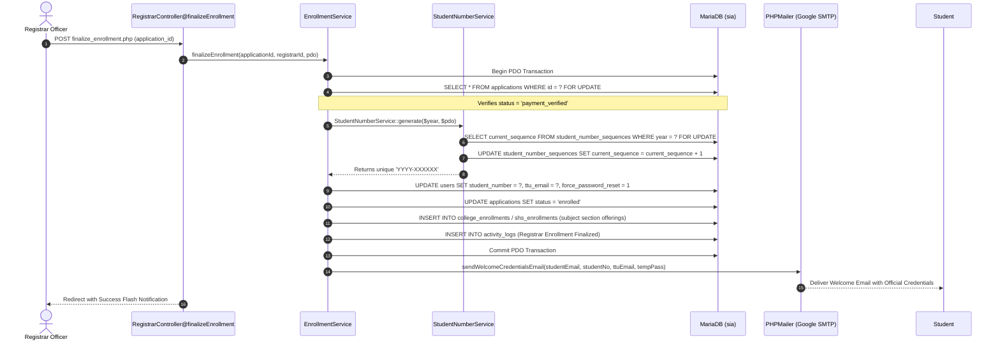

# Registrar Admin Relationship Map

This document traces the code relationships, data models, and database interactions for the Registrar Administration subsystem governing academic programs, curricula, subjects, and student records.

---

## 1. Registrar Dashboard (`/admin/registrar/registrar_dashboard.php`)

### Page Identity
- **File Path:** [`app/Views/admin/registrar/dashboard.php`](file:///c:/xampp/htdocs/sia/app/Views/admin/registrar/dashboard.php)
- **Controller:** [`app/Controllers/Admin/Registrar/RegistrarController.php`](file:///c:/xampp/htdocs/sia/app/Controllers/Admin/Registrar/RegistrarController.php) (`dashboard()`)
- **Route:** `GET /admin/registrar/registrar_dashboard.php`
- **Authorized Roles:** `admin`, `superadmin`
- **Middleware:** `SessionSecurityMiddleware`, `AuthMiddleware`, `RoleMiddleware:admin,superadmin`

### Database Tracing
```text
GET /admin/registrar/registrar_dashboard.php
    ↓
RegistrarController@dashboard (Pure Controller Data Aggregation)
    ↓
1. Enrolled counts:
   SELECT COUNT(*), SUM(College), SUM(Senior High) FROM applications WHERE status = 'enrolled'
2. Clearance Queue counts:
   SELECT COUNT(*), SUM(College), SUM(Senior High) FROM applications a 
   JOIN student_assessments sa ON a.id = sa.application_id 
   WHERE (a.status = 'payment_verified' OR (a.status = 'approved' AND sa.payment_status IN ('partial', 'paid')))
3. Active Sections:
   SELECT COUNT(*) FROM college_sections WHERE status = 1
   SELECT COUNT(*) FROM shs_sections WHERE status = 1
4. Registered Students with Official Number:
   SELECT COUNT(*) FROM applications a JOIN users u ON u.id = a.user_id 
   WHERE a.status = 'enrolled' AND u.student_number IS NOT NULL AND u.student_number != ''
5. Academic Catalog Totals:
   SELECT COUNT(*) FROM subjects
   SELECT COUNT(*) FROM college_programs WHERE is_active = 1
   SELECT COUNT(*) FROM shs_strands WHERE is_active = 1
6. Recent Enrolled Students Preview (Last 5 records):
   SELECT a.id, a.reference_number, a.lrn, a.academic_level, a.grade_level, a.strand,
          u.first_name, u.last_name, u.student_number, u.email, a.contact_number
   FROM applications a JOIN users u ON u.id = a.user_id WHERE a.status = 'enrolled' ORDER BY a.id DESC LIMIT 5
7. Active Academic Year & System Settings:
   SELECT setting_key, setting_value FROM system_settings
    ↓
Renders: app/Views/admin/registrar/dashboard.php (Zero raw SQL queries in view)
```

---

## 2. Enrolled Students Masterlist & CSV Export (`/admin/registrar/students.php`)

### Page Identity
- **File Path:** [`app/Views/admin/registrar/students.php`](file:///c:/xampp/htdocs/sia/app/Views/admin/registrar/students.php)
- **Controllers:** `RegistrarController@students`, `RegistrarController@exportStudents`
- **Routes:** `GET /admin/registrar/students.php`, `GET|POST /admin/registrar/students_export.php`

### Tracing Chain, Server-Side Pagination & CSV Stream
```text
GET /admin/registrar/students.php?page=1&per_page=25&search=...&level=...&grade=...&strand=...
    ↓
RegistrarController@students
    ↓
1. Global KPIs (Enrolled Students Only, independent of pagination & filters):
   - total_count: SELECT COUNT(*) FROM applications a JOIN users u ON u.id = a.user_id WHERE a.status = 'enrolled'
   - college_count: COALESCE(SUM(CASE WHEN a.academic_level = 'College' THEN 1 ELSE 0 END), 0)
   - shs_count: COALESCE(SUM(CASE WHEN a.academic_level = 'Senior High School' THEN 1 ELSE 0 END), 0)
   - official_id_count: COALESCE(SUM(CASE WHEN u.student_number IS NOT NULL AND u.student_number != '' THEN 1 ELSE 0 END), 0)
2. Filtered Count:
   SELECT COUNT(a.id) FROM applications a JOIN users u ON u.id = a.user_id 
   WHERE a.status = 'enrolled' [AND search AND level AND grade AND strand]
3. Paginated Data Retrieval:
   SELECT a.id, a.reference_number, a.lrn, a.status, a.academic_level, a.strand, 
          a.grade_level, a.gender, a.contact_number, u.first_name, u.last_name, u.student_number
   FROM applications a
   JOIN users u ON u.id = a.user_id
   WHERE a.status = 'enrolled' [AND search AND level AND grade AND strand]
   ORDER BY a.grade_level ASC, a.strand ASC, u.last_name ASC
   LIMIT :limit OFFSET :offset
    ↓
Renders: app/Views/admin/registrar/students.php with pagination controls (25, 50, 100 rows/page)
    ↓
GET|POST /admin/registrar/students_export.php
    ↓
Direct Stream to Browser (strictly enrolled: WHERE a.status = 'enrolled' AND filters):
    ├── header('Content-Type: text/csv; charset=utf-8')
    ├── header('Content-Disposition: attachment; filename="ttu_student_records_YYYYMMDD_HHMMSS.csv"')
    └── fputcsv($output, ['Student Number', 'Last Name', 'First Name', 'Institutional Email', 'Personal Email', 'Academic Level', 'Grade/Year Level', 'Program / Strand', 'Section'])
```

---

## 3. Universal Subjects Catalog (`/admin/registrar/subjects.php`)

### Page Identity
- **File Path:** [`app/Views/admin/registrar/subjects.php`](file:///c:/xampp/htdocs/sia/app/Views/admin/registrar/subjects.php)
- **Controller:** [`app/Controllers/Admin/Registrar/SubjectController.php`](file:///c:/xampp/htdocs/sia/app/Controllers/Admin/Registrar/SubjectController.php) (`index()`, `process()`)
- **Routes:** `GET /admin/registrar/subjects.php`, `POST /admin/registrar/subject_process.php`

### Tracing Chain
```text
POST /admin/registrar/subject_process.php (action ['create'|'update'|'delete'], subject_code, subject_name, units, subject_type, education_level)
    ↓
SubjectController@process
    ↓
Database Operation:
    ├── [create]: INSERT INTO subjects (subject_code, subject_name, units, subject_type, education_level, status) VALUES (?, ?, ?, ?, ?, 1)
    ├── [update]: UPDATE subjects SET subject_name = ?, units = ?, subject_type = ?, education_level = ? WHERE id = ?
    └── [delete]: UPDATE subjects SET status = 0 WHERE id = ? (Soft delete)
    ↓
Redirect: /admin/registrar/subjects.php
```

---

## 4. College & SHS Curriculum Builders

### Page Identity
- **College Builder:** [`app/Controllers/Admin/Registrar/CollegeController.php`](file:///c:/xampp/htdocs/sia/app/Controllers/Admin/Registrar/CollegeController.php) (`curriculumBuilder()`) $\rightarrow$ `admin/registrar/college_curriculum_builder.php`
- **SHS Builder:** [`app/Controllers/Admin/Registrar/ShsController.php`](file:///c:/xampp/htdocs/sia/app/Controllers/Admin/Registrar/ShsController.php) (`curriculumBuilder()`) $\rightarrow$ `admin/registrar/shs_curriculum_builder.php`

### Database Mapping Flow


---

## 5. Official Enrollment Finalization (`/admin/registrar/finalize_enrollment.php`)

### Page Identity
- **Endpoint:** `POST /admin/registrar/finalize_enrollment.php`
- **Controller:** [`app/Controllers/Admin/Registrar/RegistrarController.php`](file:///c:/xampp/htdocs/sia/app/Controllers/Admin/Registrar/RegistrarController.php) (`finalizeEnrollment()`)
- **Authorized Roles:** `admin`, `superadmin`
- **Middleware:** `SessionSecurityMiddleware`, `AuthMiddleware`, `RoleMiddleware:admin,superadmin`

### Tracing Chain & Service Orchestration


---
**Related:**
- [[00 - Master Relationship Index & Matrix]]
- [[05 - Admissions Admin Relationship Map]]
- [[08 - Scheduler Admin Relationship Map]]
