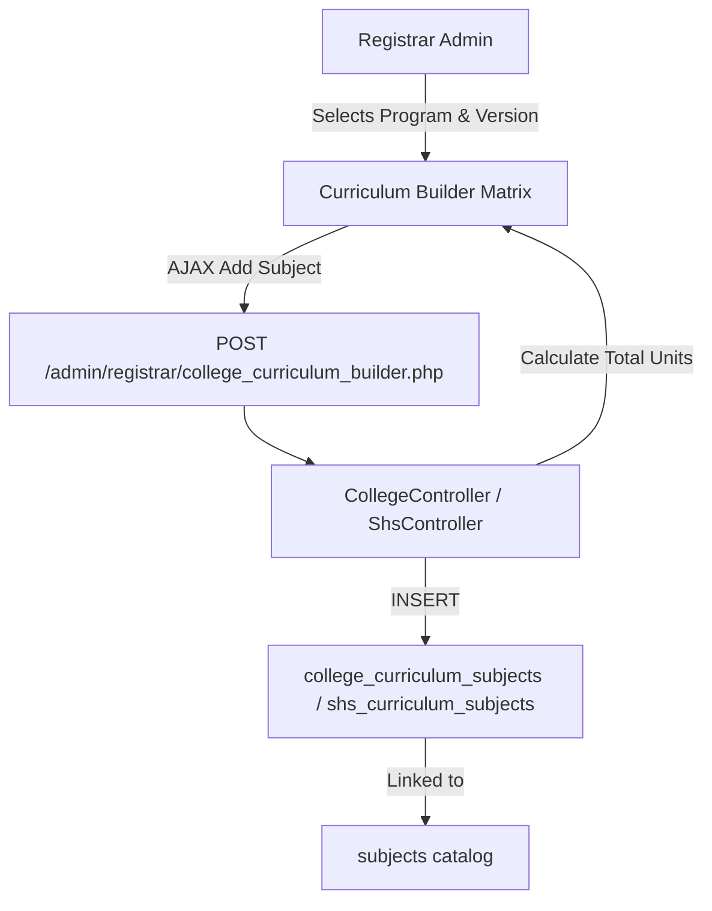
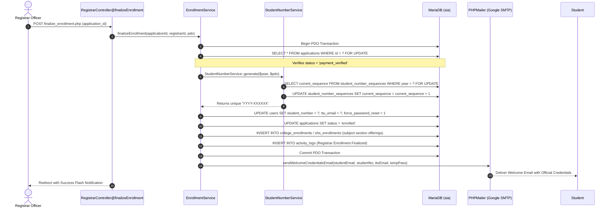

# Registrar Admin Relationship Map

This document traces the code relationships, data models, and database interactions for the Registrar Administration subsystem governing academic programs, curricula, subjects, and student records.

---

## 1. Registrar Dashboard (`/admin/registrar/registrar_dashboard.php`)

### Page Identity
- **File Path:** [`app/Views/admin/registrar/dashboard.php`](file:///c:/xampp/htdocs/sia/app/Views/admin/registrar/dashboard.php)
- **Controller:** [`app/Controllers/Admin/Registrar/RegistrarController.php`](file:///c:/xampp/htdocs/sia/app/Controllers/Admin/Registrar/RegistrarController.php) (`dashboard()`)
- **Route:** `GET /admin/registrar/registrar_dashboard.php`
- **Authorized Roles:** `admin`, `superadmin`
- **Middleware:** `SessionSecurityMiddleware`, `AuthMiddleware`, `RoleMiddleware:admin,superadmin`

### Database Tracing
```text
GET /admin/registrar/registrar_dashboard.php
    ↓
RegistrarController@dashboard
    ↓
1. SELECT COUNT(*) as total_students FROM users WHERE student_number IS NOT NULL
2. SELECT COUNT(*) as total_college_programs FROM college_programs WHERE is_active = 1
3. SELECT COUNT(*) as total_shs_strands FROM shs_strands WHERE is_active = 1
4. SELECT COUNT(*) as total_subjects FROM subjects WHERE status = 1
5. SELECT COUNT(*) as total_curricula FROM college_curricula WHERE status = 'active'
    ↓
Renders: app/Views/admin/registrar/dashboard.php
```

---

## 2. Enrolled Students Masterlist & CSV Export (`/admin/registrar/students.php`)

### Page Identity
- **File Path:** [`app/Views/admin/registrar/students.php`](file:///c:/xampp/htdocs/sia/app/Views/admin/registrar/students.php)
- **Controllers:** `RegistrarController@students`, `RegistrarController@exportStudents`
- **Routes:** `GET /admin/registrar/students.php`, `GET|POST /admin/registrar/students_export.php`

### Tracing Chain, Server-Side Pagination & CSV Stream
```text
GET /admin/registrar/students.php?page=1&per_page=25&search=...&academic_level=...&strand=...
    ↓
RegistrarController@students
    ↓
1. Global KPIs (Independent of pagination & filters):
   - total_enrolled: SELECT COUNT(*) FROM applications WHERE status = 'enrolled'
   - college_enrolled: SELECT COUNT(*) FROM applications WHERE status = 'enrolled' AND academic_level = 'College'
   - shs_enrolled: SELECT COUNT(*) FROM applications WHERE status = 'enrolled' AND academic_level = 'Senior High School'
2. Filtered Count:
   SELECT COUNT(*) FROM users u JOIN applications a ON u.id = a.user_id AND a.status = 'enrolled' ... [WHERE filters]
3. Paginated Data Retrieval:
   SELECT u.id, u.student_number, u.first_name, u.last_name, u.email, u.ttu_email, 
          a.reference_number, a.academic_level, a.grade_level, a.strand, a.status,
          COALESCE(cs.section_code, ss.section_code, 'Unassigned') AS section_code
   FROM users u
   JOIN applications a ON u.id = a.user_id AND a.status = 'enrolled'
   LEFT JOIN college_sections cs ON a.section_id = cs.id AND a.academic_level = 'College'
   LEFT JOIN shs_sections ss ON a.section_id = ss.id AND a.academic_level = 'Senior High School'
   [WHERE search AND academic_level AND strand]
   ORDER BY u.last_name ASC, u.first_name ASC
   LIMIT :limit OFFSET :offset
    ↓
Renders: app/Views/admin/registrar/students.php with pagination controls (25, 50, 100 rows/page)
    ↓
GET|POST /admin/registrar/students_export.php
    ↓
Direct Stream to Browser (respects active search & dropdown filters):
    ├── header('Content-Type: text/csv')
    ├── header('Content-Disposition: attachment; filename="students_masterlist_YYYY-MM-DD.csv"')
    └── fputcsv($output, ['Student Number', 'Last Name', 'First Name', 'Institutional Email', 'Personal Email', 'Academic Level', 'Grade/Year Level', 'Program / Strand', 'Section'])
```

---

## 3. Universal Subjects Catalog (`/admin/registrar/subjects.php`)

### Page Identity
- **File Path:** [`app/Views/admin/registrar/subjects.php`](file:///c:/xampp/htdocs/sia/app/Views/admin/registrar/subjects.php)
- **Controller:** [`app/Controllers/Admin/Registrar/SubjectController.php`](file:///c:/xampp/htdocs/sia/app/Controllers/Admin/Registrar/SubjectController.php) (`index()`, `process()`)
- **Routes:** `GET /admin/registrar/subjects.php`, `POST /admin/registrar/subject_process.php`

### Tracing Chain
```text
POST /admin/registrar/subject_process.php (action ['create'|'update'|'delete'], subject_code, subject_name, units, subject_type, education_level)
    ↓
SubjectController@process
    ↓
Database Operation:
    ├── [create]: INSERT INTO subjects (subject_code, subject_name, units, subject_type, education_level, status) VALUES (?, ?, ?, ?, ?, 1)
    ├── [update]: UPDATE subjects SET subject_name = ?, units = ?, subject_type = ?, education_level = ? WHERE id = ?
    └── [delete]: UPDATE subjects SET status = 0 WHERE id = ? (Soft delete)
    ↓
Redirect: /admin/registrar/subjects.php
```

---

## 4. College & SHS Curriculum Builders

### Page Identity
- **College Builder:** [`app/Controllers/Admin/Registrar/CollegeController.php`](file:///c:/xampp/htdocs/sia/app/Controllers/Admin/Registrar/CollegeController.php) (`curriculumBuilder()`) $\rightarrow$ `admin/registrar/college_curriculum_builder.php`
- **SHS Builder:** [`app/Controllers/Admin/Registrar/ShsController.php`](file:///c:/xampp/htdocs/sia/app/Controllers/Admin/Registrar/ShsController.php) (`curriculumBuilder()`) $\rightarrow$ `admin/registrar/shs_curriculum_builder.php`

### Database Mapping Flow


---

## 5. Official Enrollment Finalization (`/admin/registrar/finalize_enrollment.php`)

### Page Identity
- **Endpoint:** `POST /admin/registrar/finalize_enrollment.php`
- **Controller:** [`app/Controllers/Admin/Registrar/RegistrarController.php`](file:///c:/xampp/htdocs/sia/app/Controllers/Admin/Registrar/RegistrarController.php) (`finalizeEnrollment()`)
- **Authorized Roles:** `admin`, `superadmin`
- **Middleware:** `SessionSecurityMiddleware`, `AuthMiddleware`, `RoleMiddleware:admin,superadmin`

### Tracing Chain & Service Orchestration


---
**Related:**
- [[00 - Master Relationship Index & Matrix]]
- [[05 - Admissions Admin Relationship Map]]
- [[08 - Scheduler Admin Relationship Map]]
