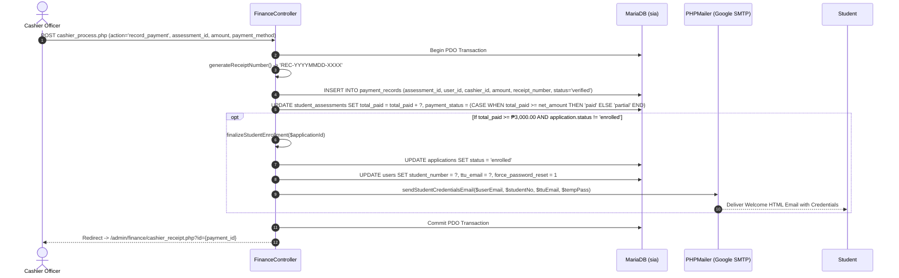

# Finance & Cashier Relationship Map

This document traces the complete calculation chains, payment verification workflows, official receipt generation, and automatic enrollment triggers in the Finance & Cashier subsystem.

---

## 1. Cashier Dashboard (`/admin/finance/cashier_dashboard.php`)

### Page Identity
- **File Path:** [`app/Views/admin/finance/cashier_dashboard.php`](file:///c:/xampp/htdocs/sia/app/Views/admin/finance/cashier_dashboard.php)
- **Controller:** [`app/Controllers/Admin/Finance/FinanceController.php`](file:///c:/xampp/htdocs/sia/app/Controllers/Admin/Finance/FinanceController.php) (`dashboard()`)
- **Route:** `GET /admin/finance/cashier_dashboard.php`
- **Authorized Roles:** `cashier`, `admin`, `superadmin`
- **Middleware:** `SessionSecurityMiddleware`, `AuthMiddleware`, `RoleMiddleware:cashier,admin,superadmin`

### Database Tracing Chain
```text
GET /admin/finance/cashier_dashboard.php
    ↓
FinanceController@dashboard
    ↓
1. SELECT SUM(amount) as today_collections FROM payment_records WHERE payment_date = CURDATE() AND status = 'verified'
2. SELECT SUM(amount) as total_collections FROM payment_records WHERE status = 'verified'
3. SELECT COUNT(*) as pending_proofs FROM payment_records WHERE status = 'pending'
4. SELECT COUNT(*) as unpaid_assessments FROM student_assessments WHERE payment_status = 'unpaid'
5. SELECT p.*, u.first_name, u.last_name, a.reference_number
   FROM payment_records p
   JOIN users u ON p.user_id = u.id
   JOIN student_assessments sa ON p.assessment_id = sa.id
   JOIN applications a ON sa.application_id = a.id
   ORDER BY p.created_at DESC LIMIT 10
    ↓
Renders financial summary cards, daily collection trend chart, and pending verification queue
```

---

## 2. Payment Recording & Online Proof Verification (`/admin/finance/cashier_payments.php`)

### Page Identity
- **File Path:** [`app/Views/admin/finance/cashier_payments.php`](file:///c:/xampp/htdocs/sia/app/Views/admin/finance/cashier_payments.php)
- **Controller:** `FinanceController@payments`, `FinanceController@process`
- **Routes:** `GET /admin/finance/cashier_payments.php`, `POST /admin/finance/cashier_process.php`

### Tracing Chain & Auto-Enrollment Trigger


---

## 3. Official Printable Payment Receipt (`/admin/finance/cashier_receipt.php`)

### Page Identity
- **File Path:** [`app/Views/admin/finance/cashier_receipt.php`](file:///c:/xampp/htdocs/sia/app/Views/admin/finance/cashier_receipt.php)
- **Controller:** `FinanceController@receipt`
- **Route:** `GET /admin/finance/cashier_receipt.php?id={payment_id}`

### Data Rendered
Renders official university header, OR Number (`REC-YYYYMMDD-XXXX`), student details, breakdown of amount paid, remaining balance, and cashier signature line with printable media stylesheet (`@media print`).

---

## 4. Fee Template Management (`/admin/finance/fees.php`)

### Page Identity
- **File Path:** [`app/Views/admin/finance/fees.php`](file:///c:/xampp/htdocs/sia/app/Views/admin/finance/fees.php)
- **Controller:** [`app/Controllers/Admin/Finance/FeeController.php`](file:///c:/xampp/htdocs/sia/app/Controllers/Admin/Finance/FeeController.php) (`index()`, `process()`)
- **Routes:** `GET /admin/finance/fees.php`, `POST /admin/finance/fee_process.php`

### Tuition Rate per Unit Data Flow
```text
POST /admin/finance/fee_process.php
  (name, academic_level, grade_level, strand, semester, is_per_unit, tuition_fee, miscellaneous_fee, registration_fee, laboratory_fee, other_fees)
    ↓
FeeController@process
    ↓
Database Operation:
    ├── INSERT INTO fee_templates 
    │   (name, academic_level, grade_level, strand, semester, is_per_unit, tuition_fee, miscellaneous_fee, registration_fee, laboratory_fee, other_fees, total_amount)
    │   VALUES (?, ?, ?, ?, ?, ?, ?, ?, ?, ?, ?, ?)
    └── logActivity($adminId, 'Fee Template Created', 'Created template ' . $name)
    ↓
Redirect: /admin/finance/fees.php
```

---
**Related:**
- [[00 - Master Relationship Index & Matrix]]
- [[04 - Applicant Portal Relationship Map]]
- [[05 - Admissions Admin Relationship Map]]
- [[10 - Scholarship Admin Relationship Map]]
