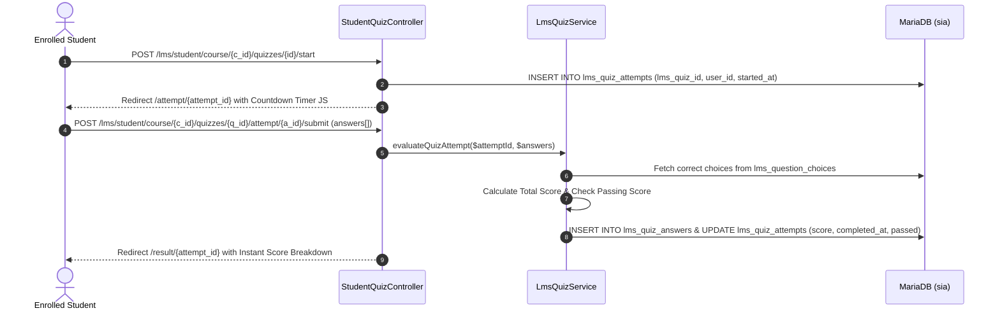

# LMS Student Portal Relationship Map

This document traces the complete page-to-code chains, dynamic course auto-provisioning, assignment submissions, timed quiz engines, and gradebook calculations for the Student LMS Portal.

---

## 1. Student LMS Dashboard (`/lms/student/dashboard.php`)

### Page Identity
- **File Path:** [`app/Views/lms/student/dashboard.php`](file:///c:/xampp/htdocs/sia/app/Views/lms/student/dashboard.php)
- **Controller:** [`app/Controllers/Lms/StudentController.php`](file:///c:/xampp/htdocs/sia/app/Controllers/Lms/StudentController.php) (`dashboard()`)
- **Route:** `GET /lms/student/dashboard.php`
- **Authorized Role:** `applicant` / `student` (with `applications.status = 'enrolled'`)
- **Middleware:** `SessionSecurityMiddleware`, `AuthMiddleware`

### JIT Auto-Provisioning & Data Aggregation
```mermaid
flowchart TD
    Student[Student Accesses /lms/student/dashboard.php] --> Controller[StudentController@dashboard]
    Controller --> Repos[CollegeEnrollmentRepository / ShsEnrollmentRepository]
    Repos --> DB1[Query college_enrollments / shs_enrollments where status='enrolled']
    DB1 --> Provision{lms_courses exists for subject?}
    Provision -->|No| AutoCreate[Auto-Provision row in lms_courses with section adviser as instructor]
    Provision -->|Yes| LinkCourse[Link course instance]
    LinkCourse --> Service[LmsService Aggregator]
    Service --> D1[getStudentUpcomingDeadlines: lms_assignments + lms_quizzes]
    Service --> D2[getStudentAnnouncements: lms_announcements]
    Service --> D3[getStudentStreak: computes continuous daily login days]
    Service --> D4[getStudentNextEvent: resolves next scheduled timetable block]
    Service --> View[Render app/Views/lms/student/dashboard.php]
```

---

## 2. Course Learning Modules (`/lms/student/course.php`)

### Page Identity
- **File Path:** [`app/Views/lms/student/course.php`](file:///c:/xampp/htdocs/sia/app/Views/lms/student/course.php)
- **Controller:** `StudentController@course`
- **Route:** `GET /lms/student/course.php?id={course_id}`

### Tracing Chain & Material Delivery
```text
GET /lms/student/course.php?id={course_id}
    ↓
StudentController@course
    ↓
1. SELECT * FROM lms_courses WHERE id = ?
2. SELECT * FROM lms_modules WHERE lms_course_id = ? AND status = 'published' ORDER BY order_index ASC
3. For each module:
   SELECT * FROM lms_materials WHERE lms_module_id = ? AND status = 'published'
    ↓
Renders accordion module viewer with download buttons pointing to:
    GET /lms/download/material/{material_id} -> DownloadController@material (Protected from IDOR)
```

---

## 3. Assignment Submissions (`/lms/student/course/{course_id}/assignments`)

### Page Identity
- **File Paths:**
  - Index: [`app/Views/lms/student/assignments/index.php`](file:///c:/xampp/htdocs/sia/app/Views/lms/student/assignments/index.php)
  - Detail/Submission: [`app/Views/lms/student/assignments/show.php`](file:///c:/xampp/htdocs/sia/app/Views/lms/student/assignments/show.php)
- **Controller:** [`app/Controllers/Lms/StudentAssignmentController.php`](file:///c:/xampp/htdocs/sia/app/Controllers/Lms/StudentAssignmentController.php) (`index()`, `show()`, `submit()`)
- **Routes:**
  - `GET /lms/student/course/{course_id}/assignments`
  - `GET /lms/student/course/{course_id}/assignments/{id}`
  - `POST /lms/student/course/{course_id}/assignments/{id}/submit`

### Tracing Chain & File Storage
```text
POST /lms/student/course/{course_id}/assignments/{id}/submit (submission_text, submission_file)
    ↓
StudentAssignmentController@submit
    ↓
Validation:
    ├── Due date check: NOW() <= lms_assignments.due_date
    └── File type: PDF, DOC, DOCX, ZIP <= 10MB
    ↓
Store file: `storage/lms_materials/submissions/{unique_id}_{filename}`
    ↓
Database Operation:
    INSERT INTO lms_submissions (lms_assignment_id, user_id, file_path, submission_text, submitted_at)
    VALUES (?, ?, ?, ?, NOW())
    ON DUPLICATE KEY UPDATE file_path = VALUES(file_path), submission_text = VALUES(submission_text), submitted_at = NOW()
    ↓
Redirect: /lms/student/course/{course_id}/assignments/{id} with success alert
```

---

## 4. Timed Quiz Engine (`/lms/student/course/{course_id}/quizzes`)

### Page Identity
- **File Paths:**
  - Quiz List: [`app/Views/lms/student/quizzes/index.php`](file:///c:/xampp/htdocs/sia/app/Views/lms/student/quizzes/index.php)
  - Quiz Overview: [`app/Views/lms/student/quizzes/show.php`](file:///c:/xampp/htdocs/sia/app/Views/lms/student/quizzes/show.php)
  - Quiz Taking / Timer: [`app/Views/lms/student/quizzes/attempt.php`](file:///c:/xampp/htdocs/sia/app/Views/lms/student/quizzes/attempt.php)
  - Results Breakdown: [`app/Views/lms/student/quizzes/result.php`](file:///c:/xampp/htdocs/sia/app/Views/lms/student/quizzes/result.php)
- **Controller:** [`app/Controllers/Lms/StudentQuizController.php`](file:///c:/xampp/htdocs/sia/app/Controllers/Lms/StudentQuizController.php) (`index()`, `show()`, `start()`, `attempt()`, `submit()`, `result()`)
- **Service:** [`app/Services/LmsQuizService.php`](file:///c:/xampp/htdocs/sia/app/Services/LmsQuizService.php)
- **Routes:**
  - `GET /lms/student/course/{course_id}/quizzes`
  - `GET /lms/student/course/{course_id}/quizzes/{id}`
  - `POST /lms/student/course/{course_id}/quizzes/{id}/start`
  - `GET /lms/student/course/{course_id}/quizzes/{quiz_id}/attempt/{attempt_id}`
  - `POST /lms/student/course/{course_id}/quizzes/{quiz_id}/attempt/{attempt_id}/submit`
  - `GET /lms/student/course/{course_id}/quizzes/{quiz_id}/result/{attempt_id}`

### Execution Flow


---

## 5. Student Gradebook (`/lms/student/course/{course_id}/gradebook`)

### Page Identity
- **File Path:** [`app/Views/lms/student/gradebook/index.php`](file:///c:/xampp/htdocs/sia/app/Views/lms/student/gradebook/index.php)
- **Controller:** [`app/Controllers/Lms/StudentGradebookController.php`](file:///c:/xampp/htdocs/sia/app/Controllers/Lms/StudentGradebookController.php) (`index()`)
- **Service:** [`app/Services/LmsGradebookService.php`](file:///c:/xampp/htdocs/sia/app/Services/LmsGradebookService.php)
- **Route:** `GET /lms/student/course/{course_id}/gradebook`

### Calculation Math
Aggregates student scores across assignments (`lms_submissions.grade`) and quizzes (`lms_quiz_attempts.score`), computing term percentages and letter grades.

---
**Related:**
- [[00 - Master Relationship Index & Matrix]]
- [[13 - LMS Faculty Portal Relationship Map]]
- [[04 - Applicant Portal Relationship Map]]
