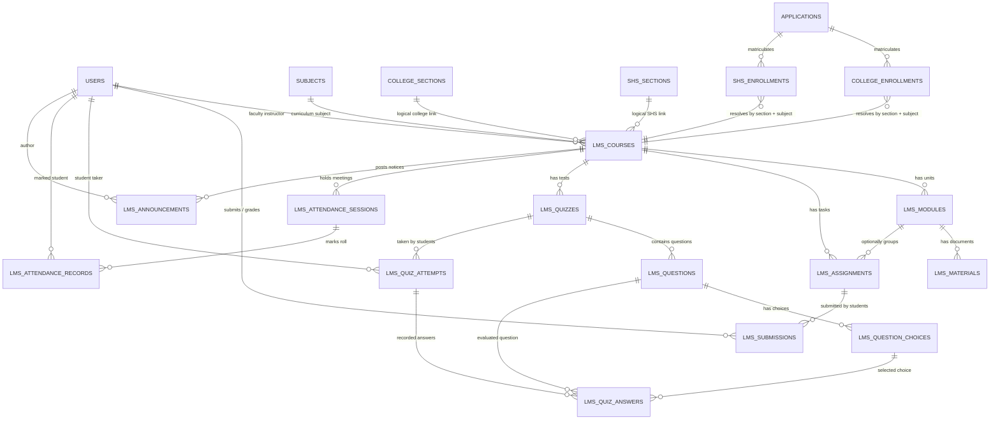

# LMS Database Map & Entity Relational Schema

> **Database Engine**: MariaDB 10.4+ / MySQL 8.0+  
> **Database Name**: `sia`  
> **Character Set**: `utf8mb4`  
> **Collation**: `utf8mb4_unicode_ci`  
> **Verification Status**: 100% verified against active database dictionary  

---

## 1. Relational Architecture Diagram

---

## 2. LMS Table Dictionary (13 Active Tables)

### 2.1 `lms_courses`
* **Purpose**: Primary classroom shell representing an active section taking a specific subject under a designated faculty instructor.
* **Row Count in DB**: 15 rows
* **Status**: **ACTIVE & CENTRAL**
* **Columns**:
  * `id` (`INT(10) UNSIGNED`, `AUTO_INCREMENT`, `PRIMARY KEY`)
  * `academic_level` (`ENUM('College', 'SHS')`, `NOT NULL`)
  * `academic_section_id` (`INT(10) UNSIGNED`, `NOT NULL`) — Logical foreign key to `college_sections.id` or `shs_sections.id`.
  * `subject_id` (`INT(10) UNSIGNED`, `NOT NULL`) — Foreign key to `subjects.id`.
  * `faculty_user_id` (`INT(10) UNSIGNED`, `NOT NULL`) — Foreign key to `users.id`.
  * `status` (`ENUM('active', 'archived')`, `NOT NULL`, `DEFAULT 'active'`)
  * `created_at` (`TIMESTAMP`, `DEFAULT CURRENT_TIMESTAMP`)
  * `updated_at` (`TIMESTAMP`, `DEFAULT CURRENT_TIMESTAMP ON UPDATE CURRENT_TIMESTAMP`)
* **Keys & Constraints**:
  * `PRIMARY KEY (`id`)`
  * `UNIQUE KEY unique_section_subject_course (`academic_level`, `academic_section_id`, `subject_id`)`
  * `KEY idx_lms_course_subject (`subject_id`)`
  * `KEY idx_lms_course_faculty (`faculty_user_id`)`
  * `CONSTRAINT fk_lms_course_subject FOREIGN KEY (subject_id) REFERENCES subjects (id) ON DELETE CASCADE`
  * `CONSTRAINT fk_lms_course_faculty FOREIGN KEY (faculty_user_id) REFERENCES users (id) ON UPDATE CASCADE`
* **Enrollment Relationships**: Links directly to `subjects.id` and logically to `college_sections.id` or `shs_sections.id`.

---

### 2.2 `lms_modules`
* **Purpose**: Course unit or chapter grouping (e.g. "Week 1: Foundations", "Module 2: Database Design").
* **Row Count in DB**: 15 rows
* **Status**: **ACTIVE**
* **Columns**:
  * `id` (`INT(10) UNSIGNED`, `AUTO_INCREMENT`, `PRIMARY KEY`)
  * `lms_course_id` (`INT(10) UNSIGNED`, `NOT NULL`) — Foreign key to `lms_courses.id`.
  * `title` (`VARCHAR(255)`, `NOT NULL`)
  * `description` (`TEXT`, `NULL`)
  * `display_order` (`INT(11)`, `NOT NULL`, `DEFAULT 0`)
  * `status` (`ENUM('draft', 'published')`, `NOT NULL`, `DEFAULT 'published'`)
  * `created_at` (`TIMESTAMP`, `DEFAULT CURRENT_TIMESTAMP`)
  * `updated_at` (`TIMESTAMP`, `DEFAULT CURRENT_TIMESTAMP ON UPDATE CURRENT_TIMESTAMP`)
* **Keys & Constraints**:
  * `PRIMARY KEY (`id`)`
  * `KEY fk_lms_mod_course (`lms_course_id`)`
  * `CONSTRAINT fk_lms_mod_course FOREIGN KEY (lms_course_id) REFERENCES lms_courses (id) ON DELETE CASCADE`

---

### 2.3 `lms_materials`
* **Purpose**: Downloadable learning documents and instructional files attached to course modules.
* **Row Count in DB**: 3 rows
* **Status**: **ACTIVE**
* **Columns**:
  * `id` (`INT(10) UNSIGNED`, `AUTO_INCREMENT`, `PRIMARY KEY`)
  * `lms_module_id` (`INT(10) UNSIGNED`, `NOT NULL`) — Foreign key to `lms_modules.id`.
  * `file_name` (`VARCHAR(255)`, `NOT NULL`) — Original display title of file.
  * `file_path` (`VARCHAR(255)`, `NOT NULL`) — Storage filename.
  * `mime_type` (`VARCHAR(100)`, `NULL`)
  * `file_size` (`INT(11)`, `NULL`) — Size in bytes.
  * `created_at` (`TIMESTAMP`, `DEFAULT CURRENT_TIMESTAMP`)
* **Keys & Constraints**:
  * `PRIMARY KEY (`id`)`
  * `KEY fk_lms_mat_module (`lms_module_id`)`
  * `CONSTRAINT fk_lms_mat_module FOREIGN KEY (lms_module_id) REFERENCES lms_modules (id) ON DELETE CASCADE`

---

### 2.4 `lms_assignments`
* **Purpose**: Course homework, projects, and laboratory task specifications.
* **Row Count in DB**: 2 rows
* **Status**: **ACTIVE**
* **Columns**:
  * `id` (`INT(10) UNSIGNED`, `AUTO_INCREMENT`, `PRIMARY KEY`)
  * `lms_course_id` (`INT(10) UNSIGNED`, `NOT NULL`) — Foreign key to `lms_courses.id`.
  * `lms_module_id` (`INT(10) UNSIGNED`, `NULL`) — Optional foreign key to `lms_modules.id`.
  * `title` (`VARCHAR(255)`, `NOT NULL`)
  * `description` (`TEXT`, `NULL`)
  * `due_date` (`DATETIME`, `NULL`)
  * `max_score` (`INT(11)`, `NOT NULL`, `DEFAULT 100`)
  * `status` (`ENUM('draft', 'published')`, `NOT NULL`, `DEFAULT 'draft'`)
  * `file_path` (`VARCHAR(255)`, `NULL`)
  * `created_at` (`TIMESTAMP`, `DEFAULT CURRENT_TIMESTAMP`)
  * `updated_at` (`TIMESTAMP`, `DEFAULT CURRENT_TIMESTAMP ON UPDATE CURRENT_TIMESTAMP`)
* **Keys & Constraints**:
  * `PRIMARY KEY (`id`)`
  * `KEY fk_lms_ass_course (`lms_course_id`)`
  * `KEY fk_lms_ass_module (`lms_module_id`)`
  * `CONSTRAINT fk_lms_ass_course FOREIGN KEY (lms_course_id) REFERENCES lms_courses (id) ON DELETE CASCADE`
  * `CONSTRAINT fk_lms_ass_module FOREIGN KEY (lms_module_id) REFERENCES lms_modules (id) ON DELETE SET NULL`

---

### 2.5 `lms_submissions`
* **Purpose**: Student uploaded assignment deliverables, scores, and faculty evaluation feedback.
* **Row Count in DB**: 0 rows
* **Status**: **ACTIVE (Operational, awaiting live submissions)**
* **Columns**:
  * `id` (`INT(10) UNSIGNED`, `AUTO_INCREMENT`, `PRIMARY KEY`)
  * `assignment_id` (`INT(10) UNSIGNED`, `NOT NULL`) — Foreign key to `lms_assignments.id`.
  * `student_id` (`INT(10) UNSIGNED`, `NOT NULL`) — Foreign key to `users.id`.
  * `status` (`ENUM('SUBMITTED', 'RESUBMITTED', 'GRADED')`, `NOT NULL`, `DEFAULT 'SUBMITTED'`)
  * `file_path` (`VARCHAR(255)`, `NULL`)
  * `file_name` (`VARCHAR(255)`, `NULL`)
  * `mime_type` (`VARCHAR(100)`, `NULL`)
  * `file_size` (`INT(11)`, `NULL`, `DEFAULT 0`)
  * `submission_text` (`TEXT`, `NULL`)
  * `grade` (`DECIMAL(5,2)`, `NULL`)
  * `feedback` (`TEXT`, `NULL`)
  * `submitted_at` (`DATETIME`, `NOT NULL`, `DEFAULT CURRENT_TIMESTAMP`)
  * `graded_at` (`DATETIME`, `NULL`)
  * `graded_by` (`INT(10) UNSIGNED`, `NULL`) — Foreign key to `users.id`.
* **Keys & Constraints**:
  * `PRIMARY KEY (`id`)`
  * `KEY fk_lms_sub_assign (`assignment_id`)`
  * `KEY fk_lms_sub_student (`student_id`)`
  * `KEY fk_lms_sub_grader (`graded_by`)`
  * `CONSTRAINT fk_lms_sub_assign FOREIGN KEY (assignment_id) REFERENCES lms_assignments (id) ON DELETE CASCADE`
  * `CONSTRAINT fk_lms_sub_student FOREIGN KEY (student_id) REFERENCES users (id) ON DELETE CASCADE`
  * `CONSTRAINT fk_lms_sub_grader FOREIGN KEY (graded_by) REFERENCES users (id) ON DELETE SET NULL`

---

### 2.6 `lms_quizzes`
* **Purpose**: Timed assessments, exams, and quizzes configured for a course.
* **Row Count in DB**: 1 row
* **Status**: **ACTIVE**
* **Columns**:
  * `id` (`INT(10) UNSIGNED`, `AUTO_INCREMENT`, `PRIMARY KEY`)
  * `lms_course_id` (`INT(10) UNSIGNED`, `NOT NULL`) — Foreign key to `lms_courses.id`.
  * `title` (`VARCHAR(255)`, `NOT NULL`)
  * `description` (`TEXT`, `NULL`)
  * `time_limit` (`INT(11)`, `NULL`) — Duration in minutes (NULL = unlimited).
  * `max_attempts` (`INT(11)`, `NULL`, `DEFAULT 1`)
  * `passing_score` (`DECIMAL(5,2)`, `NULL`)
  * `start_date` (`DATETIME`, `NULL`)
  * `end_date` (`DATETIME`, `NULL`)
  * `status` (`ENUM('draft', 'published')`, `NOT NULL`, `DEFAULT 'draft'`)
  * `created_at` (`TIMESTAMP`, `DEFAULT CURRENT_TIMESTAMP`)
  * `updated_at` (`TIMESTAMP`, `DEFAULT CURRENT_TIMESTAMP ON UPDATE CURRENT_TIMESTAMP`)
* **Keys & Constraints**:
  * `PRIMARY KEY (`id`)`
  * `KEY fk_quiz_course (`lms_course_id`)`
  * `CONSTRAINT fk_quiz_course FOREIGN KEY (lms_course_id) REFERENCES lms_courses (id) ON DELETE CASCADE`

---

### 2.7 `lms_questions`
* **Purpose**: Assessment questions belonging to a quiz.
* **Row Count in DB**: 3 rows
* **Status**: **ACTIVE**
* **Columns**:
  * `id` (`INT(10) UNSIGNED`, `AUTO_INCREMENT`, `PRIMARY KEY`)
  * `lms_quiz_id` (`INT(10) UNSIGNED`, `NOT NULL`) — Foreign key to `lms_quizzes.id`.
  * `question_text` (`TEXT`, `NOT NULL`)
  * `question_type` (`ENUM('multiple_choice', 'true_false')`, `NOT NULL`, `DEFAULT 'multiple_choice'`)
  * `points` (`DECIMAL(5,2)`, `NOT NULL`, `DEFAULT 1.00`)
  * `display_order` (`INT(11)`, `NOT NULL`, `DEFAULT 0`)
  * `created_at` (`TIMESTAMP`, `DEFAULT CURRENT_TIMESTAMP`)
* **Keys & Constraints**:
  * `PRIMARY KEY (`id`)`
  * `KEY fk_question_quiz (`lms_quiz_id`)`
  * `CONSTRAINT fk_question_quiz FOREIGN KEY (lms_quiz_id) REFERENCES lms_quizzes (id) ON DELETE CASCADE`

---

### 2.8 `lms_question_choices`
* **Purpose**: Options/choices available for a multiple-choice or true/false question.
* **Row Count in DB**: 8 rows
* **Status**: **ACTIVE**
* **Columns**:
  * `id` (`INT(10) UNSIGNED`, `AUTO_INCREMENT`, `PRIMARY KEY`)
  * `lms_question_id` (`INT(10) UNSIGNED`, `NOT NULL`) — Foreign key to `lms_questions.id`.
  * `choice_text` (`TEXT`, `NOT NULL`)
  * `is_correct` (`TINYINT(1)`, `NOT NULL`, `DEFAULT 0`)
  * `display_order` (`INT(11)`, `NOT NULL`, `DEFAULT 0`)
* **Keys & Constraints**:
  * `PRIMARY KEY (`id`)`
  * `KEY fk_choice_question (`lms_question_id`)`
  * `CONSTRAINT fk_choice_question FOREIGN KEY (lms_question_id) REFERENCES lms_questions (id) ON DELETE CASCADE`

---

### 2.9 `lms_quiz_attempts`
* **Purpose**: Student test-taking sessions tracking timing, state, and final computed score.
* **Row Count in DB**: 0 rows
* **Status**: **ACTIVE**
* **Columns**:
  * `id` (`INT(10) UNSIGNED`, `AUTO_INCREMENT`, `PRIMARY KEY`)
  * `lms_quiz_id` (`INT(10) UNSIGNED`, `NOT NULL`) — Foreign key to `lms_quizzes.id`.
  * `student_id` (`INT(10) UNSIGNED`, `NOT NULL`) — Foreign key to `users.id`.
  * `attempt_number` (`INT(11)`, `NOT NULL`, `DEFAULT 1`)
  * `started_at` (`DATETIME`, `NOT NULL`)
  * `submitted_at` (`DATETIME`, `NULL`)
  * `score` (`DECIMAL(5,2)`, `NULL`)
  * `status` (`ENUM('in_progress', 'submitted', 'graded')`, `NOT NULL`, `DEFAULT 'in_progress'`)
* **Keys & Constraints**:
  * `PRIMARY KEY (`id`)`
  * `UNIQUE KEY uq_quiz_student_attempt (`lms_quiz_id`, `student_id`, `attempt_number`)`
  * `KEY fk_attempt_student (`student_id`)`
  * `CONSTRAINT fk_attempt_quiz FOREIGN KEY (lms_quiz_id) REFERENCES lms_quizzes (id) ON DELETE CASCADE`
  * `CONSTRAINT fk_attempt_student FOREIGN KEY (student_id) REFERENCES users (id) ON DELETE CASCADE`

---

### 2.10 `lms_quiz_answers`
* **Purpose**: Records individual student choice selections for each question in an attempt.
* **Row Count in DB**: 0 rows
* **Status**: **ACTIVE**
* **Columns**:
  * `id` (`INT(10) UNSIGNED`, `AUTO_INCREMENT`, `PRIMARY KEY`)
  * `lms_quiz_attempt_id` (`INT(10) UNSIGNED`, `NOT NULL`) — Foreign key to `lms_quiz_attempts.id`.
  * `lms_question_id` (`INT(10) UNSIGNED`, `NOT NULL`) — Foreign key to `lms_questions.id`.
  * `lms_question_choice_id` (`INT(10) UNSIGNED`, `NULL`) — Foreign key to `lms_question_choices.id`.
  * `is_correct` (`TINYINT(1)`, `NOT NULL`, `DEFAULT 0`)
  * `points_awarded` (`DECIMAL(5,2)`, `NOT NULL`, `DEFAULT 0.00`)
* **Keys & Constraints**:
  * `PRIMARY KEY (`id`)`
  * `UNIQUE KEY uq_attempt_question (`lms_quiz_attempt_id`, `lms_question_id`)`
  * `KEY fk_answer_question (`lms_question_id`)`
  * `KEY fk_answer_choice (`lms_question_choice_id`)`
  * `CONSTRAINT fk_answer_attempt FOREIGN KEY (lms_quiz_attempt_id) REFERENCES lms_quiz_attempts (id) ON DELETE CASCADE`
  * `CONSTRAINT fk_answer_question FOREIGN KEY (lms_question_id) REFERENCES lms_questions (id) ON DELETE CASCADE`
  * `CONSTRAINT fk_answer_choice FOREIGN KEY (lms_question_choice_id) REFERENCES lms_question_choices (id) ON DELETE SET NULL`

---

### 2.11 `lms_attendance_sessions`
* **Purpose**: Class attendance meeting dates created by faculty.
* **Row Count in DB**: 1 row
* **Status**: **ACTIVE**
* **Columns**:
  * `id` (`INT(10) UNSIGNED`, `AUTO_INCREMENT`, `PRIMARY KEY`)
  * `lms_course_id` (`INT(10) UNSIGNED`, `NOT NULL`) — Foreign key to `lms_courses.id`.
  * `session_date` (`DATE`, `NOT NULL`)
  * `start_time` (`TIME`, `NULL`)
  * `end_time` (`TIME`, `NULL`)
  * `notes` (`TEXT`, `NULL`)
  * `created_at` (`TIMESTAMP`, `DEFAULT CURRENT_TIMESTAMP`)
  * `updated_at` (`TIMESTAMP`, `DEFAULT CURRENT_TIMESTAMP ON UPDATE CURRENT_TIMESTAMP`)
* **Keys & Constraints**:
  * `PRIMARY KEY (`id`)`
  * `KEY lms_course_id (`lms_course_id`)`
  * `CONSTRAINT lms_attendance_sessions_ibfk_1 FOREIGN KEY (lms_course_id) REFERENCES lms_courses (id) ON DELETE CASCADE`

---

### 2.12 `lms_attendance_records`
* **Purpose**: Individual student presence status for a specific attendance session.
* **Row Count in DB**: 1 row
* **Status**: **ACTIVE**
* **Columns**:
  * `id` (`INT(10) UNSIGNED`, `AUTO_INCREMENT`, `PRIMARY KEY`)
  * `lms_attendance_session_id` (`INT(10) UNSIGNED`, `NOT NULL`) — Foreign key to `lms_attendance_sessions.id`.
  * `student_id` (`INT(10) UNSIGNED`, `NOT NULL`) — Foreign key to `users.id`.
  * `status` (`ENUM('present', 'absent', 'late', 'excused')`, `NOT NULL`, `DEFAULT 'present'`)
  * `remarks` (`VARCHAR(255)`, `NULL`)
  * `recorded_at` (`TIMESTAMP`, `DEFAULT CURRENT_TIMESTAMP ON UPDATE CURRENT_TIMESTAMP`)
* **Keys & Constraints**:
  * `PRIMARY KEY (`id`)`
  * `UNIQUE KEY uq_attendance_student (`lms_attendance_session_id`, `student_id`)`
  * `KEY student_id (`student_id`)`
  * `CONSTRAINT lms_attendance_records_ibfk_1 FOREIGN KEY (lms_attendance_session_id) REFERENCES lms_attendance_sessions (id) ON DELETE CASCADE`
  * `CONSTRAINT lms_attendance_records_ibfk_2 FOREIGN KEY (student_id) REFERENCES users (id) ON DELETE CASCADE`

---

### 2.13 `lms_announcements`
* **Purpose**: Course-level broadcasts posted by instructor or administrators.
* **Row Count in DB**: 1 row
* **Status**: **ACTIVE**
* **Columns**:
  * `id` (`INT(10) UNSIGNED`, `AUTO_INCREMENT`, `PRIMARY KEY`)
  * `lms_course_id` (`INT(10) UNSIGNED`, `NOT NULL`) — Foreign key to `lms_courses.id`.
  * `author_user_id` (`INT(10) UNSIGNED`, `NOT NULL`) — Foreign key to `users.id`.
  * `title` (`VARCHAR(255)`, `NOT NULL`)
  * `content` (`TEXT`, `NOT NULL`)
  * `status` (`ENUM('draft', 'published')`, `NOT NULL`, `DEFAULT 'draft'`)
  * `published_at` (`TIMESTAMP`, `NULL`)
  * `expires_at` (`TIMESTAMP`, `NULL`)
  * `created_at` (`TIMESTAMP`, `DEFAULT CURRENT_TIMESTAMP`)
  * `updated_at` (`TIMESTAMP`, `DEFAULT CURRENT_TIMESTAMP ON UPDATE CURRENT_TIMESTAMP`)
* **Keys & Constraints**:
  * `PRIMARY KEY (`id`)`
  * `KEY lms_course_id (`lms_course_id`)`
  * `KEY author_user_id (`author_user_id`)`
  * `CONSTRAINT lms_announcements_ibfk_1 FOREIGN KEY (lms_course_id) REFERENCES lms_courses (id) ON DELETE CASCADE`
  * `CONSTRAINT lms_announcements_ibfk_2 FOREIGN KEY (author_user_id) REFERENCES users (id) ON DELETE CASCADE`

---

## 3. Discrepancy Analysis: Database vs Obsolete Documentation

| Table Name | Active Database Reality | Erroneous Legacy Documentation Claims | Architectural Impact |
| :--- | :--- | :--- | :--- |
| `lms_courses` | Has `academic_level` and `academic_section_id` | Documented as having only `college_section_id` | Erroneous docs omit Senior High School support entirely. |
| `lms_materials` | Columns: `id`, `lms_module_id`, `file_name`, `file_path`, `mime_type`, `file_size`, `created_at` | Documented as having `title`, `description`, `file_type`, `status`, `lms_lesson_id` | Code trying to query `title` or `status` directly from `lms_materials` fails. |
| `lms_assignments`| Column is `max_score` | Documented as `max_points` | Discrepancy causes SQL errors if developers write queries following the Data Dictionary. |
| `lms_submissions`| Columns: `assignment_id`, `student_id`, `status`, `file_name`, `mime_type`, `file_size`, `graded_by` | Documented as `lms_assignment_id`, `user_id` | Breaks foreign key mapping if code uses legacy column names. |
| `lms_quizzes` | Columns: `time_limit`, `max_attempts`, `passing_score`, `start_date`, `end_date` | Documented as `time_limit_minutes`, `due_date` | Inaccurate timing logic if using documented names. |
| `lms_attendance_sessions` | Columns: `session_date`, `start_time`, `end_time`, `notes` | Documented as having `title` | Documented queries fail on missing `title` column. |
| `lms_lessons` | **DOES NOT EXIST** | Documented as intermediate child between modules and materials | The active schema is 2-tier (`lms_modules` $\rightarrow$ `lms_materials`), not 3-tier. |
| `lms_student_progress` | **DOES NOT EXIST** | Documented as tracking lesson completion | Progress is calculated dynamically from submissions and quiz attempts. |
