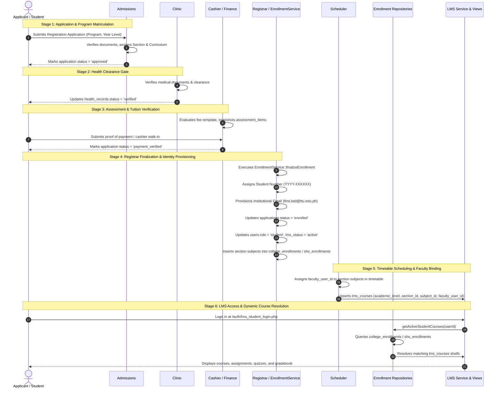

# LMS ↔ Enrollment Integration Blueprint & Traceability Analysis

> **Document Type**: Technical Integration Specification & System Contract  
> **Systems Involved**: TTU Enrollment System $\longleftrightarrow$ TTU Learning Management System  
> **Status**: Verified via Real-Time Code Execution & Database Traces  

---

## 1. End-to-End Student Lifecycle Flow



---

## 2. Forensic Code Trace of Lifecycle Questions

### Question 1: Does official enrollment create an "LMS Enrollment" record?
* **Code Trace**: Look at [app/Services/EnrollmentService.php](file:///c:/xampp/htdocs/sia/app/Services/EnrollmentService.php) lines 120–156:
  ```php
  $pdo->prepare('UPDATE applications SET status = "enrolled" WHERE id = :id')->execute(['id' => $applicationId]);
  $pdo->prepare('UPDATE users SET role = "student", lms_status = "active" WHERE id = :id')->execute(['id' => $userId]);
  // assignSectionSubjects:
  $insCe = $pdo->prepare('INSERT IGNORE INTO college_enrollments (application_id, subject_id, college_section_id) VALUES (:app_id, :sub_id, :sec_id)');
  ```
* **Actual Answer**: **NO.** There is no `lms_enrollments` table in the database. Enrollment does **not** insert any LMS-specific record. Instead, the student becomes eligible for LMS courses because their `users.lms_status` is marked `'active'`, `applications.status` is `'enrolled'`, and rows exist in `college_enrollments` or `shs_enrollments`.

---

### Question 2: Does the LMS automatically know which courses the student belongs to?
* **Code Trace**: Look at [app/Repositories/CollegeEnrollmentRepository.php](file:///c:/xampp/htdocs/sia/app/Repositories/CollegeEnrollmentRepository.php) lines 18–43:
  ```php
  SELECT ce.college_section_id, ce.subject_id, s.subject_code, s.subject_name ...
  FROM college_enrollments ce
  JOIN applications a ON ce.application_id = a.id
  JOIN subjects s ON ce.subject_id = s.id
  WHERE a.user_id = :uid AND a.status IN ('enrolled', 'approved')
  ```
* **Actual Answer**: **YES, dynamically on every request.** The LMS does not maintain a static cache or list of course registrations. It executes a live join between `college_enrollments` (or `shs_enrollments`) and `lms_courses` on every single dashboard and course load.

---

### Question 3: Does faculty automatically see their assigned classes?
* **Code Trace**: Look at [app/Services/LmsService.php](file:///c:/xampp/htdocs/sia/app/Services/LmsService.php) lines 62–91:
  ```php
  SELECT lc.id as lms_course_id, lc.academic_level, lc.academic_section_id, lc.subject_id, s.subject_code ...
  FROM lms_courses lc
  JOIN subjects s ON lc.subject_id = s.id
  WHERE lc.faculty_user_id = :fid AND lc.status = 'active'
  ```
### Question 3: Does faculty automatically see their assigned classes?
* **Code Trace**: Look at [app/Services/LmsService.php](file:///c:/xampp/htdocs/sia/app/Services/LmsService.php) lines 62–91:
  ```php
  SELECT lc.id as lms_course_id, lc.academic_level, lc.academic_section_id, lc.subject_id, s.subject_code ...
  FROM lms_courses lc
  JOIN subjects s ON lc.subject_id = s.id
  WHERE lc.faculty_user_id = :fid AND lc.status = 'active'
  ```
* **Actual Answer**: **YES, provided an `lms_courses` row exists for their user ID.**
  * If the schedule was saved via the Schedule Builder ([SchedulerController.php:771](file:///c:/xampp/htdocs/sia/app/Controllers/Admin/Scheduler/SchedulerController.php#L771)), the `lms_courses` row is synchronized immediately.
  * **Resolved in Phase 2**: Course shell provisioning is deterministic and idempotent via `LmsService::provisionCourseShell()`. When faculty is assigned, changed, or set to TBA (`NULL`), the `faculty_user_id` column updates accordingly without creating duplicate course shells.
  * **TBA Shell Support**: If a section subject has no assigned faculty, `faculty_user_id` is stored as `NULL`, displaying as "TBA" for students while preventing unauthorized faculty claiming.

---

### Question 4: Does the LMS use the same student identity/account as Enrollment?
* **Code Trace**: Look at [app/Controllers/Lms/LmsAuthController.php](file:///c:/xampp/htdocs/sia/app/Controllers/Lms/LmsAuthController.php) lines 69–85 and [app/Controllers/AuthController.php](file:///c:/xampp/htdocs/sia/app/Controllers/AuthController.php) lines 111–122.
* **Actual Answer**: **YES.** Both Enrollment and LMS share the identical `users` table. The student logs in using the exact same password and their official `student_number` (e.g. `2026-000001`) or `email` / `ttu_email`.

---

### Question 5: Does section assignment propagate into LMS?
* **Code Trace**: Look at [app/Repositories/CollegeEnrollmentRepository.php](file:///c:/xampp/htdocs/sia/app/Repositories/CollegeEnrollmentRepository.php) lines 89–95:
  ```php
  WHERE lc.academic_level = 'College' 
    AND lc.academic_section_id = :sec_id 
    AND lc.subject_id = :sub_id
  ```
* **Actual Answer**: **YES, at initial enrollment and during section transfers.**
  * When enrollment finalizes, `college_enrollments.college_section_id` receives the section ID.
  * **Resolved in Phase 2**: Reassigning a student's section now executes via `EnrollmentService::transferSection()`. This atomically updates `applications.section_id` AND `college_enrollments.college_section_id` (or `shs_enrollments.shs_section_id`) inside a PDO transaction. The student's LMS course access immediately shifts to the new section's course shells while revoking access to the old section.

---

### Question 6: Does curriculum determine LMS subjects?
* **Code Trace**: Look at [app/Controllers/Admin/Scheduler/SchedulerController.php](file:///c:/xampp/htdocs/sia/app/Controllers/Admin/Scheduler/SchedulerController.php) lines 504–526 and [app/Services/EnrollmentService.php](file:///c:/xampp/htdocs/sia/app/Services/EnrollmentService.php) lines 233–251.
* **Actual Answer**: **YES, indirectly through the Section.**
  1. Section is created with a `curriculum_id`.
  2. Scheduler auto-populates `college_section_subjects` from `college_curriculum_subjects`.
  3. `EnrollmentService::assignSectionSubjects` copies those subjects into `college_enrollments`.
  4. LMS repository reads `college_enrollments`.
  * For **Irregular students**, subjects are chosen via `application_subject_requests` and bypass standard curriculum progression, but still link to specific section offerings.

---

### Question 7: Does dropping/adding a subject update LMS?
* **Code Trace**: Look at repository query in [CollegeEnrollmentRepository.php](file:///c:/xampp/htdocs/sia/app/Repositories/CollegeEnrollmentRepository.php#L34-L42).
* **Actual Answer**:
  * **Resolved in Phase 2**: Supported via `EnrollmentService::dropSubject()` and `withdrawSubject()`.
  * Rather than hard-deleting records and orphaning historical data, the enrollment row transitions to `status = 'dropped'` with `dropped_at = NOW()`.
  * The student immediately loses active LMS course access, and is excluded from active faculty gradebooks and attendance rosters.
  * All historical student submissions (`lms_submissions`) and quiz attempts (`lms_quiz_attempts`) remain safely preserved in the database for institutional auditing.

---

### Question 8: Does an inactive/unenrolled student still have LMS access?
* **Code Trace**: Look at [app/Controllers/Lms/LmsAuthController.php](file:///c:/xampp/htdocs/sia/app/Controllers/Lms/LmsAuthController.php).
* **Actual Answer**:
  * **Resolved in Phase 1**: Strict `status = 'enrolled'` gate enforced. Applicants whose status is merely `approved` or `payment_verified` are rejected from LMS authentication with a clear warning explaining that registrar finalization is required.
  * Inactive or suspended users (`is_active = 0` or `lms_status = 'suspended'`) are blocked from authentication.

---

## 3. Source of Truth Matrix

| Domain Information | Primary Authoritative Owner | LMS Role | Relational Field / Mechanism | Architectural Violations in Current Code |
| :--- | :--- | :--- | :--- | :--- |
| **Student Identity** | **Enrollment** (`users`) | Consumer | `users.id`, `student_number` | None. Cleanly shared. |
| **Academic Program** | **Enrollment** (`college_programs`, `shs_strands`) | Consumer | Joined via `college_sections.program_id` | None. |
| **Curriculum Catalog** | **Enrollment** (`college_curricula`, `subjects`) | Consumer | Immutable catalog. LMS never creates subjects. | None. |
| **Section & Cohort** | **Enrollment** (`college_sections`, `shs_sections`) | Consumer | `lms_courses.academic_section_id` | `lms_courses` has no direct FK on section ID due to polymorphic `academic_level`. |
| **Schedule / Timetable** | **Enrollment** (`college_section_subjects`) | Consumer | Timetable blocks (`day`, `start_time`, `room`) | LMS repositories read timetable live; duplicate instructor string vs faculty ID exists. |
| **Faculty Assignment** | **Enrollment / Scheduler** | Consumer | `college_section_subjects.faculty_user_id` $\rightarrow$ `lms_courses.faculty_user_id` | When scheduler changes faculty, un-synced LMS courses may retain stale faculty ID. |
| **Official Enrollment** | **Enrollment** (`applications.status = 'enrolled'`, `college_enrollments`) | Gating Authority | `college_enrollments.application_id` | `LmsAuthController` allows `status = 'approved'`, violating Registrar gate. |
| **Course Classroom Shell** | **LMS** (`lms_courses`) | **OWNER** | `lms_courses.id` | Generated via 3 uncoordinated methods (JIT, Scheduler, Admin). |
| **Learning Materials** | **LMS** (`lms_modules`, `lms_materials`) | **OWNER** | Attached to `lms_courses.id` | Upload directory escapes to outside project root. |
| **Assignments & Quizzes** | **LMS** (`lms_assignments`, `lms_quizzes`) | **OWNER** | Attached to `lms_courses.id` | None. Pure LMS ownership. |
| **Student Submissions & Attempts** | **LMS** (`lms_submissions`, `lms_quiz_attempts`) | **OWNER** | Attached to LMS tasks + `users.id` | Submissions table uses `student_id` instead of `user_id` (safe but mismatched in docs). |
| **Course Grades (LMS Tasks)** | **LMS** (`lms_submissions.grade`, quiz scores) | **OWNER** | Scoped to individual LMS assessment items | Does not yet push official final midterm/final grades back to Registrar transcript. |
| **Attendance Meetings** | **LMS** (`lms_attendance_sessions`, records) | **OWNER** | Attached to `lms_courses.id` | None. Pure LMS ownership. |

---

## 4. Data Duplication Audit

| Data Item | Existing Location (Enrollment) | Duplicate Location (LMS) | Classification | Architectural Verdict & Recommendation |
| :--- | :--- | :--- | :--- | :--- |
| **Instructor Identity** | `users.id` / `college_section_subjects.faculty_user_id` | `college_section_subjects.instructor` (VARCHAR) AND `lms_courses.faculty_user_id` | **DANGEROUS** | Storing `instructor` as a freeform string in `college_section_subjects` leads to name mismatches. **Recommendation**: Deprecate string column; enforce `faculty_user_id` as non-nullable FK. |
| **Section Identifier** | `college_sections.section_code` | Dynamically joined in views | **INTENTIONAL & CLEAN** | LMS does not store `section_code` in `lms_courses`. It reads it dynamically via JOIN. Keep this pattern. |
| **Subject Title & Code** | `subjects.subject_code`, `subject_name` | Dynamically joined in views | **INTENTIONAL & CLEAN** | LMS references `lms_courses.subject_id $\rightarrow$ subjects.id`. No duplicate subject names in LMS tables. |
| **Enrolled Student Roster** | `college_enrollments (application_id, subject_id, college_section_id)` | Read live in repositories and gradebook | **NECESSARY REFERENCE** | LMS has no `lms_enrollments` table. It queries `college_enrollments` directly. **Recommendation**: Keep referencing directly; avoid creating a duplicate `lms_enrollments` table. |
| **Student Roster Count** | Count of `college_enrollments` | Subquery in `LmsService::getFacultyCourses` reading `applications.section_id` | **INCORRECTLY SYNCHRONIZED** | Subquery in `LmsService` checks `applications.section_id = lc.academic_section_id`. This hides irregular students! **Recommendation**: Change subquery to count distinct students from `college_enrollments` / `shs_enrollments`. |

---

## 5. Formal System Integration Contract

To maintain clean architectural boundaries and zero regressions:

### Contract Invariants
1. **Never Insert LMS Enrollments**: LMS shall never duplicate enrollment records into a separate table. All student course access must query `college_enrollments` (College) or `shs_enrollments` (SHS) where `applications.status = 'enrolled'`.
2. **Never Permit Unfinalized Access**: The condition `applications.status IN ('enrolled', 'approved')` in `LmsAuthController` and `CollegeEnrollmentRepository` must be strictly refactored to `applications.status = 'enrolled'`.
3. **Synchronous Shell Generation on Schedule Finalization**: Whenever Scheduler assigns a faculty member to a section-subject, an `lms_courses` shell must be created or updated atomically in the same database transaction.
4. **No JIT Writes in Read Repositories**: `CollegeEnrollmentRepository::getActiveStudentCourses()` and `ShsEnrollmentRepository` must be pure read operations. They should never execute `INSERT INTO lms_courses` during HTTP `GET` requests.
5. **Section Subject Timetable is Binding**: The assigned instructor in `college_section_subjects.faculty_user_id` is the authoritative teacher of the LMS course shell.
