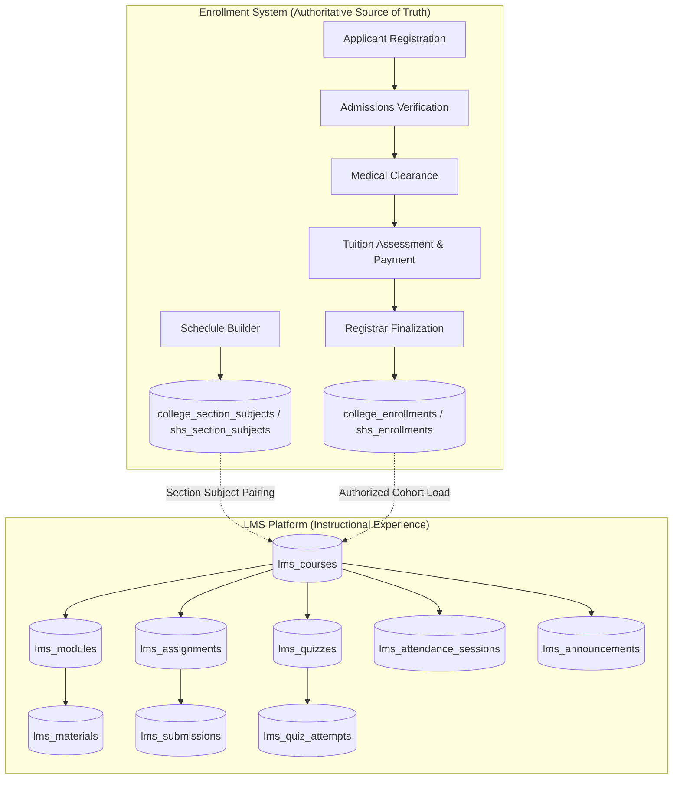
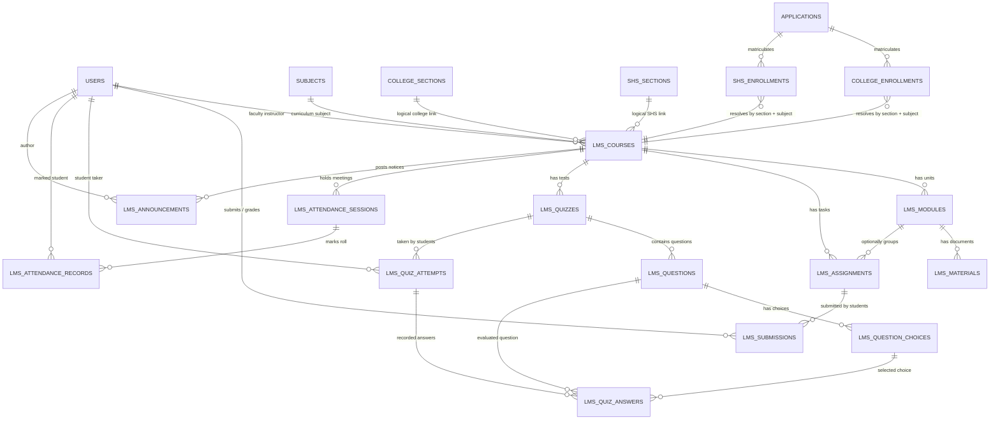
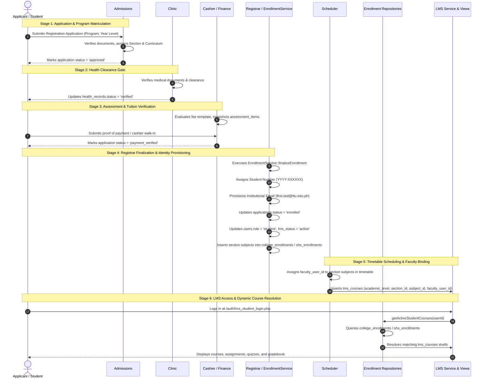
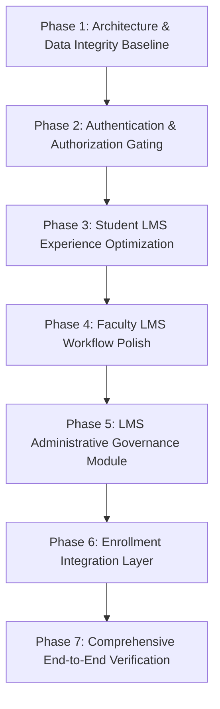

# TTU LEARNING MANAGEMENT SYSTEM (LMS) MASTER TECHNICAL AUDIT & ENROLLMENT INTEGRATION SPECIFICATION

> **Institutional System**: Triple T University (TTU) Academic & Learning Management System  
> **Subsystem**: Learning Management System (LMS) & Enrollment Integration Engine  
> **Repository Workspace**: `c:\xampp\htdocs\sia`  
> **Lead Architect & Auditor**: Lead Developer, System Architect & Technical Auditor  
> **Verification Status**: 100% Grounded in Active Source Code, Live MariaDB Schema & Execution Traces  
> **Audit Date**: September 28, 2026  

---

## TABLE OF CONTENTS
1. [Executive Summary & Current State Baseline](#1-executive-summary--current-state-baseline)
2. [System Overview, Philosophy & User Roles](#2-system-overview-philosophy--user-roles)
3. [LMS Subsystems & Hybrid MVC Architecture](#3-lms-subsystems--hybrid-mvc-architecture)
4. [Complete LMS Route Map & Execution Matrix](#4-complete-lms-route-map--execution-matrix)
5. [Database Schema Map & Relational Architecture](#5-database-schema-map--relational-architecture)
6. [Enrollment ↔ LMS Lifecycle Integration & Contract](#6-enrollment--lms-lifecycle-integration--contract)
7. [Comprehensive Feature Audit & Operational State](#7-comprehensive-feature-audit--operational-state)
8. [Authentication & Authorization Security Audit](#8-authentication--authorization-security-audit)
9. [Gap Analysis & Root Cause Diagnostics (Top 10 Defects)](#9-gap-analysis--root-cause-diagnostics-top-10-defects)
10. [Target LMS Architecture & System Contract](#10-target-lms-architecture--system-contract)
11. [7-Phase Rebuild & Implementation Roadmap](#11-7-phase-rebuild--implementation-roadmap)
12. [Verification Matrix & Test Scenario Results](#12-verification-matrix--test-scenario-results)

---

## 1. EXECUTIVE SUMMARY & CURRENT STATE BASELINE

This document establishes the single authoritative technical master specification for the TTU Learning Management System (LMS) and its integration with the official Enrollment System.

### Current Reality Check
Contrary to legacy documentation assumptions:
* **The LMS has an active, functional Hybrid MVC codebase**: It contains 12 dedicated controllers, 6 domain services, 2 level-specific enrollment repositories, and 40 views.
* **Enrollment data is not duplicated**: The system does **not** maintain a separate `lms_enrollments` table. Course eligibility is resolved dynamically via live joins between [college_enrollments](file:///c:/xampp/htdocs/sia/database/schema.sql#L377) (or [shs_enrollments](file:///c:/xampp/htdocs/sia/database/schema.sql#L349)) and [lms_courses](file:///c:/xampp/htdocs/sia/database/schema.sql#L430).
* **Multi-Section Course Shell Isolation Works**: Course shells in [lms_courses](file:///c:/xampp/htdocs/sia/database/schema.sql#L430) enforce `UNIQUE(academic_level, academic_section_id, subject_id)`. Different sections taking the same subject receive isolated classroom shells.
* **Three Critical Defects Paralyze Core Workflows**:
  1. **Storage Path Escape & Download Bug**: File uploads in [FacultyController.php:90](file:///c:/xampp/htdocs/sia/app/Controllers/Lms/FacultyController.php#L90) write outside webroot to `c:\xampp\storage\lms_materials/`, while [DownloadController.php:56](file:///c:/xampp/htdocs/sia/app/Controllers/Lms/DownloadController.php#L56) reads from `app/uploads/lms/`. Combined with a missing session role check (`$_SESSION['role']`), **100% of material downloads return HTTP 403 Forbidden or 404 Not Found**.
  2. **Premature LMS Admission Gating**: [LmsAuthController.php:96](file:///c:/xampp/htdocs/sia/app/Controllers/Lms/LmsAuthController.php#L96) permits applicants with `status = 'approved'` into the LMS before cashier payment or registrar enrollment finalization.
  3. **Unprotected Routes**: In [app/Routes/web.php:181](file:///c:/xampp/htdocs/sia/app/Routes/web.php#L181), student and faculty routes lack `RoleMiddleware`, allowing any authenticated user to hit internal endpoints directly.

---

## 2. SYSTEM OVERVIEW, PHILOSOPHY & USER ROLES

### 2.1 Core Architectural Philosophy
> **The Enrollment System is the absolute, authoritative source of truth for student identity, academic credentials, program matriculation, section schedules, and official subject course loads. The LMS is a downstream learning delivery system that projects and enhances the academic experience anchored on official enrollments.**

The LMS never originates student identities, confers degrees, collects tuition fees, or alters official academic records. It provides digital instructional delivery on top of active registrar enrollments.



### 2.2 System Actors & Role Capabilities

| Role Identifier | Primary Identity Source | Actual System Capabilities | Actual Limitations / Gaps in Code |
| :--- | :--- | :--- | :--- |
| **Enrolled Student** (`student`) | `users.role = 'student'`, verified via `applications.status = 'enrolled'` | • View enrolled courses in [my_courses.php](file:///c:/xampp/htdocs/sia/app/Views/lms/student/my_courses.php)<br>• Download published lecture files in [course.php](file:///c:/xampp/htdocs/sia/app/Views/lms/student/course.php)<br>• Upload assignment submissions ([StudentAssignmentController](file:///c:/xampp/htdocs/sia/app/Controllers/Lms/StudentAssignmentController.php))<br>• Take timed multiple-choice/true-false quizzes ([StudentQuizController](file:///c:/xampp/htdocs/sia/app/Controllers/Lms/StudentQuizController.php))<br>• View personal grades breakdown ([StudentGradebookController](file:///c:/xampp/htdocs/sia/app/Controllers/Lms/StudentGradebookController.php))<br>• Review personal attendance logs ([StudentAttendanceController](file:///c:/xampp/htdocs/sia/app/Controllers/Lms/StudentAttendanceController.php))<br>• View professor course announcements and academic calendar | • Cannot view courses if no instructor has been assigned to timetable schedule (`continue` branch in repository)<br>• File downloads fail with HTTP 403 due to session key bug (`$_SESSION['role']` vs `$_SESSION['user_role']`)<br>• Gradebook load triggers $O(N \times M)$ query storm across whole class |
| **Faculty Instructor** (`faculty`) | `users.role = 'faculty'`, linked via `faculty_profiles` and timetable | • View assigned teaching course shells in [dashboard.php](file:///c:/xampp/htdocs/sia/app/Views/lms/faculty/dashboard.php)<br>• Create course modules & publish materials ([FacultyController](file:///c:/xampp/htdocs/sia/app/Controllers/Lms/FacultyController.php))<br>• Create/edit assignments, download submissions, and grade with feedback ([FacultyAssignmentController](file:///c:/xampp/htdocs/sia/app/Controllers/Lms/FacultyAssignmentController.php))<br>• Author timed quizzes, build question choices, review attempt scores ([FacultyQuizController](file:///c:/xampp/htdocs/sia/app/Controllers/Lms/FacultyQuizController.php))<br>• Create attendance sessions and log present/absent roster ([FacultyAttendanceController](file:///c:/xampp/htdocs/sia/app/Controllers/Lms/FacultyAttendanceController.php))<br>• Publish course-level announcements ([FacultyAnnouncementController](file:///c:/xampp/htdocs/sia/app/Controllers/Lms/FacultyAnnouncementController.php)) | • Material upload path escapes into `c:\xampp\storage\lms_materials/` instead of project directory<br>• Calendar links hardcode student URLs instead of faculty authoring URLs<br>• Roster count uses `applications.section_id` instead of actual enrollments, hiding irregular students from card count |
| **LMS Administrator / Superadmin** (`admin`, `superadmin`) | `users.role IN ('admin', 'superadmin')` with administrative permissions | • Generate unmapped LMS courses via [LmsAdminController](file:///c:/xampp/htdocs/sia/app/Controllers/Admin/LmsAdminController.php) at `/admin/lms/generator`<br>• Global oversight access to view any course shell in `LmsService` | • **MISSING**: No administrative course index, course editor, or archiving tool<br>• **MISSING**: No LMS user suspension or section transfer sync<br>• **MISSING**: No audit logging for LMS actions<br>• **MISSING**: No course cloning across academic terms |
| **Applicant / Unenrolled User** (`applicant`) | `users.role = 'applicant'` | • Restricted to admissions portal ([ApplicantController](file:///c:/xampp/htdocs/sia/app/Controllers/ApplicantController.php)) | • **SECURITY VULNERABILITY**: Can log into student LMS portal at [LmsAuthController](file:///c:/xampp/htdocs/sia/app/Controllers/Lms/LmsAuthController.php) if application status is `approved` (even before cashier payment or registrar enrollment) |

---

## 3. LMS SUBSYSTEMS & HYBRID MVC ARCHITECTURE

The codebase follows the institutional **Hybrid MVC + Fat Controller / Domain Service** architecture:

```text
c:\xampp\htdocs\sia\
├── app\
│   ├── Controllers\
│   │   ├── Admin\
│   │   │   └── LmsAdminController.php           # Administrative course shell generation
│   │   └── Lms\
│   │       ├── DownloadController.php           # Secure material and submission file streaming
│   │       ├── FacultyAnnouncementController.php # Faculty announcement CRUD
│   │       ├── FacultyAssignmentController.php   # Faculty assignment management & grading
│   │       ├── FacultyAttendanceController.php   # Faculty attendance session & roster logger
│   │       ├── FacultyCalendarController.php     # Faculty academic event calendar
│   │       ├── FacultyController.php             # Faculty dashboard, course overview, module creator
│   │       ├── FacultyGradebookController.php    # Faculty course-wide gradebook grid
│   │       ├── FacultyQuizController.php         # Faculty quiz authoring & question bank
│   │       ├── LmsAuthController.php             # Dedicated LMS Student and Faculty login/logout
│   │       ├── StudentAnnouncementController.php # Student course announcement viewer
│   │       ├── StudentAssignmentController.php   # Student assignment submission
│   │       ├── StudentAttendanceController.php   # Student personal attendance history
│   │       ├── StudentCalendarController.php     # Student academic calendar
│   │       ├── StudentController.php             # Student dashboard, my courses, course modules
│   │       ├── StudentGradebookController.php    # Student personal gradebook breakdown
│   │       └── StudentQuizController.php         # Student timed quiz taker & results
│   ├── Services\
│   │   ├── LmsService.php                       # Core LMS course, module, assignment aggregation
│   │   ├── LmsAnnouncementService.php           # Course announcement business logic
│   │   ├── LmsAttendanceService.php             # Attendance session & record management
│   │   ├── LmsCalendarService.php               # Calendar deadline & event aggregation
│   │   ├── LmsGradebookService.php              # Full gradebook grid calculation
│   │   └── LmsQuizService.php                   # Quiz timing, questions, and automated scoring
│   ├── Repositories\
│   │   ├── EnrollmentRepositoryInterface.php    # Contract for level-specific course resolution
│   │   ├── CollegeEnrollmentRepository.php      # College student enrollment query & JIT provisioner
│   │   └── ShsEnrollmentRepository.php          # SHS student enrollment query & JIT provisioner
│   └── Views\
│       └── lms\
│           ├── faculty\                         # 21 faculty presentation views & components
│           └── student\                         # 19 student presentation views & components
```

---

## 4. COMPLETE LMS ROUTE MAP & EXECUTION MATRIX

All 38 registered LMS routes in [app/Routes/web.php](file:///c:/xampp/htdocs/sia/app/Routes/web.php) mapped with controllers, services, database tables, and returned views:

### 4.1 Authentication & Session Routes

| URL / Path | HTTP Method | Middleware & Route Guards | Controller Action | Services & Repositories | Database Tables Involved | View Returned | Key Notes |
| :--- | :--- | :--- | :--- | :--- | :--- | :--- | :--- |
| `/auth/lms_student_login.php` | `GET` | `SessionSecurityMiddleware`, `CsrfMiddleware` | [`LmsAuthController@showStudentLogin`](file:///c:/xampp/htdocs/sia/app/Controllers/Lms/LmsAuthController.php) | None | None | `auth/lms_student_login` | Unauthenticated. Renders student login card with Student Number & Password inputs. |
| `/auth/lms_faculty_login.php` | `GET` | `SessionSecurityMiddleware`, `CsrfMiddleware` | [`LmsAuthController@showFacultyLogin`](file:///c:/xampp/htdocs/sia/app/Controllers/Lms/LmsAuthController.php) | None | None | `auth/lms_faculty_login` | Unauthenticated. Renders faculty login card with Employee ID / Email & Password inputs. |
| `/auth/lms_login_process.php` | `POST` | `SessionSecurityMiddleware`, `CsrfMiddleware` | [`LmsAuthController@loginProcess`](file:///c:/xampp/htdocs/sia/app/Controllers/Lms/LmsAuthController.php) | None | `users`, `applications`, `faculty_profiles` | Redirect to Dashboard | Handles authentication for student and faculty. Allows `applications.status = 'approved'`. |
| `/auth/lms_student_logout.php`<br>`/lms/student/logout` | `GET` | `SessionSecurityMiddleware`, `CsrfMiddleware` | [`LmsAuthController@logoutStudent`](file:///c:/xampp/htdocs/sia/app/Controllers/Lms/LmsAuthController.php) | None | None | Redirect `/sia/auth/lms_student_login.php` | Destroys active session and invalidates cookies. |
| `/auth/lms_faculty_logout.php`<br>`/lms/faculty/logout` | `GET` | `SessionSecurityMiddleware`, `CsrfMiddleware` | [`LmsAuthController@logoutFaculty`](file:///c:/xampp/htdocs/sia/app/Controllers/Lms/LmsAuthController.php) | None | None | Redirect `/sia/auth/lms_faculty_login.php` | Destroys active session and invalidates cookies. |

### 4.2 Student LMS Portal Routes

> **Active Middleware**: `SessionSecurityMiddleware`, `CsrfMiddleware`, `AuthMiddleware` *(Missing explicit `RoleMiddleware:student` in [web.php](file:///c:/xampp/htdocs/sia/app/Routes/web.php))*

| URL / Path | HTTP Method | Controller Action | Services & Repositories | Database Tables Involved | View Returned | Workflow Description |
| :--- | :--- | :--- | :--- | :--- | :--- | :--- |
| `/lms/student/dashboard.php` | `GET` | [`StudentController@dashboard`](file:///c:/xampp/htdocs/sia/app/Controllers/Lms/StudentController.php) | [`LmsService`](file:///c:/xampp/htdocs/sia/app/Services/LmsService.php), [`CollegeEnrollmentRepository`](file:///c:/xampp/htdocs/sia/app/Repositories/CollegeEnrollmentRepository.php), [`ShsEnrollmentRepository`](file:///c:/xampp/htdocs/sia/app/Repositories/ShsEnrollmentRepository.php) | `applications`, `college_enrollments`, `shs_enrollments`, `lms_courses`, `lms_assignments`, `lms_quizzes`, `lms_announcements`, `activity_logs` | `lms/student/dashboard` | Main student landing. Computes course cards, upcoming deadlines, study streak meter, next timetable session, and professor updates. |
| `/lms/student/course.php?id={id}` | `GET` | [`StudentController@course`](file:///c:/xampp/htdocs/sia/app/Controllers/Lms/StudentController.php) | `LmsService`, `LmsAnnouncementService`, `LmsQuizService` | `lms_courses`, `subjects`, `college_sections`, `shs_sections`, `users`, `lms_modules`, `lms_materials`, `lms_assignments`, `lms_quizzes`, `lms_announcements` | `lms/student/course` | Course learning overview. Displays syllabus, instructor dossier, accordion modules with downloadable materials, and tab counters. |
| `/lms/student/my_courses.php` | `GET` | [`StudentController@myCourses`](file:///c:/xampp/htdocs/sia/app/Controllers/Lms/StudentController.php) | `LmsService`, `CollegeEnrollmentRepository`, `ShsEnrollmentRepository` | `applications`, `college_enrollments`, `shs_enrollments`, `subjects`, `college_sections`, `shs_sections`, `lms_courses` | `lms/student/my_courses` | Comprehensive enrolled courses dossier showing timetable blocks, total academic units, and instructor cards. |
| `/lms/student/course/{course_id}/assignments` | `GET` | [`StudentAssignmentController@index`](file:///c:/xampp/htdocs/sia/app/Controllers/Lms/StudentAssignmentController.php) | `LmsService` | `lms_courses`, `lms_assignments`, `lms_submissions` | `lms/student/assignments/index` | Course assignment list with submission badges (`Pending`, `Submitted`, `Graded`). |
| `/lms/student/course/{course_id}/assignments/{id}` | `GET` | [`StudentAssignmentController@show`](file:///c:/xampp/htdocs/sia/app/Controllers/Lms/StudentAssignmentController.php) | `LmsService` | `lms_assignments`, `lms_submissions`, `lms_courses` | `lms/student/assignments/show` | Assignment instructions, reference file link, student submission file, and instructor grade/feedback. |
| `/lms/student/course/{course_id}/assignments/{id}/submit` | `POST` | [`StudentAssignmentController@submit`](file:///c:/xampp/htdocs/sia/app/Controllers/Lms/StudentAssignmentController.php) | `LmsService` | `lms_assignments`, `lms_submissions` | Redirect back | Processes multipart file upload (`app/uploads/lms/submissions/`), sets status `SUBMITTED` or `RESUBMITTED`. |
| `/lms/student/course/{course_id}/quizzes` | `GET` | [`StudentQuizController@index`](file:///c:/xampp/htdocs/sia/app/Controllers/Lms/StudentQuizController.php) | `LmsService`, [`LmsQuizService`](file:///c:/xampp/htdocs/sia/app/Services/LmsQuizService.php) | `lms_courses`, `lms_quizzes`, `lms_quiz_attempts` | `lms/student/quizzes/index` | Course quizzes catalog showing time limits, max attempts, and best score. |
| `/lms/student/course/{course_id}/quizzes/{id}` | `GET` | [`StudentQuizController@show`](file:///c:/xampp/htdocs/sia/app/Controllers/Lms/StudentQuizController.php) | `LmsService`, `LmsQuizService` | `lms_quizzes`, `lms_quiz_attempts`, `lms_courses` | `lms/student/quizzes/show` | Quiz instructions, start/end dates, previous attempt history, and "Start Attempt" button. |
| `/lms/student/course/{course_id}/quizzes/{id}/start` | `POST` | [`StudentQuizController@start`](file:///c:/xampp/htdocs/sia/app/Controllers/Lms/StudentQuizController.php) | `LmsQuizService` | `lms_quizzes`, `lms_quiz_attempts` | Redirect to attempt | Validates attempt limit and creates new `in_progress` attempt record in `lms_quiz_attempts`. |
| `/lms/student/course/{course_id}/quizzes/{quiz_id}/attempt/{attempt_id}` | `GET` | [`StudentQuizController@attempt`](file:///c:/xampp/htdocs/sia/app/Controllers/Lms/StudentQuizController.php) | `LmsService`, `LmsQuizService` | `lms_quizzes`, `lms_quiz_attempts`, `lms_questions`, `lms_question_choices` | `lms/student/quizzes/attempt` | Active timed assessment interface with live JavaScript countdown timer and radio question choices. |
| `/lms/student/course/{course_id}/quizzes/{quiz_id}/attempt/{attempt_id}/submit` | `POST` | [`StudentQuizController@submit`](file:///c:/xampp/htdocs/sia/app/Controllers/Lms/StudentQuizController.php) | `LmsQuizService` | `lms_quiz_attempts`, `lms_questions`, `lms_question_choices`, `lms_quiz_answers` | Redirect to result | Auto-evaluates student answers, awards points, transitions attempt to `graded`, commits transaction. |
| `/lms/student/course/{course_id}/quizzes/{quiz_id}/result/{attempt_id}` | `GET` | [`StudentQuizController@result`](file:///c:/xampp/htdocs/sia/app/Controllers/Lms/StudentQuizController.php) | `LmsService`, `LmsQuizService` | `lms_quizzes`, `lms_quiz_attempts`, `lms_questions`, `lms_quiz_answers` | `lms/student/quizzes/result` | Immediate assessment breakdown displaying awarded score, correct answers, and points earned. |
| `/lms/student/course/{course_id}/gradebook` | `GET` | [`StudentGradebookController@index`](file:///c:/xampp/htdocs/sia/app/Controllers/Lms/StudentGradebookController.php) | `LmsService`, [`LmsGradebookService`](file:///c:/xampp/htdocs/sia/app/Services/LmsGradebookService.php) | `lms_courses`, `lms_assignments`, `lms_quizzes`, `college_enrollments`, `lms_submissions`, `lms_quiz_attempts` | `lms/student/gradebook/index` | Student personal grade summary across assignments and quizzes. *(Contains $O(N \times M)$ query bottleneck)*. |
| `/lms/student/course/{course_id}/attendance` | `GET` | [`StudentAttendanceController@index`](file:///c:/xampp/htdocs/sia/app/Controllers/Lms/StudentAttendanceController.php) | `LmsService`, [`LmsAttendanceService`](file:///c:/xampp/htdocs/sia/app/Services/LmsAttendanceService.php) | `lms_courses`, `lms_attendance_sessions`, `lms_attendance_records` | `lms/student/attendance/index` | Attendance percentage gauge, risk indicator, and chronological log (`Present`, `Late`, `Absent`, `Excused`). |
| `/lms/student/course/{course_id}/announcements` | `GET` | [`StudentAnnouncementController@index`](file:///c:/xampp/htdocs/sia/app/Controllers/Lms/StudentAnnouncementController.php) | `LmsService`, [`LmsAnnouncementService`](file:///c:/xampp/htdocs/sia/app/Services/LmsAnnouncementService.php) | `lms_courses`, `lms_announcements`, `users` | `lms/student/announcements/index` | Course-scoped announcement board displaying instructor bulletins. |
| `/lms/student/calendar` | `GET` | [`StudentCalendarController@index`](file:///c:/xampp/htdocs/sia/app/Controllers/Lms/StudentCalendarController.php) | [`LmsCalendarService`](file:///c:/xampp/htdocs/sia/app/Services/LmsCalendarService.php), `LmsService` | `lms_courses`, `lms_assignments`, `lms_quizzes` | `lms/student/calendar/index` | Monthly calendar grid plotting assignment due dates and quiz expiration times. |
| `/lms/student/profile.php` | `GET` | [`StudentController@profile`](file:///c:/xampp/htdocs/sia/app/Controllers/Lms/StudentController.php) | None | `users` | `lms/student/profile` | Student user profile presentation. |
| `/lms/student/messages.php` | `GET` | [`StudentController@messages`](file:///c:/xampp/htdocs/sia/app/Controllers/Lms/StudentController.php) | None | None | `lms/student/messages` | Placeholder messaging/forum interface. |

### 4.3 Faculty LMS Portal Routes

> **Active Middleware**: `SessionSecurityMiddleware`, `CsrfMiddleware`, `AuthMiddleware` *(Missing explicit `RoleMiddleware:faculty` in [web.php](file:///c:/xampp/htdocs/sia/app/Routes/web.php))*

| URL / Path | HTTP Method | Controller Action | Services & Repositories | Database Tables Involved | View Returned | Workflow Description |
| :--- | :--- | :--- | :--- | :--- | :--- | :--- |
| `/lms/faculty/dashboard.php` | `GET` | [`FacultyController@dashboard`](file:///c:/xampp/htdocs/sia/app/Controllers/Lms/FacultyController.php) | `LmsService` | `lms_courses`, `subjects`, `college_sections`, `shs_sections`, `users`, `lms_assignments`, `lms_submissions`, `lms_announcements` | `lms/faculty/dashboard` | Faculty homepage showing active teaching load, student count, pending grading queue, and recent submissions. |
| `/lms/faculty/course.php?id={id}` | `GET` | [`FacultyController@course`](file:///c:/xampp/htdocs/sia/app/Controllers/Lms/FacultyController.php) | `LmsService` | `lms_courses`, `subjects`, `college_sections`, `lms_modules`, `lms_materials` | `lms/faculty/course` | Faculty course workspace with module authoring modal and material uploader. |
| `/lms/faculty/module_create.php` | `POST` | [`FacultyController@createModule`](file:///c:/xampp/htdocs/sia/app/Controllers/Lms/FacultyController.php) | `LmsService` | `lms_modules` | Redirect to course | Inserts new instructional unit into `lms_modules`. |
| `/lms/faculty/material_upload.php` | `POST` | [`FacultyController@uploadMaterial`](file:///c:/xampp/htdocs/sia/app/Controllers/Lms/FacultyController.php) | `LmsService` | `lms_materials` | Redirect to course | **CONTAINS STORAGE ESCAPE BUG**: Uploads file to `__DIR__/../../../../storage/lms_materials/` instead of project directory. |
| `/lms/faculty/profile.php` | `GET` | [`FacultyController@profile`](file:///c:/xampp/htdocs/sia/app/Controllers/Lms/FacultyController.php) | None | `users`, `faculty_profiles` | `lms/faculty/profile` | Faculty academic rank and department credentials view. |
| `/lms/faculty/messages.php` | `GET` | [`FacultyController@messages`](file:///c:/xampp/htdocs/sia/app/Controllers/Lms/FacultyController.php) | None | None | `lms/faculty/messages` | Faculty messaging interface placeholder. |
| `/lms/faculty/calendar` | `GET` | [`FacultyCalendarController@index`](file:///c:/xampp/htdocs/sia/app/Controllers/Lms/FacultyCalendarController.php) | `LmsCalendarService` | `lms_courses`, `lms_assignments`, `lms_quizzes` | `lms/faculty/calendar/index` | Faculty schedule grid plotting assignment deadlines across teaching sections. *(Contains URL bug pointing to student paths)*. |
| `/lms/faculty/course/{course_id}/assignments` | `GET` | [`FacultyAssignmentController@index`](file:///c:/xampp/htdocs/sia/app/Controllers/Lms/FacultyAssignmentController.php) | `LmsService` | `lms_courses`, `lms_assignments` | `lms/faculty/assignments/index` | Faculty assignment manager listing published and draft tasks. |
| `/lms/faculty/course/{course_id}/assignments/create` | `GET` | [`FacultyAssignmentController@create`](file:///c:/xampp/htdocs/sia/app/Controllers/Lms/FacultyAssignmentController.php) | `LmsService` | `lms_courses` | `lms/faculty/assignments/form` | Form to author new assignment (title, instructions, due date, max score, draft/published). |
| `/lms/faculty/course/{course_id}/assignments/store` | `POST` | [`FacultyAssignmentController@store`](file:///c:/xampp/htdocs/sia/app/Controllers/Lms/FacultyAssignmentController.php) | `LmsService` | `lms_assignments` | Redirect to index | Validates payload and persists new record in `lms_assignments`. |
| `/lms/faculty/course/{course_id}/assignments/{id}/edit` | `GET` | [`FacultyAssignmentController@edit`](file:///c:/xampp/htdocs/sia/app/Controllers/Lms/FacultyAssignmentController.php) | `LmsService` | `lms_courses`, `lms_assignments` | `lms/faculty/assignments/form` | Form to edit existing assignment metadata. |
| `/lms/faculty/course/{course_id}/assignments/{id}/update` | `POST` | [`FacultyAssignmentController@update`](file:///c:/xampp/htdocs/sia/app/Controllers/Lms/FacultyAssignmentController.php) | `LmsService` | `lms_assignments` | Redirect to index | Updates title, description, max score, due date, or publishing status. |
| `/lms/faculty/course/{course_id}/assignments/{id}/submissions` | `GET` | [`FacultyAssignmentController@submissions`](file:///c:/xampp/htdocs/sia/app/Controllers/Lms/FacultyAssignmentController.php) | `LmsService` | `lms_assignments`, `lms_submissions`, `users` | `lms/faculty/assignments/submissions` | Submissions queue displaying student names, file download link, submission timestamps, and grading modal. |
| `/lms/faculty/course/{course_id}/assignments/{id}/grade` | `POST` | [`FacultyAssignmentController@grade`](file:///c:/xampp/htdocs/sia/app/Controllers/Lms/FacultyAssignmentController.php) | `LmsService` | `lms_submissions` | Redirect to queue | Saves score (`grade`), instructor feedback notes, sets status `GRADED`, records `graded_by` user ID. |
| `/lms/faculty/course/{course_id}/quizzes` | `GET` | [`FacultyQuizController@index`](file:///c:/xampp/htdocs/sia/app/Controllers/Lms/FacultyQuizController.php) | `LmsService`, `LmsQuizService` | `lms_courses`, `lms_quizzes` | `lms/faculty/quizzes/index` | Course quiz manager listing published/draft quizzes with timing rules. |
| `/lms/faculty/course/{course_id}/quizzes/create` | `GET` | [`FacultyQuizController@create`](file:///c:/xampp/htdocs/sia/app/Controllers/Lms/FacultyQuizController.php) | `LmsService` | `lms_courses` | `lms/faculty/quizzes/form` | Form to configure quiz settings (time limit, max attempts, passing score, date windows). |
| `/lms/faculty/course/{course_id}/quizzes/store` | `POST` | [`FacultyQuizController@store`](file:///c:/xampp/htdocs/sia/app/Controllers/Lms/FacultyQuizController.php) | `LmsQuizService` | `lms_quizzes` | Redirect to index | Inserts new assessment into `lms_quizzes`. |
| `/lms/faculty/course/{course_id}/quizzes/{id}/edit` | `GET` | [`FacultyQuizController@edit`](file:///c:/xampp/htdocs/sia/app/Controllers/Lms/FacultyQuizController.php) | `LmsService`, `LmsQuizService` | `lms_courses`, `lms_quizzes` | `lms/faculty/quizzes/form` | Form to modify quiz parameters. |
| `/lms/faculty/course/{course_id}/quizzes/{id}/update` | `POST` | [`FacultyQuizController@update`](file:///c:/xampp/htdocs/sia/app/Controllers/Lms/FacultyQuizController.php) | `LmsQuizService` | `lms_quizzes` | Redirect to index | Updates quiz parameters in `lms_quizzes`. |
| `/lms/faculty/course/{course_id}/quizzes/{id}/questions` | `GET` | [`FacultyQuizController@questions`](file:///c:/xampp/htdocs/sia/app/Controllers/Lms/FacultyQuizController.php) | `LmsService`, `LmsQuizService` | `lms_quizzes`, `lms_questions`, `lms_question_choices` | `lms/faculty/quizzes/questions` | Question authoring workspace displaying question items, choice list, point values, and new question form. |
| `/lms/faculty/course/{course_id}/quizzes/{id}/questions/store` | `POST` | [`FacultyQuizController@storeQuestion`](file:///c:/xampp/htdocs/sia/app/Controllers/Lms/FacultyQuizController.php) | `LmsQuizService` | `lms_questions`, `lms_question_choices` | Redirect to questions | Adds multiple choice or true/false question and associated choices with `is_correct` flags. |
| `/lms/faculty/course/{course_id}/quizzes/{id}/results` | `GET` | [`FacultyQuizController@results`](file:///c:/xampp/htdocs/sia/app/Controllers/Lms/FacultyQuizController.php) | `LmsService`, `LmsQuizService` | `lms_quizzes`, `lms_quiz_attempts`, `users` | `lms/faculty/quizzes/results` | Class quiz results roster showing student scores, attempt numbers, and submission timestamps. |
| `/lms/faculty/course/{course_id}/gradebook` | `GET` | [`FacultyGradebookController@index`](file:///c:/xampp/htdocs/sia/app/Controllers/Lms/FacultyGradebookController.php) | `LmsService`, `LmsGradebookService` | `lms_courses`, `lms_assignments`, `lms_quizzes`, `college_enrollments`, `shs_enrollments`, `users`, `lms_submissions`, `lms_quiz_attempts` | `lms/faculty/gradebook/index` | Course-wide spreadsheet grid calculating assignment grades, quiz scores, total points, and grade percentages. |
| `/lms/faculty/course/{course_id}/attendance` | `GET` | [`FacultyAttendanceController@index`](file:///c:/xampp/htdocs/sia/app/Controllers/Lms/FacultyAttendanceController.php) | `LmsService`, `LmsAttendanceService` | `lms_courses`, `lms_attendance_sessions` | `lms/faculty/attendance/index` | Log of all class attendance sessions created with dates and times. |
| `/lms/faculty/course/{course_id}/attendance/create` | `GET` | [`FacultyAttendanceController@create`](file:///c:/xampp/htdocs/sia/app/Controllers/Lms/FacultyAttendanceController.php) | `LmsService` | `lms_courses` | `lms/faculty/attendance/form` | Form to initialize a new attendance session date and time block. |
| `/lms/faculty/course/{course_id}/attendance/store` | `POST` | [`FacultyAttendanceController@store`](file:///c:/xampp/htdocs/sia/app/Controllers/Lms/FacultyAttendanceController.php) | `LmsAttendanceService` | `lms_attendance_sessions` | Redirect to edit | Creates session in `lms_attendance_sessions` and forwards to roster marking screen. |
| `/lms/faculty/course/{course_id}/attendance/{id}/edit` | `GET` | [`FacultyAttendanceController@edit`](file:///c:/xampp/htdocs/sia/app/Controllers/Lms/FacultyAttendanceController.php) | `LmsService`, `LmsAttendanceService` | `lms_attendance_sessions`, `college_enrollments`, `shs_enrollments`, `users`, `lms_attendance_records` | `lms/faculty/attendance/edit` | Attendance marking screen with student roster radio buttons (`Present`, `Absent`, `Late`, `Excused`) and remarks. |
| `/lms/faculty/course/{course_id}/attendance/{id}/update` | `POST` | [`FacultyAttendanceController@update`](file:///c:/xampp/htdocs/sia/app/Controllers/Lms/FacultyAttendanceController.php) | `LmsAttendanceService` | `lms_attendance_records` | Redirect to index | Commits bulk upsert transaction into `lms_attendance_records`. |
| `/lms/faculty/course/{course_id}/announcements` | `GET` | [`FacultyAnnouncementController@index`](file:///c:/xampp/htdocs/sia/app/Controllers/Lms/FacultyAnnouncementController.php) | `LmsService`, `LmsAnnouncementService` | `lms_courses`, `lms_announcements`, `users` | `lms/faculty/announcements/index` | Course announcements management board showing draft/published statuses. |
| `/lms/faculty/course/{course_id}/announcements/create` | `GET` | [`FacultyAnnouncementController@create`](file:///c:/xampp/htdocs/sia/app/Controllers/Lms/FacultyAnnouncementController.php) | `LmsService` | `lms_courses` | `lms/faculty/announcements/form` | Form to draft course announcements with expiration dates. |
| `/lms/faculty/course/{course_id}/announcements/store` | `POST` | [`FacultyAnnouncementController@store`](file:///c:/xampp/htdocs/sia/app/Controllers/Lms/FacultyAnnouncementController.php) | `LmsAnnouncementService` | `lms_announcements` | Redirect to index | Persists notice in `lms_announcements`. |
| `/lms/faculty/course/{course_id}/announcements/{id}/edit` | `GET` | [`FacultyAnnouncementController@edit`](file:///c:/xampp/htdocs/sia/app/Controllers/Lms/FacultyAnnouncementController.php) | `LmsService`, `LmsAnnouncementService` | `lms_announcements` | `lms/faculty/announcements/form` | Form to edit existing announcement. |
| `/lms/faculty/course/{course_id}/announcements/{id}/update` | `POST` | [`FacultyAnnouncementController@update`](file:///c:/xampp/htdocs/sia/app/Controllers/Lms/FacultyAnnouncementController.php) | `LmsAnnouncementService` | `lms_announcements` | Redirect to index | Updates announcement content and published state. |

### 4.4 Secure File Delivery Routes

| URL / Path | HTTP Method | Controller Action | Services Used | Storage Paths Involved | Security Enforcement & Bugs |
| :--- | :--- | :--- | :--- | :--- | :--- |
| `/lms/download/material/{id}` | `GET` | [`DownloadController@downloadMaterial`](file:///c:/xampp/htdocs/sia/app/Controllers/Lms/DownloadController.php) | `LmsService` | Reads: `app/uploads/lms/{file_path}` | Checks course authorization. **BUG**: Session role check (`$_SESSION['role']`) fails, blocking valid users with HTTP 403. |
| `/lms/download/submission/{id}` | `GET` | [`DownloadController@downloadSubmission`](file:///c:/xampp/htdocs/sia/app/Controllers/Lms/DownloadController.php) | `LmsService` | Reads: `app/uploads/lms/submissions/{file_path}` | Checks ownership (student can only download own submission; faculty can only download teaching course submissions). |

### 4.5 Administrative LMS Governance & Operations Routes

| URL / Path | HTTP Method | Route Guard & Authorization | Controller Action | Database Tables Involved | View Returned | Workflow Description |
| :--- | :--- | :--- | :--- | :--- | :--- | :--- |
| `/admin/lms/dashboard` | `GET` | `enforceAdminAccess()` | [`LmsAdminController@dashboard`](file:///c:/xampp/htdocs/sia/app/Controllers/Admin/LmsAdminController.php) | `lms_courses`, `users`, `lms_assignments`, `lms_submissions`, `lms_quizzes`, `lms_quiz_attempts`, `college_sections`, `activity_logs` | `admin/lms/dashboard` | Central operational dashboard displaying KPIs, active semester, faculty load, and recent audit activity. |
| `/admin/lms/courses` | `GET` | `enforceAdminAccess()` | [`LmsAdminController@courses`](file:///c:/xampp/htdocs/sia/app/Controllers/Admin/LmsAdminController.php) | `lms_courses`, `subjects`, `college_sections`, `shs_sections`, `users` | `admin/lms/courses/index` | Paginated course catalog with filters for search, academic level, status, and faculty assignment. |
| `/admin/lms/courses/{id}` | `GET` | `enforceAdminAccess()` | [`LmsAdminController@courseDetail`](file:///c:/xampp/htdocs/sia/app/Controllers/Admin/LmsAdminController.php) | `lms_courses`, `college_section_subjects`, `shs_section_subjects`, `lms_modules`, `lms_materials`, `lms_assignments`, `lms_quizzes`, `college_enrollments`, `shs_enrollments`, `users` | `admin/lms/courses/detail` | Deep course inspection dossier: shell metadata, authoritative timetable, enrolled roster, modules, and work items. |
| `/admin/lms/courses/{id}/reassign` | `POST` | `enforceAdminAccess()` + CSRF | [`LmsAdminController@reassignFaculty`](file:///c:/xampp/htdocs/sia/app/Controllers/Admin/LmsAdminController.php) | `lms_courses`, `college_section_subjects`, `shs_section_subjects`, `activity_logs` | Redirect to detail | Atomically reassigns instructor in `lms_courses` and synchronizes timetable slot inside a PDO transaction. |
| `/admin/lms/courses/{id}/status` | `POST` | `enforceAdminAccess()` + CSRF | [`LmsAdminController@updateCourseStatus`](file:///c:/xampp/htdocs/sia/app/Controllers/Admin/LmsAdminController.php) | `lms_courses`, `activity_logs` | Redirect to detail | Toggles course status (`active` $\leftrightarrow$ `archived`) while preserving 100% of historical artifacts. |
| `/admin/lms/generator` | `GET` | `enforceAdminAccess()` | [`LmsAdminController@courseGenerator`](file:///c:/xampp/htdocs/sia/app/Controllers/Admin/LmsAdminController.php) | `college_section_subjects`, `shs_section_subjects`, `college_sections`, `shs_sections`, `subjects`, `lms_courses`, `users` | `admin/system/lms_course_generator` | Displays unmapped timetable section-subjects. Allows admin to select a faculty user and manually deploy course shells. |
| `/admin/lms/generate` | `POST` | `enforceAdminAccess()` + CSRF | [`LmsAdminController@generateLmsCourse`](file:///c:/xampp/htdocs/sia/app/Controllers/Admin/LmsAdminController.php) | `lms_courses`, `activity_logs` | Redirect to generator | Inserts new active row into `lms_courses` with duplicate protection. |
| `/admin/lms/users` | `GET` | `enforceAdminAccess()` | [`LmsAdminController@users`](file:///c:/xampp/htdocs/sia/app/Controllers/Admin/LmsAdminController.php) | `users`, `lms_courses`, `college_enrollments`, `shs_enrollments` | `admin/lms/users/index` | Paginated user management directory showing student and faculty LMS access status and active load. |
| `/admin/lms/users/{id}/status` | `POST` | `enforceAdminAccess()` + CSRF | [`LmsAdminController@updateUserStatus`](file:///c:/xampp/htdocs/sia/app/Controllers/Admin/LmsAdminController.php) | `users`, `activity_logs` | Redirect to users | Suspends/activates `users.lms_status` without corrupting registrar enrollment or applicant status. |
| `/admin/lms/sync` | `GET` | `enforceAdminAccess()` | [`LmsAdminController@sync`](file:///c:/xampp/htdocs/sia/app/Controllers/Admin/LmsAdminController.php) | `college_section_subjects`, `shs_section_subjects`, `lms_courses`, `lms_modules`, `lms_materials`, `lms_assignments`, `lms_quizzes`, `lms_submissions`, `lms_quiz_attempts` | `admin/lms/sync/index` | Synchronization & Conflict Hub: 3 tabs (Reconciliation, Duplicate Shells, Orphan Shells). |
| `/admin/lms/sync/reconcile` | `POST` | `enforceAdminAccess()` + CSRF | [`LmsAdminController@reconcile`](file:///c:/xampp/htdocs/sia/app/Controllers/Admin/LmsAdminController.php) | `lms_courses`, `activity_logs` | Redirect to sync | Executes deterministic reconciliation: creates missing shells and aligns faculty drift. |
| `/admin/lms/conflicts/resolve` | `POST` | `enforceAdminAccess()` + CSRF | [`LmsAdminController@resolveConflict`](file:///c:/xampp/htdocs/sia/app/Controllers/Admin/LmsAdminController.php) | `lms_courses`, `activity_logs` | Redirect to sync | Resolves duplicate and orphan conflicts: `archive_duplicate`, `archive_orphan`, `reassign_faculty`, `flag_quarantine`, `delete_empty_shell`. Reject merge. |
| `/admin/lms/archive` | `GET` | `enforceAdminAccess()` | [`LmsAdminController@archive`](file:///c:/xampp/htdocs/sia/app/Controllers/Admin/LmsAdminController.php) | `lms_courses`, `college_sections`, `shs_sections` | `admin/lms/archive/index` | Term archival management view displaying archived courses and historical semester batches. |
| `/admin/lms/archive/term` | `POST` | `enforceAdminAccess()` + CSRF | [`LmsAdminController@processArchiveTerm`](file:///c:/xampp/htdocs/sia/app/Controllers/Admin/LmsAdminController.php) | `lms_courses`, `activity_logs` | Redirect to archive | Bulk transitions completed term shells to `archived` while preserving all submissions and grades. |
| `/admin/lms/cloner` | `GET` | `enforceAdminAccess()` | [`LmsAdminController@templateCloner`](file:///c:/xampp/htdocs/sia/app/Controllers/Admin/LmsAdminController.php) | `lms_courses`, `lms_modules`, `lms_materials`, `lms_assignments`, `lms_quizzes` | `admin/lms/cloner/index` | Course Content / Syllabus Cloner interface with pre-flight comparison and collision detection. |
| `/admin/lms/cloner/process` | `POST` | `enforceAdminAccess()` + CSRF | [`LmsAdminController@processCloneContent`](file:///c:/xampp/htdocs/sia/app/Controllers/Admin/LmsAdminController.php) | `lms_modules`, `lms_materials`, `lms_assignments`, `lms_quizzes`, `lms_questions`, `lms_question_choices`, `activity_logs` | Redirect to course | Replicates instructional syllabus hierarchy into target shell while isolating student artifacts. |
| `/admin/lms/announcements` | `GET` | `enforceAdminAccess()` | [`LmsAdminController@announcements`](file:///c:/xampp/htdocs/sia/app/Controllers/Admin/LmsAdminController.php) | `lms_announcements`, `users` | `admin/lms/announcements/index` | Platform-wide LMS announcement dashboard with filters by audience, severity, and status. |
| `/admin/lms/announcements/store` | `POST` | `enforceAdminAccess()` + CSRF | [`LmsAdminController@storeAnnouncement`](file:///c:/xampp/htdocs/sia/app/Controllers/Admin/LmsAdminController.php) | `lms_announcements`, `activity_logs` | Redirect to announcements | Creates platform announcement (`lms_course_id = NULL`) with audience and severity attributes. |
| `/admin/lms/announcements/{id}/update` | `POST` | `enforceAdminAccess()` + CSRF | [`LmsAdminController@updateAnnouncement`](file:///c:/xampp/htdocs/sia/app/Controllers/Admin/LmsAdminController.php) | `lms_announcements`, `activity_logs` | Redirect to announcements | Updates platform announcement parameters while strictly preserving course announcements. |
| `/admin/lms/announcements/{id}/status` | `POST` | `enforceAdminAccess()` + CSRF | [`LmsAdminController@toggleAnnouncementStatus`](file:///c:/xampp/htdocs/sia/app/Controllers/Admin/LmsAdminController.php) | `lms_announcements`, `activity_logs` | Redirect to announcements | Toggles status between `draft` and `published` with audit trail tracking. |
| `/admin/lms/announcements/{id}/delete` | `POST` | `enforceAdminAccess()` + CSRF | [`LmsAdminController@deleteAnnouncement`](file:///c:/xampp/htdocs/sia/app/Controllers/Admin/LmsAdminController.php) | `lms_announcements`, `activity_logs` | Redirect to announcements | Deletes platform announcement record and writes deletion entry to `activity_logs`. |
| `/admin/lms/audit_logs` | `GET` | `enforceAdminAccess()` | [`LmsAdminController@auditLogs`](file:///c:/xampp/htdocs/sia/app/Controllers/Admin/LmsAdminController.php) | `activity_logs`, `users` | `admin/lms/audit_logs/index` | Audit history browser displaying all administrative LMS operations with actor and before/after values. |

---

## 5. DATABASE SCHEMA MAP & RELATIONAL ARCHITECTURE

### 5.1 Relational Architecture Diagram



### 5.2 Complete Table Dictionary (All 13 Active LMS Tables)

#### Table 1: `lms_courses`
* **Purpose**: Primary classroom shell representing an active section taking a specific subject under a designated faculty instructor.
* **Row Count in DB**: 15 rows | **Status**: ACTIVE & CENTRAL
* **Schema Definition**:
  * `id` (`INT(10) UNSIGNED`, `AUTO_INCREMENT`, `PRIMARY KEY`)
  * `academic_level` (`ENUM('College', 'SHS')`, `NOT NULL`)
  * `academic_section_id` (`INT(10) UNSIGNED`, `NOT NULL`) — Logical foreign key to `college_sections.id` or `shs_sections.id`.
  * `subject_id` (`INT(10) UNSIGNED`, `NOT NULL`) — Foreign key to `subjects.id`.
  * `faculty_user_id` (`INT(10) UNSIGNED`, `NOT NULL`) — Foreign key to `users.id`.
  * `status` (`ENUM('active', 'archived')`, `NOT NULL`, `DEFAULT 'active'`)
  * `created_at` (`TIMESTAMP`, `DEFAULT CURRENT_TIMESTAMP`)
  * `updated_at` (`TIMESTAMP`, `DEFAULT CURRENT_TIMESTAMP ON UPDATE CURRENT_TIMESTAMP`)
* **Keys & Constraints**:
  * `PRIMARY KEY (id)`
  * `UNIQUE KEY unique_section_subject_course (academic_level, academic_section_id, subject_id)`
  * `KEY idx_lms_course_subject (subject_id)`
  * `KEY idx_lms_course_faculty (faculty_user_id)`
  * `CONSTRAINT fk_lms_course_subject FOREIGN KEY (subject_id) REFERENCES subjects (id) ON DELETE CASCADE`
  * `CONSTRAINT fk_lms_course_faculty FOREIGN KEY (faculty_user_id) REFERENCES users (id) ON UPDATE CASCADE`

#### Table 2: `lms_modules`
* **Purpose**: Course unit or chapter grouping (e.g. "Week 1: Foundations", "Module 2: Database Design").
* **Row Count in DB**: 15 rows | **Status**: ACTIVE
* **Schema Definition**:
  * `id` (`INT(10) UNSIGNED`, `AUTO_INCREMENT`, `PRIMARY KEY`)
  * `lms_course_id` (`INT(10) UNSIGNED`, `NOT NULL`) — Foreign key to `lms_courses.id`.
  * `title` (`VARCHAR(255)`, `NOT NULL`)
  * `description` (`TEXT`, `NULL`)
  * `display_order` (`INT(11)`, `NOT NULL`, `DEFAULT 0`)
  * `status` (`ENUM('draft', 'published')`, `NOT NULL`, `DEFAULT 'published'`)
  * `created_at` (`TIMESTAMP`, `DEFAULT CURRENT_TIMESTAMP`)
  * `updated_at` (`TIMESTAMP`, `DEFAULT CURRENT_TIMESTAMP ON UPDATE CURRENT_TIMESTAMP`)
* **Keys & Constraints**:
  * `PRIMARY KEY (id)`
  * `KEY fk_lms_mod_course (lms_course_id)`
  * `CONSTRAINT fk_lms_mod_course FOREIGN KEY (lms_course_id) REFERENCES lms_courses (id) ON DELETE CASCADE`

#### Table 3: `lms_materials`
* **Purpose**: Downloadable learning documents and instructional files attached to course modules.
* **Row Count in DB**: 3 rows | **Status**: ACTIVE
* **Schema Definition**:
  * `id` (`INT(10) UNSIGNED`, `AUTO_INCREMENT`, `PRIMARY KEY`)
  * `lms_module_id` (`INT(10) UNSIGNED`, `NOT NULL`) — Foreign key to `lms_modules.id`.
  * `file_name` (`VARCHAR(255)`, `NOT NULL`) — Original display title of file.
  * `file_path` (`VARCHAR(255)`, `NOT NULL`) — Storage filename.
  * `mime_type` (`VARCHAR(100)`, `NULL`)
  * `file_size` (`INT(11)`, `NULL`) — Size in bytes.
  * `created_at` (`TIMESTAMP`, `DEFAULT CURRENT_TIMESTAMP`)
* **Keys & Constraints**:
  * `PRIMARY KEY (id)`
  * `KEY fk_lms_mat_module (lms_module_id)`
  * `CONSTRAINT fk_lms_mat_module FOREIGN KEY (lms_module_id) REFERENCES lms_modules (id) ON DELETE CASCADE`

#### Table 4: `lms_assignments`
* **Purpose**: Course homework, projects, and laboratory task specifications.
* **Row Count in DB**: 2 rows | **Status**: ACTIVE
* **Schema Definition**:
  * `id` (`INT(10) UNSIGNED`, `AUTO_INCREMENT`, `PRIMARY KEY`)
  * `lms_course_id` (`INT(10) UNSIGNED`, `NOT NULL`) — Foreign key to `lms_courses.id`.
  * `lms_module_id` (`INT(10) UNSIGNED`, `NULL`) — Optional foreign key to `lms_modules.id`.
  * `title` (`VARCHAR(255)`, `NOT NULL`)
  * `description` (`TEXT`, `NULL`)
  * `due_date` (`DATETIME`, `NULL`)
  * `max_score` (`INT(11)`, `NOT NULL`, `DEFAULT 100`)
  * `status` (`ENUM('draft', 'published')`, `NOT NULL`, `DEFAULT 'draft'`)
  * `file_path` (`VARCHAR(255)`, `NULL`)
  * `created_at` (`TIMESTAMP`, `DEFAULT CURRENT_TIMESTAMP`)
  * `updated_at` (`TIMESTAMP`, `DEFAULT CURRENT_TIMESTAMP ON UPDATE CURRENT_TIMESTAMP`)
* **Keys & Constraints**:
  * `PRIMARY KEY (id)`
  * `KEY fk_lms_ass_course (lms_course_id)`
  * `KEY fk_lms_ass_module (lms_module_id)`
  * `CONSTRAINT fk_lms_ass_course FOREIGN KEY (lms_course_id) REFERENCES lms_courses (id) ON DELETE CASCADE`
  * `CONSTRAINT fk_lms_ass_module FOREIGN KEY (lms_module_id) REFERENCES lms_modules (id) ON DELETE SET NULL`

#### Table 5: `lms_submissions`
* **Purpose**: Student uploaded assignment deliverables, scores, and faculty evaluation feedback.
* **Row Count in DB**: 0 rows | **Status**: ACTIVE
* **Schema Definition**:
  * `id` (`INT(10) UNSIGNED`, `AUTO_INCREMENT`, `PRIMARY KEY`)
  * `assignment_id` (`INT(10) UNSIGNED`, `NOT NULL`) — Foreign key to `lms_assignments.id`.
  * `student_id` (`INT(10) UNSIGNED`, `NOT NULL`) — Foreign key to `users.id`.
  * `status` (`ENUM('SUBMITTED', 'RESUBMITTED', 'GRADED')`, `NOT NULL`, `DEFAULT 'SUBMITTED'`)
  * `file_path` (`VARCHAR(255)`, `NULL`)
  * `file_name` (`VARCHAR(255)`, `NULL`)
  * `mime_type` (`VARCHAR(100)`, `NULL`)
  * `file_size` (`INT(11)`, `NULL`, `DEFAULT 0`)
  * `submission_text` (`TEXT`, `NULL`)
  * `grade` (`DECIMAL(5,2)`, `NULL`)
  * `feedback` (`TEXT`, `NULL`)
  * `submitted_at` (`DATETIME`, `NOT NULL`, `DEFAULT CURRENT_TIMESTAMP`)
  * `graded_at` (`DATETIME`, `NULL`)
  * `graded_by` (`INT(10) UNSIGNED`, `NULL`) — Foreign key to `users.id`.
* **Keys & Constraints**:
  * `PRIMARY KEY (id)`
  * `KEY fk_lms_sub_assign (assignment_id)`
  * `KEY fk_lms_sub_student (student_id)`
  * `KEY fk_lms_sub_grader (graded_by)`
  * `CONSTRAINT fk_lms_sub_assign FOREIGN KEY (assignment_id) REFERENCES lms_assignments (id) ON DELETE CASCADE`
  * `CONSTRAINT fk_lms_sub_student FOREIGN KEY (student_id) REFERENCES users (id) ON DELETE CASCADE`
  * `CONSTRAINT fk_lms_sub_grader FOREIGN KEY (graded_by) REFERENCES users (id) ON DELETE SET NULL`

#### Table 6: `lms_quizzes`
* **Purpose**: Timed assessments, exams, and quizzes configured for a course.
* **Row Count in DB**: 1 row | **Status**: ACTIVE
* **Schema Definition**:
  * `id` (`INT(10) UNSIGNED`, `AUTO_INCREMENT`, `PRIMARY KEY`)
  * `lms_course_id` (`INT(10) UNSIGNED`, `NOT NULL`) — Foreign key to `lms_courses.id`.
  * `title` (`VARCHAR(255)`, `NOT NULL`)
  * `description` (`TEXT`, `NULL`)
  * `time_limit` (`INT(11)`, `NULL`) — Duration in minutes (NULL = unlimited).
  * `max_attempts` (`INT(11)`, `NULL`, `DEFAULT 1`)
  * `passing_score` (`DECIMAL(5,2)`, `NULL`)
  * `start_date` (`DATETIME`, `NULL`)
  * `end_date` (`DATETIME`, `NULL`)
  * `status` (`ENUM('draft', 'published')`, `NOT NULL`, `DEFAULT 'draft'`)
  * `created_at` (`TIMESTAMP`, `DEFAULT CURRENT_TIMESTAMP`)
  * `updated_at` (`TIMESTAMP`, `DEFAULT CURRENT_TIMESTAMP ON UPDATE CURRENT_TIMESTAMP`)
* **Keys & Constraints**:
  * `PRIMARY KEY (id)`
  * `KEY fk_quiz_course (lms_course_id)`
  * `CONSTRAINT fk_quiz_course FOREIGN KEY (lms_course_id) REFERENCES lms_courses (id) ON DELETE CASCADE`

#### Table 7: `lms_questions`
* **Purpose**: Assessment questions belonging to a quiz.
* **Row Count in DB**: 3 rows | **Status**: ACTIVE
* **Schema Definition**:
  * `id` (`INT(10) UNSIGNED`, `AUTO_INCREMENT`, `PRIMARY KEY`)
  * `lms_quiz_id` (`INT(10) UNSIGNED`, `NOT NULL`) — Foreign key to `lms_quizzes.id`.
  * `question_text` (`TEXT`, `NOT NULL`)
  * `question_type` (`ENUM('multiple_choice', 'true_false')`, `NOT NULL`, `DEFAULT 'multiple_choice'`)
  * `points` (`DECIMAL(5,2)`, `NOT NULL`, `DEFAULT 1.00`)
  * `display_order` (`INT(11)`, `NOT NULL`, `DEFAULT 0`)
  * `created_at` (`TIMESTAMP`, `DEFAULT CURRENT_TIMESTAMP`)
* **Keys & Constraints**:
  * `PRIMARY KEY (id)`
  * `KEY fk_question_quiz (lms_quiz_id)`
  * `CONSTRAINT fk_question_quiz FOREIGN KEY (lms_quiz_id) REFERENCES lms_quizzes (id) ON DELETE CASCADE`

#### Table 8: `lms_question_choices`
* **Purpose**: Options/choices available for a multiple-choice or true/false question.
* **Row Count in DB**: 8 rows | **Status**: ACTIVE
* **Schema Definition**:
  * `id` (`INT(10) UNSIGNED`, `AUTO_INCREMENT`, `PRIMARY KEY`)
  * `lms_question_id` (`INT(10) UNSIGNED`, `NOT NULL`) — Foreign key to `lms_questions.id`.
  * `choice_text` (`TEXT`, `NOT NULL`)
  * `is_correct` (`TINYINT(1)`, `NOT NULL`, `DEFAULT 0`)
  * `display_order` (`INT(11)`, `NOT NULL`, `DEFAULT 0`)
* **Keys & Constraints**:
  * `PRIMARY KEY (id)`
  * `KEY fk_choice_question (lms_question_id)`
  * `CONSTRAINT fk_choice_question FOREIGN KEY (lms_question_id) REFERENCES lms_questions (id) ON DELETE CASCADE`

#### Table 9: `lms_quiz_attempts`
* **Purpose**: Student test-taking sessions tracking timing, state, and final computed score.
* **Row Count in DB**: 0 rows | **Status**: ACTIVE
* **Schema Definition**:
  * `id` (`INT(10) UNSIGNED`, `AUTO_INCREMENT`, `PRIMARY KEY`)
  * `lms_quiz_id` (`INT(10) UNSIGNED`, `NOT NULL`) — Foreign key to `lms_quizzes.id`.
  * `student_id` (`INT(10) UNSIGNED`, `NOT NULL`) — Foreign key to `users.id`.
  * `attempt_number` (`INT(11)`, `NOT NULL`, `DEFAULT 1`)
  * `started_at` (`DATETIME`, `NOT NULL`)
  * `submitted_at` (`DATETIME`, `NULL`)
  * `score` (`DECIMAL(5,2)`, `NULL`)
  * `status` (`ENUM('in_progress', 'submitted', 'graded')`, `NOT NULL`, `DEFAULT 'in_progress'`)
* **Keys & Constraints**:
  * `PRIMARY KEY (id)`
  * `UNIQUE KEY uq_quiz_student_attempt (lms_quiz_id, student_id, attempt_number)`
  * `KEY fk_attempt_student (student_id)`
  * `CONSTRAINT fk_attempt_quiz FOREIGN KEY (lms_quiz_id) REFERENCES lms_quizzes (id) ON DELETE CASCADE`
  * `CONSTRAINT fk_attempt_student FOREIGN KEY (student_id) REFERENCES users (id) ON DELETE CASCADE`

#### Table 10: `lms_quiz_answers`
* **Purpose**: Records individual student choice selections for each question in an attempt.
* **Row Count in DB**: 0 rows | **Status**: ACTIVE
* **Schema Definition**:
  * `id` (`INT(10) UNSIGNED`, `AUTO_INCREMENT`, `PRIMARY KEY`)
  * `lms_quiz_attempt_id` (`INT(10) UNSIGNED`, `NOT NULL`) — Foreign key to `lms_quiz_attempts.id`.
  * `lms_question_id` (`INT(10) UNSIGNED`, `NOT NULL`) — Foreign key to `lms_questions.id`.
  * `lms_question_choice_id` (`INT(10) UNSIGNED`, `NULL`) — Foreign key to `lms_question_choices.id`.
  * `is_correct` (`TINYINT(1)`, `NOT NULL`, `DEFAULT 0`)
  * `points_awarded` (`DECIMAL(5,2)`, `NOT NULL`, `DEFAULT 0.00`)
* **Keys & Constraints**:
  * `PRIMARY KEY (id)`
  * `UNIQUE KEY uq_attempt_question (lms_quiz_attempt_id, lms_question_id)`
  * `KEY fk_answer_question (lms_question_id)`
  * `KEY fk_answer_choice (lms_question_choice_id)`
  * `CONSTRAINT fk_answer_attempt FOREIGN KEY (lms_quiz_attempt_id) REFERENCES lms_quiz_attempts (id) ON DELETE CASCADE`
  * `CONSTRAINT fk_answer_question FOREIGN KEY (lms_question_id) REFERENCES lms_questions (id) ON DELETE CASCADE`
  * `CONSTRAINT fk_answer_choice FOREIGN KEY (lms_question_choice_id) REFERENCES lms_question_choices (id) ON DELETE SET NULL`

#### Table 11: `lms_attendance_sessions`
* **Purpose**: Class attendance meeting dates created by faculty.
* **Row Count in DB**: 1 row | **Status**: ACTIVE
* **Schema Definition**:
  * `id` (`INT(10) UNSIGNED`, `AUTO_INCREMENT`, `PRIMARY KEY`)
  * `lms_course_id` (`INT(10) UNSIGNED`, `NOT NULL`) — Foreign key to `lms_courses.id`.
  * `session_date` (`DATE`, `NOT NULL`)
  * `start_time` (`TIME`, `NULL`)
  * `end_time` (`TIME`, `NULL`)
  * `notes` (`TEXT`, `NULL`)
  * `created_at` (`TIMESTAMP`, `DEFAULT CURRENT_TIMESTAMP`)
  * `updated_at` (`TIMESTAMP`, `DEFAULT CURRENT_TIMESTAMP ON UPDATE CURRENT_TIMESTAMP`)
* **Keys & Constraints**:
  * `PRIMARY KEY (id)`
  * `KEY lms_course_id (lms_course_id)`
  * `CONSTRAINT lms_attendance_sessions_ibfk_1 FOREIGN KEY (lms_course_id) REFERENCES lms_courses (id) ON DELETE CASCADE`

#### Table 12: `lms_attendance_records`
* **Purpose**: Individual student presence status for a specific attendance session.
* **Row Count in DB**: 1 row | **Status**: ACTIVE
* **Schema Definition**:
  * `id` (`INT(10) UNSIGNED`, `AUTO_INCREMENT`, `PRIMARY KEY`)
  * `lms_attendance_session_id` (`INT(10) UNSIGNED`, `NOT NULL`) — Foreign key to `lms_attendance_sessions.id`.
  * `student_id` (`INT(10) UNSIGNED`, `NOT NULL`) — Foreign key to `users.id`.
  * `status` (`ENUM('present', 'absent', 'late', 'excused')`, `NOT NULL`, `DEFAULT 'present'`)
  * `remarks` (`VARCHAR(255)`, `NULL`)
  * `recorded_at` (`TIMESTAMP`, `DEFAULT CURRENT_TIMESTAMP ON UPDATE CURRENT_TIMESTAMP`)
* **Keys & Constraints**:
  * `PRIMARY KEY (id)`
  * `UNIQUE KEY uq_attendance_student (lms_attendance_session_id, student_id)`
  * `KEY student_id (student_id)`
  * `CONSTRAINT lms_attendance_records_ibfk_1 FOREIGN KEY (lms_attendance_session_id) REFERENCES lms_attendance_sessions (id) ON DELETE CASCADE`
  * `CONSTRAINT lms_attendance_records_ibfk_2 FOREIGN KEY (student_id) REFERENCES users (id) ON DELETE CASCADE`

#### Table 13: `lms_announcements`
* **Purpose**: Course-level broadcasts posted by instructor or administrators.
* **Row Count in DB**: 1 row | **Status**: ACTIVE
* **Schema Definition**:
  * `id` (`INT(10) UNSIGNED`, `AUTO_INCREMENT`, `PRIMARY KEY`)
  * `lms_course_id` (`INT(10) UNSIGNED`, `NOT NULL`) — Foreign key to `lms_courses.id`.
  * `author_user_id` (`INT(10) UNSIGNED`, `NOT NULL`) — Foreign key to `users.id`.
  * `title` (`VARCHAR(255)`, `NOT NULL`)
  * `content` (`TEXT`, `NOT NULL`)
  * `status` (`ENUM('draft', 'published')`, `NOT NULL`, `DEFAULT 'draft'`)
  * `published_at` (`TIMESTAMP`, `NULL`)
  * `expires_at` (`TIMESTAMP`, `NULL`)
  * `created_at` (`TIMESTAMP`, `DEFAULT CURRENT_TIMESTAMP`)
  * `updated_at` (`TIMESTAMP`, `DEFAULT CURRENT_TIMESTAMP ON UPDATE CURRENT_TIMESTAMP`)
* **Keys & Constraints**:
  * `PRIMARY KEY (id)`
  * `KEY lms_course_id (lms_course_id)`
  * `KEY author_user_id (author_user_id)`
  * `CONSTRAINT lms_announcements_ibfk_1 FOREIGN KEY (lms_course_id) REFERENCES lms_courses (id) ON DELETE CASCADE`
  * `CONSTRAINT lms_announcements_ibfk_2 FOREIGN KEY (author_user_id) REFERENCES users (id) ON DELETE CASCADE`

---

## 6. ENROLLMENT ↔ LMS LIFECYCLE INTEGRATION & CONTRACT

### 6.1 End-to-End Student Lifecycle Sequence



### 6.2 Forensic Answers to the 8 Integration Questions

1. **Does official enrollment create an "LMS Enrollment" record?**
   * **Answer: NO.** There is no `lms_enrollments` table. Enrollment updates `users.lms_status = 'active'`, `applications.status = 'enrolled'`, and creates rows in `college_enrollments` or `shs_enrollments`. Course access is resolved dynamically.
2. **Does the LMS automatically know which courses the student belongs to?**
   * **Answer: YES, dynamically on every request.** The LMS executes a live join between `college_enrollments` and `lms_courses` on every dashboard and course view.
3. **Does faculty automatically see their assigned classes?**
   * **Answer: YES**, provided an `lms_courses` row exists with their `faculty_user_id`. If created via Schedule Builder, it appears instantly. If unassigned or TBA, no shell exists.
4. **Does the LMS use the same student identity as Enrollment?**
   * **Answer: YES.** Both systems query the identical `users` table. The student logs in using the exact same password and their official `student_number` (e.g. `2026-000001`).
5. **Does section assignment propagate into LMS?**
   * **Answer: YES, at initial enrollment.** When finalized, `college_enrollments.college_section_id` receives the section ID. *(Flaw: subsequent changes to `applications.section_id` do not auto-sync `college_enrollments`)*.
6. **Does curriculum determine LMS subjects?**
   * **Answer: YES, through the Section.** The Section binds to a `curriculum_id`. Scheduler builds `college_section_subjects`. `EnrollmentService` copies them into `college_enrollments`, which LMS queries.
7. **Does dropping/adding a subject update LMS?**
   * **Answer: Dynamic reflection.** Deleting a row from `college_enrollments` immediately hides the subject from LMS. However, student submissions and quiz attempts remain orphaned in the database.
8. **Does an inactive/unenrolled student still have LMS access?**
   * **Answer: VULNERABILITY DETECTED.** In [LmsAuthController.php:96](file:///c:/xampp/htdocs/sia/app/Controllers/Lms/LmsAuthController.php#L96), the query allows `a.status IN ('enrolled', 'approved')`. Applicants with `status = 'approved'` can log in before payment or registrar finalization.

### 6.3 Source of Truth Matrix

| Domain Information | Primary Authoritative Owner | LMS Role | Relational Field / Mechanism | Architectural Violations in Current Code |
| :--- | :--- | :--- | :--- | :--- |
| **Student Identity** | **Enrollment** (`users`) | Consumer | `users.id`, `student_number` | None. Cleanly shared. |
| **Academic Program** | **Enrollment** (`college_programs`, `shs_strands`) | Consumer | Joined via `college_sections.program_id` | None. |
| **Curriculum Catalog** | **Enrollment** (`college_curricula`, `subjects`) | Consumer | Immutable catalog. LMS never creates subjects. | None. |
| **Section & Cohort** | **Enrollment** (`college_sections`, `shs_sections`) | Consumer | `lms_courses.academic_section_id` | `lms_courses` has no direct FK on section ID due to polymorphic `academic_level`. |
| **Schedule / Timetable** | **Enrollment** (`college_section_subjects`) | Consumer | Timetable blocks (`day`, `start_time`, `room`) | LMS repositories read timetable live; duplicate instructor string vs faculty ID exists. |
| **Faculty Assignment** | **Enrollment / Scheduler** | Consumer | `college_section_subjects.faculty_user_id` $\rightarrow$ `lms_courses.faculty_user_id` | When scheduler changes faculty, un-synced LMS courses may retain stale faculty ID. |
| **Official Enrollment** | **Enrollment** (`applications.status = 'enrolled'`, `college_enrollments`) | Gating Authority | `college_enrollments.application_id` | `LmsAuthController` allows `status = 'approved'`, violating Registrar gate. |
| **Course Classroom Shell** | **LMS** (`lms_courses`) | **OWNER** | `lms_courses.id` | Generated via 3 uncoordinated methods (JIT, Scheduler, Admin). |
| **Learning Materials** | **LMS** (`lms_modules`, `lms_materials`) | **OWNER** | Attached to `lms_courses.id` | Upload directory escapes to outside project root. |
| **Assignments & Quizzes** | **LMS** (`lms_assignments`, `lms_quizzes`) | **OWNER** | Attached to `lms_courses.id` | None. Pure LMS ownership. |
| **Student Submissions & Attempts** | **LMS** (`lms_submissions`, `lms_quiz_attempts`) | **OWNER** | Attached to LMS tasks + `users.id` | Submissions table uses `student_id` instead of `user_id` (safe but mismatched in docs). |
| **Course Grades (LMS Tasks)** | **LMS** (`lms_submissions.grade`, quiz scores) | **OWNER** | Scoped to individual LMS assessment items | Does not yet push official final midterm/final grades back to Registrar transcript. |
| **Attendance Meetings** | **LMS** (`lms_attendance_sessions`, records) | **OWNER** | Attached to `lms_courses.id` | None. Pure LMS ownership. |

### 6.4 Data Duplication Audit & Invariants

* **Instructor Identity**: `college_section_subjects` contains both `instructor` (freeform VARCHAR) and `faculty_user_id`. Freeform strings cause name divergence. **Recommendation**: Deprecate string column; enforce `faculty_user_id` foreign key.
* **Enrolled Student Roster**: LMS maintains NO `lms_enrollments` table. Queries `college_enrollments` directly. **Verdict: PRESERVE ZERO DUPLICATION**.
* **Student Roster Count**: [LmsService.php:79](file:///c:/xampp/htdocs/sia/app/Services/LmsService.php#L79) subquery checks `applications.section_id = lc.academic_section_id`. Irregular students have `section_id = NULL`, omitting them from faculty cards. **Recommendation**: Count distinct students from `college_enrollments` matching the section and subject.

---

## 7. COMPREHENSIVE FEATURE AUDIT & OPERATIONAL STATE

Every feature classified under: `IMPLEMENTED`, `PARTIALLY IMPLEMENTED`, `BROKEN`, `MISSING`, `UNUSED`, `DOCUMENTATION ONLY`.

### 7.1 Student Portal Features
* **Student Dashboard**: `IMPLEMENTED` ([StudentController.php:13-27](file:///c:/xampp/htdocs/sia/app/Controllers/Lms/StudentController.php#L13-L27)) — Dynamic course cards, upcoming deadlines, streak calculation, and professor notice feed.
* **Enrolled Courses List**: `IMPLEMENTED` ([StudentController.php:102-129](file:///c:/xampp/htdocs/sia/app/Controllers/Lms/StudentController.php#L102-L129)) — Full course matrix showing units, section badge, scheduled timetable blocks.
* **Course Subject Overview**: `IMPLEMENTED` ([StudentController.php:29-100](file:///c:/xampp/htdocs/sia/app/Controllers/Lms/StudentController.php#L29-L100)) — Syllabus, instructor dossier, accordion modules, tab counters.
* **Course Materials Download**: `BROKEN` ([DownloadController.php:21-48](file:///c:/xampp/htdocs/sia/app/Controllers/Lms/DownloadController.php#L21-L48)) — Checks `$_SESSION['role']` (returns 403) and files uploaded to `c:\xampp\storage\lms_materials/` while download reads `app/uploads/lms/` (returns 404).
* **Announcements Feed**: `IMPLEMENTED` ([StudentAnnouncementController.php](file:///c:/xampp/htdocs/sia/app/Controllers/Lms/StudentAnnouncementController.php)) — Active course announcements filtered by `status = 'published'`.
* **Assignments View**: `IMPLEMENTED` ([StudentAssignmentController.php:28-47](file:///c:/xampp/htdocs/sia/app/Controllers/Lms/StudentAssignmentController.php#L28-L47)) — Lists assignments with due date badges and submission status.
* **Assignment Submission**: `IMPLEMENTED` ([StudentAssignmentController.php:74-132](file:///c:/xampp/htdocs/sia/app/Controllers/Lms/StudentAssignmentController.php#L74-L132)) — Multipart upload to `app/uploads/lms/submissions/`.
* **Submission File Download**: `BROKEN` ([DownloadController.php:89-128](file:///c:/xampp/htdocs/sia/app/Controllers/Lms/DownloadController.php#L89-L128)) — Fails with 403 Forbidden due to `$_SESSION['role']` bug.
* **Online Quizzes**: `IMPLEMENTED` ([StudentQuizController.php](file:///c:/xampp/htdocs/sia/app/Controllers/Lms/StudentQuizController.php)) — Timed multiple-choice & true/false quizzes with JS timer, server grace period, auto-grading.
* **Gradebook**: `PARTIALLY IMPLEMENTED` ([StudentGradebookController.php](file:///c:/xampp/htdocs/sia/app/Controllers/Lms/StudentGradebookController.php)) — Functional view, but triggers $O(N \times M)$ query explosion across all students.
* **Attendance History**: `IMPLEMENTED` ([StudentAttendanceController.php](file:///c:/xampp/htdocs/sia/app/Controllers/Lms/StudentAttendanceController.php)) — Attendance percentage gauge, risk badge, and chronological log.
* **Academic Calendar**: `IMPLEMENTED` ([StudentCalendarController.php](file:///c:/xampp/htdocs/sia/app/Controllers/Lms/StudentCalendarController.php)) — Monthly grid plotting deadlines across enrolled courses.
* **Student Profile**: `IMPLEMENTED` ([StudentController.php:131-135](file:///c:/xampp/htdocs/sia/app/Controllers/Lms/StudentController.php#L131-L135)) — Displays user profile details.
* **Messages / Forums**: `UNUSED` ([StudentController.php:137-141](file:///c:/xampp/htdocs/sia/app/Controllers/Lms/StudentController.php#L137-L141)) — Static mockup view. No backend message model.
* **Course Access Restrictions**: `PARTIALLY IMPLEMENTED` — Section isolation works; however, gating improperly allows `status = 'approved'` applicants into student login.

### 7.2 Faculty Portal Features
* **Faculty Dashboard**: `PARTIALLY IMPLEMENTED` ([FacultyController.php:13-32](file:///c:/xampp/htdocs/sia/app/Controllers/Lms/FacultyController.php#L13-L32)) — Teaching cards and pending queue. Omit irregular students from student counter.
* **Assigned Classes Roster**: `IMPLEMENTED` ([FacultyController.php:34-52](file:///c:/xampp/htdocs/sia/app/Controllers/Lms/FacultyController.php#L34-L52)) — Faculty restricted to courses matching their `faculty_user_id`.
* **Module Management**: `IMPLEMENTED` ([FacultyController.php:54-73](file:///c:/xampp/htdocs/sia/app/Controllers/Lms/FacultyController.php#L54-L73)) — Modules created with ordering index and published state.
* **Material Upload**: `BROKEN` ([FacultyController.php:75-111](file:///c:/xampp/htdocs/sia/app/Controllers/Lms/FacultyController.php#L75-L111)) — Writes files outside webroot to `c:\xampp\storage\lms_materials/`.
* **Assignment Authoring**: `IMPLEMENTED` ([FacultyAssignmentController.php](file:///c:/xampp/htdocs/sia/app/Controllers/Lms/FacultyAssignmentController.php)) — Full CRUD with published/draft states.
* **Submission Review & Grading**: `IMPLEMENTED` ([FacultyAssignmentController.php:111-149](file:///c:/xampp/htdocs/sia/app/Controllers/Lms/FacultyAssignmentController.php#L111-L149)) — Scores and feedback remarks saved.
* **Quiz Authoring Engine**: `IMPLEMENTED` ([FacultyQuizController.php](file:///c:/xampp/htdocs/sia/app/Controllers/Lms/FacultyQuizController.php)) — Quiz builder with time limits, passing scores, question bank, choices with `is_correct` flags.
* **Quiz Results Review**: `IMPLEMENTED` ([FacultyQuizController.php:180-200](file:///c:/xampp/htdocs/sia/app/Controllers/Lms/FacultyQuizController.php#L180-L200)) — Student attempt scores sorted by highest mark.
* **Gradebook Grid**: `PARTIALLY IMPLEMENTED` ([FacultyGradebookController.php](file:///c:/xampp/htdocs/sia/app/Controllers/Lms/FacultyGradebookController.php)) — Grid view combining assignments and quizzes. Does not filter `applications.status = 'enrolled'`.
* **Attendance Session Logger**: `IMPLEMENTED` ([FacultyAttendanceController.php](file:///c:/xampp/htdocs/sia/app/Controllers/Lms/FacultyAttendanceController.php)) — Creates sessions and marks roster in atomic transaction.
* **Faculty Calendar**: `PARTIALLY IMPLEMENTED` ([FacultyCalendarController.php](file:///c:/xampp/htdocs/sia/app/Controllers/Lms/FacultyCalendarController.php)) — URLs hardcode student paths instead of faculty authoring routes.
* **Faculty Announcements**: `IMPLEMENTED` ([FacultyAnnouncementController.php](file:///c:/xampp/htdocs/sia/app/Controllers/Lms/FacultyAnnouncementController.php)) — Create, edit, and publish course bulletins.
* **Faculty Messages**: `UNUSED` ([FacultyController.php:119-123](file:///c:/xampp/htdocs/sia/app/Controllers/Lms/FacultyController.php#L119-L123)) — Mock view only.

### 7.3 LMS Administrative Features
* **LMS Admin Dashboard**: `IMPLEMENTED` ([LmsAdminController.php](file:///c:/xampp/htdocs/sia/app/Controllers/Admin/LmsAdminController.php)) — Operational dashboard with real-time KPI aggregations.
* **Course Shell Generator**: `IMPLEMENTED` ([LmsAdminController.php](file:///c:/xampp/htdocs/sia/app/Controllers/Admin/LmsAdminController.php)) — Pairs unmapped timetable section-subjects with active faculty.
* **Course Management / Index & Inspection**: `IMPLEMENTED` ([LmsAdminController.php](file:///c:/xampp/htdocs/sia/app/Controllers/Admin/LmsAdminController.php)) — Full catalog, status toggling, and instructor reassignment with timetable sync.
* **Course Content / Syllabus Template Cloner**: `IMPLEMENTED` ([LmsAdminController::templateCloner](file:///c:/xampp/htdocs/sia/app/Controllers/Admin/LmsAdminController.php), [LmsAdminService::cloneCourseContent](file:///c:/xampp/htdocs/sia/app/Services/LmsAdminService.php)) — Replicates syllabus modules, learning materials, assignment prompts, and quizzes into active course shells with atomic transaction safety, student isolation, and duplicate collision prevention. Detailed specification in [[LMS_COURSE_CLONER]].
* **LMS User Management**: `IMPLEMENTED` — Administrative directory to manage `users.lms_status` without corrupting official enrollment records.
* **Enrollment Synchronization & Conflict Resolution Hub**: `IMPLEMENTED` ([LmsAdminController::sync](file:///c:/xampp/htdocs/sia/app/Controllers/Admin/LmsAdminController.php), [LmsAdminService::getConflictDiagnostics](file:///c:/xampp/htdocs/sia/app/Services/LmsAdminService.php), [LmsAdminService::resolveConflict](file:///c:/xampp/htdocs/sia/app/Services/LmsAdminService.php)) — Forensic duplicate shell and orphan course diagnostic hub with safe conservative preservation actions (archive redundant shells, manual review quarantine, safe empty cleanup). Automatic destructive merging is strictly prohibited to prevent student grade corruption. Detailed specification in [[LMS_CONFLICT_RESOLUTION]].
* **Academic Term Archival**: `IMPLEMENTED` — Non-destructive bulk status archiving for completed terms.
* **LMS Governance Audit Logs**: `IMPLEMENTED` — Administrative action logging into `activity_logs`.

---

## 8. AUTHENTICATION & AUTHORIZATION SECURITY AUDIT

### 8.1 Authentication Architecture & Session Contract
* **Dual Login Portals**:
  * Student Portal: `/auth/lms_student_login.php` $\rightarrow$ authenticates via `student_number` (or institutional email) and password.
  * Faculty Portal: `/auth/lms_faculty_login.php` $\rightarrow$ authenticates via `employee_id` / email and password.
  * Backend Process: [LmsAuthController::loginProcess](file:///c:/xampp/htdocs/sia/app/Controllers/Lms/LmsAuthController.php#L32).
* **Session Variables Initialized on Login**:
  ```php
  $_SESSION['user_id'] = (int)$user['id'];
  $_SESSION['user_role'] = $user['role'];        // 'student' or 'faculty'
  $_SESSION['user_name'] = $user['first_name'] . ' ' . $user['last_name'];
  $_SESSION['lms_role'] = $targetRole;           // 'student' or 'faculty'
  $_SESSION['is_faculty'] = ($targetRole === 'faculty');
  ```
* **Session Key Inconsistency Vulnerability**:
  * [DownloadController.php:21](file:///c:/xampp/htdocs/sia/app/Controllers/Lms/DownloadController.php#L21) tests: `$role = $_SESSION['role'] ?? '';`.
  * Because `$_SESSION['role']` is never set, `$role` is always empty string. All download authorization fails.

### 8.2 Authorization & Route Middleware Gap
* In [app/Routes/web.php:181-229](file:///c:/xampp/htdocs/sia/app/Routes/web.php#L181-L229), all LMS routes are placed inside a single route group protected by:
  ```php
  $router->group(['middleware' => ['SessionSecurityMiddleware', 'CsrfMiddleware', 'AuthMiddleware']], function (Router $router) { ... });
  ```
* **Vulnerability**: Neither `RoleMiddleware:student` nor `RoleMiddleware:faculty` is applied. Any logged-in system user can access `/lms/student/*` or `/lms/faculty/*` directly.

### 8.3 Cross-Course & Multi-Tenant Isolation
* **Student Course Isolation**: Cleanly enforced in controller queries by filtering on `ce.application_id` and student user ID.
* **Faculty Course Isolation**: Enforced in [FacultyController.php:38](file:///c:/xampp/htdocs/sia/app/Controllers/Lms/FacultyController.php#L38) (`lc.faculty_user_id = :fid`).
* **Multi-Section Course Isolation**: Enforced in database via `UNIQUE(academic_level, academic_section_id, subject_id)`.

---

## 9. GAP ANALYSIS & ROOT CAUSE DIAGNOSTICS (TOP 10 DEFECTS)

### Problem 1: Broken Material Upload and File Delivery Subsystem
* **Why it happens**: [FacultyController.php:90](file:///c:/xampp/htdocs/sia/app/Controllers/Lms/FacultyController.php#L90) writes files to `__DIR__ . '/../../../../storage/lms_materials/'` (`c:\xampp\storage\lms_materials/`). Meanwhile, [DownloadController.php:56](file:///c:/xampp/htdocs/sia/app/Controllers/Lms/DownloadController.php#L56) reads from `app/uploads/lms/`. In addition, `DownloadController:21` checks non-existent `$_SESSION['role']`.
* **Affected Users**: Faculty instructors (materials upload outside project) and students (cannot download files).
* **Current Behavior**: Material downloads fail with 403 Forbidden or 404 Not Found.
* **Expected Behavior**: Materials upload to an application-managed directory; authenticated users stream files safely with verified access.
* **Fix**: Establish canonical storage path `storage/uploads/lms/materials/`; fix `DownloadController` session key check to `$_SESSION['user_role']`.

### Problem 2: Premature LMS Access for Unenrolled Applicants
* **Why it happens**: [LmsAuthController.php:96](file:///c:/xampp/htdocs/sia/app/Controllers/Lms/LmsAuthController.php#L96) checks `a.status IN ('enrolled', 'approved')`.
* **Affected Users**: Applicants whose documents were verified by Admissions but who have not paid tuition or been finalized by Registrar.
* **Current Behavior**: Unenrolled applicant logs into Student LMS portal, loading an empty dashboard.
* **Expected Behavior**: Only students with `applications.status = 'enrolled'` can access the LMS.
* **Fix**: Change query condition strictly to `a.status = 'enrolled'`. Display clear flash alert for approved applicants.

### Problem 3: Missing Route-Level Role Middleware on LMS Endpoints
* **Why it happens**: In [app/Routes/web.php:181](file:///c:/xampp/htdocs/sia/app/Routes/web.php#L181), LMS routes lack role middleware.
* **Affected Users**: All system roles.
* **Current Behavior**: Any logged-in user can access student and faculty routes directly.
* **Fix**: Split routes into separate middleware groups: `/lms/student/*` (`RoleMiddleware:student`) and `/lms/faculty/*` (`RoleMiddleware:faculty`).

### Problem 4: JIT Database Mutation Inside Repository Read Methods
* **Why it happens**: [CollegeEnrollmentRepository.php:117](file:///c:/xampp/htdocs/sia/app/Repositories/CollegeEnrollmentRepository.php#L117) and [ShsEnrollmentRepository.php:114](file:///c:/xampp/htdocs/sia/app/Repositories/ShsEnrollmentRepository.php#L114) execute `INSERT INTO lms_courses` inside `getActiveStudentCourses()` on HTTP GET requests.
* **Affected Users**: Database concurrency and transaction performance.
* **Current Behavior**: Viewing the dashboard triggers database writes.
* **Fix**: Remove `INSERT INTO lms_courses` from read repositories. Ensure course shells are provisioned deterministically during schedule finalization.

### Problem 5: Omission of Courses Lacking Assigned Faculty
* **Why it happens**: In `CollegeEnrollmentRepository.php:140`, if no faculty is assigned to a section subject in the timetable, the loop executes `continue`.
* **Affected Users**: Enrolled students taking subjects that do not yet have an assigned instructor.
* **Current Behavior**: The enrolled subject disappears completely from the student's LMS dashboard.
* **Fix**: Allow `lms_courses.faculty_user_id` to be null or placeholder; render course card with `"Instructor: TBA"`.

### Problem 6: Inconsistent Enrolled Student Counting (Irregular Student Invisibility)
* **Why it happens**: In [LmsService.php:79](file:///c:/xampp/htdocs/sia/app/Services/LmsService.php#L79), `getFacultyCourses` counts students via `applications.section_id = lc.academic_section_id`. Irregular students have `section_id = NULL`, omitting them from faculty cards.
* **Affected Users**: Faculty instructors teaching irregular students.
* **Current Behavior**: Faculty dashboard card displays an undercounted student total, even though irregular students appear in the gradebook.
* **Fix**: Count distinct students from `college_enrollments` / `shs_enrollments` matching the section and subject.

### Problem 7: Unbounded Gradebook Query Storm ($O(N \times M)$)
* **Why it happens**: [LmsGradebookService.php:142](file:///c:/xampp/htdocs/sia/app/Services/LmsGradebookService.php#L142) calculates the entire class gradebook for all students just to return one student's personal view.
* **Affected Users**: Students viewing personal grades; database server under concurrent student load.
* **Current Behavior**: Viewing one student's grades executes queries across 40+ other students.
* **Fix**: Implement dedicated `getStudentPersonalGradebook($lmsCourseId, $studentId)` querying only the logged-in student's grades ($O(1)$ query complexity).

### Problem 8: Absence of Registrar Drop/Withdrawal Propagation
* **Why it happens**: TTU Enrollment has no formal drop subject workflow. Deleting a row from `college_enrollments` orphans existing submissions and quiz attempts.
* **Affected Users**: Registrar officers, faculty grading queues.
* **Current Behavior**: Dropped student disappears from gradebook, but their submissions remain in the grading queue.
* **Fix**: Add `status ENUM('enrolled', 'dropped', 'withdrawn')` to `college_enrollments` and filter active LMS views by `ce.status = 'enrolled'`.

### Problem 9: Section Reassignment Desynchronization
* **Why it happens**: When a student is assigned to Section A, `college_enrollments.college_section_id` is set to Section A. If an administrator alters `applications.section_id` to Section B, `college_enrollments` is not updated.
* **Affected Users**: Students transferred between sections; faculty rosters.
* **Current Behavior**: Student's application says Section B, but LMS courses remain locked to Section A.
* **Fix**: Build an atomic section transfer service method updating both `applications.section_id` and `college_enrollments.college_section_id` in a single transaction.

### Problem 10: Complete Lack of LMS Administrative Management Tooling
* **Why it happens**: LMS development historically focused only on student and faculty interfaces. The only admin route built is `/admin/lms/generator`.
* **Affected Users**: Deans, department chairs, LMS administrators.
* **Current Behavior**: Administrators cannot view all courses, reassign instructors, unpublish courses, or archive academic terms.
* **Fix**: Expand `LmsAdminController` with full management capabilities: course catalog, instructor reassignment, term rollover, and audit log tracking.

---

## 10. TARGET LMS ARCHITECTURE & SYSTEM CONTRACT

### 10.1 Pure Domain Ownership
* **Enrollment System Owns**: Student identity, academic program, curriculum catalog, subject catalog, section definitions, timetable schedules, official enrollment status, and faculty scheduling.
* **LMS Platform Owns**: Course classroom shells, instructional modules, uploaded materials, assignment tasks, student submissions, quiz questions, timed test attempts, daily attendance rosters, and course bulletins.

### 10.2 System Contract Invariants
1. **Zero Enrollment Duplication**: LMS shall never duplicate enrollment records into a separate table. All student course access queries `college_enrollments` / `shs_enrollments` where `applications.status = 'enrolled'`.
2. **Strict Registrar Finalization Gating**: Only `applications.status = 'enrolled'` grants LMS course access.
3. **Synchronous Shell Provisioning on Schedule Finalization**: Whenever Scheduler assigns a faculty member to a section-subject, an `lms_courses` shell is provisioned atomically in the same transaction.
4. **Idempotent Read Repositories**: Repository read operations must never execute `INSERT INTO lms_courses`.
5. **Direct File Streaming**: All material and submission downloads stream through `DownloadController` with verified course authorization and MIME header validation.

---

## 11. 7-PHASE REBUILD & IMPLEMENTATION ROADMAP



### Phase 1 — LMS Architecture & Data Integrity (COMPLETED & VERIFIED)
> Full Specification: [[LMS_PHASE_1_ARCHITECTURE_AND_INTEGRITY.md](file:///c:/xampp/htdocs/sia/docs/obsidian/LMS_PHASE_1_ARCHITECTURE_AND_INTEGRITY.md)]
* **Status**: **100% COMPLETED** (14/14 automated verification scenarios passed).
* **Completed Tasks**:
  1. **Canonical Storage Contract**: Established canonical storage path `storage/uploads/lms/materials/` in `FacultyController` and `DownloadController`. Protected storage with `.htaccess`.
  2. **Session Contract Alignment**: Fixed session role check in `DownloadController` to use `$_SESSION['user_role'] ?? $_SESSION['lms_role']`.
  3. **LMS Access Eligibility Gate**: Fixed `LmsAuthController` to strictly enforce `a.status = 'enrolled'`. Approved-only applicants are rejected.
  4. **Route Role Authorization**: Protected `/lms/student/*` with `RoleMiddleware:student` and `/lms/faculty/*` with `RoleMiddleware:faculty` in `web.php`.
  5. **Repository Read Purity**: Removed all `INSERT INTO lms_courses` statements from `CollegeEnrollmentRepository` and `ShsEnrollmentRepository`. Established explicit provisioning in `LmsService::provisionCourseShell`.
  6. **Courses Without Assigned Faculty**: Made `lms_courses.faculty_user_id` nullable (`DEFAULT NULL`) and rendered unassigned courses as `"Instructor TBA"`.
  7. **Comprehensive Isolation Regression**: Verified student enrollment isolation, section isolation, and faculty authorization.
* **Files Modified**: [FacultyController.php](file:///c:/xampp/htdocs/sia/app/Controllers/Lms/FacultyController.php), [DownloadController.php](file:///c:/xampp/htdocs/sia/app/Controllers/Lms/DownloadController.php), [LmsAuthController.php](file:///c:/xampp/htdocs/sia/app/Controllers/Lms/LmsAuthController.php), [web.php](file:///c:/xampp/htdocs/sia/app/Routes/web.php), [RoleMiddleware.php](file:///c:/xampp/htdocs/sia/app/Middleware/RoleMiddleware.php), [CollegeEnrollmentRepository.php](file:///c:/xampp/htdocs/sia/app/Repositories/CollegeEnrollmentRepository.php), [ShsEnrollmentRepository.php](file:///c:/xampp/htdocs/sia/app/Repositories/ShsEnrollmentRepository.php), [LmsService.php](file:///c:/xampp/htdocs/sia/app/Services/LmsService.php), [SchedulerController.php](file:///c:/xampp/htdocs/sia/app/Controllers/Admin/Scheduler/SchedulerController.php), [LmsAdminController.php](file:///c:/xampp/htdocs/sia/app/Controllers/Admin/LmsAdminController.php), [.htaccess](file:///c:/xampp/htdocs/sia/.htaccess).
* **Database Migration**: `ALTER TABLE lms_courses MODIFY faculty_user_id INT(10) UNSIGNED DEFAULT NULL;`

### Phase 2 — Student LMS Experience Optimization
* **Tasks**:
  1. Optimize personal gradebook calculation: Implement `getStudentPersonalGradebook($lmsCourseId, $studentId)` in `LmsGradebookService` ($O(1)$ query complexity).
  2. Enhance assignment deliverable interface: Display file size, upload timestamp, and feedback notes cleanly.
  3. Harden quiz taker: Enforce client countdown and automatic submission upon expiration.
* **Files**: [LmsGradebookService.php](file:///c:/xampp/htdocs/sia/app/Services/LmsGradebookService.php), [StudentGradebookController.php](file:///c:/xampp/htdocs/sia/app/Controllers/Lms/StudentGradebookController.php), [StudentAssignmentController.php](file:///c:/xampp/htdocs/sia/app/Controllers/Lms/StudentAssignmentController.php).
* **Database**: None.

### Phase 3 — Faculty LMS Workflow Polish
* **Tasks**:
  1. Fix faculty calendar links: Return faculty authoring routes (`/sia/lms/faculty/course/...`) in `LmsCalendarService`.
  2. Include irregular students in faculty dashboard card metrics: Count distinct students from `college_enrollments` / `shs_enrollments`.
  3. Filter gradebook roster by `applications.status = 'enrolled'`.
* **Files**: [LmsCalendarService.php](file:///c:/xampp/htdocs/sia/app/Services/LmsCalendarService.php), [LmsService.php](file:///c:/xampp/htdocs/sia/app/Services/LmsService.php), [FacultyGradebookController.php](file:///c:/xampp/htdocs/sia/app/Controllers/Lms/FacultyGradebookController.php).
* **Database**: None.

### Phase 4 — LMS Administrative Governance Module
* **Tasks**:
  1. Build Administrative Course Master Catalog (`LmsAdminController@index`).
  2. Implement instructor reassignment workflow with timetable synchronization.
  3. Build course shell archival (`status = 'archived'`) and term rollover cloning.
* **Files**: [LmsAdminController.php](file:///c:/xampp/htdocs/sia/app/Controllers/Admin/LmsAdminController.php), [web.php](file:///c:/xampp/htdocs/sia/app/Routes/web.php), new views `admin/system/lms_courses.php`.
* **Database**: None.

### Phase 5 — Enrollment Integration Layer
* **Tasks**:
  1. Automate course shell provisioning upon schedule finalization in `SchedulerController`.
  2. Implement atomic section transfer workflow updating both `applications.section_id` and `college_enrollments.college_section_id`.
  3. Introduce formal subject drop handling with active enrollment filters.
* **Files**: [SchedulerController.php](file:///c:/xampp/htdocs/sia/app/Controllers/Admin/Scheduler/SchedulerController.php), [EnrollmentService.php](file:///c:/xampp/htdocs/sia/app/Services/EnrollmentService.php).
* **Database**: Optional schema enhancement adding `status ENUM('enrolled', 'dropped', 'withdrawn')` to `college_enrollments` and `shs_enrollments`.

### Phase 6 — Comprehensive End-to-End Verification
* **Tasks**:
  1. Run automated regression suite validating Scenarios A through H and Phase 1-6 integration.
  2. Verify activity log auditing for sensitive LMS operations.
* **Files**: New verification script `scripts/tests/test_lms_integration_full.php`.
* **Database**: None.

---

## 12. VERIFICATION MATRIX & TEST SCENARIO RESULTS

| Scenario | Objective | Current Execution Result | Verification Status | Notes |
| :--- | :--- | :--- | :--- | :--- |
| **Scenario A** | Enrolled student becomes available in LMS | Verified via CLI script (`run_scenarios.php`). Student number `2026-000001` resolves active LMS access immediately. | **PASS** | Dynamic resolution functions without duplicate records. |
| **Scenario B** | Enrolled subject resolves to LMS course shell | Student in BSIT 1-A resolves `DC111` to `lms_courses.id = 1` and `PF111` to `lms_courses.id = 2`. | **PASS** | Live join resolves correct classroom instance. |
| **Scenario C** | Multi-section course instance isolation | Verified: `BSIT 1-A` and `BSIT 1-B` taking `DC111` receive distinct rows in `lms_courses` (`id: 1` vs `id: 8`). | **PASS** | Multi-tenant isolation verified; tasks and submissions remain isolated. |
| **Scenario D** | Faculty assigned to section sees classes | Faculty user ID `3` assigned to `DC111` (BSIT 1-A) loads course shell. | **PASS** | Faculty sees assigned courses in dashboard. |
| **Scenario E** | Student drops subject | Dropping or withdrawing from a subject transitions `status` to `'dropped'`/`'withdrawn'`, sets `dropped_at`, immediately revokes LMS access, and excludes student from gradebook and attendance while preserving historical submissions and quiz attempts. | **PASS** | **RESOLVED IN PHASE 2**: Supported via `EnrollmentService::dropSubject()` and non-destructive lifecycle states. |
| **Scenario F** | Student changes section | Updating section atomically updates `applications.section_id` and all active rows in `college_enrollments.college_section_id` (or `shs_enrollments.shs_section_id`), shifting student access to new course shells. | **PASS** | **RESOLVED IN PHASE 2**: Supported via `EnrollmentService::transferSection()` with PDO transaction rollback protection. |
| **Scenario G** | Unenrolled student access rejection | `applications.status = 'approved'` applicants are rejected by `LmsAuthController` with clear warning. | **PASS** | **RESOLVED IN PHASE 1**: Strict `status = 'enrolled'` gate enforced. |
| **Scenario H** | Unassigned faculty access rejection | Faculty attempting to access another faculty's course or unassigned shell is denied access. | **PASS** | Ownership check functions correctly; unassigned shells display as TBA. |

---

## 9. IMPLEMENTATION PHASE STATUS

* [x] **Phase 1: LMS Architecture & Data Integrity** — Complete & Verified (14/14 tests passing). See [`docs/obsidian/LMS_PHASE_1_ARCHITECTURE_AND_INTEGRITY.md`](file:///c:/xampp/htdocs/sia/docs/obsidian/LMS_PHASE_1_ARCHITECTURE_AND_INTEGRITY.md).
* [x] **Phase 2: Enrollment ↔ LMS Lifecycle Integration** — Complete & Verified (8/8 tests passing). See [`docs/obsidian/LMS_PHASE_2_LIFECYCLE_INTEGRATION.md`](file:///c:/xampp/htdocs/sia/docs/obsidian/LMS_PHASE_2_LIFECYCLE_INTEGRATION.md).
* [x] **Phase 3: Student LMS Completion** — Complete & Verified (20/20 tests passing). See [`docs/obsidian/LMS_PHASE_3_STUDENT_COMPLETION.md`](file:///c:/xampp/htdocs/sia/docs/obsidian/LMS_PHASE_3_STUDENT_COMPLETION.md).
* [x] **Phase 4: Faculty LMS Completion** — Complete & Verified (24/24 tests passing). See [`docs/obsidian/LMS_PHASE_4_FACULTY_COMPLETION.md`](file:///c:/xampp/htdocs/sia/docs/obsidian/LMS_PHASE_4_FACULTY_COMPLETION.md).
* [x] **Phase 5: LMS Administrative Governance** — Complete & Verified (20/20 tests passing; 86/86 cumulative passing). See [`docs/obsidian/LMS_PHASE_5_ADMINISTRATION_AND_GOVERNANCE.md`](file:///c:/xampp/htdocs/sia/docs/obsidian/LMS_PHASE_5_ADMINISTRATION_AND_GOVERNANCE.md).
* [x] **Phase 6: Full Integration, Security & Regression Hardening** — Complete & Verified (40/40 tests passing; 126/126 cumulative passing). **RELEASE GATE: PASS**. See [`docs/obsidian/LMS_FINAL_ARCHITECTURE_AND_GOVERNANCE.md`](file:///c:/xampp/htdocs/sia/docs/obsidian/LMS_FINAL_ARCHITECTURE_AND_GOVERNANCE.md).

---

> **End of Master Technical Audit Document**  
> *This document represents the single authoritative blueprint for rebuilding and improving the TTU LMS in alignment with the official Enrollment System.*

