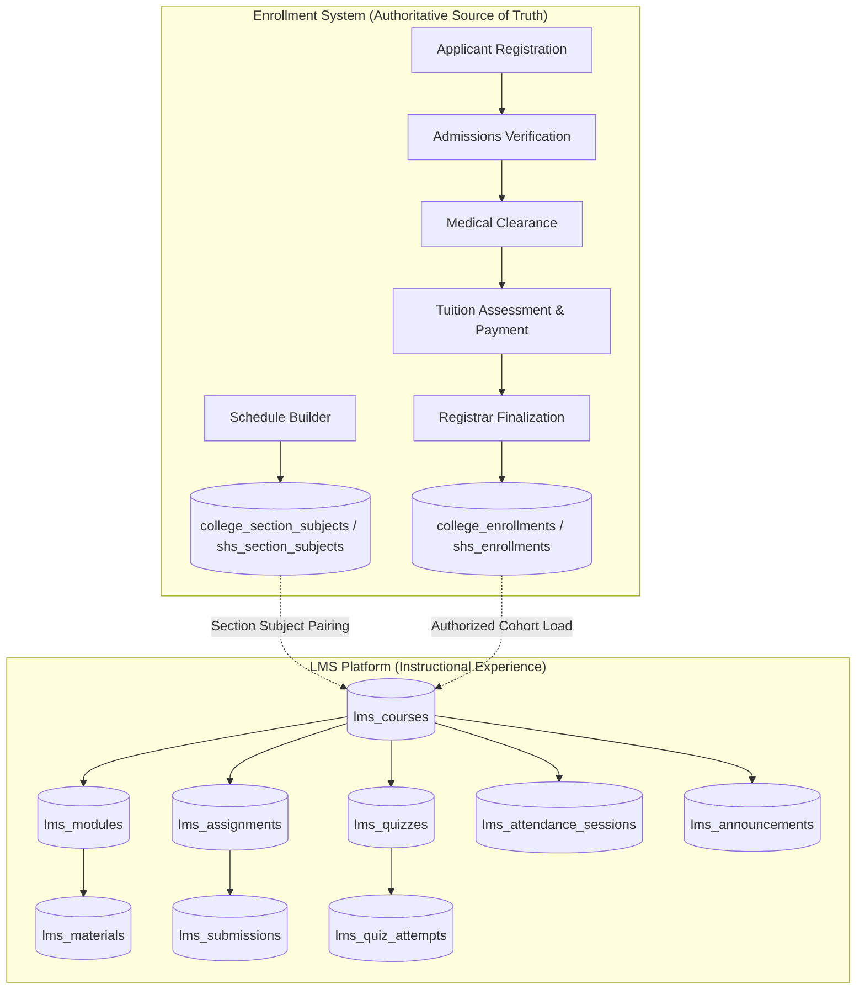

# LMS System Overview & Architecture Dossier

> **Institutional System**: Triple T University (TTU) Academic & Learning Management System  
> **Component**: Learning Management System (LMS) Subsystem  
> **Status**: Comprehensive Technical Audit & Architectural Baseline  
> **Author**: Lead Developer, System Architect & Technical Auditor  
> **Date**: September 2026  

---

## 1. System Purpose & Core Mission

The Triple T University Learning Management System (LMS) provides digital learning environments, instructional content delivery, asynchronous assignment submission, automated quiz assessments, grade tracking, attendance monitoring, and academic announcements for university students and faculty instructors.

### Core Philosophy: Academic Enrollment as the Source of Truth
The foundational rule of the TTU architecture is:
> **The Enrollment System is the absolute, authoritative source of truth for student identity, academic credentials, program matriculation, section schedules, and official subject course loads. The LMS is a downstream learning delivery system that projects and enhances the academic experience anchored on official enrollments.**

The LMS does **not** create student identities, confer academic degrees, assign tuition fees, or manage official registration records. Instead, it reads official enrollments and instantiates interactive course shells for active learning.



---

## 2. LMS User Roles & System Actors

| Role Identifier | Primary Identity Source | Actual System Capabilities | Actual Limitations / Gaps in Code |
| :--- | :--- | :--- | :--- |
| **Enrolled Student** (`student`) | `users.role = 'student'`, verified via `applications.status = 'enrolled'` | • View enrolled courses in [my_courses.php](file:///c:/xampp/htdocs/sia/app/Views/lms/student/my_courses.php)<br>• Download published lecture files in [course.php](file:///c:/xampp/htdocs/sia/app/Views/lms/student/course.php)<br>• Upload assignment submissions ([StudentAssignmentController](file:///c:/xampp/htdocs/sia/app/Controllers/Lms/StudentAssignmentController.php))<br>• Take timed multiple-choice/true-false quizzes ([StudentQuizController](file:///c:/xampp/htdocs/sia/app/Controllers/Lms/StudentQuizController.php))<br>• View personal grades breakdown ([StudentGradebookController](file:///c:/xampp/htdocs/sia/app/Controllers/Lms/StudentGradebookController.php))<br>• Review personal attendance logs ([StudentAttendanceController](file:///c:/xampp/htdocs/sia/app/Controllers/Lms/StudentAttendanceController.php))<br>• View professor course announcements and academic calendar | • Cannot view courses if no instructor has been assigned to timetable schedule (`continue` branch in repository)<br>• File downloads fail with HTTP 403 due to session key bug (`$_SESSION['role']` vs `$_SESSION['user_role']`)<br>• Gradebook load triggers $O(N \times M)$ query storm across whole class |
| **Faculty Instructor** (`faculty`) | `users.role = 'faculty'`, linked via `faculty_profiles` and timetable | • View assigned teaching course shells in [dashboard.php](file:///c:/xampp/htdocs/sia/app/Views/lms/faculty/dashboard.php)<br>• Create course modules & publish materials ([FacultyController](file:///c:/xampp/htdocs/sia/app/Controllers/Lms/FacultyController.php))<br>• Create/edit assignments, download submissions, and grade with feedback ([FacultyAssignmentController](file:///c:/xampp/htdocs/sia/app/Controllers/Lms/FacultyAssignmentController.php))<br>• Author timed quizzes, build question choices, review attempt scores ([FacultyQuizController](file:///c:/xampp/htdocs/sia/app/Controllers/Lms/FacultyQuizController.php))<br>• Create attendance sessions and log present/absent roster ([FacultyAttendanceController](file:///c:/xampp/htdocs/sia/app/Controllers/Lms/FacultyAttendanceController.php))<br>• Publish course-level announcements ([FacultyAnnouncementController](file:///c:/xampp/htdocs/sia/app/Controllers/Lms/FacultyAnnouncementController.php)) | • Material upload path escapes into `c:\xampp\storage\lms_materials/` instead of project directory<br>• Calendar links hardcode student URLs instead of faculty authoring URLs<br>• Roster count uses `applications.section_id` instead of actual enrollments, hiding irregular students from card count |
| **LMS Administrator / Superadmin** (`admin`, `superadmin`) | `users.role IN ('admin', 'superadmin')` with administrative permissions | • Generate unmapped LMS courses via [LmsAdminController](file:///c:/xampp/htdocs/sia/app/Controllers/Admin/LmsAdminController.php) at `/admin/lms/generator`<br>• Global oversight access to view any course shell in `LmsService` | • **MISSING**: No administrative course index, course editor, or archiving tool<br>• **MISSING**: No LMS user suspension or section transfer sync<br>• **MISSING**: No audit logging for LMS actions<br>• **MISSING**: No course cloning across academic terms |
| **Applicant / Unenrolled User** (`applicant`) | `users.role = 'applicant'` | • Restricted to admissions portal ([ApplicantController](file:///c:/xampp/htdocs/sia/app/Controllers/ApplicantController.php)) | • **SECURITY VULNERABILITY**: Can log into student LMS portal at [LmsAuthController](file:///c:/xampp/htdocs/sia/app/Controllers/Lms/LmsAuthController.php) if application status is `approved` (even before cashier payment or registrar enrollment) |

---

## 3. High-Level Subsystems and Component Structure

The LMS is structured under the **Hybrid MVC + Domain Service Layer** architecture:

```text
c:\xampp\htdocs\sia\
├── app\
│   ├── Controllers\
│   │   ├── Admin\
│   │   │   └── LmsAdminController.php          # Administrative LMS course shell generation
│   │   └── Lms\
│   │       ├── DownloadController.php          # Secure material and submission file streaming
│   │       ├── FacultyAnnouncementController.php# Faculty announcement CRUD
│   │       ├── FacultyAssignmentController.php  # Faculty assignment management & grading
│   │       ├── FacultyAttendanceController.php  # Faculty attendance session & roster logger
│   │       ├── FacultyCalendarController.php    # Faculty academic event calendar
│   │       ├── FacultyController.php            # Faculty dashboard, course overview, module creator
│   │       ├── FacultyGradebookController.php   # Faculty course-wide gradebook grid
│   │       ├── FacultyQuizController.php        # Faculty quiz authoring & question bank
│   │       ├── LmsAuthController.php            # Dedicated LMS Student and Faculty login/logout
│   │       ├── StudentAnnouncementController.php# Student course announcement viewer
│   │       ├── StudentAssignmentController.php  # Student assignment submission
│   │       ├── StudentAttendanceController.php  # Student personal attendance history
│   │       ├── StudentCalendarController.php    # Student academic calendar
│   │       ├── StudentController.php            # Student dashboard, my courses, course modules
│   │       ├── StudentGradebookController.php   # Student personal gradebook breakdown
│   │       └── StudentQuizController.php        # Student timed quiz taker & results
│   ├── Services\
│   │   ├── LmsService.php                      # Core LMS course, module, assignment & aggregation service
│   │   ├── LmsAnnouncementService.php          # Course announcement business logic
│   │   ├── LmsAttendanceService.php            # Attendance session & record management
│   │   ├── LmsCalendarService.php              # Calendar deadline & event aggregation
│   │   ├── LmsGradebookService.php             # Full gradebook grid calculation
│   │   └── LmsQuizService.php                  # Quiz timing, questions, and automated scoring
│   ├── Repositories\
│   │   ├── EnrollmentRepositoryInterface.php   # Contract for level-specific course resolution
│   │   ├── CollegeEnrollmentRepository.php     # College student enrollment query & JIT provisioner
│   │   └── ShsEnrollmentRepository.php         # SHS student enrollment query & JIT provisioner
│   └── Views\
│       └── lms\
│           ├── faculty\                        # 21 faculty presentation views & components
│           └── student\                        # 19 student presentation views & components
```

---

## 4. Current Architectural Status

| Domain Area | Evaluation | Architectural Assessment |
| :--- | :--- | :--- |
| **LMS ↔ Enrollment Identity** | **UNIFIED** | Uses single `users` table. Student numbers and Employee IDs are shared. No duplicate user records exist. |
| **Academic Scoping** | **SPLIT BY LEVEL** | College courses derive from `college_enrollments` + `college_sections`; SHS courses derive from `shs_enrollments` + `shs_sections`. Both share `subjects` and `lms_courses`. |
| **Course Provisioning** | **HYBRID JIT / MANUAL** | Courses are created via 3 disparate channels: (1) JIT write inside repository read operations, (2) manual admin generation at `/admin/lms/generator`, or (3) timetable sync in `SchedulerController`. |
| **Multi-Section Isolation** | **FUNCTIONAL** | `lms_courses` enforces `UNIQUE(academic_level, academic_section_id, subject_id)`. Sections taking identical subjects (e.g. `BSIT 1-A` and `BSIT 1-B`) receive completely isolated classroom instances. |
| **Role Authorization** | **PARTIALLY BROKEN** | Web routes in [web.php](file:///c:/xampp/htdocs/sia/app/Routes/web.php) lack `RoleMiddleware` wrappers. Controllers use inconsistent session checks (`$_SESSION['role']` vs `$_SESSION['user_role']`). |
| **File Storage Subsystem** | **BROKEN** | Directory traversal bug writes uploaded materials outside webroot (`c:\xampp\storage\lms_materials/`), while [DownloadController](file:///c:/xampp/htdocs/sia/app/Controllers/Lms/DownloadController.php) expects `app/uploads/lms/`. All material downloads fail. |
| **Administrative Tooling** | **MINIMAL / INCOMPLETE** | No course management dashboard. Admins cannot view active course listings, reassign faculty, or monitor submission activity. |
