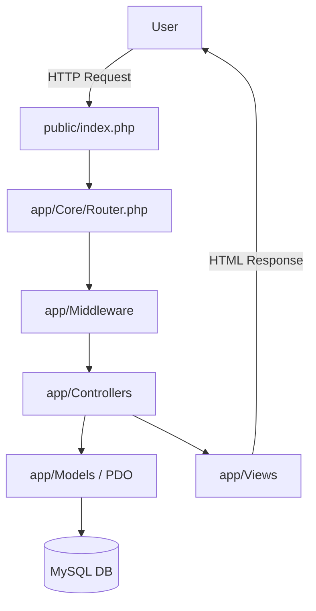
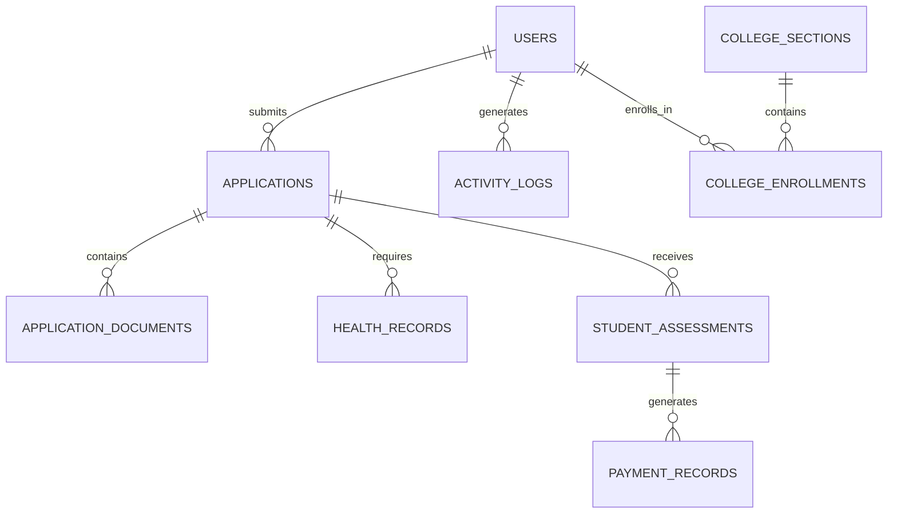

# TTU System — Comprehensive Project Overview & Architecture Reference

## 1. EXECUTIVE PROJECT OVERVIEW

The **TTU System** (Code Name: `sia`) is a monolithic web application designed to handle the entire student lifecycle for a university, from initial applicant registration and enrollment to academic records, finances, and a built-in Learning Management System (LMS).

### System Purpose
To centralize and automate school administration (Admissions, Registrar, Cashier, Clinic) and provide students and faculty with dedicated portals for learning and management.

### Current Architectural Style
The system recently underwent a full migration and is currently built on a **Custom Vanilla PHP MVC Architecture**. All requests are routed through a single entry point (`public/index.php`), processed by a custom `Router`, filtered by `Middleware`, and handled by `Controllers` which render `Views`.

### Current Development State
The core MVC structure and Applicant/Admin modules are fully ported and functional. The LMS Student module is partially implemented, while the LMS Faculty module is currently incomplete and buggy.

### Major Technical Limitations
- No Dependency Injection Container.
- No standard ORM (Object-Relational Mapping); all queries use raw PDO.
- No automated testing suite.

### Major Architectural Opportunities
- Transitioning the authenticated dashboards (Admin, LMS, Applicant) to a **Hybrid SPA Navigation** model for instantaneous page loads.
- Implementing an active record pattern or lightweight ORM for models.



---

## 2. TECHNOLOGY STACK

| Layer          | Technology | Version | Evidence |
| -------------- | ---------- | ------- | -------- |
| Backend        | Vanilla PHP | 8.x (assumed) | `app/Core/Router.php` |
| Database       | MySQL / MariaDB | Not explicitly determined | `app/Core/Database.php` |
| Frontend       | HTML5 / CSS3 | N/A | `app/Views/` |
| CSS Framework  | Bootstrap | 5.3.3 | `public/vendor/bootstrap/` |
| Icons          | Bootstrap Icons | 1.11.3 | `public/vendor/bootstrap-icons/` |
| JavaScript     | Vanilla JS + jQuery | 3.7.1 | `public/vendor/jquery/` |
| Charts         | Chart.js | 4.4.1 | `public/vendor/chartjs/` |
| Modals         | SweetAlert2 | 11 | `public/vendor/sweetalert2/` |
| Server         | Apache (XAMPP) | Not explicitly determined | `C:\xampp\htdocs` |
| Authentication | Native PHP Sessions | N/A | `app/Middleware/AuthMiddleware.php` |

---

## 3. CURRENT DIRECTORY / FILE ARCHITECTURE

```text
sia/
├── .agents/                 # AI Agent Skills and Rules (Global Customizations)
├── app/                     # Core Application Logic (MVC)
│   ├── Controllers/         # Handles request logic (Admin, Api, Lms, Applicant)
│   ├── Core/                # Base framework (Router, Request, Response, Database)
│   ├── Helpers/             # Global utility functions
│   ├── Middleware/          # Auth, Roles, CSRF, Session Security
│   ├── Models/              # Data access layer (ActivityLog, User, Application)
│   ├── Routes/              # Route definitions (web.php)
│   └── Views/               # HTML Templates (admin, applicant, auth, components, lms)
├── config/                  # Configuration files
├── database/                # Schema definitions, migrations, and seeders
├── docs/                    # Documentation (Obsidian Second Brain)
├── public/                  # Publicly accessible entry point and assets
│   ├── index.php            # SINGLE ENTRY POINT
│   ├── css/                 # Custom CSS
│   ├── js/                  # Custom JS
│   ├── vendor/              # Localized CDNs (Bootstrap, jQuery, Fonts)
│   └── uploads/             # User uploaded files
└── scratch/                 # Temporary script files
```

---

## 4. SYSTEM MODULE MAP

### Enrollment / Applicant System
- **Purpose**: Handles student applications, document uploads, and tracking.
- **Controllers**: `ApplicantController`, `EnrollController`, `DocumentController`, `HealthController`
- **Views**: `app/Views/applicant/`
- **Status**: Fully migrated to MVC.

### Registrar
- **Purpose**: Manages student records, curriculum, and enrollment queues.
- **Controllers**: `RegistrarController`, `SubjectController`, `CollegeController`, `ShsController`, `ScheduleController`
- **Views**: `app/Views/admin/registrar/`
- **Status**: Fully migrated to MVC.

### Finance / Cashier
- **Purpose**: Handles fee templates, student assessments, and payments.
- **Controllers**: `FinanceController`, `FeeController`
- **Views**: `app/Views/admin/finance/`
- **Status**: Fully migrated to MVC.

### LMS (Learning Management System)
- **Student Module**:
  - **Controllers**: `LmsAuthController`, `StudentController`
  - **Views**: `app/Views/lms/student/`
  - **Status**: Functional (Dashboard, My Courses).
- **Faculty Module**:
  - **Controllers**: `FacultyController`
  - **Views**: `app/Views/lms/faculty/`
  - **Status**: **INCOMPLETE/BUGGY**. The `FacultyController` contains invalid procedural redirect code resulting in a broken flow (`$response->redirect("/sia/lms/../../auth/lms_faculty_login.php"); return;`).
  - **Database Tables**: `lms_modules`, `lms_assignments`, `lms_submissions` exist in schema but lack active Models.

---

## 5. USER ROLES & ACCESS CONTROL

Managed primarily by `app/Middleware/RoleMiddleware.php`.

| Module     | applicant | student | faculty | registrar | cashier | scholarship | clinic | admin | superadmin |
| ---------- | :-------: | :-----: | :-----: | :-------: | :-----: | :---------: | :----: | :---: | :--------: |
| Applicant  |     ✓     |         |         |           |         |             |        |       |            |
| LMS        |           |    ✓    |    ✓    |           |         |             |        |       |            |
| Registrar  |           |         |         |     ✓     |         |             |        |   ✓   |      ✓     |
| Finance    |           |         |         |           |    ✓    |             |        |   ✓   |      ✓     |
| Admissions |           |         |         |           |         |             |        |   ✓   |      ✓     |
| Clinic     |           |         |         |           |         |             |    ✓   |   ✓   |      ✓     |
| System     |           |         |         |           |         |             |        |       |      ✓     |

---

## 6. DATABASE ARCHITECTURE



**Key Tables**:
- `users`: Core authentication table (includes `role` ENUM).
- `applications`: Tracks the 5-stage enrollment workflow.
- `fee_templates`: Base costs mapped to programs.
- `lms_modules`, `lms_assignments`, `lms_submissions`: Unused/partially used LMS schema.

---

## 7. DATABASE ↔ APPLICATION REFERENCES

**TABLE: `applications`**
- **Used By**: Registrar, Admissions, Clinic, Finance.
- **Relevant Controllers**: `AdmissionsController`, `EnrollController`.
- **Relevant Models**: `Application.php`.

**TABLE: `lms_modules`**
- **Status**: ORPHANED/UNIMPLEMENTED.
- **Evidence**: Exists in `database/schema.sql`, but there are no `Module` or `LmsModule` models in `app/Models/`, nor do active controllers query this table. 

---

## 8. REQUEST / APPLICATION FLOW

### MVC Standard Flow (e.g., Viewing Dashboard)
```text
Browser -> GET /applicant/dashboard.php
  ↓
public/index.php (Initializes App)
  ↓
Router (app/Core/Router.php matches route)
  ↓
SessionSecurityMiddleware -> AuthMiddleware
  ↓
ApplicantController@dashboard
  ↓
render('applicant/dashboard', $data)
  ↓
Browser (HTML Response)
```

---

## 9. CURRENT FRONTEND ARCHITECTURE

- **CSS/UI**: Heavily relies on Bootstrap 5 utility classes (`d-flex`, `mb-3`, `container-fluid`).
- **Icons**: Bootstrap Icons.
- **Typography**: Google Fonts (Outfit, Inter, Poppins) localized offline via `public/vendor/fonts.css`.
- **Interactivity**: Uses jQuery for basic DOM manipulation and AJAX requests (especially in Admin DataTables/Forms). Alerts are handled by SweetAlert2.
- **Asset Strategy**: All CDNs have been successfully localized for offline/intranet usage (`public/vendor/`).

---

## 10. TARGET PORTAL NAVIGATION ARCHITECTURE

The system is currently a standard **Multi-Page Application (MPA)**. Every click causes a full browser reload.

**Proposed Hybrid SPA Assessment**:
The Admin and LMS portals are excellent candidates for a Hybrid SPA. 
- **Current State**: Views currently include `layout_header.php` and `layout_footer.php` inside the controller output.
- **Conflict**: A Hybrid SPA requires controllers to return ONLY the HTML fragment (`#main-content`) when requested via AJAX, but return the full page when requested directly (e.g. via hard refresh).
- **Implementation Path**: Modify `BaseController::render()`. If the request contains the `X-Requested-With: XMLHttpRequest` header, the controller should skip injecting the header/footer and only return the view template. Intercept all sidebar clicks with vanilla JS/fetch, update `#main-content`, and use `history.pushState` to update the URL.

---

## 11. MPA vs SPA vs HYBRID ANALYSIS

- **Current MPA**: Safe, stable, but visually jarring (screen flickers on every sidebar click).
- **Full SPA (React/Vue)**: **REJECTED**. Would require abandoning the entire PHP Vanilla MVC Views layer and rewriting the frontend completely. Too complex for current requirements.
- **Hybrid SPA (AJAX Fragments)**: **RECOMMENDED**. Maintains the Vanilla PHP MVC architecture. Controllers stay exactly the same. Requires minimal JavaScript to intercept links and swap HTML. Offers the snappy feel of a SPA with the simplicity of an MPA.

---

## 12. MVC MIGRATION READINESS

- **Status**: The procedural-to-MVC migration is **COMPLETE**.
- **Evidence**: The codebase exclusively uses `app/Routes/web.php` and `public/index.php` as the central dispatcher. All procedural `admin/` and `applicant/` directories have been deleted and replaced with `app/Controllers/` and `app/Views/`.

---

## 13. SECURITY AUDIT — HIGH LEVEL

| Issue | Location | Severity | Recommended Direction |
|-------|----------|----------|-----------------------|
| Missing IDOR Checks | Controllers (e.g., `DocumentController`) | Medium | Ensure that when fetching a record by ID from the DB, it strictly belongs to `$_SESSION['user_id']`. |
| Raw PDO | `app/Models` | Low | Prepared statements are consistently used, preventing SQL injection. |
| CSRF | `CsrfMiddleware` | Low | CSRF protection is implemented for POST routes. Ensure forms include the token. |

---

## 14. PERFORMANCE ANALYSIS

- **Current Performance**: Very high. Vanilla PHP with localized CDNs ensures rapid TTFB (Time to First Byte).
- **Bottlenecks**: Full page reloads on large dashboards (like Registrar queues) force the browser to re-parse Bootstrap CSS and JavaScript repeatedly. 
- **Recommendation**: Implementing the Hybrid SPA navigation will drastically reduce client-side parsing time and bandwidth, heavily optimizing perceived performance.

---

## 15. ARCHITECTURAL DEPENDENCY MAP

```text
public/index.php
   ↓
app/Routes/web.php
   ↓
app/Core/Router.php
   ↓
app/Middleware (SessionSecurity -> Auth -> Role)
   ↓
app/Controllers (e.g., Admin\SystemController)
   ↓
app/Models (e.g., User)
   ↓
app/Core/Database (PDO)
```

---

## 16. CURRENT PROBLEMS & TECHNICAL DEBT

| Priority | Problem | Location | Impact | Recommendation |
| -------- | ------- | -------- | ------ | -------------- |
| **Critical** | FacultyController Bug | `app/Controllers/Lms/FacultyController.php` | Faculty cannot access LMS | Rewrite controller properly; remove raw redirect string. |
| **High** | Missing LMS Schema Integration | `lms_*` DB Tables | LMS is incomplete | Build Models and Controllers for `lms_modules` and `lms_assignments`. |
| **Medium** | No standard ORM | Project-wide | Slower development | Implement a lightweight Query Builder or Active Record base class. |

---

## 17. RECOMMENDED DEVELOPMENT ROADMAP

- **Phase 1 — Bug Fixes**: Repair `FacultyController` and restore faculty LMS access.
- **Phase 2 — LMS Expansion**: Implement Models and Controllers for `lms_modules`, `lms_assignments`, and `lms_submissions`.
- **Phase 3 — Hybrid Portal Shell**: Update `BaseController::render()` and write the vanilla JS router to enable instantaneous sidebar navigation across the system.
- **Phase 4 — Database ORM**: Implement a lightweight Active Record system to replace manual PDO queries in controllers.

---

## 18. AI DEVELOPMENT RULES

1. **Never assume database columns**. Always inspect `database/schema.sql` before writing SQL.
2. **Never modify architecture** without first inspecting existing dependencies (`web.php`).
3. **Verify every database query** against the actual schema.
4. **Preserve the Vanilla PHP MVC pattern**. Do NOT introduce Laravel, Symfony, React, or Vue unless explicitly instructed.
5. **Keep Controllers Thin**. Controllers handle requests; Models handle database logic; Views handle HTML.
6. **Prefer the proposed Hybrid Navigation approach**. When enhancing UI, intercept clicks and swap HTML rather than doing full page reloads, provided it doesn't break existing JS.
7. **Always check for offline assets**. Rely on `/sia/public/vendor/` rather than inserting external CDNs.
8. **Fix before feature**. If working near `FacultyController`, fix the syntax/routing bugs before adding new features.

---

## 19. FINAL ARCHITECTURAL SUMMARY

### Current Architecture
The TTU System is a fully-fledged, custom Vanilla PHP MVC application. It securely routes requests through middleware and relies entirely on local assets for 100% offline capability.

### Proposed Architecture
The system should evolve by retaining its strict MVC backend while transitioning the frontend to a **Hybrid SPA** model, allowing dynamic content replacement without full page reloads.

### Biggest Risks
The LMS module is currently incomplete and structurally flawed (particularly on the faculty side), which breaks the application flow for teachers.

### Biggest Opportunities
Because the backend is already fully decoupled into MVC, implementing Hybrid SPA navigation will be surprisingly trivial and will yield massive performance and UX gains.

### Recommended Next Step
**Repair the `FacultyController.php` and map out the LMS Database tables (Modules, Assignments) to actual PHP Models.**
