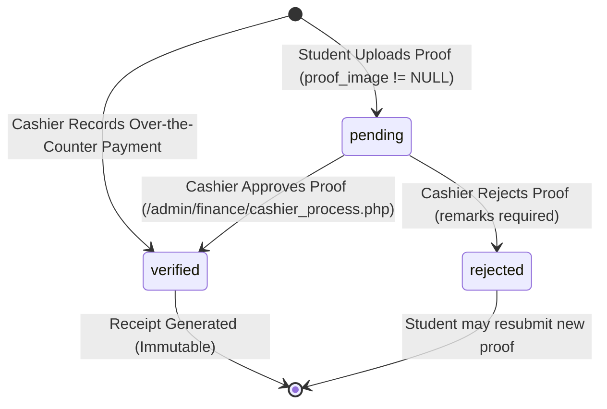
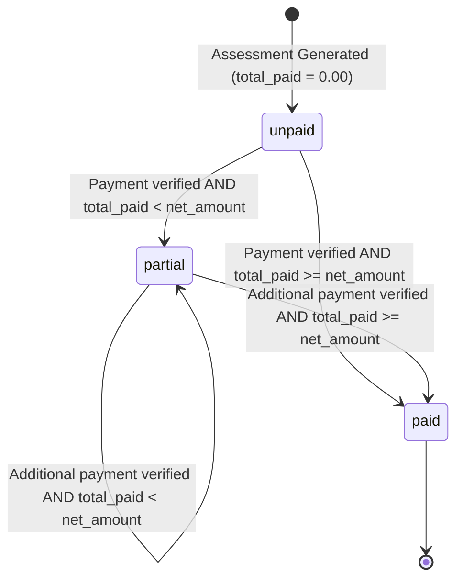
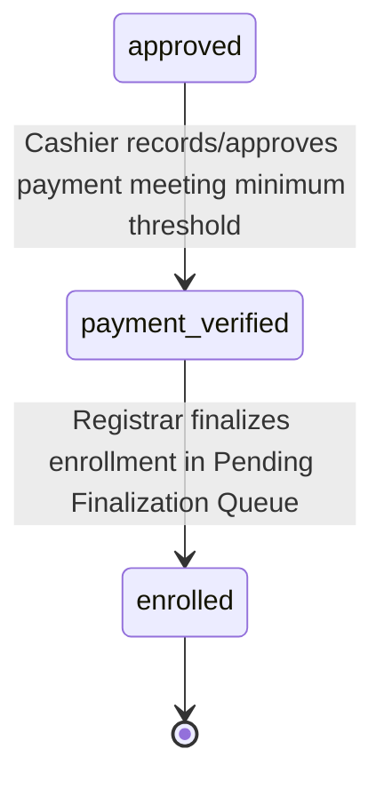

# TTU Cashier Architecture Audit

## 1. Executive Summary

This architectural audit was conducted on the **TTU Enrollment System** to comprehensively evaluate the existing Cashier and payment architecture. The objective is to establish an authoritative blueprint of how the system currently processes tuition assessments, records over-the-counter payments, verifies online payment proofs, issues receipts, tracks student account balances, and decouples fiscal validation from academic matriculation.

This document serves as the architectural foundation for a future **PayMongo payment gateway integration** and a **configurable concurrent online payment queue** (supporting scalable concurrency targets of 100, 250, 500+ concurrent payment sessions).

### Key Audit Findings
1. **Hybrid MVC & Fat Controllers**: Financial transactions and ledger operations are governed by "Fat Controllers" with raw PDO queries. Primary responsibilities reside in `App\Controllers\Admin\Finance\FinanceController` and `App\Controllers\ApplicantController`.
2. **Authoritative Decoupling (ADR-008)**: Payments do **not** confer academic enrollment. Successful verification transitions the student's application to `payment_verified`. Official matriculation, `@ttu.edu.ph` email issuance, student number allocation, and LMS course provisioning are strictly reserved for the Office of the Registrar via `EnrollmentService::finalizeEnrollment()`.
3. **Financial Immutability (ADR-009)**: Upon assessment generation, line items are snapshotted in `assessment_items`, preventing retroactive rate changes if fee templates change.
4. **Current Online Payment Mechanism**: There is **no active payment gateway**. Current "online payment" is purely a manual proof-of-payment upload workflow where applicants upload screenshot images (`.jpg`, `.png`, `.webp`) of bank transfers or GCash receipts, creating a `pending` row in `payment_records` awaiting manual Cashier review.
5. **Critical Concurrency Deficiencies**:
   - `generateAtomicReceiptNumber()` contains a race condition: it increments the sequence table and then performs an un-isolated `SELECT`, allowing concurrent transactions to generate identical receipt numbers.
   - `payment_records.receipt_number` lacks a `UNIQUE` database constraint.
   - `FinanceController::process()` (`verify_online_payment`) omits a validation check verifying whether the approved amount exceeds the remaining balance (`$amount > $balance`), risking account overpayment and corrupted balances.
   - `ApplicantController::processPayment()` lacks database transaction wrapping (`beginTransaction()`) and row locking (`FOR UPDATE`), allowing duplicate pending submissions.
   - `FinanceController::process()` omits `requirePermission('payments.record')`, relying solely on the broad `RoleMiddleware:admin` group.

---

## 2. Cashier Module Structure

The Cashier and financial subsystem spans administrative controllers, applicant controllers, domain services, helper libraries, views, and database tables.

```text
c:\xampp\htdocs\sia\
├── app/
│   ├── Controllers/
│   │   ├── Admin/
│   │   │   └── Finance/
│   │   │       ├── FinanceController.php     # Primary Cashier POS & Ledger Controller
│   │   │       └── FeeController.php         # Fee Templates & Tuition Rates Controller
│   │   ├── ApplicantController.php           # Student Assessment & Proof Upload Controller
│   │   └── Admin/
│   │       └── System/
│   │           └── ReportController.php      # Financial Reports & CSV Export
│   ├── Services/
│   │   ├── AssessmentService.php             # Tuition Calculation & Assessment Breakdown
│   │   └── EnrollmentService.php             # Authoritative Enrollment Finalization (Registrar Gate)
│   ├── Models/
│   │   └── StudentAssessment.php             # Minimal Model (17 lines, data retrieval helper)
│   ├── Helpers/
│   │   └── functions.php                     # Receipt Generator & Snapshot Functions
│   ├── Middleware/
│   │   ├── RoleMiddleware.php                # Role-based route guard
│   │   └── CsrfMiddleware.php                # CSRF protection on POST/PUT/DELETE
│   ├── Routes/
│   │   └── web.php                           # Application routing declarations
│   └── Views/
│       ├── admin/
│       │   └── finance/
│       │       ├── cashier_dashboard.php     # Cashier overview, collection KPIs, unpaid queue
│       │       ├── cashier_assessment.php    # Student assessment details & POS payment modal
│       │       ├── cashier_payments.php      # Transaction ledger & Online Proof verification modal
│       │       ├── receipt.php               # Official Printable Receipt view (@media print)
│       │       └── fees.php                  # Institutional Fee Template configuration
│       └── applicant/
│           └── assessment.php                # Applicant billing view & proof upload modal
├── database/
│   └── schema.sql                            # Source-of-truth MariaDB DDL
└── uploads/
    └── payments/                             # Storage for uploaded student payment receipt images
```

---

## 3. Complete Payment Flow

### Current Over-the-Counter (Cashier POS) Flow
```text
Student / Applicant
      ↓
Applies & Cleared by Clinic & Approved by Admissions
      ↓
AdmissionsController invokes AssessmentService::generateAssessment()
      ↓
student_assessments record created + assessment_items frozen line-item snapshot
      ↓
Student visits Cashier Window
      ↓
Cashier opens /admin/finance/cashier_assessment.php?id={id}
      ↓
Cashier submits POST /admin/finance/cashier_process.php (action='record_payment')
      ↓
[FinanceController::process]
      ├── 1. PDO beginTransaction()
      ├── 2. SELECT * FROM student_assessments WHERE id = ? FOR UPDATE
      ├── 3. Validate: $amount <= $balance AND $amount >= min(3000, $balance)
      ├── 4. generateAtomicReceiptNumber($pdo) -> REC-YYYYMMDD-XXXX
      ├── 5. INSERT INTO payment_records (status='verified', cashier_id=SESSION.user_id)
      ├── 6. UPDATE student_assessments (total_paid += amount, payment_status='paid'|'partial')
      ├── 7. UPDATE applications SET status = 'payment_verified' (if not already 'enrolled')
      ├── 8. INSERT INTO activity_logs (student & admin audit trails)
      └── 9. PDO commit()
      ↓
Redirect to /admin/finance/cashier_receipt.php?id={payment_id}
      ↓
Application appears in Registrar Pending Finalization Queue
      ↓
Registrar executes POST /admin/registrar/finalize_enrollment.php
      ↓
EnrollmentService::finalizeEnrollment() -> status = 'enrolled' + Student Number + TTU Email
```

### Current Manual "Online Payment" Proof Upload Flow
```text
Student / Applicant
      ↓
Opens /applicant/assessment.php
      ↓
Views Assessment Balance & TTU Bank/GCash account numbers
      ↓
Pays via external GCash/Maya/Bank App & captures screenshot
      ↓
Submits Modal: POST /applicant/payment_process.php (action='submit_payment_proof')
      ↓
[ApplicantController::processPayment]
      ├── 1. Validate HealthRecord clearance (must not be null)
      ├── 2. Validate $amount <= $balance AND $amount >= min(500, $balance)
      ├── 3. Validate MIME type & file extension (JPG/PNG/WEBP, max 5MB)
      ├── 4. Upload file to uploads/payments/proof_{user_id}_{timestamp}.{ext}
      ├── 5. INSERT INTO payment_records (status='pending', cashier_id=NULL, proof_image=filename)
      └── 6. Log activity
      ↓
Applicant sees "Pending Verification" badge on assessment portal
      ↓
Cashier opens /admin/finance/cashier_payments.php
      ↓
Cashier clicks "Review Proof", inspects image modal
      ↓
Cashier submits POST /admin/finance/cashier_process.php (action='verify_online_payment', decision='approve'|'reject')
      ↓
[FinanceController::process]
      ├── 1. PDO beginTransaction()
      ├── 2. SELECT * FROM payment_records WHERE id = ? FOR UPDATE (checks status='pending')
      ├── 3. SELECT * FROM student_assessments WHERE id = ? FOR UPDATE
      ├── IF REJECT:
      │     ├── UPDATE payment_records SET status='rejected', remarks=?, cashier_id=?
      │     ├── INSERT activity_logs (Student notified of rejection)
      │     └── PDO commit()
      └── IF APPROVE:
            ├── generateAtomicReceiptNumber($pdo) -> REC-YYYYMMDD-XXXX
            ├── UPDATE payment_records SET status='verified', receipt_number=?, cashier_id=?
            ├── UPDATE student_assessments (total_paid += amount, payment_status='paid'|'partial')
            ├── UPDATE applications SET status = 'payment_verified'
            ├── INSERT activity_logs (Student & Admin)
            └── PDO commit()
      ↓
Application appears in Registrar Pending Finalization Queue
```

---

## 4. Controller Map

### 1. `App\Controllers\Admin\Finance\FinanceController`
- **File Path**: [`app/Controllers/Admin/Finance/FinanceController.php`](file:///c:/xampp/htdocs/sia/app/Controllers/Admin/Finance/FinanceController.php)
- **Responsibility**: Financial executive dashboard, assessment inspection, cashier point-of-sale execution, payment ledger, manual receipt rendering, online proof review.
- **Base Class**: `App\Core\BaseController`
- **Endpoints & Methods**:
  | Route | HTTP Method | Action / Method | Authorization Guard |
  |---|---|---|---|
  | `/admin/finance/cashier_dashboard.php` | `GET` | `dashboard()` | `requirePermission(['assessments.generate', 'payments.record'])` |
  | `/admin/finance/cashier_assessment.php` | `GET` | `assessment()` | `requirePermission(['assessments.generate', 'payments.record'])` |
  | `/admin/finance/cashier_payments.php` | `GET` | `payments()` | `requirePermission(['payments.record'])` |
  | `/admin/finance/cashier_receipt.php` | `GET` | `receipt()` | `requirePermission('receipts.print')` |
  | `/admin/finance/cashier_process.php` | `POST` | `process()` | Role group `admin` (Missing granular `requirePermission`) |

- **Key Business Logic**:
  - `record_payment`: Validates over-the-counter payments. Enforces minimum payment of ₱3,000.00 (or remaining balance if lower). Validates that payment amount does not exceed balance. Generates atomic receipt sequence. Sets payment record to `verified`.
  - `verify_online_payment`: Processes cashier approval or rejection of student-uploaded proofs. On rejection, remarks are mandatory. On approval, generates receipt sequence, updates student assessment balance, and advances application status to `payment_verified`.

### 2. `App\Controllers\ApplicantController`
- **File Path**: [`app/Controllers/ApplicantController.php`](file:///c:/xampp/htdocs/sia/app/Controllers/ApplicantController.php)
- **Responsibility**: Applicant self-service portal, assessment statement viewing, proof-of-payment upload.
- **Endpoints & Methods**:
  | Route | HTTP Method | Action / Method | Authorization Guard |
  |---|---|---|---|
  | `/applicant/assessment.php` | `GET` | `assessment()` | `RoleMiddleware:applicant,student` |
  | `/applicant/payment_process.php` | `POST` | `processPayment()` | `RoleMiddleware:applicant,student` |

- **Key Business Logic**:
  - `processPayment`: Action `submit_payment_proof`. Enforces health information clearance check prior to allowing payment submissions. Validates amount against allowable balance deducting already pending submissions (`$net_amount - $total_paid - $pendingAmount`). Restricts minimum payment to ₱500.00 (or balance). Saves uploaded screenshot to `uploads/payments/` with sanitized filename `proof_{userId}_{timestamp}.{ext}`. Inserts record into `payment_records` with status `pending`.

### 3. `App\Controllers\Admin\Finance\FeeController`
- **File Path**: [`app/Controllers/Admin/Finance/FeeController.php`](file:///c:/xampp/htdocs/sia/app/Controllers/Admin/Finance/FeeController.php)
- **Responsibility**: Governance of university fee templates and tuition rate matrix.
- **Endpoints & Methods**:
  | Route | HTTP Method | Action / Method | Authorization Guard |
  |---|---|---|---|
  | `/admin/finance/fees.php` | `GET` | `index()` | `RoleMiddleware:admin` |
  | `/admin/finance/fee_process.php` | `POST` | `process()` | `RoleMiddleware:admin` |

---

## 5. Service Map

### 1. `App\Services\AssessmentService`
- **File Path**: [`app/Services/AssessmentService.php`](file:///c:/xampp/htdocs/sia/app/Services/AssessmentService.php)
- **Responsibility**: Stateless domain calculations for tuition and institutional fees, immutable snapshotting, and composite balance retrieval.
- **Key Methods**:
  - `public static function generateAssessment(int $applicationId, int $userId, PDO $pdo): ?int`:
    - Checks if assessment already exists for `application_id`. If exists, returns immediately (idempotency guard).
    - Resolves fee template by `grade_level`, `strand`, and `semester`.
    - Handles per-unit calculation for College and Senior High School. For irregular students, inspects `application_subject_requests` to aggregate exact enrolled lecture/laboratory units.
    - Inserts record into `student_assessments`.
    - Calls `snapshotAssessmentItems()` helper to freeze all billed items into `assessment_items`.
    - Invokes `recalculateAssessment()` to apply scholarship discounts if applicable.
  - `public static function recalculateAssessment(int $userId, PDO $pdo): void`:
    - Delegates to `recalculateStudentAssessment($userId, $pdo)` in `app/Helpers/functions.php`. Computes tuition/miscellaneous coverage against active scholarship records in `scholarship_recipients`.
  - `public static function getAssessmentBreakdown(PDO $pdo, ?int $assessmentId = null, ?int $userId = null, ?int $applicationId = null): ?array`:
    - Reads assessment record, payments history, immutable `assessment_items` snapshot, enrolled subjects, and computed balances.
    - Includes dynamic tuition auto-sync for open/unpaid assessments with zero payments.

### 2. `App\Services\EnrollmentService`
- **File Path**: [`app/Services/EnrollmentService.php`](file:///c:/xampp/htdocs/sia/app/Services/EnrollmentService.php)
- **Responsibility**: Authoritative matriculation gatekeeper.
- **Relationship to Cashier**:
  - In `finalizeEnrollment()`, line 60:
    ```php
    $isPaymentVerified = in_array($app['payment_status'], ['partial', 'paid'], true) || ($app['status'] === 'payment_verified');
    if (!$isPaymentVerified) {
        return ['success' => false, 'error' => 'Cannot finalize enrollment: Tuition payment has not been verified.'];
    }
    ```
  - Proves that payment verification in Cashier is a hard prerequisite for enrollment finalization, but Cashier cannot directly trigger finalization.

### 3. `App\Services\StudentNumberService`
- **File Path**: [`app/Services/StudentNumberService.php`](file:///c:/xampp/htdocs/sia/app/Services/StudentNumberService.php)
- **Responsibility**: Generates student numbers (`YYYY-XXXXXX`) using `student_number_sequences`.

---

## 6. Repository Map

### CURRENT IMPLEMENTATION:
- **No dedicated payment repositories exist.**
- Database access is performed directly within controllers (`FinanceController`, `ApplicantController`) and domain services (`AssessmentService`) using raw PDO prepared statements.
- The project's existing repository layer (`app/Repositories/`) consists solely of:
  - `CollegeEnrollmentRepository.php`
  - `ShsEnrollmentRepository.php`
  - `EnrollmentRepositoryInterface.php`

### OBSERVATION:
- All SQL operations for `payment_records`, `student_assessments`, and `receipt_sequences` are inline PDO statements within controller methods.

### RECOMMENDATION:
- When implementing PayMongo and the payment queue, introduce a clean `PaymentRepository` or dedicated `PaymentService` to encapsulate all payment mutations and avoid further fattening `FinanceController`.

---

## 7. Database Architecture

### Table: `payment_records`
- **Purpose**: Master ledger of all over-the-counter payments and online payment proof submissions.
- **Primary Key**: `id` (int(10) unsigned AUTO_INCREMENT)
- **Columns**:
  | Column | Data Type | Nullable | Default | Purpose / Notes |
  |---|---|---|---|---|
  | `id` | `int(10) unsigned` | No | Auto | Primary key |
  | `assessment_id` | `int(10) unsigned` | No | None | FK to `student_assessments.id` (ON DELETE CASCADE) |
  | `user_id` | `int(10) unsigned` | No | None | FK to `users.id` (ON DELETE CASCADE) (Student/Applicant) |
  | `cashier_id` | `int(10) unsigned` | Yes | NULL | FK to `users.id` (ON DELETE SET NULL) (Officer who processed/verified) |
  | `amount` | `decimal(10,2)` | No | None | Payment amount in PHP |
  | `payment_date` | `date` | No | None | Date payment occurred (`CURDATE()` or user date) |
  | `payment_method` | `varchar(50)` | No | None | e.g. `'Cash'`, `'GCash'`, `'Bank Transfer'` |
  | `receipt_number` | `varchar(50)` | Yes | NULL | Official receipt number, e.g. `'REC-YYYYMMDD-XXXX'` |
  | `reference_number` | `varchar(100)` | Yes | NULL | External transaction ref (GCash ref, bank slip number) |
  | `proof_image` | `varchar(255)` | Yes | NULL | Filename of uploaded receipt screenshot |
  | `status` | `enum('pending','verified','rejected')` | No | `'pending'` | Current status of the payment record |
  | `remarks` | `text` | Yes | NULL | Cashier remarks (mandatory on rejection) |
  | `created_at` | `timestamp` | No | `current_timestamp()` | Creation timestamp |
  | `updated_at` | `timestamp` | No | `current_timestamp() ON UPDATE` | Update timestamp |

- **Foreign Keys**:
  - `payment_records_ibfk_1`: `assessment_id` $\rightarrow$ `student_assessments(id)`
  - `payment_records_ibfk_2`: `user_id` $\rightarrow$ `users(id)`
  - `payment_records_ibfk_3`: `cashier_id` $\rightarrow$ `users(id)`
- **Indexes**:
  - `KEY assessment_id (assessment_id)`
  - `KEY user_id (user_id)`
  - `KEY cashier_id (cashier_id)`
- **CRITICAL DATABASE GAPS**:
  - `receipt_number` has **NO UNIQUE CONSTRAINT**.
  - `reference_number` has **NO UNIQUE CONSTRAINT**.
  - No gateway tracking fields (`checkout_session_id`, `gateway_payment_id`, `gateway_fee`).

---

### Table: `student_assessments`
- **Purpose**: Term assessment master record tracking total tuition, miscellaneous fees, discounts, and payments.
- **Primary Key**: `id` (int(10) unsigned AUTO_INCREMENT)
- **Columns**:
  | Column | Data Type | Nullable | Default | Purpose / Notes |
  |---|---|---|---|---|
  | `id` | `int(10) unsigned` | No | Auto | Primary key |
  | `user_id` | `int(10) unsigned` | No | None | FK to `users.id` (Student) |
  | `application_id` | `int(10) unsigned` | No | None | FK to `applications.id` |
  | `fee_template_id` | `int(10) unsigned` | Yes | NULL | FK to `fee_templates.id` |
  | `scholarship_id` | `int(10) unsigned` | Yes | NULL | FK to `scholarships.id` |
  | `tuition_fee` | `decimal(10,2)` | No | `0.00` | Assessed tuition |
  | `miscellaneous_fee` | `decimal(10,2)` | No | `0.00` | Assessed miscellaneous fee |
  | `registration_fee` | `decimal(10,2)` | No | `0.00` | Registration fee |
  | `laboratory_fee` | `decimal(10,2)` | No | `0.00` | Laboratory fee |
  | `other_fees` | `decimal(10,2)` | No | `0.00` | Other institutional fees |
  | `total_amount` | `decimal(10,2)` | No | `0.00` | Gross assessment sum |
  | `discount_amount` | `decimal(10,2)` | No | `0.00` | Scholarship/grant deduction |
  | `net_amount` | `decimal(10,2)` | No | `0.00` | Payable amount (`total_amount - discount_amount`) |
  | `total_paid` | `decimal(10,2)` | No | `0.00` | Cumulative verified payments sum |
  | `payment_status` | `enum('unpaid','partial','paid')` | No | `'unpaid'` | Settlement status |
  | `created_at` | `timestamp` | No | `current_timestamp()` | Created timestamp |
  | `updated_at` | `timestamp` | No | `current_timestamp() ON UPDATE` | Updated timestamp |

- **Foreign Keys**:
  - `student_assessments_ibfk_1`: `user_id` $\rightarrow$ `users(id)`
  - `student_assessments_ibfk_2`: `application_id` $\rightarrow$ `applications(id)`
  - `student_assessments_ibfk_3`: `fee_template_id` $\rightarrow$ `fee_templates(id)`
  - `student_assessments_ibfk_4`: `scholarship_id` $\rightarrow$ `scholarships(id)`
- **Indexes**:
  - `KEY user_id`, `KEY application_id`, `KEY fee_template_id`, `KEY scholarship_id`, `KEY idx_assessment_payment_status (payment_status)`

---

### Table: `assessment_items`
- **Purpose**: Permanent, immutable line-item snapshot of fees and enrolled subjects at time of assessment generation (ADR-009).
- **Primary Key**: `id` (int(10) unsigned AUTO_INCREMENT)
- **Columns**: `id`, `assessment_id` (FK), `item_type` (`enum('tuition','miscellaneous','laboratory','registration','other','discount')`), `item_code` (`varchar(50)`), `item_name` (`varchar(150)`), `units` (`decimal(4,2)`), `rate_per_unit` (`decimal(10,2)`), `amount` (`decimal(10,2)`), `created_at`.

---

### Table: `receipt_sequences`
- **Purpose**: Dedicated year-scoped sequence counter for generating collision-safe receipt numbers.
- **Primary Key**: `id` (int(10) unsigned AUTO_INCREMENT)
- **Columns**:
  - `id`: INT unsigned AUTO_INCREMENT PK
  - `sequence_year`: INT unsigned NOT NULL UNIQUE
  - `current_value`: INT unsigned NOT NULL DEFAULT 0
  - `updated_at`: TIMESTAMP

---

### Table: `applications` (Payment-Related Columns)
- `id`: INT unsigned AUTO_INCREMENT PK
- `user_id`: INT unsigned NOT NULL FK
- `reference_number`: VARCHAR(50) NOT NULL UNIQUE (e.g. `APP-2026-XXXXX`)
- `status`: `enum('pending','under_review','correction_required','approved','payment_verified','rejected','enrolled')`

---

## 8. Payment Status Lifecycle

### Payment Record Status (`payment_records.status`)


### Student Assessment Payment Status (`student_assessments.payment_status`)


### Application Lifecycle Status (`applications.status`)


### State Machine Rules & Observations:
- **Over-the-counter payments** immediately enter `verified` status.
- **Online manual uploads** start in `pending` status.
- **Idempotency**: There is no mechanism in `payment_records` preventing an identical payment from being verified twice if called outside standard forms.
- **Can a payment become PAID twice?**: In `verify_online_payment`, line 418 checks: `if (!$payment || $payment['status'] !== 'pending') throw new Exception('Payment record not found or already processed.');`. This prevents the *same* `payment_records` row from being approved twice.
- **However**, if a student submits two separate `pending` payments for the same balance, both can be approved independently, causing `total_paid` to exceed `net_amount` because balance checks are absent in `verify_online_payment`.

---

## 9. Transaction Handling

### Analysis of `FinanceController::process()`:
- **`record_payment`**:
  - Uses `PDO::beginTransaction()`, `PDO::commit()`, and `PDO::rollBack()`.
  - Uses `SELECT * FROM student_assessments WHERE id = :id FOR UPDATE`.
  - Correctly scopes locking to the assessment record during over-the-counter payment.
- **`verify_online_payment`**:
  - Uses `PDO::beginTransaction()`, `PDO::commit()`, and `PDO::rollBack()`.
  - Uses `SELECT * FROM payment_records WHERE id = :id FOR UPDATE`.
  - Uses `SELECT * FROM student_assessments WHERE id = :id FOR UPDATE`.
  - Both records are locked during the verification transaction.

### Analysis of `ApplicantController::processPayment()`:
- **CRITICAL OMISSION**: **No transaction is used.**
- Lines 404–544 execute plain `SELECT` and `INSERT` without `beginTransaction()` or `commit()`.
- File upload (`move_uploaded_file`) occurs before database insert. If database insert fails, the orphaned image file remains permanently on disk.
- If two HTTP requests arrive concurrently from the same applicant, both calculate the balance simultaneously and both insert duplicate `pending` records.

---

## 10. Concurrency Analysis

### 1. Receipt Sequence Generator Flaw (`generateAtomicReceiptNumber`)
- **Location**: `app/Helpers/functions.php`, lines 858–875:
  ```php
  $pdo->prepare("
      INSERT INTO receipt_sequences (sequence_year, current_value) 
      VALUES (:year, 1) 
      ON DUPLICATE KEY UPDATE current_value = current_value + 1
  ")->execute(['year' => $year]);

  $stmt = $pdo->prepare("SELECT current_value FROM receipt_sequences WHERE sequence_year = :year LIMIT 1");
  $stmt->execute(['year' => $year]);
  $seq = (int) $stmt->fetchColumn();
  ```
- **Concurrency Defect**: The `INSERT ... ON DUPLICATE KEY UPDATE` increments the counter atomically in the table, but the subsequent `SELECT current_value` is a completely separate query that is **not** isolated to the executing connection.
- **Failure Scenario**:
  1. Connection A increments `current_value` from 50 to 51.
  2. Connection B increments `current_value` from 51 to 52.
  3. Connection A runs `SELECT current_value` and reads 52.
  4. Connection B runs `SELECT current_value` and reads 52.
  5. Both Connection A and Connection B return `REC-20261002-0052`.
- **Database Vulnerability**: `payment_records.receipt_number` has **no unique constraint**. The duplicate receipt number is inserted without error, producing duplicate official receipts in the university ledger.

### 2. Double-Click / Race Condition on Student Proof Upload
- In `ApplicantController::processPayment()`, concurrent requests can both pass the balance check and create dual pending payments for the same tuition dues.

### 3. Lack of Overpayment Guard in Cashier Verification
- In `FinanceController::process()` (`verify_online_payment`), if an assessment's remaining balance is ₱2,000, and a cashier approves a pending payment of ₱5,000, the controller executes `$newPaid = $currentPaid + $amount` without checking `$amount > $balance`.
- Result: `total_paid` becomes ₱7,000 on a ₱5,000 assessment.

---

## 11. Security and Authorization

### Authorization Matrix
| Capability | Authorized Roles | Enforced By | Assessment |
|---|---|---|---|
| View Cashier Dashboard | `cashier`, `admin`, `superadmin` | `RoleMiddleware:admin` + `requirePermission(['assessments.generate', 'payments.record'])` | Secure |
| View Student Account | `cashier`, `admin`, `superadmin` | `RoleMiddleware:admin` + `requirePermission(['assessments.generate', 'payments.record'])` | Secure |
| Record Over-the-Counter Payment | `cashier`, `admin`, `superadmin` | `RoleMiddleware:admin` only | **Vulnerable to role privilege escalation** |
| Verify/Reject Online Payment | `cashier`, `admin`, `superadmin` | `RoleMiddleware:admin` only | **Vulnerable to role privilege escalation** |
| Print Official Receipt | `cashier`, `admin`, `superadmin` | `RoleMiddleware:admin` + `requirePermission('receipts.print')` | Secure |
| Submit Payment Proof | `applicant`, `student` | `RoleMiddleware:applicant,student` | Secure |
| Manipulate Payment Amount | Student (Proof Upload) | Server-side validation restricts to allowable balance | Secure |

### Security Findings:
1. **Missing `requirePermission` in `cashier_process.php`**:
   - `FinanceController::process()` does not call `requirePermission('payments.record')`.
   - Any authenticated user with an admin role (`admissions`, `clinic`, `scholarship`, `scheduler`) can send a POST request to `/admin/finance/cashier_process.php` and successfully record or approve payments.
2. **CSRF Protection**:
   - CSRF is enforced by `CsrfMiddleware` across all POST routes in the `admin` and `applicant` groups via `getCsrfInput()` (`<input type="hidden" name="csrf_token" value="...">`).
3. **File Upload Security**:
   - `ApplicantController::processPayment()` validates file size (max 5MB), extension whitelist (`jpg`, `jpeg`, `png`, `webp`), and verifies actual MIME type using PHP `finfo` (`finfo_file()`). Uploaded files are stored in `uploads/payments/` with randomized unique timestamps and user IDs.

---

## 12. Existing Online Payment Support

### Audit of Payment Gateways:
- **PayMongo**: Not present in codebase.
- **Stripe**: Not present in codebase.
- **Xendit**: Not present in codebase.
- **Webhooks**: No webhook listeners or webhook route definitions exist in `app/Routes/web.php`.
- **Payment Intents / Checkout Sessions**: No concepts exist in codebase.
- **"Online Payment" Definition**: In TTU's current codebase, "online payment" refers strictly to an asynchronous upload of manual proof images (`payment_records.proof_image`) reviewed manually by human cashier personnel.

---

## 13. PayMongo Integration Readiness

Without writing any implementation code, the existing architecture has clear integration touchpoints for PayMongo:

```text
Existing Architecture                   PayMongo Addition
─────────────────────                   ─────────────────
ApplicantController@assessment    ───►  [Pay with PayMongo Button]
                                              │
                                              ▼
(New Domain Service)             ◄───  PayMongoService::createCheckoutSession()
                                              │ (Returns Checkout URL)
                                              ▼
Student Browser                   ───►  Redirected to PayMongo Hosted Checkout
                                              │ (Pays via GCash, Maya, Card)
                                              ▼
(New Public Webhook Endpoint)     ◄───  POST /api/webhooks/paymongo
                                              │
                                              ▼
                                        Verify Webhook Signature (HMAC SHA-256)
                                              │
                                              ▼
FinanceController/PaymentService  ───►  Atomic Record in `payment_records`
                                        - status = 'verified'
                                        - receipt_number = REC-YYYYMMDD-XXXX
                                        - payment_method = 'paymongo_gcash' / etc.
                                        - total_paid incremented in student_assessments
                                        - application status = 'payment_verified'
```

### What Database Changes Will Be Needed:
`payment_records` will require:
1. `checkout_session_id` VARCHAR(150) NULL (Indexed)
2. `payment_intent_id` VARCHAR(150) NULL
3. `gateway_payment_id` VARCHAR(150) NULL
4. `gateway` VARCHAR(50) DEFAULT 'manual' (`'manual'`, `'paymongo'`)
5. `gateway_fee` DECIMAL(10,2) DEFAULT 0.00
6. `raw_webhook_payload` JSON / LONGTEXT NULL

---

## 14. Payment Queue Readiness

### Concept Alignment:
The future queue must support **configurable concurrent payment capacity** (e.g., 100, 250, 500+ simultaneous paying students) with timeout handling.

### Current Readiness Assessment:
| Queue Requirement | Current State in TTU | Status | Required Architecture |
|---|---|---|---|
| **Active Payment Session Tracking** | No table exists. | **Missing** | Needs `payment_sessions` table tracking `user_id`, `session_token`, `status`, `expires_at`. |
| **Configurable Capacity** | `system_settings` table exists with key-value pairs. | **Ready for extension** | Add `payment_queue_max_concurrency` (e.g. 100) to `system_settings`. |
| **Session Expiration / Timeout** | No expiration mechanism exists. | **Missing** | Add `expires_at` timestamp (e.g. 15-minute checkout window). |
| **Queue Wait Screen & Polling** | Standard Bootstrap views exist; no polling endpoints. | **Missing** | Add `GET /api/payment_queue/status` returning position and readiness token. |
| **Background Queue Worker / Cron** | No cron jobs, daemons, or background workers exist. | **Missing** | Implement lazy expiration checks on queue polling queries or an external scheduled task. |
| **Locking & Slot Management** | PDO row locking (`FOR UPDATE`) is used in `FinanceController`. | **Compatible** | Use `SELECT COUNT(*) ... FOR UPDATE` or atomic counters when allocating checkout slots. |

---

## 15. Documentation Cross-Check

| Document | Accurate? | Implementation Matches? | Discrepancies Found |
|---|---|---|---|
| `docs/obsidian/16 - Page Relationships/09 - Finance & Cashier Relationship Map.md` | **Partial** | **No** | Documents `generateAtomicReceiptNumber` format `REC-YYYYMMDD-XXXX` correctly. However, claims receipts are formatted as `OR-YYYY-XXXXXX` in section 3. Also claims line items in receipts are loaded from `assessment_items` in `cashier_receipt.php`, but `receipt.php` actually renders static fee summaries from the assessment row. |
| `docs/obsidian/14 - Architecture Decisions/ADR-008 Authoritative Enrollment State Machine and Cashier Decoupling.md` | **YES** | **YES** | Accurately describes that Cashier transitions applications to `payment_verified` and Registrar exclusively finalizes to `enrolled`. Implementation matches. |
| `docs/obsidian/14 - Architecture Decisions/ADR-009 Financial Immutability and Assessment Snapshots.md` | **YES** | **YES** | Accurately documents `assessment_items` table and `snapshotAssessmentItems()`. |
| `docs/obsidian/16 - Page Relationships/04 - Applicant Portal Relationship Map.md` | **NO** | **NO** | Lists controller method as `uploadPaymentProof` and route as `POST /applicant/payment_proof_upload.php`. Actual code uses `processPayment` and `POST /applicant/payment_process.php`. Claims it updates `student_assessments.payment_status = 'partial'`, but code leaves `student_assessments` completely untouched. |
| `docs/obsidian/17 - File Reference/01 - Controllers Reference.md` | **NO** | **NO** | Completely omits `FinanceController.php` and `FeeController.php`. Neither file is documented in the reference manual. |
| `docs/obsidian/17 - File Reference/03 - Services Reference.md` | **Partial** | **No** | Lists `AssessmentService::generateAssessment(int $applicationId, ?int $feeTemplateId, PDO $pdo)`. Actual method signature is `generateAssessment(int $applicationId, int $userId, PDO $pdo)`. Lists `recalculateAssessment(int $assessmentId, PDO $pdo): bool`. Actual method is `recalculateAssessment(int $userId, PDO $pdo): void`. |
| `scripts/tests/test_enrollment_bot.php` | **NO** | **NO** | Test bot inserts `payment_records.status = 'completed'`. Actual DB enum is `enum('pending','verified','rejected')`. |

---

## 16. Issues Found

### CRITICAL
1. **Race Condition in `generateAtomicReceiptNumber()`**:
   - **File**: [`app/Helpers/functions.php`](file:///c:/xampp/htdocs/sia/app/Helpers/functions.php#L858-L875)
   - **Evidence**: Separate `INSERT ... ON DUPLICATE KEY UPDATE` followed by non-locked `SELECT current_value`.
   - **Impact**: Under concurrent payments, multiple transactions can read and be assigned the identical receipt number.
2. **Missing Balance Validation in Online Payment Approval**:
   - **File**: [`app/Controllers/Admin/Finance/FinanceController.php`](file:///c:/xampp/htdocs/sia/app/Controllers/Admin/Finance/FinanceController.php#L475-L495)
   - **Evidence**: `verify_online_payment` computes `$balance = $netAmount - $currentPaid` on line 437 but never asserts `if ($amount > $balance)`.
   - **Impact**: Cashier approving an outdated or duplicate pending proof can over-credit an account, causing `total_paid > net_amount`.

### HIGH
3. **Missing Permission Enforcement in `FinanceController::process()`**:
   - **File**: [`app/Controllers/Admin/Finance/FinanceController.php`](file:///c:/xampp/htdocs/sia/app/Controllers/Admin/Finance/FinanceController.php#L287-L310)
   - **Evidence**: Method does not call `requirePermission('payments.record')`.
   - **Impact**: Any authenticated administrative staff (e.g. admissions, clinic, scheduler) can execute payments or approve proofs.
4. **Lack of Transaction in `ApplicantController::processPayment()`**:
   - **File**: [`app/Controllers/ApplicantController.php`](file:///c:/xampp/htdocs/sia/app/Controllers/ApplicantController.php#L389-L540)
   - **Evidence**: No `beginTransaction()` or `FOR UPDATE` locks. File upload is performed before database insert without rollback cleanup.
   - **Impact**: Double-clicks create duplicate pending records and orphaned image files.

### MEDIUM
5. **Missing Database Unique Constraints**:
   - `payment_records.receipt_number` and `payment_records.reference_number` are not unique in `schema.sql`.
6. **CsrfMiddleware Blocks Future Webhooks**:
   - `CsrfMiddleware` unconditionally blocks POST requests without a valid session token. Webhook endpoints must be explicitly routed outside this middleware.

### LOW
7. **Documentation Discrepancies**:
   - Outdated route names and method signatures in Obsidian relationship maps. Missing `FinanceController` in controller reference.

---

## 17. Recommended Fixes (Pre-Integration Phase)

1. **Atomic Receipt Numbering**:
   - Refactor `generateAtomicReceiptNumber()` to use MySQL's `LAST_INSERT_ID(current_value + 1)` within the `ON DUPLICATE KEY UPDATE` statement, immediately retrieving `$pdo->lastInsertId()`.
2. **Add Unique Constraint on `receipt_number`**:
   - Add `UNIQUE KEY uq_receipt_number (receipt_number)` to `payment_records`.
3. **Enforce Permission Check in `FinanceController::process()`**:
   - Add `requirePermission('payments.record');` at the entry of `FinanceController::process()`.
4. **Add Overpayment Guard in `verify_online_payment`**:
   - Add `if ($amount > ($balance + 0.01)) { throw new Exception("Approved amount exceeds remaining balance."); }`.
5. **Wrap `ApplicantController::processPayment()` in PDO Transaction**:
   - Add `beginTransaction()`, lock assessment row with `FOR UPDATE`, and clean up uploaded file if the insert throws an exception.

---

## 18. Recommended Future Architecture

When PayMongo and the payment queue are introduced, they should cleanly overlay onto the existing architecture without modifying registrar decoupling:

```text
[ Applicant / Student ]
          │
          ▼
   [ Payment Queue ]  ◄─── Configurable Concurrency (e.g. 100/250/500 slots)
          │                Managed via `payment_sessions` + `system_settings`
          ▼
[ PayMongo Checkout API ]
          │
          ▼
[ External Webhook Handler ] ─── (Bypasses Session & CsrfMiddleware)
  /api/webhooks/paymongo         (Validates PayMongo-Signature HMAC)
          │
          ▼
 [ Existing Cashier Core ]  ─── Atomic PDO Transaction:
                                - Inserts verified `payment_records`
                                - Generates `REC-YYYYMMDD-XXXX`
                                - Updates `student_assessments` total_paid
                                - Updates `applications` status = 'payment_verified'
          │
          ▼
[ Registrar Finalization Queue ] (Unchanged - Preserves ADR-008)
```

---

## 19. Files That Should Be Reused

1. **`App\Services\AssessmentService`**:
   - Reuse `getAssessmentBreakdown()` to calculate exact line items and total amounts.
2. **`App\Services\EnrollmentService`**:
   - Reuse `finalizeEnrollment()` untouched. Preserves strict separation between financial verification and academic matriculation.
3. **`generateAtomicReceiptNumber()`** in `app/Helpers/functions.php`:
   - Reuse after patching the atomic `LAST_INSERT_ID` retrieval.
4. **`app/Views/admin/finance/receipt.php`**:
   - Reuse as the printable receipt view for both Cashier and PayMongo payments.
5. **`student_assessments` and `assessment_items` Tables**:
   - Full reuse without schema redesign.
6. **`payment_records` Table**:
   - Reuse as the central ledger; extend with nullable gateway columns.

---

## 20. Files That Should NOT Be Recreated

1. **DO NOT recreate an enrollment finalization pipeline**:
   - Online payments must **never** directly matriculate students. They must transition applications to `payment_verified`, delegating matriculation to `EnrollmentService`.
2. **DO NOT create duplicate fee calculation engines**:
   - All tuition formulas, per-unit assessments, and irregular student unit lookups are already solved in `AssessmentService.php`.
3. **DO NOT create a separate parallel ledger table**:
   - PayMongo transactions belong in `payment_records` alongside Cashier transactions to ensure unified revenue reporting in `ReportController.php`.

---

## 21. Questions / Unknowns

1. **Processing Fees**: Will TTU absorb PayMongo processing fees (~2.5% for cards, ~2.0% for GCash), or will the fee be surcharged to the student during checkout session creation?
2. **Partial Downpayment Rule**: For PayMongo checkout sessions, should students be allowed to pay the minimum downpayment (₱3,000.00 / ₱500.00) or only the exact full balance?
3. **Queue TTL**: What is TTU's desired payment session expiration window (e.g., 10 minutes vs 15 minutes)?
4. **Server Environment**: Does TTU's deployment environment support an OS-level cron job (e.g. `crontab` or Windows Task Scheduler) to run a background queue-cleanup script, or must queue expiration be handled purely in-process via lazy HTTP polling?

---

## 22. Final Audit Summary

The TTU Enrollment System's Cashier and Finance subsystem possesses a well-structured foundation based on **Hybrid MVC standards**, **immutable line-item snapshots (ADR-009)**, and **authoritative Registrar decoupling (ADR-008)**.

However, the module currently operates on a **manual proof-of-payment model** rather than an automated gateway. Before PayMongo and a high-concurrency payment queue can be integrated safely, the race condition in receipt sequence generation, the missing overpayment check in payment verification, and the controller permission gap should be resolved. Once patched, the architecture will seamlessly support a high-concurrency, queue-managed PayMongo integration.
