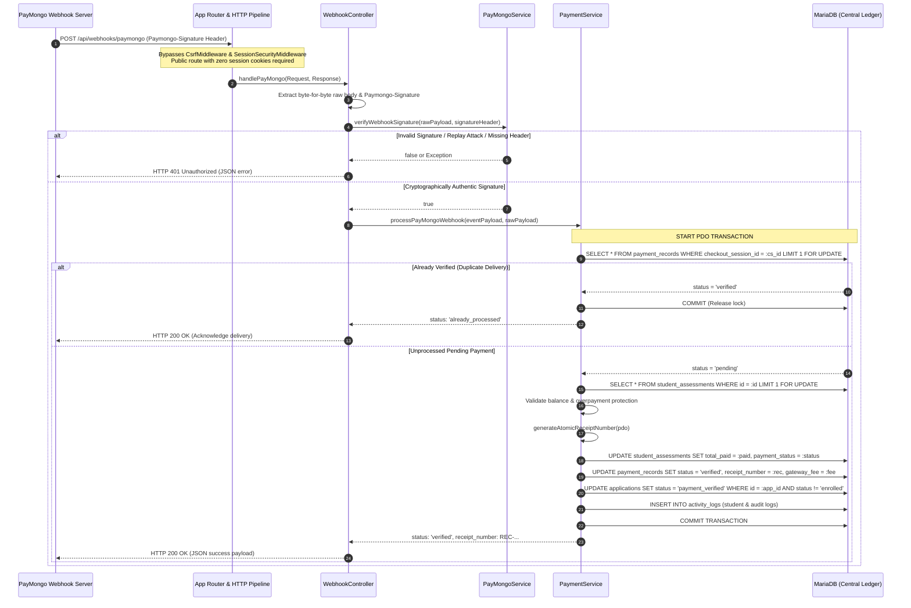

# TTU ENROLLMENT SYSTEM — PHASE 3: PAYMONGO WEBHOOK & RECONCILIATION REPORT

**Author**: Senior Software Architect / Backend Engineer  
**Date**: October 2, 2026  
**Status**: Completed & Verified  
**Scope**: Server-to-server PayMongo webhook reception, HMAC SHA-256 signature verification, idempotent financial reconciliation, atomic receipt issuance, and lifecycle boundaries.

---

## 1. Executive Summary

Phase 3 implements an institutional-grade, server-to-server automated payment reconciliation engine connecting Triple T University (TTU) with the PayMongo gateway.

In strict compliance with architectural boundaries established in Phase 0 (Cashier Safety Fixes), Phase 1 (Payment Architecture Foundation), and Phase 2 (PayMongo Checkout Integration):
- **Browser Return Is Untrusted**: Client-side browser redirects (`/applicant/payment_callback.php`) remain purely informational. Zero financial mutations, balance changes, or receipt generations occur from client navigation.
- **Server Cryptographic Verification**: Financial confirmation is triggered **exclusively** by verified PayMongo webhook notifications delivered to the public endpoint `/api/webhooks/paymongo`.
- **Single Financial Ledger**: `payment_records` remains the sole system of record. No shadow or secondary ledgers were introduced.
- **Idempotency Invariant**: Any duplicate, re-sent, or out-of-order webhook delivery is detected and resolved as `already_processed`, returning `HTTP 200 OK` without creating duplicate receipts, inflating `student_assessments.total_paid`, or re-triggering status mutations.
- **Registrar Boundary**: Confirmed payments transition `applications.status` to `payment_verified`. The final transition to `enrolled`, student number generation, and course provisioning remains strictly gated inside `EnrollmentService::finalizeEnrollment()`.

---

## 2. Webhook Architecture & Public Endpoint Flow



---

## 3. Cryptographic Signature Verification (`Paymongo-Signature`)

Authentication is enforced in accordance with official PayMongo documentation. The endpoint accepts no session cookies or basic auth credentials; incoming requests are authenticated purely by HMAC SHA-256 signatures.

### 3.1 Header Structure
The `Paymongo-Signature` header contains comma-delimited key-value pairs:
```http
Paymongo-Signature: t=1727827200,te=8f9a2b...,li=3c4d5e...
```
- `t`: Epoch timestamp integer when the webhook was dispatched.
- `te`: Test mode HMAC SHA-256 hex digest.
- `li`: Live mode HMAC SHA-256 hex digest.

### 3.2 Verification Algorithm (`PayMongoService::verifyWebhookSignature`)
1. **Header Parsing**: Parses `t`, `te`, and `li` components.
2. **Replay Attack Defense**: Rejects requests where `abs(time() - (int)$t) > 300` (5-minute tolerance window).
3. **Payload Construction**: Concatenates timestamp and raw request body:
   $$\text{SignatureString} = t \parallel "." \parallel \text{rawPayload}$$
4. **HMAC Generation**: Computes $\text{HMAC-SHA256}(\text{SignatureString}, \text{PAYMONGO\_WEBHOOK\_SECRET})$.
5. **Constant-Time Comparison**: Compares the digest against `te` or `li` using `hash_equals()` to prevent timing side-channel attacks.

---

## 4. Idempotency & Concurrency Strategy

PayMongo's webhook delivery guarantees **at-least-once** delivery. Network timeouts or delayed 200 acknowledgments will cause PayMongo to retry delivery up to 12 times with exponential backoff.

### 4.1 Strict Row-Level Locking (`LIMIT 1 FOR UPDATE`)
When a webhook arrives, the transaction immediately acquires an exclusive row lock on `payment_records`:
```sql
SELECT * FROM payment_records WHERE checkout_session_id = :session_id LIMIT 1 FOR UPDATE;
```
- **Sequential Retries**: If Webhook #1 already verified the record, Webhook #2 reads `status = 'verified'` and immediately exits with `HTTP 200 OK` (`already_processed`).
- **Concurrent Races**: If Webhook #1 and Webhook #2 arrive simultaneously from parallel worker threads, Thread #2 blocks on the MariaDB row lock until Thread #1 commits. When Thread #2 wakes up, it reads the committed state (`status = 'verified'`), detects that the transaction has already been fulfilled, and returns `HTTP 200 OK` without re-crediting the student.

### 4.2 Single Receipt Guarantee
`payment_records.receipt_number` has a unique database constraint (`uq_payment_records_receipt_number`). Furthermore, `generateAtomicReceiptNumber()` is called only when transitioning from `pending` to `verified`. Retries or duplicate requests never call the receipt generator.

---

## 5. Database Transaction & Financial Integrity

All database modifications during reconciliation are wrapped in an atomic PDO transaction. If any sub-operation fails, the entire transaction rolls back cleanly without leaving partial mutations or corrupting assessment balances.

### 5.1 Reconciliation Lifecycle

| Stage | Operation | Entity Modified | Safety Control |
|---|---|---|---|
| **1. Lock Record** | Acquire exclusive lock on target payment | `payment_records` | `LIMIT 1 FOR UPDATE` prevents concurrent race conditions |
| **2. Idempotency Check** | Verify current record status | Memory | Returns `HTTP 200` if status is already `verified` |
| **3. Lock Assessment** | Lock associated assessment row | `student_assessments` | Guarantees live balance view |
| **4. Overpayment Guard** | Check remaining balance against amount | Memory | Throws domain exception if $amount > balance$ or balance $\le 0$ |
| **5. Atomic Receipt** | Generate monotonic receipt sequence | Table lock / sequence | `generateAtomicReceiptNumber()` generates `REC-YYYYMMDD-XXXX` |
| **6. Credit Ledger** | Mark verified, store receipt & fee | `payment_records` | `recordWebhookConfirmation()` records `gateway_fee` and raw JSON |
| **7. Update Balance** | Increment `total_paid`, set `payment_status` | `student_assessments` | Status transitions to `partial` or `paid` |
| **8. Advance Workflow** | Transition application status | `applications` | `status = 'payment_verified'` (`WHERE status != 'enrolled'`) |
| **9. Audit Trail** | Log student notice and admin audit log | `activity_logs` | Transparent operational traceability |
| **10. Atomic Commit** | Commit PDO transaction | MariaDB | Releases all row locks |

---

## 6. Comprehensive Event Handling Matrix

The integration handles every PayMongo event type and exceptional state:

| Incoming Scenario / Event Type | Gateway Resource State | System Action Taken | Database Mutation | HTTP Response Code |
|---|---|---|---|---|
| **`checkout_session.payment.paid`** | Session `paid`, Intent `succeeded` | Verify payment, generate receipt, update assessment balance | `status = 'verified'`, `receipt_number = REC-...`, balance updated | `200 OK` (`success`) |
| **`payment.paid`** | Payment `paid` | Verify payment via `payment_intent_id` | Same as above | `200 OK` (`success`) |
| **`payment.failed`** | Payment `failed` | Record transaction failure; no receipt, no balance deduction | `status = 'failed'`, `remarks` recorded | `200 OK` (`success`) |
| **`checkout_session.expired`** | Session `expired` | Mark pending session expired; allows student to re-attempt | `status = 'expired'`, `remarks` recorded | `200 OK` (`success`) |
| **Session Cancelled** | Session `cancelled` | Mark pending session cancelled | `status = 'cancelled'` | `200 OK` (`success`) |
| **Duplicate Webhook** | Session `paid` (Already processed) | Idempotent acknowledgment; no re-credit, no second receipt | **None** (Read-only check) | `200 OK` (`already_processed`) |
| **Unknown Transaction** | Unrecognized session or intent | Transaction not found guard; logs warning | **None** | `404 Not Found` (`error`) |
| **Overpayment Attempt** | Account already paid OTC/in-flight | Block balance corruption; rollback transaction | **None** (Rollback) | `422 Unprocessable` (`error`) |
| **Malformed Payload** | Invalid JSON syntax or envelope | Rejection guard | **None** | `400 Bad Request` (`error`) |
| **Invalid Signature** | HMAC mismatch or tampered body | Rejection guard | **None** | `401 Unauthorized` (`error`) |
| **Expired Signature (>300s)** | Replay attack attempt | Rejection guard | **None** | `401 Unauthorized` (`error`) |
| **Non-POST Method** | GET, PUT, or DELETE request | HTTP Method guard | **None** | `405 Method Not Allowed` |

---

## 7. Modified & Created Artifacts

### 7.1 Core Components Created / Modified
1. [app/Controllers/WebhookController.php](file:///c:/xampp/htdocs/sia/app/Controllers/WebhookController.php)
   - Dedicated controller for PayMongo server-to-server notifications.
   - Strictly enforces POST, validates JSON body, authenticates HMAC signature, and coordinates reconciliation.
2. [app/Services/PayMongoService.php](file:///c:/xampp/htdocs/sia/app/Services/PayMongoService.php)
   - Added `verifyWebhookSignature(string $rawPayload, string $signatureHeader, ?string $webhookSecret = null, int $tolerance = 300): bool`.
   - Added `generateSignatureHeader(string $rawPayload, string $secret, ?int $timestamp = null, bool $livemode = false): string` (utility for test suites and simulator environments).
3. [app/Services/PaymentService.php](file:///c:/xampp/htdocs/sia/app/Services/PaymentService.php)
   - Added `processPayMongoWebhook(array $eventPayload, ?string $rawPayload = null): array`.
   - Enforces atomic PDO transaction, row locks on payment and assessment, balance overpayment check, atomic receipt issuance, and application status transition.
4. [app/Repositories/PaymentRepository.php](file:///c:/xampp/htdocs/sia/app/Repositories/PaymentRepository.php)
   - Added `recordWebhookConfirmation(int $id, string $status, ?string $receiptNumber = null, ?float $gatewayFee = null, ?string $paymentIntentId = null, ?string $rawPayload = null, ?string $remarks = null): bool`.
5. [app/Core/Request.php](file:///c:/xampp/htdocs/sia/app/Core/Request.php)
   - Added `getRawBody()`, `setRawBody()`, `setHeader()`, and `setMethod()` to support pristine byte-for-byte HMAC verification and in-memory mock testing.
6. [app/Core/Response.php](file:///c:/xampp/htdocs/sia/app/Core/Response.php)
   - Added `statusCode` and `jsonData` properties for test inspectability.
7. [app/Routes/web.php](file:///c:/xampp/htdocs/sia/app/Routes/web.php)
   - Registered public routes `POST /api/webhooks/paymongo` and `POST /api/webhooks/paymongo.php` outside CSRF/session middleware groups.
8. [scripts/migrations/phase3_webhook_enum.php](file:///c:/xampp/htdocs/sia/scripts/migrations/phase3_webhook_enum.php)
   - Expanded `payment_records.status` ENUM definition to support `('pending', 'verified', 'rejected', 'failed', 'cancelled', 'expired')`.
   - Added `idx_payment_records_payment_intent` index on `payment_records(payment_intent_id)`.
9. [database/schema.sql](file:///c:/xampp/htdocs/sia/database/schema.sql) and [schema_dump.sql](file:///c:/xampp/htdocs/sia/schema_dump.sql)
   - Synchronized with active MariaDB schema.

---

## 8. Verification & Test Suite Execution

A dedicated, comprehensive test suite was developed in [scripts/tests/test_phase3_paymongo_webhook.php](file:///c:/xampp/htdocs/sia/scripts/tests/test_phase3_paymongo_webhook.php) covering 45 automated test assertions. In addition, all prior regression test suites and the full 9-step automated applicant enrollment bot were executed.

### 8.1 Test Suites Summary

| Test Suite File | Coverage Scope | Tests | Result |
|---|---|:---:|:---:|
| [scripts/tests/test_phase3_paymongo_webhook.php](file:///c:/xampp/htdocs/sia/scripts/tests/test_phase3_paymongo_webhook.php) | HMAC verification, controller protocol, reconciliation, idempotency, failures, cancellations, unknown transactions, overpayment | 45 | **45 / 45 PASSED** |
| [scripts/tests/test_phase2_paymongo_integration.php](file:///c:/xampp/htdocs/sia/scripts/tests/test_phase2_paymongo_integration.php) | PayMongo checkout creation, session linking, callback safety, balance checks | 28 | **28 / 28 PASSED** |
| [scripts/tests/test_phase1_payment_foundation.php](file:///c:/xampp/htdocs/sia/scripts/tests/test_phase1_payment_foundation.php) | OTC payments, online proof verification/rejection, repository pagination | 40 | **40 / 40 PASSED** |
| [scripts/tests/test_phase0_safety_suite.php](file:///c:/xampp/htdocs/sia/scripts/tests/test_phase0_safety_suite.php) | Concurrency receipts, reference UNIQUE constraints, upload rollback | 11 | **11 / 11 PASSED** |
| [scripts/tests/test_enrollment_bot.php](file:///c:/xampp/htdocs/sia/scripts/tests/test_enrollment_bot.php) | Complete 9-step institutional enrollment lifecycle (Registration to LMS Course Access) | 9 Steps | **100% SUCCESS** |

```text
====================================================================
  TTU ENROLLMENT SYSTEM — PHASE 3 PAYMONGO WEBHOOK TEST SUITE       
====================================================================

[TEST 1] Paymongo-Signature Cryptographic Verification...
  [PASS] Valid testmode ('te') signature passes cryptographic verification
  [PASS] Valid livemode ('li') signature passes cryptographic verification
  [PASS] Tampered request payload fails verification (HMAC mismatch)
  [PASS] Signature signed with wrong secret is rejected
  [PASS] Expired timestamp rejected by replay attack defense window (300s)
  [PASS] Malformed signature header string is rejected

[TEST 2] Webhook Controller Protocol & Security Rejections...
  [PASS] Rejects non-POST request with HTTP 405 Method Not Allowed
  [PASS] Rejects empty payload with HTTP 400 Bad Request
  [PASS] Rejects malformed JSON with HTTP 400 Bad Request
  [PASS] Rejects missing Paymongo-Signature header with HTTP 401 Unauthorized
  [PASS] Rejects forged signature with HTTP 401 Unauthorized

[TEST 3] Successful Payment Reconciled via Webhook (checkout_session.payment.paid)...
  [PASS] Webhook controller returns HTTP 200 OK for valid payment event
  [PASS] Response indicates success
  [PASS] Payment record status transitioned from 'pending' to 'verified'
  [PASS] Official atomic receipt number generated (REC-20261002-0742)
  [PASS] Gateway fee of ₱125.00 recorded from payload
  [PASS] Raw webhook payload archived in database
  [PASS] Assessment total_paid incremented to ₱5,000.00
  [PASS] Assessment payment_status set to 'partial'
  [PASS] Application status transitioned to 'payment_verified'
  [PASS] Application is NOT marked 'enrolled' (Registrar gate strictly preserved)

[TEST 4] Idempotency & Duplicate Webhook Processing...
  [PASS] Duplicate delivery attempt 1 returns HTTP 200 OK
  [PASS] Duplicate delivery 1 identified as 'already_processed'
  [PASS] Duplicate delivery attempt 2 returns HTTP 200 OK
  [PASS] Duplicate delivery 2 identified as 'already_processed'
  [PASS] Duplicate delivery attempt 3 returns HTTP 200 OK
  [PASS] Duplicate delivery 3 identified as 'already_processed'
  [PASS] Receipt number remained identical across duplicate webhooks
  [PASS] Assessment total_paid remained ₱5,000.00 (NO duplicate balance inflation)

[TEST 5] Full Settlement via Direct 'payment.paid' Webhook Event...
  [PASS] Direct payment.paid webhook handled with HTTP 200 OK
  [PASS] Second payment transitioned to 'verified'
  [PASS] Second unique atomic receipt generated (REC-20261002-0743)
  [PASS] Assessment total_paid reached ₱12,000.00 (Full tuition settlement)
  [PASS] Assessment payment_status reached final 'paid' state

[TEST 6] Overpayment & Settled Account Protections...
  [PASS] Webhook rejects payment on already settled assessment with HTTP 422
  [PASS] Error message explicitly indicates account is fully settled
  [PASS] Assessment total_paid remains uncorrupted at ₱12,000.00

[TEST 7] Failed Payment Webhook Handling (payment.failed)...
  [PASS] Failed payment webhook acknowledged with HTTP 200 OK
  [PASS] Payment record status transitioned to 'failed'
  [PASS] No receipt number issued for failed transaction

[TEST 8] Cancelled / Expired Payment Webhook Handling...
  [PASS] Expired session webhook acknowledged with HTTP 200 OK
  [PASS] Payment record status transitioned to 'expired'
  [PASS] No receipt issued for expired session

[TEST 9] Unknown Transaction Guard...
  [PASS] Unknown checkout session returns HTTP 404 Not Found
  [PASS] Response specifies transaction was not found

====================================================================
  PHASE 3 TEST SUMMARY: 45 PASSED, 0 FAILED
====================================================================
```

---

## 9. Remaining Considerations & Next Steps

Phase 3 completes the server-side payment reconciliation lifecycle. Per user instructions, execution stops here.

### 9.1 Next Phase Considerations
1. **Configurable High-Concurrency Payment Queue (Phase 4)**:
   - When large student batches register simultaneously during peak enrollment windows, introduce slot throttling to limit concurrent PayMongo checkout sessions.
   - Queue wait screen with polling, heartbeat renewal, and automatic slot forfeiture after a 15-minute checkout window.
2. **Production Webhook Registration**:
   - In production or staging environments with a public domain, register `https://<domain>/sia/api/webhooks/paymongo` in the PayMongo Dashboard (under *Developers* $\rightarrow$ *Webhooks*), subscribed to `checkout_session.payment.paid`, `payment.paid`, and `payment.failed`.
   - Copy the generated Webhook Signing Secret (`whsk_...`) into `.env` as `PAYMONGO_WEBHOOK_SECRET`.
