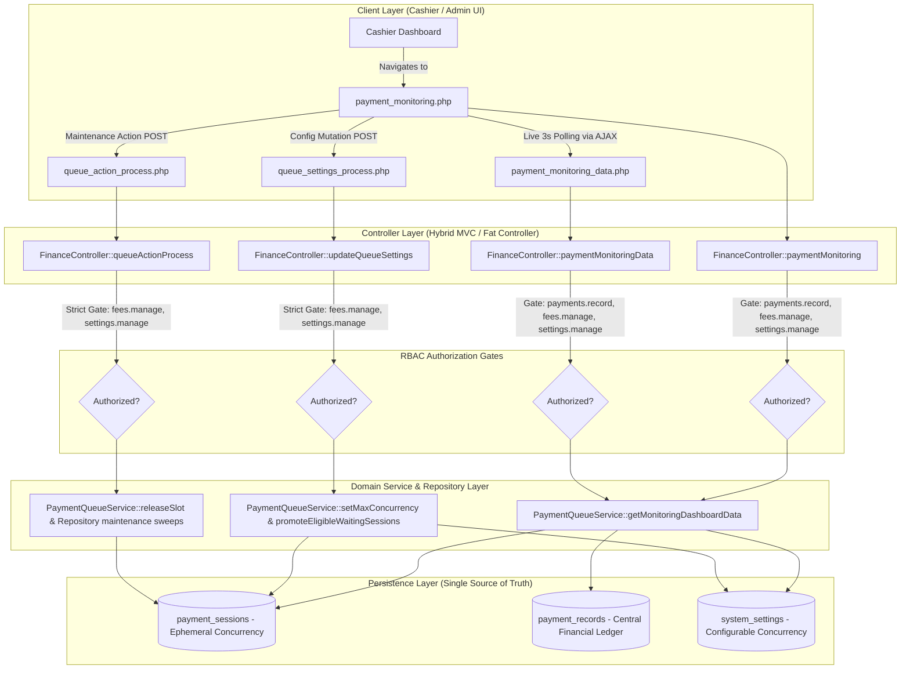

# Phase 6: Cashier/Admin Payment Monitoring & Queue Governance Report

## Executive Summary

Phase 6 completes the institutional operations portal for the **Triple T University (TTU) Enrollment System** by delivering real-time queue monitoring, PayMongo gateway telemetry, and dynamic capacity governance directly within the Cashier/Finance module.

This implementation connects the concurrent payment queue infrastructure (Phase 4) and applicant-facing online payment portal (Phase 5) to authorized administrative staff (`cashier`, `finance admin`, `superadmin`), providing total visibility and live control over concurrent payment intake without introducing ledger duplication or breaching domain boundaries.

---

## 1. Architectural Highlights



---

## 2. Telemetry & Real-Time Monitoring Specification

The monitoring dashboard unifies three streams of institutional data into a unified, live-updating telemetry contract (`/admin/finance/payment_monitoring_data.php`):

| Telemetry Category | Data Field | Source Table | Description |
| :--- | :--- | :--- | :--- |
| **Capacity & Slots** | `max_concurrency` | `system_settings` | Configured maximum simultaneous checkout sessions ($100 \rightarrow 250 \rightarrow 500 \rightarrow 1000$). |
| | `active_sessions` | `payment_sessions` | Number of applicants currently occupying active checkout reservations (`status = 'active'`). |
| | `available_slots` | Computed | $\max(0, \text{max\_concurrency} - \text{active\_sessions})$. Instant indicator of intake headroom. |
| | `utilization_percent` | Computed | Capacity saturation percentage with contextual status indicators (Optimal / High / Saturated). |
| **Virtual Waiting Line** | `waiting_sessions` | `payment_sessions` | Number of applicants currently in FIFO waiting queue with active heartbeats (`status = 'waiting'`). |
| | Queue List | `payment_sessions` | Detailed list with queue position, student number, applicant name, and wait duration. |
| **Session Lifecycle** | `completed_count` | `payment_sessions` | Sessions that successfully finalized payment via PayMongo webhook. |
| | `expired_count` | `payment_sessions` | Sessions whose 15-minute reservation timer elapsed without capture. |
| | `cancelled_count` | `payment_sessions` | Sessions voluntarily exited by applicants via the checkout leave action. |
| | `abandoned_count` | `payment_sessions` | Dormant waiting tabs reclaimed due to missing client heartbeats ($>5$ min). |
| **Financial Ledger** | `total_transactions` | `payment_records` | Global count of all PayMongo gateway records in the institutional ledger. |
| | `verified_collections` | `payment_records` | Cumulative Philippine Peso volume verified and receipted through PayMongo. |
| | `total_gateway_fees` | `payment_records` | PayMongo processing fee totals recorded for accounting audit and reconciliation. |
| | Transaction Breakdown | `payment_records` | Real-time counts partitioned by status (`verified`, `pending`, `failed`, `expired`, `rejected`). |
| | Transaction Audit Trail | `payment_records` | Identifiers: `checkout_session_id`, `payment_intent_id`, and `official_receipt_number`. |

---

## 3. Strict Single Financial Ledger Preservation

In accordance with institutional guidelines:
1. **Zero Ledger Duplication**: All financial collections, receipts, and transaction records originate and reside exclusively within `payment_records`.
2. **Ephemeral Queue Boundaries**: `payment_sessions` is used strictly for concurrency tracking, FIFO ordering, and reservation expiration. No money, balances, or receipts are stored in `payment_sessions`.
3. **Receipt Traceability**: When an online checkout completes, `payment_records.id` is linked to `payment_sessions.payment_record_id` purely for reverse lookup. Financial audit queries (`getPayMongoStats`, `getPayMongoTransactions`) query `payment_records` directly.

---

## 4. Permission & Security Architecture

The monitoring module implements a two-tier Role-Based Access Control (RBAC) model:

```
+-----------------------------------------------------------------------------------+
| Module View & Read-Only Polling Gate                                               |
| Permitted Permissions: ['payments.record', 'fees.manage', 'settings.manage', '*'] |
| Roles: Cashier, Finance Officer, Superadmin                                        |
+-----------------------------------------------------------------------------------+
                                       |
                                       v
+-----------------------------------------------------------------------------------+
| Queue Settings Mutation & Emergency Maintenance Gate                              |
| Permitted Permissions: ['fees.manage', 'settings.manage', '*']                     |
| Roles: Finance Officer / Superadmin ONLY                                          |
| Cashiers with only 'payments.record' are BLOCKED with HTTP 403                    |
+-----------------------------------------------------------------------------------+
```

### Security Defenses Implemented:
* **Unauthorized Role Rejection**: Students, applicants, faculty, clinic staff, admissions officers, and schedulers attempting to load the view or query the polling endpoint are blocked with `HTTP 403 Forbidden`.
* **Privilege Separation**: Junior cashiers possessing only `payments.record` can view live metrics and inspect transactions, but are prevented from mutating queue capacity, window durations, or triggering maintenance sweeps.
* **Anti-CSRF Verification**: All configuration form submissions and administrative maintenance actions enforce server-side CSRF token validation (`validateCsrfToken($_POST['csrf_token'])`).
* **Audit Logging**: All configuration changes are permanently logged using `logActivity()` with old and new capacity values, timestamp, and executing administrator user ID.

---

## 5. Dynamic Capacity & Instant Promotion Flow

Capacity is dynamically configurable via `system_settings`:

1. Authorized finance administrators can select presets (`100`, `250`, `500`, `1000`) or input custom capacity limits.
2. Upon saving, `FinanceController::updateQueueSettings()` compares the new capacity against the old capacity.
3. If capacity expands (e.g., $100 \rightarrow 250$), the system immediately invokes `PaymentQueueService::promoteEligibleWaitingSessions()`.
4. The earliest waiting applicants in FIFO order are instantly promoted to `active` status under atomic database row locks (`FOR UPDATE`), receiving fresh checkout reservation windows without administrative delay.

---

## 6. Cashier UI/UX Consistency

The monitoring interface ([`app/Views/admin/finance/payment_monitoring.php`](file:///c:/xampp/htdocs/sia/app/Views/admin/finance/payment_monitoring.php)) adheres to TTU design standards:
* **Dossier Hero Header**: Features active academic year, institutional branding, live capacity badge, and a real-time pulse indicator showing background sync status.
* **Four KPI Cards**:
  1. *Active Checkout Sessions* with live animated progress bar and available slot counter.
  2. *Virtual Waiting Line* tracking queued students and wait times.
  3. *PayMongo Intake* displaying verified collections and absorbed gateway fees.
  4. *Completed Checkouts* showing capture rate alongside expired and cancelled session counts.
* **Capacity Governance Drawer**: Accessible exclusively to authorized finance staff with capacity presets, window duration controls, and virtual queue toggle.
* **Multi-Tab Telemetry Panel**:
  - *Active Checkout Sessions*: Displays real-time countdown timers ticking every second in applicant rows, student ID, assessment amounts, and force-release maintenance buttons.
  - *Virtual Waiting Line*: Real-time list of queued applicants with queue position, wait duration, and heartbeat freshness indicators.
  - *PayMongo Gateway Transactions*: Searchable audit table with PayMongo Checkout IDs, Payment Intent IDs, Official Receipt numbers, amounts, and color-coded status badges.
* **Seamless Navigation Integration**:
  - Direct menu item under Finance in [`admin_navbar.php`](file:///c:/xampp/htdocs/sia/app/Views/components/admin_navbar.php).
  - Quick action button in [`cashier_dashboard.php`](file:///c:/xampp/htdocs/sia/app/Views/admin/finance/cashier_dashboard.php).
  - Quick action button in [`cashier_payments.php`](file:///c:/xampp/htdocs/sia/app/Views/admin/finance/cashier_payments.php).

---

## 7. Automated Test Suite & Regression Verification

### 7.1 Phase 6 Test Suite Results (`scripts/tests/test_phase6_payment_monitoring.php`)
* **Total Executed Tests**: 56
* **Passed**: 56
* **Failed**: 0
* **Pass Rate**: 100%

Key Test Scenarios Verified:
* **Section 1 (Telemetry Aggregation)**: Verified `getActiveSessionsDetailed`, `getWaitingSessionsDetailed`, `getSessionCounts`, `getPayMongoStats`, and `getPayMongoTransactions`.
* **Section 2 (RBAC Protection)**: Verified view access for Cashier and Superadmin; verified HTTP 403 rejection for Student and Clinic; verified HTTP 403 mutation block for recording-only Cashier; verified HTTP 200 mutation success for Finance Admin.
* **Section 3 (Dynamic Capacity Expansion)**: Verified instant auto-promotion of waiting applicant upon capacity expansion from 1 to 250.
* **Section 4 (Queue Maintenance Actions)**: Verified `recycle_stale` reclaims expired sessions; verified `force_release` vacates slot and promotes next waiting applicant.
* **Section 5 (Real-Time Polling Endpoint)**: Verified JSON structure, metric keys, and live dataset delivery.

### 7.2 Full Institutional Regression Suite Results
| Test Suite Script | Focus Area | Results |
| :--- | :--- | :--- |
| `test_phase0_safety_suite.php` | Concurrency, receipt collisions, balance checks | **11 Passed, 0 Failed** |
| `test_phase1_payment_foundation.php` | Cashier OTC, online verification, ledger | **40 Passed, 0 Failed** |
| `test_phase2_paymongo_integration.php` | PayMongo checkout creation & security | **28 Passed, 0 Failed** |
| `test_phase3_paymongo_webhook.php` | Webhook verification, HMAC, idempotency | **45 Passed, 0 Failed** |
| `test_phase4_payment_queue.php` | Concurrent queue engine & worker safety | **65 Passed, 0 Failed** |
| `test_phase5_student_payment_ui.php` | Applicant portal, queue join/leave/poll | **59 Passed, 0 Failed** |
| `test_phase6_payment_monitoring.php` | Cashier queue monitor & governance | **56 Passed, 0 Failed** |
| `test_enrollment_bot.php` | Full End-to-End Enrollment (Steps 1–9) | **All 9 Steps Passed** |

---

## 8. Compliance & Domain Boundary Confirmation

1. **Registrar Finalization Gate Intact**: Finalization remains strictly inside `EnrollmentService::finalizeEnrollment()`. Neither the queue monitor nor PayMongo webhook automatically finalizes enrollment.
2. **Single Financial Ledger**: No shadow tables created; `payment_records` remains the sole ledger.
3. **Stop Trigger**: Implementation terminates cleanly at Phase 6 with all requirements fulfilled.
