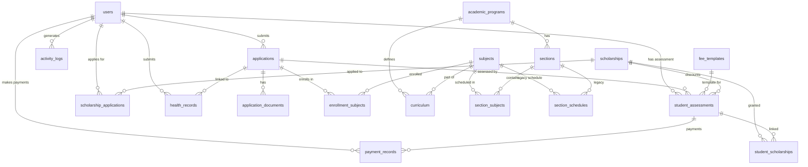

# TTU Enrollment System — Project Overview

> **Document Version:** 1.0  
> **Generated:** July 16, 2026  
> **System Name:** Triple T University (TTU) Online Enrollment System  
> **Code Name:** SIA (`sia`)

---

## 1. Executive Summary

The TTU Online Enrollment System is a **PHP-based web application** running on a XAMPP (Apache + MySQL + PHP) stack. It serves as a full-cycle enrollment management platform for **Triple T University**, covering Senior High School and College academic levels. The system handles the end-to-end lifecycle from applicant registration through admission review, fee assessment, and enrollment finalization.

The project uses a **server-rendered, multi-page architecture** — every page is a standalone PHP file. There is no frontend framework (React, Vue, etc.). The UI is built with **Bootstrap 5.3** and a custom CSS design system using the **Poppins** typeface. AJAX is used selectively (Schedule Builder, some APIs). The backend uses raw **PDO** (no ORM, no framework).

**Key Stats:**
| Metric | Value |
|---|---|
| Total PHP Files | ~80+ |
| Database Tables | 20 |
| User Roles | 6 |
| Academic Programs | 10 (5 SHS + 5 College) |
| Subjects Seeded | 123 |
| Curriculum Mappings | 271 |

---

## 2. Project Architecture

```
Architecture: Traditional Server-Side Rendered (SSR) PHP
Pattern:      Page-Controller (each PHP file is a controller + view)
Database:     MySQL 5.7+ / MariaDB via PDO
Frontend:     Bootstrap 5.3.3 + Bootstrap Icons 1.11.3 + custom CSS
Typography:   Google Fonts (Poppins)
JavaScript:   Vanilla JS (no jQuery, no build tools)
Auth:         Session-based with CSRF protection
```

The project follows a **flat page-controller** pattern. Each PHP file typically:
1. Includes auth middleware (`includes/auth.php`)
2. Includes database config (`config/database.php`)
3. Performs PDO queries inline
4. Renders HTML output directly

There are no PHP classes, no namespaces, no Composer autoloader, and no dependency management.

---

## 3. Folder Structure

```
sia/
├── admin/                          # Admin portal (all back-office modules)
│   ├── admissions/                 # Application review, medical clearance
│   │   ├── admissions_dashboard.php
│   │   ├── review.php
│   │   ├── application_detail.php
│   │   ├── application_process.php
│   │   ├── bulk_process.php
│   │   ├── document_view.php
│   │   ├── medical_clearance.php
│   │   ├── medical_detail.php
│   │   └── medical_process.php
│   ├── components/                 # Shared admin UI partials
│   │   ├── navbar.php              # Left sidebar + topbar
│   │   └── footer.php
│   ├── finance/                    # Cashier, fees, payments
│   │   ├── cashier_dashboard.php
│   │   ├── cashier_assessment.php
│   │   ├── cashier_payments.php
│   │   ├── cashier_process.php
│   │   ├── cashier_receipt.php
│   │   ├── fees.php
│   │   └── fee_process.php
│   ├── registrar/                  # Programs, subjects, curriculum, sections, schedules
│   │   ├── registrar_dashboard.php
│   │   ├── programs.php + program_process.php
│   │   ├── subjects.php + subject_process.php
│   │   ├── curriculum.php + curriculum_process.php
│   │   ├── sections.php
│   │   ├── schedule_builder.php + schedule_builder_process.php
│   │   ├── section_schedule_process.php
│   │   ├── enrollment_queue.php
│   │   ├── students.php + students_export.php
│   │   └── (14 files total)
│   ├── scholarship/                # Scholarship CRUD + application review
│   │   ├── scholarship_dashboard.php
│   │   ├── scholarships.php
│   │   ├── scholarship_review.php
│   │   ├── scholarship_detail.php
│   │   └── scholarship_process.php
│   ├── system/                     # Superadmin tools
│   │   ├── sysadmin_dashboard.php
│   │   ├── users.php + user_process.php
│   │   ├── reports.php + reports_export.php
│   │   ├── settings.php + settings_process.php
│   │   ├── audit_logs.php
│   │   ├── user_activity.php
│   │   └── backup.php + backup_process.php
│   └── dashboard.php               # Role-based router
│
├── applicant/                      # Student/applicant portal
│   ├── components/
│   │   └── navbar.php
│   ├── dashboard.php               # Main applicant hub (753 lines)
│   ├── enroll.php                  # Enrollment form (78K — largest file)
│   ├── enroll_process.php          # Form processing (673 lines)
│   ├── status.php                  # Application status + timeline
│   ├── profile.php + profile_process.php
│   ├── documents.php + document_upload.php + document_view.php + document_workflow.php
│   ├── health_info.php + health_process.php
│   ├── scholarships.php + scholarship_apply.php
│   ├── assessment.php              # Fee assessment viewer
│   ├── print_slip.php              # Enrollment slip generator
│   └── api_*.php                   # JSON APIs (6 files)
│
├── auth/                           # Authentication
│   ├── login.php + login_process.php
│   ├── register.php + register_process.php
│   └── logout.php
│
├── components/                     # Shared UI partials (public-facing)
│   ├── header.php                  # HTML <head> + Bootstrap CDN
│   ├── navbar.php                  # Public navigation bar
│   ├── footer.php
│   └── sidebar.php
│
├── config/
│   └── database.php                # PDO connection factory
│
├── css/
│   ├── design-system.css           # CSS custom properties + base styles
│   └── main.css                    # All component/page styles (1035 lines)
│
├── database/
│   ├── schema.sql                  # Full DDL (455 lines, 20 tables)
│   ├── seed.sql                    # Initial data (programs, settings, users)
│   └── migrate_college_offerings.php
│
├── images/                         # Empty (no images currently)
├── assets/                         # Empty (no assets currently)
├── uploads/
│   └── documents/                  # Uploaded applicant documents
│
├── includes/
│   ├── auth.php                    # Session, CSRF, RBAC, permission system
│   └── functions.php               # Helper functions (508 lines)
│
├── js/
│   └── main.js                     # Global spinner, alert auto-dismiss
│
├── migrations/                     # Schema evolution scripts
│   ├── phase1_expansion.php
│   ├── phase2_college.php
│   ├── phase3_curriculum.php
│   ├── phase3_scholarships.php
│   ├── phase5_health.php
│   ├── phase6_rbac.php
│   ├── phase7_unified_scheduling.php
│   ├── phase8_cleanup.php
│   └── db_reset_data.php
│
├── public/
│   └── index.php                   # Landing page / homepage (624 lines)
│
├── setup_database.php              # Automated DB bootstrapper
├── seed_official_curriculum.php    # Official curriculum seeder
├── PROJECT.md
└── README.md
```

---

## 4. Database Overview

The live database has **20 tables**. Below is every table with its purpose, primary key, foreign keys, and key fields.

### 4.1 Core User & Auth Tables

| Table | Purpose | PK | FKs | Key Fields |
|---|---|---|---|---|
| `users` | All user accounts (applicants + staff) | `id` | — | `email` (unique), `role` (enum: applicant, admin, superadmin, admissions, scholarship, cashier), `password`, `student_number` (unique, nullable), `department`, `permissions` (JSON), `is_active` |
| `login_attempts` | Brute-force rate limiting | `id` | — | `ip_address`, `email`, `attempt_time` |

### 4.2 Application & Enrollment Tables

| Table | Purpose | PK | FKs | Key Fields |
|---|---|---|---|---|
| `applications` | Enrollment applications (one per student) | `id` | `user_id → users.id` | `reference_number` (unique), `status` (enum: pending / under_review / correction_required / approved / rejected / enrolled), `academic_level`, `grade_level`, `semester`, `strand`, `section_id`, extensive personal/parent/school data fields, `admin_feedback`, `internal_notes` |
| `application_documents` | Uploaded documents per application | `id` | `application_id → applications.id` | `document_name`, `file_path`, `status` (pending/verified/rejected), `feedback` |
| `enrollment_subjects` | Subjects enrolled per application | `id` | `application_id → applications.id`, `subject_id → subjects.id` | Unique constraint on `(application_id, subject_id)` |

### 4.3 Academic Structure Tables

| Table | Purpose | PK | FKs | Key Fields |
|---|---|---|---|---|
| `academic_programs` | SHS Strands + College Degrees | `id` | — | `code` (unique), `name`, `category` (enum: Senior High School / College), `is_active` |
| `subjects` | Master subject catalog | `id` | — | `subject_code` (unique), `subject_name`, `units`, `description`, `status` |
| `curriculum` | Maps subjects → programs by year/semester | `id` | `program_id → academic_programs.id`, `subject_id → subjects.id` | `year_level`, `semester`, unique constraint on `(program_id, year_level, semester, subject_id)` |
| `sections` | Class sections (e.g., BSIT-1A) | `id` | `program_id → academic_programs.id` | `section_code` (unique), `year_level`, `semester`, `schedule_type` (Morning/Afternoon), `capacity`, `adviser`, `status` |
| `section_subjects` | **Unified scheduling table** — one row per subject-per-section with full schedule data | `id` | `section_id → sections.id`, `subject_id → subjects.id` | `instructor`, `room`, `building`, `day`, `start_time`, `end_time`, `delivery_mode` (Face-to-Face/Online/Hybrid), `capacity`, `status` |
| `section_schedules` | **Legacy table** — original SHS schedule structure (superseded by `section_subjects`) | `id` | `section_id → sections.id`, `subject_id → subjects.id` | `day`, `start_time`, `end_time`, `room`, `instructor` |

### 4.4 Financial Tables

| Table | Purpose | PK | FKs | Key Fields |
|---|---|---|---|---|
| `fee_templates` | Tuition/fee structures per academic level | `id` | — | `academic_level`, `grade_level`, `strand`, `tuition_fee`, `miscellaneous_fee`, `registration_fee`, `laboratory_fee`, `other_fees`, `total_amount` |
| `student_assessments` | Generated fee assessments per student | `id` | `user_id → users.id`, `application_id → applications.id`, `fee_template_id → fee_templates.id`, `scholarship_id → scholarships.id` | `total_amount`, `discount_amount`, `net_amount`, `total_paid`, `payment_status` (unpaid/partial/paid) |
| `payment_records` | Individual payment transactions | `id` | `assessment_id → student_assessments.id`, `user_id → users.id`, `cashier_id → users.id` | `amount`, `payment_date`, `payment_method`, `receipt_number` (unique), `status` (pending/verified/rejected) |

### 4.5 Scholarship Tables

| Table | Purpose | PK | FKs | Key Fields |
|---|---|---|---|---|
| `scholarships` | Available scholarship programs | `id` | — | `name`, `discount_type` (percentage/fixed), `discount_value`, `is_active` |
| `scholarship_applications` | Student scholarship requests | `id` | `user_id → users.id`, `scholarship_id → scholarships.id` | `status` (pending/under_review/approved/rejected), `admin_feedback` |
| `student_scholarships` | Approved scholarship-to-assessment link | `id` | `assessment_id → student_assessments.id`, `scholarship_id → scholarships.id` | — |

### 4.6 Health & System Tables

| Table | Purpose | PK | FKs | Key Fields |
|---|---|---|---|---|
| `health_records` | Medical/health information per student | `id` | `user_id → users.id`, `application_id → applications.id` | Boolean flags for conditions (allergies, asthma, etc.), `status` (pending/under_review/verified/correction_required/rejected), `admin_remarks` |
| `activity_logs` | System-wide audit trail | `id` | `user_id → users.id` | `icon`, `title`, `description`, `ip_address`, `affected_record`, `old_value` (JSON), `new_value` (JSON), `reason` |
| `announcements` | System announcements for applicant dashboard | `id` | — | `badge_label`, `badge_color`, `title`, `content`, `is_active` |
| `system_settings` | Key-value configuration store | `id` | — | `setting_key` (unique), `setting_value`, e.g. `active_school_year`, `enrollment_status`, `college_cost_per_unit` |

---

## 5. Database Relationships



---

## 6. User Roles

The system implements **6 roles** via the `users.role` ENUM column. Authorization is enforced through a **permission-based RBAC system** defined in [auth.php](file:///c:/xampp/htdocs/sia/includes/auth.php#L117-L143).

| Role | Permissions | Accessible Modules | Dashboard |
|---|---|---|---|
| **superadmin** | `*` (all permissions) | Every module in the system | `system/sysadmin_dashboard.php` |
| **admin** (Registrar) | `students.view`, `students.edit`, `programs.manage`, `subjects.manage`, `curriculum.manage`, `sections.manage`, `schedules.manage`, `enrollment.finalize`, `applications.view_details` | Registrar Dashboard, Students, Programs, Subjects, Curriculum, Sections, Schedule Builder, Enrollment Queue | `registrar/registrar_dashboard.php` |
| **admissions** | `applications.view_queue`, `applications.view_details`, `applications.review`, `documents.verify`, `medical.review` | Admissions Dashboard, Application Review, Application Detail, Medical Clearance | `admissions/admissions_dashboard.php` |
| **cashier** | `fees.manage`, `assessments.generate`, `payments.record`, `receipts.print` | Cashier Dashboard, Fee Templates, Payment History, Assessment Generation, Receipt Printing | `finance/cashier_dashboard.php` |
| **scholarship** | `scholarships.manage`, `scholarship_applications.review` | Scholarship Dashboard, Scholarship Management, Application Review | `scholarship/scholarship_dashboard.php` |
| **applicant** | No backend permissions — separate portal | Applicant Dashboard, Enrollment Form, Status Tracking, Documents, Health Info, Scholarships, Assessment, Print Slip | `applicant/dashboard.php` |

**Custom Permissions:** Users can have additional permissions stored in `users.permissions` (JSON column) which are merged with role-based defaults at login time.

---

## 7. Authentication

### Login Flow
1. User submits email + password to [login_process.php](file:///c:/xampp/htdocs/sia/auth/login_process.php)
2. **CSRF token verification** via `verifyCsrfToken()`
3. Input validation (email format, non-empty password)
4. PDO query against `users` table with `password_verify()`
5. Failed attempts logged to `login_attempts` table
6. **Auto-deactivation**: Applicant accounts inactive >3 days with no application are soft-deleted
7. On success: `session_regenerate_id(true)` to prevent session fixation
8. Session populated: `user_id`, `user_name`, `user_role`, `user_permissions`, `user_department`
9. IP and User-Agent stored for **session hijacking detection**
10. Redirect to role-specific dashboard via [dashboard.php](file:///c:/xampp/htdocs/sia/admin/dashboard.php)

### Security Features
- **CSRF tokens**: Generated via `bin2hex(random_bytes(32))`, checked on every POST
- **Session hijacking protection**: IP + User-Agent fingerprinting
- **Session regeneration**: Every 30 minutes
- **Secure cookie flags**: `httponly`, `samesite=Strict`, `secure` when HTTPS
- **Password policy**: Minimum 8 chars, requires uppercase, lowercase, digit, special character
- **Login attempt tracking**: Stored in `login_attempts` table (pruned after 24 hours)

### Registration
New applicants register via [register.php](file:///c:/xampp/htdocs/sia/auth/register.php) with first name, last name, email, and password. All accounts default to the `applicant` role.

---

## 8. Module Overview

### 8.1 Public Module
| File | Purpose |
|---|---|
| [public/index.php](file:///c:/xampp/htdocs/sia/public/index.php) | Landing page with hero section, about, features, programs, and FAQ. Fully self-contained with inline CSS art (no images). |

### 8.2 Applicant Module (22 files)
| File | Purpose |
|---|---|
| [dashboard.php](file:///c:/xampp/htdocs/sia/applicant/dashboard.php) | Central hub — shows application status, timeline, documents checklist, section schedule, announcements, activity log. Context-aware: shows different UI for no-application, pending, approved, enrolled states. |
| [enroll.php](file:///c:/xampp/htdocs/sia/applicant/enroll.php) | Multi-step enrollment form (78KB) — personal info, family info, educational background, academic program selection, section selection with schedule preview. Supports correction resubmission. |
| [enroll_process.php](file:///c:/xampp/htdocs/sia/applicant/enroll_process.php) | Backend processor for enrollment form — INSERT or UPDATE logic based on whether a correction is being made. Auto-generates reference numbers, assigns student numbers on enrollment. |
| [status.php](file:///c:/xampp/htdocs/sia/applicant/status.php) | Application status tracker with animated timeline visualization. Shows admin feedback for corrections. |
| [documents.php](file:///c:/xampp/htdocs/sia/applicant/documents.php) | Document management — upload, view status of PSA Birth Certificate, Form 138, Good Moral Certificate, 2x2 Picture. |
| [health_info.php](file:///c:/xampp/htdocs/sia/applicant/health_info.php) | Medical information form — conditions, allergies, emergency contact. |
| [scholarships.php](file:///c:/xampp/htdocs/sia/applicant/scholarships.php) | Browse available scholarships and apply. |
| [assessment.php](file:///c:/xampp/htdocs/sia/applicant/assessment.php) | View fee assessment breakdown and payment status. |
| [print_slip.php](file:///c:/xampp/htdocs/sia/applicant/print_slip.php) | Printable enrollment slip for approved/enrolled students. |
| [profile.php](file:///c:/xampp/htdocs/sia/applicant/profile.php) | User profile editor (name, email, password change). |
| `api_*.php` (6 files) | JSON APIs for dynamic UI (get_sections, get_curriculum, get_schedule, get_section_subjects, get_subject_schedules, get_full_curriculum). |

### 8.3 Admissions Module (9 files)
| File | Purpose |
|---|---|
| [admissions_dashboard.php](file:///c:/xampp/htdocs/sia/admin/admissions/admissions_dashboard.php) | Stats overview — pending apps, pending docs, pending medical, recent applicants. |
| [review.php](file:///c:/xampp/htdocs/sia/admin/admissions/review.php) | Application queue with filtering (status, academic level, strand), search, and pagination. |
| [application_detail.php](file:///c:/xampp/htdocs/sia/admin/admissions/application_detail.php) | Full application view — personal info, educational background, documents, and action buttons (approve, reject, request correction). |
| [application_process.php](file:///c:/xampp/htdocs/sia/admin/admissions/application_process.php) | Backend for status transitions, document verification, bulk actions. |
| [bulk_process.php](file:///c:/xampp/htdocs/sia/admin/admissions/bulk_process.php) | Bulk approve/reject operations. |
| [medical_clearance.php](file:///c:/xampp/htdocs/sia/admin/admissions/medical_clearance.php) | Queue of health records pending clinic review. |
| [medical_detail.php](file:///c:/xampp/htdocs/sia/admin/admissions/medical_detail.php) | Individual health record review with approve/reject. |

### 8.4 Registrar Module (14 files)
| File | Purpose |
|---|---|
| [registrar_dashboard.php](file:///c:/xampp/htdocs/sia/admin/registrar/registrar_dashboard.php) | Stats — total students, sections, subjects, curriculum mappings. |
| [programs.php](file:///c:/xampp/htdocs/sia/admin/registrar/programs.php) | CRUD for academic programs (SHS strands + College degrees). |
| [subjects.php](file:///c:/xampp/htdocs/sia/admin/registrar/subjects.php) | CRUD for the master subject catalog with search/filter. |
| [curriculum.php](file:///c:/xampp/htdocs/sia/admin/registrar/curriculum.php) | Manage curriculum mappings — assign subjects to programs by year level and semester. |
| [sections.php](file:///c:/xampp/htdocs/sia/admin/registrar/sections.php) | Section CRUD — create sections with auto-import of curriculum subjects into `section_subjects`. Toggle active/inactive. Delete with confirmation modal. |
| [schedule_builder.php](file:///c:/xampp/htdocs/sia/admin/registrar/schedule_builder.php) | Interactive weekly calendar view + editable table for scheduling subjects within a section. Auto-generate schedule button. Room/instructor conflict detection. |
| [enrollment_queue.php](file:///c:/xampp/htdocs/sia/admin/registrar/enrollment_queue.php) | Lists approved students with payment ≥ partial. Registrar can finalize enrollment (set status to "enrolled" and assign student numbers). |
| [students.php](file:///c:/xampp/htdocs/sia/admin/registrar/students.php) | Student masterlist with client-side filtering and search. |
| [students_export.php](file:///c:/xampp/htdocs/sia/admin/registrar/students_export.php) | CSV export of student records. |

### 8.5 Finance Module (7 files)
| File | Purpose |
|---|---|
| [cashier_dashboard.php](file:///c:/xampp/htdocs/sia/admin/finance/cashier_dashboard.php) | Accounts with assessment status. Generate assessments for approved students. |
| [cashier_assessment.php](file:///c:/xampp/htdocs/sia/admin/finance/cashier_assessment.php) | Generate or view a student's fee assessment from fee templates. |
| [cashier_payments.php](file:///c:/xampp/htdocs/sia/admin/finance/cashier_payments.php) | Payment history log. |
| [cashier_process.php](file:///c:/xampp/htdocs/sia/admin/finance/cashier_process.php) | Backend for recording payments, verifying amounts. |
| [cashier_receipt.php](file:///c:/xampp/htdocs/sia/admin/finance/cashier_receipt.php) | Printable payment receipt. |
| [fees.php](file:///c:/xampp/htdocs/sia/admin/finance/fees.php) | CRUD for fee templates. |

### 8.6 Scholarship Module (5 files)
| File | Purpose |
|---|---|
| [scholarship_dashboard.php](file:///c:/xampp/htdocs/sia/admin/scholarship/scholarship_dashboard.php) | Stats — active scholarships, pending applications, approved count. |
| [scholarships.php](file:///c:/xampp/htdocs/sia/admin/scholarship/scholarships.php) | CRUD for scholarship programs. |
| [scholarship_review.php](file:///c:/xampp/htdocs/sia/admin/scholarship/scholarship_review.php) | Queue of student scholarship applications. |
| [scholarship_detail.php](file:///c:/xampp/htdocs/sia/admin/scholarship/scholarship_detail.php) | Individual application review. |

### 8.7 System Admin Module (11 files)
| File | Purpose |
|---|---|
| [sysadmin_dashboard.php](file:///c:/xampp/htdocs/sia/admin/system/sysadmin_dashboard.php) | System metrics — total users, registrations, recent sign-ups. |
| [users.php](file:///c:/xampp/htdocs/sia/admin/system/users.php) | User management — create, edit, activate/deactivate staff accounts. Set roles and custom permissions. |
| [reports.php](file:///c:/xampp/htdocs/sia/admin/system/reports.php) | Enrollment analytics — pipeline totals, program distribution, daily trends, revenue summary, Charts (Chart.js). Exportable. |
| [settings.php](file:///c:/xampp/htdocs/sia/admin/system/settings.php) | System settings editor (school year, enrollment status, cost per unit). |
| [audit_logs.php](file:///c:/xampp/htdocs/sia/admin/system/audit_logs.php) | Activity audit trail with filtering and pagination. |
| [user_activity.php](file:///c:/xampp/htdocs/sia/admin/system/user_activity.php) | Per-user activity history. |
| [backup.php](file:///c:/xampp/htdocs/sia/admin/system/backup.php) | Database backup (mysqldump export) and restore functionality. |

---

## 9. Enrollment Workflow

The verified, implemented workflow as extracted from the codebase:

```
1. REGISTRATION
   └── User registers at auth/register.php (creates "applicant" account)

2. APPLICATION SUBMISSION
   └── Applicant fills out applicant/enroll.php (multi-step form)
   └── Data saved to `applications` table with status = "pending"
   └── Reference number generated (e.g., TTU-202607-XXXXXX)
   └── Section selected → subjects auto-loaded into `enrollment_subjects`
   
3. DOCUMENT SUBMISSION
   └── applicant/documents.php — upload PSA, Form 138, Good Moral, 2x2 Photo
   └── Files stored in uploads/documents/
   └── OR applicant selects "on_campus" submission method
   
4. ADMISSIONS REVIEW
   └── Admissions officer reviews via admin/admissions/review.php
   └── Can verify documents individually
   └── Can approve → status = "approved"
   └── Can reject → status = "rejected"
   └── Can request correction → status = "correction_required" (with admin_feedback)
   
5. CORRECTION (if needed)
   └── Applicant sees feedback on dashboard
   └── Re-edits enroll.php → form pre-fills with existing data
   └── Resubmission → status reverts to "pending"
   
6. HEALTH INFORMATION
   └── applicant/health_info.php — submit medical details
   └── Admin reviews via medical_clearance.php → verify/reject
   
7. SCHOLARSHIP (Optional)
   └── applicant/scholarships.php — browse and apply
   └── Scholarship officer reviews → approve/reject
   └── Approved scholarships linked to assessment as discounts
   
8. FEE ASSESSMENT
   └── Cashier generates assessment via cashier_assessment.php
   └── Assessment created from fee_templates, scholarship discounts applied
   └── Student views assessment at applicant/assessment.php
   
9. PAYMENT
   └── Cashier records payment via cashier_process.php
   └── Updates payment_status (unpaid → partial → paid)
   └── Receipt printable via cashier_receipt.php
   
10. ENROLLMENT FINALIZATION
    └── Registrar views enrollment_queue.php
    └── Requirements: status = "approved" AND payment_status IN ("partial", "paid")
    └── Registrar clicks "Finalize" → status = "enrolled"
    └── Student number generated (YYYY-XXXXXX format)
    └── Student can now print enrollment slip at print_slip.php
```

---

## 10. Curriculum System

### Implementation
- **Subjects**: Stored in the `subjects` table with `subject_code`, `subject_name`, `units`. Currently 123 subjects seeded based on official DepEd K-12 and CHED PSG guidelines.
- **Curriculum Mapping**: The `curriculum` table links `subject_id` → `program_id` with `year_level` and `semester` qualifiers. Currently 271 mappings.

### SHS Curriculum
- **5 Strands**: STEM, ABM, HUMSS, TVL, GAS
- **Levels**: Grade 11, Grade 12
- **Semester**: NULL (SHS uses whole-year scheduling in this system)
- **Structure**: 15 Core subjects (shared), 6 Applied subjects (shared), plus 4-9 Specialized subjects per strand

### College Curriculum
- **5 Programs**: BSIT, BSCS, BSA, BSED, BSBA
- **Levels**: 1st Year, 2nd Year, 3rd Year, 4th Year
- **Semesters**: First, Second
- **Structure**: 15 GE courses (shared), plus program-specific professional courses

### Curriculum ↔ Section Auto-Import
When a section is created in [sections.php](file:///c:/xampp/htdocs/sia/admin/registrar/sections.php#L80-L94), the system automatically queries the `curriculum` table for the matching `program_id + year_level + semester` and bulk-inserts the subjects into `section_subjects`. This ensures sections are always pre-populated with the correct subjects.

---

## 11. Scheduling System

### Architecture
The scheduling system uses the **unified `section_subjects` table** as its single source of truth. Each row represents one subject within a section and contains the complete schedule data (day, time, room, instructor, delivery mode).

> [!NOTE]
> The legacy `section_schedules` table still exists in the schema but is **not used** by any active code. All scheduling operations target `section_subjects`.

### Schedule Builder ([schedule_builder.php](file:///c:/xampp/htdocs/sia/admin/registrar/schedule_builder.php))
- **Interactive Weekly Calendar**: Visual grid showing Mon–Sat with time slots (7AM–7PM). Subject blocks are rendered as colored cards positioned by CSS absolute positioning.
- **Editable Table**: Inline editing of day, start/end time, room, instructor, and delivery mode per subject.
- **Auto-Generate Schedule** (`generate_schedule` action in [schedule_builder_process.php](file:///c:/xampp/htdocs/sia/admin/registrar/schedule_builder_process.php)):
  - Fetches section's `schedule_type` (Morning/Afternoon) to determine time windows
  - Morning: 7:00 AM – 1:00 PM, Afternoon: 1:00 PM – 7:00 PM
  - Sequentially fills Mon–Sat with subjects based on unit hours
  - Assigns random room numbers and "Faculty TBA" placeholder
- **Conflict Detection** (`save_schedule` action):
  - **Internal conflicts**: Time overlap within the same section on the same day
  - **Room conflicts**: Same room used by another section at the same time
  - **Instructor conflicts**: Same instructor (excluding "Faculty TBA") assigned to overlapping slots in different sections
- **Save**: Updates `section_subjects` rows via AJAX POST

### What Exists
- Section creation with auto-import of curriculum subjects ✅
- Schedule auto-generation ✅
- Interactive weekly calendar ✅
- Editable schedule table ✅
- Room/instructor/internal conflict validation ✅
- Delivery mode support (Face-to-Face, Online, Hybrid) ✅

### What Does NOT Exist
- Faculty management (no `faculty` table — instructors are free-text strings)
- Room management (no `rooms` table — rooms are free-text strings)
- Workload optimization
- Multi-section conflict matrix view
- Prerequisite/corequisite enforcement

---

## 12. Dashboard Overview

### Admin Dashboards
Each role has a dedicated dashboard showing relevant metrics:

| Dashboard | Key Metrics |
|---|---|
| **Sysadmin** | Total users, total applications, today's registrations, weekly registrations, recent sign-ups table |
| **Registrar** | Total students, sections count, subjects count, curriculum mappings |
| **Admissions** | Pending applications, pending documents, pending medical, recent applicant list |
| **Cashier** | Unpaid assessments, partial payments, fully paid, total revenue collected |
| **Scholarship** | Active scholarships, pending applications, approved count |

### Applicant Dashboard
A comprehensive single-page hub showing:
- Welcome hero with student number (if enrolled)
- Application status card with animated timeline
- Document checklist with individual upload/status
- Quick action buttons (contextual: "Start Enrollment" / "View Schedule" / "Print Slip")
- Announcements feed
- Activity log

---

## 13. UI/UX Analysis

### Theme
- **Bootstrap 5.3.3** as the base framework
- **Custom Design System** ([design-system.css](file:///c:/xampp/htdocs/sia/css/design-system.css)) defining CSS custom properties for colors, spacing, shadows, radii
- **Primary Color**: `#0d6efd` (Bootstrap Blue)
- **Typography**: Poppins (Google Fonts), weight 400-700
- **Border Radius**: Consistently rounded (8-16px)
- **Shadows**: Subtle, layered (sm/md/lg)

### Navigation
- **Public**: Top navbar with logo + nav links (About, Programs, FAQ, Login, Register)
- **Admin**: Left sidebar navigation grouped by department (Admissions, Registrar, Scholarship, Finance, System Admin). Permission-gated — each section only renders if the user has relevant permissions. Mobile responsive with hamburger toggle.
- **Applicant**: Top navbar with links to Dashboard, Documents, Health Info, Scholarships, Profile

### Design Pattern — "Island Layout"
Admin pages use a consistent pattern:
1. Hero island (title + description + primary action button)
2. Success/error alert flash messages
3. Content card with top accent bar (4px primary color)
4. Searchable, sortable data tables
5. Confirmation modals for destructive actions

### Responsive Behavior
- Bootstrap grid system for layout
- Sidebar collapses to off-canvas on mobile with backdrop
- Tables wrapped in `.table-responsive` containers
- Print styles via `@media print` for receipts, enrollment slips, and student rosters

### Design Consistency
- Consistent: All pages use the same component patterns, color palette, and spacing
- Badges use `bg-opacity-10` for soft colored backgrounds
- Buttons consistently use `rounded-pill` class
- Progress bars for capacity visualization
- Timeline components for status tracking

---

## 14. Existing Features

| Feature | Status |
|---|---|
| User registration & login | ✅ Complete |
| Role-based access control (RBAC) | ✅ Complete |
| CSRF protection | ✅ Complete |
| Session security (hijacking, fixation) | ✅ Complete |
| Multi-step enrollment form (SHS + College) | ✅ Complete |
| Application status tracking with timeline | ✅ Complete |
| Document upload & verification | ✅ Complete |
| Admin application review + bulk actions | ✅ Complete |
| Correction workflow (admin → student → resubmit) | ✅ Complete |
| Health information submission + medical clearance | ✅ Complete |
| Academic programs CRUD | ✅ Complete |
| Subject catalog CRUD | ✅ Complete |
| Curriculum mapping (program → subjects) | ✅ Complete |
| Section management with auto-import | ✅ Complete |
| Schedule Builder (calendar + table + auto-generate) | ✅ Complete |
| Schedule conflict detection (room, instructor, internal) | ✅ Complete |
| Fee template management | ✅ Complete |
| Student assessment generation | ✅ Complete |
| Payment recording + receipt printing | ✅ Complete |
| Scholarship CRUD + application + approval | ✅ Complete |
| Enrollment finalization (registrar) | ✅ Complete |
| Student number generation | ✅ Complete |
| Enrollment slip printing | ✅ Complete |
| Student masterlist + CSV export | ✅ Complete |
| User management (admin CRUD) | ✅ Complete |
| System settings management | ✅ Complete |
| Audit logs / activity tracking | ✅ Complete |
| Database backup & restore | ✅ Complete |
| Reports (pipeline, trends, revenue charts) | ✅ Complete |
| Reports CSV export | ✅ Complete |
| Landing page / homepage | ✅ Complete |
| Global loading spinner | ✅ Complete |
| Applicant dashboard (context-aware) | ✅ Complete |

---

## 15. Missing Features

| Feature | Notes |
|---|---|
| Email/notification system | No email sending, no in-app notifications, no push notifications |
| Faculty management module | No `faculty` table — instructors are free-text fields |
| Room/facility management | No `rooms` table — rooms are free-text fields |
| Grading system | No grades table — system ends at enrollment |
| Class attendance tracking | Not implemented |
| Academic calendar | No calendar entity |
| Prerequisite/corequisite enforcement | Curriculum has no prerequisite links |
| Irregular student subject selection | Regular students auto-inherit section subjects; no manual picking interface |
| Password reset / forgot password | No mechanism exists |
| Multi-semester enrollment | System handles one application at a time |
| Student re-enrollment (returning students workflow) | No dedicated returning student flow |
| Payment gateway integration | Payments are recorded manually by cashier |
| File type/size validation on uploads | No server-side MIME verification |
| Two-factor authentication (2FA) | Not implemented |
| Rate limiting on login | Attempts are tracked but no lock-out mechanism is enforced |
| API authentication (for external integrations) | No API keys or JWT |

---

## 16. Technical Debt

| Item | Details |
|---|---|
| **Legacy `section_schedules` table** | Exists in schema but is not used by any active code. Should be dropped. |
| **`database/migrate_college_offerings.php`** | Legacy migration file for a now-removed `subject_offerings` table. Should be removed. |
| **No autoloader or Composer** | All includes are manual `require_once` chains. No PSR-4. |
| **No templating engine** | PHP mixed with HTML in every file. No partials beyond header/navbar/footer. |
| **Inline SQL everywhere** | No query builder, no repository pattern. SQL is written directly in page controllers. |
| **`enroll.php` is 78KB** | Extremely large single file combining form logic, validation, and complex multi-step UI. Should be decomposed. |
| **No database migrations versioning** | Migration scripts exist but have no version tracking system (no migration table, no up/down). |
| **Global `$pdo` variable** | Database connection passed via global scope, not dependency injection. |
| **Test accounts in login page** | [login.php](file:///c:/xampp/htdocs/sia/auth/login.php#L68-L79) has hardcoded test account auto-fill buttons that should be removed in production. |
| **`seed_official_curriculum.php` in root** | Seeder script left in the web root — accessible via browser. Should be moved to `migrations/` or removed after use. |

---

## 17. Known Issues

| Issue | Severity | Details |
|---|---|---|
| Login rate-limiting not enforced | Medium | `login_attempts` are logged but there is no check to block after N failed attempts |
| No file validation on document uploads | Medium | Server-side doesn't verify MIME types or file sizes beyond what the browser provides |
| `section_schedules` table is orphaned | Low | Legacy table consuming schema space. Not queried anywhere. |
| Schedule generator can overflow on extremely heavy curricula | Low | If a program has 36+ hours of subjects, the fallback logic stacks onto Saturday without clear error messaging |
| `applications.section_id` column | Low | Referenced in enroll_process but not present in the schema.sql DDL. Added by migration. Potential for confusion. |

---

## 18. Module Completion Status

| Module | Completion | Notes |
|---|---|---|
| **Authentication & Security** | 95% | Missing: password reset, 2FA, rate limit enforcement |
| **Applicant Registration** | 100% | Fully functional |
| **Enrollment Form** | 95% | Complete but very large file (78KB). No irregular student subject selection. |
| **Admissions Review** | 95% | Fully functional. Bulk operations, document verification, medical clearance all work. |
| **Registrar — Programs** | 100% | Full CRUD |
| **Registrar — Subjects** | 100% | Full CRUD |
| **Registrar — Curriculum** | 100% | Full CRUD with auto-linking |
| **Registrar — Sections** | 95% | Create, toggle status, delete. Missing: edit section details inline. |
| **Registrar — Schedule Builder** | 90% | Calendar view, auto-generate, conflict detection. Missing: drag-and-drop, multi-section view. |
| **Registrar — Enrollment Queue** | 95% | Finalization works. Missing: batch finalize. |
| **Registrar — Students** | 90% | Masterlist + export. Missing: individual student profile view. |
| **Finance — Fee Templates** | 100% | Full CRUD |
| **Finance — Assessment** | 95% | Generation works. Missing: editing assessments after creation. |
| **Finance — Payments** | 95% | Recording + receipts work. Missing: payment method breakdown reports. |
| **Scholarship** | 95% | CRUD + application review. Missing: auto-link to assessment on approval. |
| **System — User Management** | 95% | CRUD + role assignment. Missing: permission matrix UI. |
| **System — Reports** | 85% | Pipeline, trends, charts. Missing: per-program and per-section detailed reports. |
| **System — Settings** | 90% | Key-value settings. Missing: enrollment period open/close automation. |
| **System — Audit Logs** | 95% | Comprehensive logging. Activity tracking per-user. |
| **System — Backup** | 85% | Export/restore via mysqldump. Missing: scheduled backups, cloud storage. |
| **Landing Page** | 100% | Fully designed and functional |
| **Overall System** | **~93%** | A production-capable enrollment management system with minor gaps |

---

## 19. Overall Project Assessment

The TTU Enrollment System is a **substantially complete, production-capable** enrollment management platform. It covers the full student lifecycle from registration through admission, assessment, payment, and enrollment finalization with proper role-based access control.

**Strengths:**
- Clean, consistent UI with a professional design system
- Comprehensive RBAC with granular permissions
- Strong session security (CSRF, hijacking prevention, fixation protection)
- Well-structured admin portal with department-specific dashboards
- Full-featured scheduling system with conflict detection
- Official Philippine curriculum data (DepEd + CHED) pre-loaded

**Weaknesses:**
- No framework, no ORM — everything is hand-written PHP + SQL
- No automated testing (unit, integration, or E2E)
- Several extremely large files that would benefit from decomposition
- No email system for notifications
- No password reset mechanism
- Legacy tables and migration scripts that should be cleaned up

---

## 20. Recommendations (Documentation Only)

> [!IMPORTANT]
> These are recommendations only. Do not implement any of these without explicit instruction.

1. **Remove legacy `section_schedules` table** and `database/migrate_college_offerings.php`
2. **Implement password reset** via email token flow
3. **Add login lockout** after 5 failed attempts within 15 minutes
4. **Decompose `enroll.php`** into separate step components
5. **Add server-side file validation** (MIME type whitelist, max file size)
6. **Implement email notifications** for status changes (application received, approved, rejected)
7. **Create a Faculty management module** with a proper `faculty` table
8. **Create a Room management module** with a proper `rooms` table and capacity tracking
9. **Move `seed_official_curriculum.php`** out of web root to `migrations/`
10. **Remove test account auto-fill buttons** from login.php before production deployment
11. **Add automated testing** — at minimum, integration tests for the enrollment workflow
12. **Implement scheduled database backups** with retention policy
13. **Add an academic calendar module** for managing enrollment periods, exam schedules
14. **Consider a frontend build system** (Vite) if the UI grows more complex
15. **Add database migration versioning** (a `migrations` table tracking which scripts have been run)
